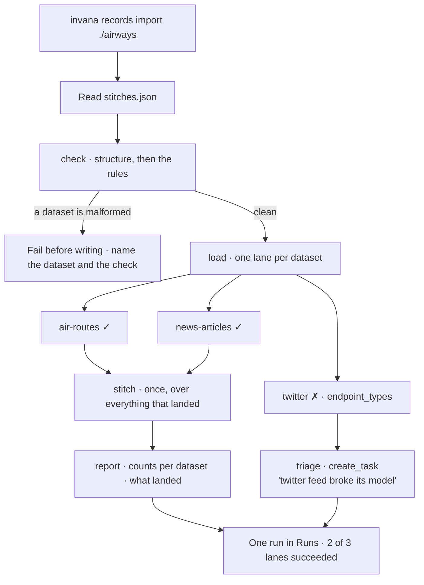

# Load a bundle

`invana records import <bundle>`. Every dataset the manifest names, loaded in parallel, stitched
once, as **one run** with one trace — and a Task raised for whoever owns a source that broke.

> ⚠ **Rewritten for [orchestration § 0](../../../orchestration.md#0-the-records)** — `Todo` · `TaskPlan` ·
> `Task` · `TaskRun` · `Lens`. The words *Thought*, *Thinking* and *Step-as-a-record* are retired, and
> **`Task` now names a node inside a plan**, never a thing a user authored. Migration:
> [task-model-migration.md](../../../building-engine/task-model-migration.md).

| | |
|---|---|
| Index | [2.3](../../../README.md#2--bring-data-in) · Slice **S15** |
| Module | [Bring data in](../spec.md) |
| API / CLI / Studio | 🔵 / 🔵 / 🔵 |
| Related | [load-data](load-data.md) (the per-dataset plan this inlines) · [the runtime](../../platform/features/runtime.md) (§3.2 — the shape) · [the-library](../../workflows/features/the-library.md) (where the plan lives) · [see-what-ran](../../operate/features/see-what-ran.md) · [schedules](../../operate/features/schedules.md) · [projects-and-tasks](../../work/features/projects-and-tasks.md) |

> **As** someone whose nightly load spans three datasets that only make sense together, **I want** one
> command and one run for the whole bundle, **so that** I read one outcome instead of correlating
> three, and the stitch happens after every part of it has landed.

## The problem this closes

`stitches.json` already describes a bundle — which datasets belong together and how they join
([LD12](load-data.md)) — and `invana records check` already validates it offline. But loading it
means three separate commands, three separate runs, and a stitch that runs three times over partial
data. Nothing holds the bundle together at run time, so:

| Today | Costs |
|---|---|
| One `import` per dataset | Three rows in the journal, three outcomes to correlate, no answer to *did the bundle load* |
| `stitch` runs inside each import ([LD18](load-data.md)) | It fires before the later datasets exist, so cross-dataset edges resolve on the second pass or not at all |
| Order is the operator's problem | A shell script with `&&` is the dependency graph, and it is not recorded anywhere |
| A failed dataset is a non-zero exit | Somebody has to notice. Nothing raises work for the person who owns the broken source |

## It is a workflow, not a new concept

**The stages are steps, and the plan grammar already carries every one of them**
([13.8 §4](../../platform/features/runtime.md)). `bundle-import@1` is a builtin workflow version in
the library ([§7 F9](../../workflows/spec.md)), composed from the plan a single dataset already runs.

```yaml
# bundle-import@1
steps:
  - id: check                                        # the offline preflight, LD12
  - id: load        depends_on: [check]
                    map_over: ${steps.check.datasets}        # one lane per dataset
                    max_parallel: 4
                    on_lane_failure: continue
                    uses: workflow:dataset-import@1          # inlined, never copied
  - id: stitch      depends_on: [load]                            # once, over everything that landed
  - id: report      depends_on: [stitch]
  - id: triage      depends_on: [{step: load, on: failure}]
                    step: create_task                        # a person owns the broken source
```

| Part | Why it is that part |
|---|---|
| `map_over` the manifest's datasets | The bundle already declares its members. Asking for a second list would be a second source of truth |
| `on_lane_failure: continue` | One broken source does not discard two good loads. The failures are reported with their lane and reason ([13.8 §6](../../platform/features/runtime.md)) |
| `stitch` **after** the fan-out | The reason the bundle exists. A standing stitch over complete data resolves in one pass, where three per-dataset stitches resolve over three partial graphs |
| `uses` rather than copied steps | The single-dataset plan has one definition. A bundle load and a single load cannot drift |
| `create_task` on the failure edge | The seam of [13.8 RP30a](../../platform/features/runtime.md): a workflow **produces** Tasks. A person owns the broken source; nobody owns the load |

## Capabilities

| # | Capability | Notes |
|---|---|---|
| C1 | One command, one run | `invana records import <bundle>` — the manifest is the argument, not a list of `--model` flags |
| C2 | The preflight runs first | `check` is the plan's first step, so a bundle that has drifted fails before anything is written ([LD15](load-data.md)) |
| C3 | A lane per dataset | Bounded by `max_parallel` and by the Graph's pools; the lower wins |
| C4 | A failed dataset does not fail the bundle | Reported by lane, with the reason, and the good loads stand |
| C5 | The stitch runs once, over everything | Not once per dataset over part of it |
| C6 | A failed lane raises a Task | Assigned to whoever the manifest names for that dataset, or unassigned in the Graph's "No project" bucket |
| C7 | One row in [Runs](../../operate/features/see-what-ran.md) | With its lanes, its per-dataset counts and its rolled-up cost. The per-dataset detail is the lane, not a sibling row |
| C8 | It schedules | `schedules.kind = workflow` ([SC6](../../operate/features/schedules.md)) — the nightly load is a schedule on this workflow, not a Task nobody accepts |
| C9 | Cancel cancels the bundle | Accepted records stay per lane; the report says which lanes had finished |
| C10 | Re-running is idempotent | By the models' keys, exactly as a single load is ([C8](load-data.md)) |

## Journey



## Seams

| Seam | What the user sees |
|---|---|
| The manifest names a dataset that is not there | `check` fails, naming the folder. Nothing is written |
| One dataset of three fails validation | Two lanes succeed, one is reported with its reason, the stitch runs over what landed, and a Task is raised naming the dataset |
| **Every** dataset fails | The stitch step is skipped — its `depends_on` edge is unsatisfied — and the run fails with a diagnosis, not an empty success |
| A stitch has no active link in the Graph | `no_stitch_for_edge`, per [LD19](load-data.md). The bundle's rules must be applied before they can be loaded against |
| Cancelled mid-fan-out | Running lanes stop at their own await points; finished lanes keep what they wrote; the report says which |
| The engine restarts mid-run | Running lanes close as `interrupted` and re-dispatch as new attempts ([13.8 §5](../../platform/features/runtime.md)). A partly-written lane is never assumed complete |
| A bundle larger than the fan-out ceiling | Refused at plan validation, naming the ceiling and the dataset count. Nothing is dispatched |
| Two bundles at once against one provider | Pool slots are granted fair-share across runs, so neither starves ([13.8 §8](../../platform/features/runtime.md)) |
| Someone runs the single-dataset command instead | It still works and is still one run. The bundle is a convenience over the same plan, not a replacement for it |

## Surfaces

| Surface | Shape |
|---|---|
| CLI | Per-lane progress on a tty, one line per lane otherwise; the summary on `stdout`, the journal on `stderr` ([LD17](load-data.md)). Non-zero exit when any lane failed |
| API | `POST …/bundles/imports` with the manifest; the response is a run id to poll or stream |
| Studio | Read-only. The run opens in **Imports** as one row; its lanes are the per-dataset detail, and the raised Task links out to Work |

## Engine

| Thing | Shape |
|---|---|
| The plan | `bundle-import@1`, a builtin version in `workflow_versions` ([§7 F9](../../workflows/spec.md)) |
| The run | `Todo(kind = import)` with `plan_origin = builtin:bundle-import@1`. **No new tables** |
| Lanes | `task_runs.lane`, keyed `(run_id, step_id, lane, iteration, attempt)` ([13.8 §19](../../platform/features/runtime.md)) |
| Routes | `POST …/bundles/imports` · everything else is the ordinary run surface |
| Events | the closed `run.*` and `step.*` set. No bundle vocabulary of its own |

**This feature is what unblocks the deferred runtime work.** It needs the frontier, lanes and `uses`
composition, each for a stated reason — so those three land here rather than in anticipation
([13.8 §21](../../platform/features/runtime.md)).

## Decisions

| # | Decision |
|---|---|
| BU1 | **A bundle load is an ordinary workflow.** `bundle-import@1` is a builtin library version; ingestion gets no grammar, no table and no runtime of its own ([13.8 RP30](../../platform/features/runtime.md)). |
| BU2 | The manifest is the fan-out collection. `stitches.json` already names the datasets; the plan maps over it rather than asking for a second declaration. |
| BU3 | `uses: workflow:dataset-import@1` — the single-dataset plan is inlined, never copied, so the two cannot drift. It expands **before** envelope validation. |
| BU4 | **The stitch runs once, after the fan-out.** Resolving cross-dataset edges over a partial graph is the defect this feature exists to close. |
| BU5 | `on_lane_failure: continue`. One broken source does not discard the loads that worked. |
| BU6 | **A failed lane raises a Task; a stage never is one.** Nobody accepts a load, so no step of it has an assignee or a definition of done ([13.8 RP30a](../../platform/features/runtime.md) · [Work W6](../../work/spec.md)). |
| BU7 | If every lane fails, `stitch` is **skipped** and the run fails with a diagnosis. An empty stitch is not a success. |
| BU8 | Recurrence is `schedules.kind = workflow` ([SC6](../../operate/features/schedules.md)). A task schedule creating a Task nobody accepts is not the mechanism. |
| BU9 | The bundle is one row in Runs. Per-dataset detail is a **lane**, never a sibling row or a child run — no agent is delegated to. |
| BU10 | The single-dataset command is not replaced. A bundle is a composition over the same plan, and both stay. |

## Not building

| Not built | Because |
|---|---|
| A bundle authoring UI | `stitches.json` is a file in the repo that produced the data, checked offline and reviewed like code |
| Partial re-run of one lane | A retry is a **new run** ([13.8 §3](../../platform/features/runtime.md)). Re-importing one dataset is the single-dataset command, which is idempotent |
| Cross-bundle dependencies | A bundle is the unit that stitches together. Two that depend on each other are one bundle |
| A bundle-level validation report | The report is per dataset, because that is what a person fixes. The run rolls the counts up |
| Transformation between lanes | unchanged from [load-data](load-data.md): whatever produced the data transforms it better |
