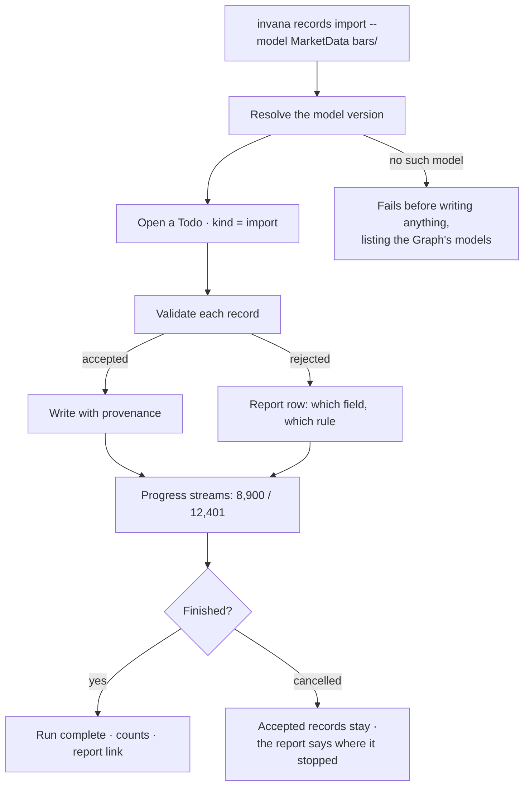

# Bring data in

`invana records import --model <name>`. Records are validated one at a time against the model they
declare, written with provenance, and the whole load is a run you can watch and cancel.

| | |
|---|---|
| Index | [2.1](../../../README.md#2--bring-data-in) · Slice **S6** |
| Module | [Bring data in](../spec.md) |
| API / CLI / Studio | ✅ / ✅ / ✅ |
| Related | [inspect-what-landed](inspect-what-landed.md) · [domain-models](../../connect-and-model/features/domain-models.md) |

> **As** someone whose pipeline already produces data, **I want** one command that loads it and tells
> me exactly what was rejected, **so that** I can put it in a DAG and trust the result.

## Capabilities

| # | Capability | Notes |
|---|---|---|
| C1 | Import from the CLI | The primary path; exit codes a scheduler can branch on |
| C2 | Import from Python | For an orchestrator holding the data already; returns a run id to wait on |
| C3 | `--model` is required | The dataset states what it conforms to; nothing is inferred |
| C4 | Per-record validation | One bad row does not fail the load |
| C5 | Provenance on everything written | Node, edge, property → the dataset record it came from |
| C6 | The run is a run | Streamed steps, retries with backoff, diagnosis on failure, cancellable |
| C7 | Relationship-link records load like any other | The edges a stitch declared arrive as data |
| C8 | Idempotent by the model's keys | Re-running the same file updates rather than duplicating |
| C9 | The run records who ran it | The principal and the invocation, so the journal can name both |
| C10 | A bundle is checked before it is imported | `invana records check` validates each dataset against its own model, then resolves the rules between them — no Graph, no connection, no model in a database |

## Journey



## Seams

| Seam | What the user sees |
|---|---|
| Model published mid-run | The run states the version it validated against and does not switch |
| Database unreachable | Retries with backoff, shown as `retrying 2/3`, then a diagnosis |
| Every record rejected | Not a crash: a report where every row has a reason |
| Read-only connection | Refused at the start, naming the connection setting |
| Same file twice | Keys decide; the report says updated versus created |

## Surfaces

| Surface | Shape |
|---|---|
| CLI | progress on a tty, machine-readable summary otherwise; non-zero exit when rejections exceed a threshold |
| Python | `import_dataset(...) → run`, with `.wait()` for a DAG to block on |
| API | run status, counts, and the report — what an external poller reads |

## Engine

| Thing | Shape |
|---|---|
| `datasets` | the dataset. **The run has no table of its own** — it is `todos` · `task_runs` · `task_runs`, dispatched by the interpreter like any other ([spec BD12](../spec.md)) |
| Validation | per record against the model version, collecting reasons |
| Provenance | source record id written on every element |
| Routes | `POST …/datasets/{id}/imports` · `GET …/imports/{id}` — unchanged. They open and read a run; the fold is behind them |
| Events | the closed `run.*` set — `run.queued · started · succeeded · failed · cancelled`, plus `step.*` ([13.8 §13](../../platform/features/runtime.md)). An import emits no vocabulary of its own, so anything watching runs sees loads too |

## Decisions

| # | Decision |
|---|---|
| LD1 | `--model` is required. There is no inference path. |
| LD2 | Validation is per record; rejections are reported, never silent. |
| LD3 | An import run is a Todo and uses the ordinary runtime. |
| LD4 | Everything written carries provenance. |
| LD5 | Import is CLI and API only. |
| LD6 | The run's four steps are `validate_records · write_graph · stitch · snapshot_model`, under `dataset-import@1` — a **builtin workflow version** in the library ([§7 F9](../../workflows/spec.md)). They are *not planned*: there is nothing for a model to decide about a load. They are still **dispatched by the interpreter**, so a load retries, times out, cancels and gates like every other run ([spec BD12](../spec.md)). |
| LD7 | An edge whose endpoint does not resolve is rejected with **both** endpoints named. A dangling edge is never written. |
| LD8 | The run records the model version it validated against at the moment it started, and reads that row for the rest of the load. |
| LD9 | The run records the principal that ran it and the invocation it came from. The load is the only place that knows them, so it is the place that writes them down. |
| LD10 | **`invana loader --graph <ref>` is a run, and its kind is what says it validated nothing.** It walks `bulk-load@1` — one step, `bulk_write` — so it retries, cancels, streams and leaves a trace exactly as an import does. Two kinds of run, one journal: the kind is a column, not a separate surface, because the question *what changed my graph* has one answer. **A connection described on the command line is not journaled**: replaying such a run would need credentials, and credentials never ride a run's `params`, so `--uri` / `--username` / `--password` / `--connector` keep the direct path and say so. `--graph` on its own is the run. |
| LD12 | **A bundle states its stitches, and the CLI checks them against the files.** `stitches.json` at a bundle's root names its datasets and the rules between them, in the vocabulary `POST …/model-links` already uses — `kind`, `source`, `target`, `identity_match`, `edge_type`, `dataset`. `invana records check <dir>` resolves each rule against `nodes/*.json` and `nodes/*.csv` and reports the count. It is a **preflight**: it reads files, never a Graph, and it declares nothing. The same manifest is declared against a Graph by `invana stitches apply` (stitch-models.md ST39) — one file, checked offline and applied online, never a second copy of the rules. |
| LD13 | **The check counts distinct key values, because the preview does.** A rule joins values, not rows: 26 airlines share 24 hub codes. Reporting rows here and keys in Studio would make the same rule read two ways, so the CLI reports keys and names the row count beside it. |
| LD14 | **A rule may declare that it is not meant to resolve fully.** `"partial": true` says the two sides overlap without either containing the other — a hashtag nobody filed a story under is an ordinary hashtag, not a broken key. Without it, one unresolved value fails the rule, so a silent partial match can never pass unnoticed. |
| LD15 | **Structure first, then the joins.** `check` validates each dataset against its own `graph-model.json` and `model.json` before it resolves a single rule: ids unique, the identity key present and unique, every property declared on its type, enum values in range, declared types honoured, and each edge's endpoints landing on the source and target types the model names. A rule that fails because a type is malformed should say the type is malformed, not that the rule matched nothing. Both sections always run and both count toward the exit code. |
| LD16 | **An endpoint is resolved against the whole bundle, and a leftover is deferred, not rejected.** `_validate_edges` already treats an endpoint the dataset does not carry as *possibly already in the graph* (LD7), so the preflight cannot call it an error: it resolves across every dataset in the bundle and reports what is left as deferred. Offline, a missing endpoint is a question; only the import can answer it. |
| LD17 | **The run streams its journal as it happens; the summary is still the last word.** `import_dataset` takes an `on_progress` callback and calls it at every stage transition and every 500 records written, carrying the same `step` and `message` the run stores in **`run_logs`** — one journal, whether it is read live or read afterwards, and the same store every other run writes to ([13.8 §17](../../platform/features/runtime.md)). `import_jobs.logs` was a second one (BD12). The CLI renders it on **stderr**: a rewriting counter on a tty, one line per stage otherwise, so `stdout` carries only the summary a pipe parses (Surfaces). A 61k-record load is otherwise minutes of silence, which reads as a hang. |
| LD18 | **The `stitch` step solves the Graph's active stitches too.** It already resolved the edges a dataset deferred; it now also runs every **active** stitch over the records this import just wrote, scoped by the job's provenance stamp (stitch-models.md ST47). A stitch is a standing rule, so data arriving after it was committed is stitched as it lands — nobody re-runs anything, and the step keeps the name it always had. |
| LD19 | **A dataset ships a stitch's rows in `stitches/<EDGE_TYPE>.json`, and they load like any other records (C7).** The file holds `{id, from, to, properties}` — the same record shape `edges/` uses — and the edge type is in *neither* model, because a cross-model edge belongs to the stitch rather than to a domain. So the check is the stitch: the Graph must hold a **declared, active** link whose `dataset_id` is this dataset and whose `edge_type` is the file's stem, or the file is reported `no_stitch_for_edge` and nothing is written. Endpoints resolve by id against the whole graph, and one that resolves nowhere is rejected naming both (LD7). |
| LD20 | **The four stages are the plan's rows, and the prologue is not one of them.** `dataset-import@1` is `validate_records → write_graph → stitch → snapshot_model` — the four keys already stored on every load's nodes ([task-model-migration § 6.4](../../../building-engine/task-model-migration.md)). What comes *before* them — resolving the model, taking its published version, checking the connection is writable, registering the Dataset row — is **opening the run**, not a step in it: it decides whether there is anything to run at all, and a refusal there is a load that never started rather than a load that failed at step 1. Its results ride on the root run's `params` as `dataset_id · model_id · version_id`, so each entry re-resolves what it needs through its own manager and stays a view over one app. |
| LD21 | **Records ride `RunVars`; only declared outputs ride the plan.** A stage hands the next one tens of thousands of parsed records, and a plan document is not where that goes — `${steps.x.y}` binds what the catalogue *declares*, which is counts and ids. So the run carries `v.load`, a `LoadVars` populated for `ask_kind = import` and `None` for an ask, exactly as `v.result` already carries a query result between *Execute* and *Project*. The rule this keeps: **what a plan can bind is what a reader can see in the trace.** Anything bigger is working state, and working state never enters the document a replay reads ([SR29](../../operate/features/see-what-ran.md)). |
| LD22 | **A load fails its stage, never the run's first row.** The interpreter attributes a failure to the node in flight, which is what the hand-written `RunTrace` did with `running_task()`. Keeping that is the reason the four keys do not change: a reader clicks the Gantt row that broke, and the row is the same row it has always been. |
| LD23 | **A folder declares its own model, and the manifest addresses folders.** A rule's `source` and `target` stay `<folder>:<Type>.<property>`, because the offline check reads *files* and a folder is where they are. Which model those records belong to is the folder's own fact, stated in its `graph-model.json` as `package_id` and `name` — resolved package first, then name ([ST40](../../connect-and-model/spec.md)). The Dataset row was only ever the third branch of that lookup, reached when a bundle ships no `graph-model.json`, and it is not what `ModelLink.source_model_id` needs. Two folders may declare one model; that is a model taking records from two sources, not an ambiguity. The relationship field that named a rows file is `rows`, never `dataset` ([terminology](../../../terminology.md)). |
| LD11 | `--graph` also supplies the connection — connector class, URI and credentials come from the Graph, and each flag overrides one part. A database Studio can already reach should not have to be described again on the command line. |

## The bundle manifest

A **bundle** is a folder of datasets that belong together. `stitches.json` at its root says
which, and how they join:

| Field | Shape |
|---|---|
| `name` | What the bundle is called in the output |
| `datasets` | Folder names, relative to the manifest |
| `stitches[].id` | A short label — `A1`, `R3` — used in the report and nowhere else |
| `stitches[].kind` | `anchor` or `relationship` |
| `stitches[].source` · `target` | `<folder>:<Type>.<property>` — the key on each side (ST26, LD23) |
| `stitches[].identity_match` | `exact` (default) or `case_insensitive` |
| `stitches[].edge_type` | Relationship only — the edge the stitch writes |
| `stitches[].rows` | Relationship only — the file under the source's `stitches/` supplying endpoints when there is no key pair (W3). It names a **file**, not a model |
| `stitches[].partial` | The two sides are meant to overlap, not match fully (LD14) |

```json
{
  "name": "airways",
  "datasets": ["air-routes", "news-articles", "twitter"],
  "stitches": [
    {"id": "A1", "kind": "anchor", "identity_match": "exact",
     "source": "news-articles:Country.iso_code", "target": "air-routes:country.code"},
    {"id": "R1", "kind": "relationship", "edge_type": "SERVED_BY",
     "source": "news-articles:City.code", "target": "air-routes:airport.code"}
  ]
}
```

`invana records check <dir>` exits non-zero when a dataset fails a structural check, when a
rule resolves nothing, or when a rule without `partial` leaves values unresolved. A bundle
that has drifted says so here rather than in Studio, after a load.

What each dataset is checked for (LD15):

| Check | Fails when |
|---|---|
| `node_ids_unique` | Two records in a dataset share an `id` |
| `identity_key_present` · `identity_key_unique` | A record has no value for a key `model.json` names, or two records share one — the `MERGE` that a null key aborts (LD12) |
| `node_type_declared` · `edge_type_declared` | A records file names a type `graph-model.json` does not have |
| `property_declared` | A record carries a property its type does not declare |
| `property_type` · `enum_value` | A value is not the type the model declares, or outside the enum it names |
| `endpoint_types` | An edge lands on types outside the `source_node_types` / `target_node_types` it declares |
| `endpoint_resolves` | Reported as **deferred**, never failed (LD16) |

## The other path

**`invana loader <path>`** bulk-loads the flat *Invana Graph CSV* format straight through the
connector's bulk queryset. It is the fast path for records that are already CSV-shaped, and it
produces no validation report, no run and no provenance — so it is not the audited one. It stays
because bulk-loading a million rows through per-record validation is the wrong tool, and it is listed
in the CLI beside `records import` with exactly that caveat.

`--graph <username>/<slug>` is the short form. The Graph already holds the connector class, the URI
and the credentials, so naming it is enough:

```
invana loader ./air-routes --graph admin/air-routes-graph
```

Each of `--connector · --uri · --username · --password` overrides that one part of the connection —
a Graph whose URI is a container hostname is still the right Graph from a host shell with
`--uri bolt://localhost:7687`. Without `--graph`, `--connector` and `--uri` are required.

The load then leaves a row in that Graph's journal, of kind `bulk`: the counts it wrote, the lines it
printed, and who ran it — with no steps, no report and no provenance, because it produced none
(IW11). Without `--graph` nothing is recorded, and the command says so.

## Not building

| Not building | Because |
|---|---|
| Import from Studio | a load is scripted and repeatable, not a click |
| Streaming ingest | a batch with a report is what a person can audit |
| Transformation on the way in | whatever produced the data transforms it better |
| Upsert strategy settings | identity comes from the model's keys |
