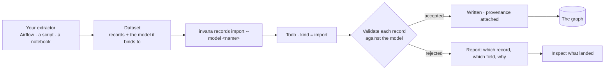

# Bring data in — module spec

Invana is a **destination**. Something else extracts and transforms; what arrives here is a dataset
that already conforms to a model. Loading it is a run like any other — same trace, same retries, same
failure vocabulary — and everything it writes carries the record it came from.

> ⚠ **Rewritten for [orchestration § 0](../../orchestration.md#0-the-records)** — `Todo` · `TaskPlan` ·
> `Task` · `TaskRun` · `Lens`. The words *Thought*, *Thinking* and *Step-as-a-record* are retired, and
> **`Task` now names a node inside a plan**, never a thing a user authored. Migration:
> [task-model-migration.md](../../building-engine/task-model-migration.md).

| | |
|---|---|
| Index | [§2 · Bring data in](../../README.md#2--bring-data-in) |
| Features | [load-data](features/load-data.md) · [inspect-what-landed](features/inspect-what-landed.md) · [load-a-bundle](features/load-a-bundle.md) |
| Depends on | [Connect and model](../connect-and-model/spec.md) (a dataset binds to a model) · [Platform](../platform/features/runtime.md) (an import is a run the runtime walks) · [Workflows](../workflows/spec.md) (its plans are builtin library versions) |
| Depended on by | everything that answers from data |

## 1. Vocabulary

Product-wide words: [terminology.md](../../terminology.md). What this module adds:

| Noun | Is | Is not |
|---|---|---|
| **Dataset** | externally produced records conforming to exactly one model | a connection to a source |
| **Import run** | one load of a dataset — a Todo of kind `import` | a background job |
| **Validation report** | per-record accept or reject, with reasons | a summary count |
| **Provenance** | the dataset record every written node and edge points back to | a timestamp |

## 2. The contract

| Rule | Detail |
|---|---|
| `model_id` is required | A dataset states what it conforms to. There is no inference path |
| Validation is per record | One bad row does not fail a load, and is never silently dropped |
| Every written element carries its source record | Provenance is what makes an answer traceable to a dataset |
| An import is a run — **and is dispatched like one** | It inherits the runtime: streamed steps, retries, timeouts, cancellation, signals and approvals. It does not write its own step rows (BD12) |
| Studio does not write | Import is CLI and API only; Studio reads |

## 3. The import run, step by step

| # | Step | What it does |
|---|---|---|
| 1 | **Register** | The dataset's records and the model it declares are accepted; a run row opens |
| 2 | **Validate** | Every record is checked against that model's active version; the report is structured, per record |
| 3 | **Ingest** | Validated records are written, each stamped with its dataset, record and run |
| 4 | **Stitch** | Declared links are resolved — identities against what is already there, and edges to other models' types |
| 5 | **Snapshot** | The model version validated against is stored with the run, so a person can see exactly what their data was checked against |
| 6 | **Result** | The written subgraph, and provenance from every element back to its record |

Nothing here authors a model. The model is authored first; the dataset conforms to it or is rejected.

## 4. What this module owns

| Owns | Shape |
|---|---|
| `datasets` | `graph_id` · `model_id` · name · declared shape · created_by |
| the run | **no table of its own.** A load is `Todo(kind = import)` + `Run(plan = dataset-import@1)` + four `task_runs`, like every other run (BD12) |
| `validation_reports` | per run: accepted, rejected, and the reason per rejected record |
| Provenance | on every written node and edge: the dataset record it came from |

## 5. Entry points

| Surface | Shape |
|---|---|
| CLI | `invana records import --model <name> <path>` — one dataset, the primary path, scriptable, exit codes that a scheduler can read · `invana records import <bundle>` — every dataset the manifest names, stitched, as one run ([2.3](features/load-a-bundle.md)) · `invana loader <path> --graph <ref>` — the bulk fast path, journaled but unaudited |
| Python | `import_dataset(...)` — for an orchestrator that already holds the data in memory; returns a run id to wait on |
| API | run status and the validation report, with provenance — what an external agent polls |
| Studio | read-only: the **Imports** journal — every run with its log, its report and who ran it; the dataset and its provenance are reached from a run |

## 6. When it goes wrong

| Case | What the user sees |
|---|---|
| Unknown type or property | The record is rejected, naming the field and the model it was checked against |
| Model version changed mid-stream | The run states which version it validated against; it does not switch |
| A relationship link's endpoint is missing | The edge is rejected with both endpoints named — never a dangling edge |
| The database rejects a write | Diagnosis with the next step, never a stack trace |
| The run is cancelled | Accepted records stay, the run is marked cancelled, and the report says where it stopped |

## 7. Cross-feature decisions

| # | Decision |
|---|---|
| BD1 | Invana does not extract. Source connectors and a mapping grammar are not built. |
| BD2 | A dataset binds to exactly one model, and `model_id` is required. |
| BD3 | An import run is a Todo — one runtime, one trace vocabulary, one failure story. |
| BD4 | Rejections are reported per record with a reason. Silence is never an outcome. |
| BD5 | Every written element carries provenance to its dataset record. |
| BD6 | Import is CLI and API; Studio reads what landed. |
| BD7 | An import opens `Todo(kind = import)` and a `Run(plan_origin = builtin:dataset-import@1)` whose four steps are `validate_records · write_graph · stitch · snapshot_model`. **The plan is fixed — nothing generates it**, because there is nothing for a model to decide about a load. Fixed means *not planned*; it never meant *not dispatched* (BD12). |
| BD8 | Studio grows no second run UI. An import's trace is the same step card an answer uses, because an import is a run. |
| BD9 | Studio's surface for this module is **Imports** — an audit journal of runs, newest first, across every dataset. The dataset hangs off the run that wrote it. The question after a load is *what happened*, and that question is answered in time order. |
| BD10 | The run carries its principal and its invocation, because an audit journal names who ran what. |
| BD11 | A run has a **kind**: `import` (validated, reported, traceable to the record) or `bulk` (`invana loader`, straight through the connector). Both are in the one journal, because what a person asks is *what changed my graph*; the kind is what stops the second from reading like the first. |
| BD12 | **A load owns no run machinery.** `import_jobs` folds into `todos` · `task_runs` · `task_runs`; its `logs` become `run_logs`; its `import.*` events become the closed `run.*` set; and its four stages become catalogue entries **the interpreter dispatches**. Writing step rows by hand is what made retries, timeouts, cancellation and approvals absent from imports. [13.8 RP29b](../platform/features/runtime.md) |
| BD13 | **A bulk run is a one-step plan, not an exception.** `bulk-load@1` runs `bulk_write`. No per-record validation and no provenance are properties of that step; they are not a reason for the run to live outside the runtime (BD11 · [13.8 RP29a](../platform/features/runtime.md)). |
| BD14 | `dataset-import@1`, `bundle-import@1` and `bulk-load@1` are **builtin workflow versions in the library**, not constants in this package — so `plan_origin` resolves and the trace can show the plan that ran. [§7 F9](../workflows/spec.md) |
| BD15 | **A bundle load is an ordinary workflow.** `bundle-import@1` maps over the datasets `stitches.json` already names, inlines `dataset-import@1` per lane, stitches once, and branches to `create_task` on a failed lane. No stage is a Task: nobody accepts a load. [2.3](features/load-a-bundle.md) · [13.8 §3.2](../platform/features/runtime.md) |
| BD16 | **Records are imported into a model, and the model is what holds them.** There is no Dataset record. A model is authored, a load hands it records, and the model is the container they belong to — one noun where there were two, and the one a person already thinks in. What a "dataset" carried splits cleanly: the *shape* was always the model's; the *source path* is a fact about one load, so it rides that run's `params`; the *counts* are what the runs already report. Nothing needed a third record to hold those three things together. |
| BD17 | **Provenance is `model · record · file · run`.** Every written element carries `_inv_model_id`, `_inv_record_id`, `_inv_file` and `_inv_run_id` — *what it conforms to*, *which record it was*, *which file it came in*, and *which load wrote it*. `_inv_model_id` is the namespace `_inv_record_id` lives in: records are externally produced, so their ids are whatever the source chose, and a pair is needed for the identity to mean anything. The model is the right half of that pair because a record's id is only ever promised unique within the thing it conforms to. |
| BD18 | **Two loads into one model are one body of data, and `MERGE` is the point.** Re-importing `airports.json`, or importing `airports-2025.json` over `airports-2024.json`, updates the model's records rather than accumulating a second copy — identity-keyed writes already guarantee it (C8). Records that must *not* merge are records of a different thing, and a different thing is a different model. This is what makes the model a sufficient container: the question *is this the same entity* is answered by the model's identity keys, which is where it was always answered. |
| BD19 | **The fast path names a model too; what it skips is validation, not the container.** `invana loader` writes records without checking them against anything, and it used to record that honestly by attaching them to a source with no model. With the model as the container ([BD16](#7-cross-feature-decisions)) that leaves the records nowhere: `_inv_model_id` is half the provenance key, and data that belongs to nothing cannot be traced, stitched or re-loaded. So `--model` says **where the records go** and is required on every path; validation is the thing the fast path opts out of, and the run says which of the two happened. A model that has never been validated against is still the thing the records conform to — or the load is the first evidence that it does not. |

## 7a. The drawn states

Hi-fi, at 1440×900, on the **Hi-fi · finance** page of the *Agents at Work Wireframes* canvas —
`claude.ai/code/artifact/58f2e380-ef59-41cd-8c96-d3dc7ddd06e4`.

The journal itself (BD9) is not drawn yet — these two artboards draw the run and the dataset
behind it.

| Artboard | Feature | Shows |
|---|---|---|
| Imports · what landed | [inspect-what-landed](features/inspect-what-landed.md) | the dataset list with its per-type counts, *Validated against `NewsArticles@v3`*, the *What landed* table, the last run's outcome with its rejection count, and the selected node's provenance line — dataset · file · record · run |
| Imports · the run | [load-data](features/load-data.md) | the same step card an answer uses, running `dataset-import@1` — `validate_records · write_graph · stitch · snapshot_model` — with where the folder came from, the rejection reason, and `Open trace · Open report · Cancel run` |

## 8. Deliberately absent

| Not built | Because |
|---|---|
| Source connections, cursors, a mapping grammar | designed and dropped — whatever already extracts your data is better at it |
| Import from Studio | a load is a scripted, repeatable act, not a click |
| Automatic model inference from a file | the dataset states its model; guessing produces a schema nobody chose |
| Streaming ingest | batch runs with a report are what a person can audit |
| Deduplication or upsert heuristics | identity comes from the model's keys, not from a strategy setting |
