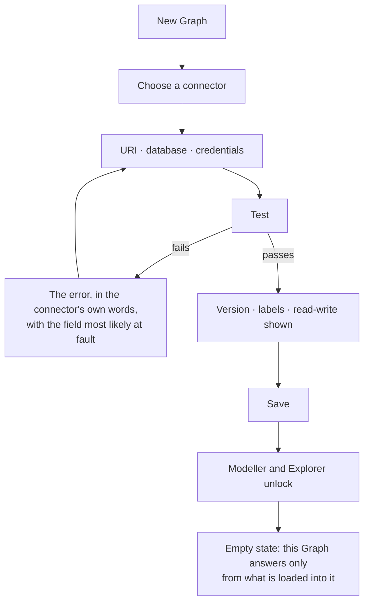

# Connect a database

One Graph binds to exactly one graph database. Set once, tested before it saves, and read-only in its
connector from then on.

| | |
|---|---|
| Index | [1.1](../../../README.md#1--connect-and-model) · Slice **S2** |
| Module | [Connect and model](../spec.md) |
| API / CLI / Studio | ✅ / — / ✅ |
| Related | [introspect-a-database](introspect-a-database.md) · [domain-models](domain-models.md) |

> **As** someone starting a Graph, **I want** to attach my database and know it works before anything
> depends on it, **so that** nothing downstream is built on a connection that was never proven.

## Capabilities

| # | Capability | Notes |
|---|---|---|
| C1 | Bind one graph database to a Graph | 1:1; there is no second connection |
| C2 | Test gates save | A connection that has not connected cannot be saved |
| C3 | Credentials encrypted at rest | A blank field on edit means "keep", never "clear" |
| C4 | The connector is fixed after the first save | Changing engine would invalidate everything modelled against it |
| C5 | Version is detected, and may be declared | The server version decides which property types are available |
| C6 | Read-only connections are honoured | Invana never writes to a database marked read-only |
| C7 | Runtime status is visible | Connected · unreachable · degraded, with the last check time |
| C8 | The database name is part of the connection | A server can hold several databases; which one this Graph reads is stated, shown and editable |

## Journey

## Seams

| Seam | What the user sees |
|---|---|
| Untested | Save is disabled and says why |
| Edit after save | Connector is fixed; URI, database and credentials remain editable, and a change requires a re-test |
| Database left blank | The connector's own default is used (`neo4j` for Neo4j); the read view says "connector default" rather than showing an invented name |
| Connector ignores databases | Gremlin backends address one graph per endpoint — the field is still accepted and simply not passed on |
| Credentials rotated elsewhere | Status goes unreachable with the last successful check time, not a silent failure |
| Database empty | Not an error — the empty state explains what to do next |
| Member without admin | Sees the connection and its status, cannot edit it |

## Surfaces

| Surface | Shape |
|---|---|
| Settings → Connection | A field group inside the settings form; `Test connection` and `Introspect` sit beside the fields |
| Status strip | Connector · version · read-write · last check |

## Engine

| Thing | Shape |
|---|---|
| `graph_connections` | 1:1 with Graph — `connector_class` · `uri` · `database` · encrypted `auth` · `read_only` · `server_version` · runtime `status` · `latency_ms` |
| Routes | `GET PUT DELETE …/connection` · `POST …/connection/test` |
| Events | `connection.created · updated · tested · deleted` |
| Packaging | one connector package per database; the core depends on none of them |

## Decisions

| # | Decision |
|---|---|
| CD1 | One Graph, one graph database. |
| CD2 | Test gates save — always, including on edit. |
| CD3 | `connector_class` is immutable after the first save. |
| CD4 | Blank credentials on edit mean "unchanged". |
| CD5 | A read-only connection is never written to, by any path. |
| CD6 | The connection is the `Graph` tab of the settings panel, not a page of its own. Rules, Skills and Datasets have their own pages, so they are not settings. |
| CD7 | After a passing test the strip states connector, server version, label count and read-write, in that order. |
| CD8 | The database name is a column on `graph_connections`, not a key inside the encrypted `auth` blob. It is not a secret, so it is returned by `GET …/connection`, shown beside the URI, and editable — a blank credential means "unchanged", and the database name must never inherit that rule. Blank means "the connector's default", and it is passed to the connector only when set. |
| CD9 | Changing the database re-tests, exactly as changing the URI does. It is not frozen like `connector_class` (CD3) — pointing a Graph at a restored copy of the same database is a move people make, and the model it was built against still holds. |

## Not building

| Not built | Because |
|---|---|
| Multiple databases per Graph | the Graph is the reasoning boundary |
| Connection pooling knobs in the UI | tuning belongs in configuration, not in a product surface |
| Credential vault integrations | encryption at rest is enough for now; an integration is a later decision |
