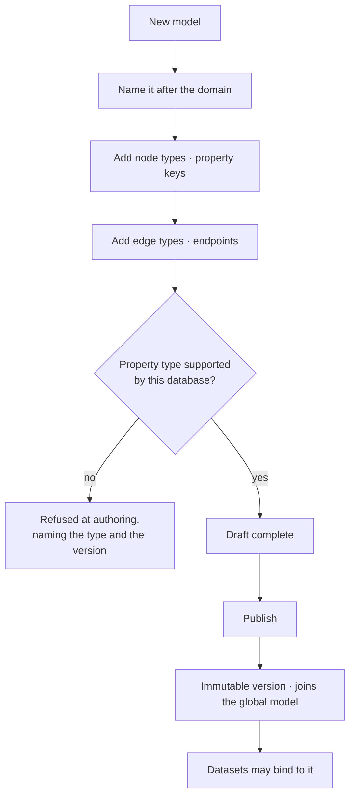

# Author a model

A model is authored against a **domain**, not a Graph — `NewsArticles`, `MarketData`, `DrugActions`.
A Graph holds many, and each one travels.

| | |
|---|---|
| Index | [1.3](../../../README.md#1--connect-and-model) · Slice **S3** |
| Module | [Connect and model](../spec.md) |
| API / CLI / Studio | ✅ / — / ✅ |
| Related | [model-editor](model-editor.md) · [share-a-model](share-a-model.md) · [stitch-models](stitch-models.md) |

> **As** someone describing a domain, **I want** to model it once and reuse it, **so that** the second
> Graph that needs `NewsArticles` does not retype a single property.

## Capabilities

| # | Capability | Notes |
|---|---|---|
| C1 | Node types with property keys and types | Types are resolved against what the database can hold |
| C2 | Edge types with declared endpoints | Direction and cardinality stated |
| C3 | Keys and constraints | What identity means for this type |
| C4 | Draft → published version | A draft is editable; a published version never changes |
| C5 | Many models per Graph | Each authored independently, none aware of the others |
| C6 | Capability-gated property types | A type the connected database cannot hold is refused at authoring, with the reason |
| C7 | Versions resolve forever | An import or answer that used v2 still resolves to v2 |

## Journey

## Seams

| Seam | What the user sees |
|---|---|
| Editing a published version | Not possible — the action is "publish a new version" |
| A type in use by a dataset | Removing it warns, naming the datasets that bind to it |
| Database upgraded | Newly available property types appear; nothing already published changes |
| Two models with the same type name | Allowed — they are different domains until a link says otherwise |

## Surfaces

| Surface | Shape |
|---|---|
| Model panel | Node types and edge types as stacked sections, each with its own add |
| Type detail | Properties, keys, constraints; inspect by default, edit while drafting |
| Version bar | Draft · published versions. The draft's account of what changed is its staged set; a published version's is its diff against the one before it (`GET …/versions/{id}/diff`) |

## Engine

| Thing | Shape |
|---|---|
| `models` | `graph_id` · `name` · `package_id` · `current_version_id` |
| `model_versions` | node types, edge types, property keys, constraints; immutable once published |
| Capability resolution | server version → available property types, per connector |
| Routes | `…/models*` · `…/models/{id}/versions*` · `POST …/models/{id}/publish` |
| Events | `model.created · updated · published` |

## Decisions

| # | Decision |
|---|---|
| DM1 | A model is named for its domain and is portable; it does not belong to a Graph. |
| DM2 | A published version is immutable. |
| DM3 | Property types are gated by the connected database's real capability. |
| DM4 | A Graph holds many models; they meet only through declared links. |
| DM5 | The first published version diffs against nothing rather than against itself — it changed everything, and saying so is more honest than an empty diff. |

## Not building

| Not built | Because |
|---|---|
| Inheritance between node types | flattening is clearer, and inheritance leaks into every query |
| Free-form property bags | a model that permits anything grounds nothing |
| Auto-migration of data on a version change | data is imported against a version, not rewritten by one |
