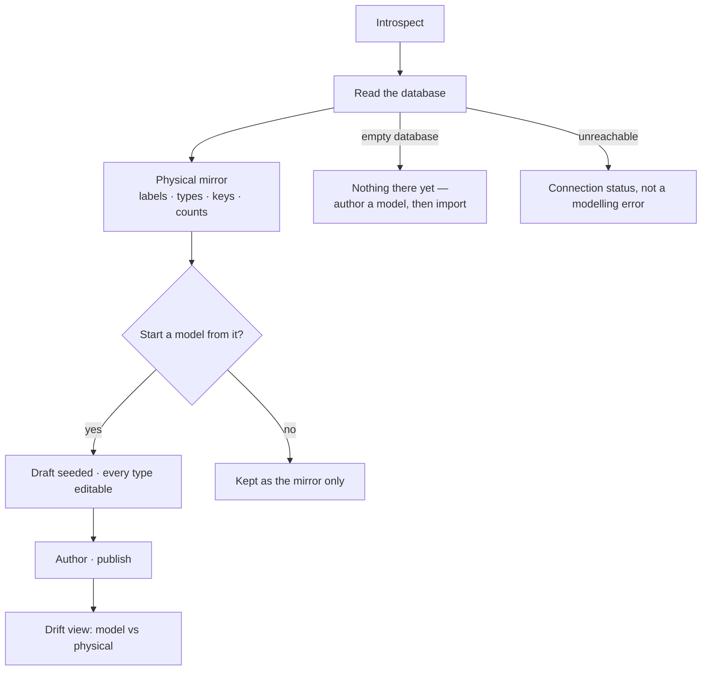

# Introspect a database

Read what the database actually holds, and offer it as a **draft** to model from. The mirror is never
the model — it is what you compare the model against.

| | |
|---|---|
| Index | [1.2](../../../README.md#1--connect-and-model) · Slice **S2** |
| Module | [Connect and model](../spec.md) |
| API / CLI / Studio | ✅ / — / ✅ |
| Related | [connect-a-database](connect-a-database.md) · [domain-models](domain-models.md) |

> **As** someone with an existing database, **I want** Invana to read what is in there and start me
> from it, **so that** I am not retyping a schema I already have.

## Capabilities

| # | Capability | Notes |
|---|---|---|
| C1 | Read labels, relationship types, property keys and counts | Whatever the connector can report |
| C2 | Produce the **physical** mirror | Named as such, never called the model |
| C3 | Seed a draft model from it | The draft is editable and unpublished |
| C4 | Refresh on demand | The mirror is a snapshot with a time on it |
| C5 | Show drift | What the published model says versus what the database holds |
| C6 | Never publish by itself | Introspection produces drafts, and only a person publishes |

## Journey

## Seams

| Seam | What the user sees |
|---|---|
| Empty database | An honest empty state, not a failed introspection |
| Huge schema | Counts first, types paged; the draft is not blocked on drawing everything |
| Types the model cannot express | Listed as unsupported with the reason, and left out of the draft |
| Re-introspecting after publish | The mirror updates; published versions are untouched |

## Surfaces

| Surface | Shape |
|---|---|
| Settings → Connection | `Introspect` beside `Test connection` |
| Modeller | The draft it seeded, ready to edit |
| Drift | Model versus physical, side by side, with what differs named |

## Engine

| Thing | Shape |
|---|---|
| Introspection | per-connector: labels, relationship types, property keys, counts, server version |
| Physical mirror | stored per Graph with a captured-at time; replaced wholesale on refresh |
| Routes | `POST …/connection/introspect` · `GET …/schema/physical` |
| Events | `connection.introspected` |

## Decisions

| # | Decision |
|---|---|
| ID1 | Introspection seeds drafts and never writes a published version. |
| ID2 | The physical mirror is named as such and is never the grounding context. |
| ID3 | Unsupported types are reported, not silently dropped. |
| ID4 | **Introspection is a run, and no lens narrows it.** `introspect_schema` (`graph_read`) runs through the runtime like every read, but it grounds the global model that every lens narrows — so it reads the whole database, and a world cannot hide a label from the thing it is defined against. |

## Not building

| Not built | Because |
|---|---|
| Continuous schema sync | drift is shown on demand; a background sync invents a source of truth |
| Automatic model publication | a schema nobody chose is not a model |
| Sampling data values to infer types | the connector's own type report is the honest input |
