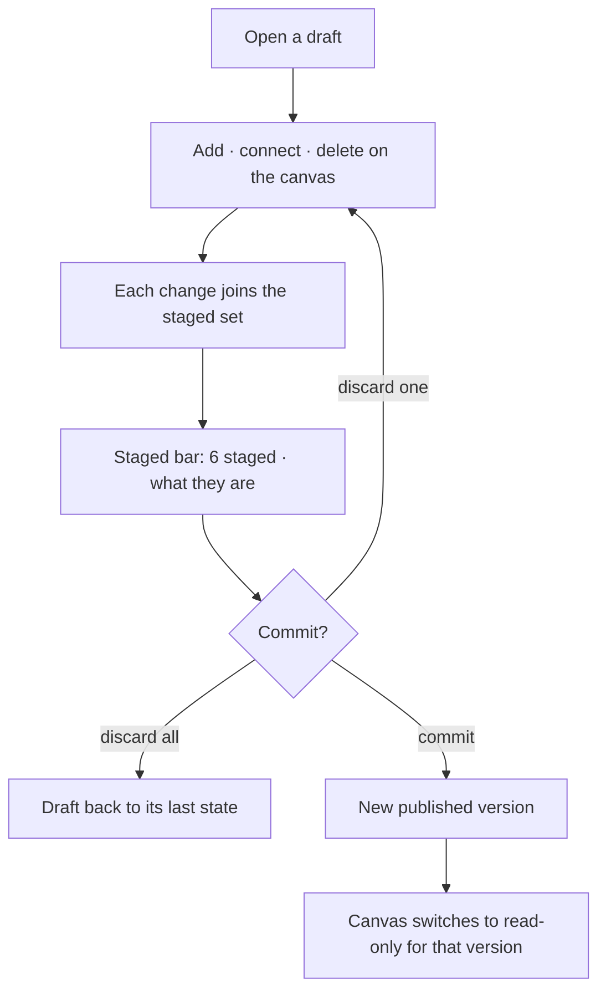

# Model editor

Draw the model. The canvas writes — one of only two kinds that do — and every change stages until it
is committed together.

| | |
|---|---|
| Index | [1.4](../../../README.md#1--connect-and-model) · Slice **S3** |
| Module | [Connect and model](../spec.md) |
| API / CLI / Studio | ✅ / — / ✅ |
| Related | [domain-models](domain-models.md) · [graph-canvas](../../explore/features/graph-canvas.md) · [selection-and-the-panel](../../explore/features/selection-and-the-panel.md) |

> **As** someone authoring a model, **I want** to draw types and connect them and see the whole shape,
> **so that** I am designing a structure rather than filling in a form.

## Capabilities

| # | Capability | Notes |
|---|---|---|
| C1 | Add a node type on the canvas | A gesture writes — this is one of the two kinds that may |
| C2 | Connect two types into an edge type | Drag from one to the other; endpoints come from the drag |
| C3 | Delete, staged | Nothing leaves until the commit |
| C4 | Every change stages | The staged set is listed, counted and reversible before it lands |
| C5 | Commit publishes | One action turns the staged set into the next version |
| C6 | Published versions are pan-and-zoom only | Read-only, with no accidental edits |
| C7 | The panel edits what the canvas selects | Properties, keys and constraints in the panel, never in a modal over the drawing |

## Journey

## Seams

| Seam | What the user sees |
|---|---|
| Nothing staged | The commit action says there is nothing to commit |
| A staged delete with dependents | Named dependents, before the commit, not after |
| Two people on one draft | Single editor at a time; the second sees it read-only with who holds it |
| Leaving mid-edit | The staged set survives; it is part of the draft, not of the session |
| Opening a model | The drawing is laid out and fitted before the first frame — it never drifts into place |
| A section with nothing in it | Its header still reads, with a `0`, and its body says what would go there (ME14) |
| Switching model mid-edit | `Models` in the crumb, then the row. The staged set stays with the draft it belongs to |
| Nothing selected yet | The model list fills the column, with `New` and `Import` on the panel header (ME17) |
| A type is selected | The panel row marks it; the type itself reads in the main column beneath the canvas (ME6, ME19) |
| A long type list | It scrolls inside its own drawer. Edge types, Stitches and Staged keep their headers on screen (ME13) |

## Surfaces

| Surface | Shape |
|---|---|
| Canvas (`kind = model`) | The types and their edges; palette floating on it |
| Panel | Two views (ME17). The **list** of models, or one model's **detail**: a `PanelStack` of four drawers — Node types · Edge types · Stitches · Staged (ME13), under a `Models › <name>` crumb row carrying the version readout, over the staged bar. Neither row scrolls |
| Staged bar | Count, the list, discard-one, discard-all, commit — `⌘↵` commits |
| Type detail | In the **main column**, beneath the canvas: the selected type's properties, with add and remove while drafting, and its constraints (ME19) |
| Version bar | `v2 · draft` beside `v1 · active`; `Publish v2` sits on the header, disabled with its reason when nothing is staged |
| Type form | The selection's form in the main column — name, parent, abstract, instance count, validation, and the property table with cardinality and constraint |
| Property keys | In the **main column**: the version's keys, with the types each is mapped onto (ME19) |

## Engine

| Thing | Shape |
|---|---|
| Draft state | the staged set, stored with the draft, not client-side |
| Commit | validates the whole staged set, then publishes one version |
| Routes | `…/models/{id}/draft*` · `POST …/models/{id}/commit` |
| Events | `model.staged · unstaged · committed` |

## Decisions

| # | Decision |
|---|---|
| ME1 | The model canvas writes from a gesture. Adding, connecting and deleting are the only three. |
| ME2 | Everything stages; nothing reaches a version until a commit. |
| ME3 | A published version's canvas is read-only. |
| ME4 | The staged set lives with the draft, so it survives a reload and is visible to anyone opening it. |
| ME5 | Staged rows sort first in every type list, each carrying a `staged` chip, so what is about to land reads before what already has. |
| ME6 | The selected type is edited in a form that spans the main column beneath the canvas — never in a modal over the drawing. |
| ME7 | A run stages onto the same draft as a gesture does. There is one staged set and one commit, whoever wrote it. |
| ME8 | A type is added from **either** side — the section's `add` in the panel, or the gesture on the canvas — and both open the same form. Two affordances, one path. |
| ME9 | A delete is confirmed as *staging* a delete, not as deleting. "Gone" and "gone when you commit" are different promises, and the confirm makes which one it is unmistakable. |
| ME10 | The compatibility banner lives on the model panel, because that is the surface whose saves the server would refuse. A warning shown where nothing is being written is a warning nobody reads. |
| ME11 | Canvas → panel selection is one-way and idempotent. The canvas announces its inspect target through a ref, never through a dependency on the handler, and the page drops a write that names the selection it already holds. A canvas that re-announces on every render and a handler that answers with a fresh object would otherwise close a render loop. |
| ME12 | The model canvas settles before it is looked at. Its force layout runs to completion rather than animating (`animate: false`, as the read-only canvas already does) and the camera fits once, at the end. A simulation that drifts for ten seconds after the drawing appears reads as a page that is still loading. |
| ME22 | **The drawing is laid out for its labels, not for its circles.** A type is a 14px circle carrying its name *underneath* it and, between two of them, an edge type's name: what has to be kept apart is the label, so the sim separates joined types by 260px, pushes unjoined ones apart at −1500, and collides on an 80px radius — the label's footprint, not the circle's. The edge type's own name is set smaller than the type names it runs between, because it is read second. At the old 90px every name landed on its neighbour. |
| ME23 | **The fit has a ceiling: the camera never zooms past 1:1 to frame a model.** A four-type model is a few hundred pixels of drawing, and a plain `fitContent` answers that by scaling it to fill the viewport — circles the size of a fist, colliding labels, and the last type off the bottom edge. Fitting *out* is always right; fitting *in* is not. |
| ME24 | **The camera follows the *settled* solve.** Both canvases register their sim by id and run it through one bridge, which frames the result on `layout:run:end` with `reason: settled` — never on the promise. A run the engine stops (a re-registration, a topology change landing mid-solve) resolves like any other with every node still on the origin, and fitting that framed a single point and called it a model. The bridge is mounted **before** the layout for the same reason: registering a layout stops whatever that id was running, so a run started beside the registration dies, and `scene:layout:add` is the one trigger that cannot be missed. |
| ME25 | **The drawing is redrawn when the solve settles, then framed.** A layer holds every node invisible while a declared `activeLayout` has yet to report a run — without that gate an unplaced node paints at the origin and the whole model piles up there. This sim is `animate: false` (ME12), so its solve lands in the same beat as the data it is laying out: the gate lifts against a flush that has already been and gone, and the drawing is never installed. The store holds the types, `getBounds()` returns the box and the minimap draws them; the viewport alone stays empty. The bridge that frames the settled solve (ME24) therefore calls the layer's `redraw()` first — a pure render pass over what the store already holds, no data touched. |
| ME26 | **A model's board is named for the model.** The tab reads `AirRoutes`, never `Model` — the rule a lens board already follows (WO15). Two models open side by side put two tabs on the strip, and a strip reading `Model · Model` is one a reader has to click through. The name comes off the models list the panel has already read, so it costs no request; until it lands the tab falls back to the kind's label rather than to an empty one. Drilling into a model in the panel is what opens the board, so the detail and the drawing arrive together. |
| ME13 | The panel is a **stack of drawers**, not a scroll of sections. Every section's header stays on screen — `Models / <name>`, Node types, Edge types, Stitches, Staged — each collapsing to its header on its own, the open ones sharing the column with draggable dividers (`PanelStack`). The header is the thing that is always readable, and the count sits in it, so a thirty-type model never buries Edge types, Stitches or Staged below one shared fold. |
| ME14 | **Every drawer is always present.** A section with nothing in it says so in its body rather than disappearing — `Staged 0`, *Select a type on the canvas*. A stack whose sections come and go re-lays-out under the reader and discards the sizes they dragged, and a header that vanishes when its subject empties is a header nobody can learn the position of. |
| ME15 | **The model drawer, Node types and Edge types open; the rest arrive closed.** The two type lists are what the panel exists for and what the hi-fi draws; above them the drilled `Models / <name>` drawer holds a fixed 160px, because what it carries — the description line, the version ladder, and anything standing in the way of a write — does not grow with the model. Stitches and Staged are a run of closed headers beneath them, one click from open. Five open sections in a 420px column give each one a couple of visible rows, which is the fold problem again in a new shape. |
| ME16 | The open/closed state is **not** a decision the section makes. `defaultCollapsed` applies once, at mount; nothing re-opens a section because its contents arrived — a panel that opens drawers by itself moves the thing the reader was looking at. |
| ME17 | **The panel is the stack — there is no chrome above it.** The first drawer header is the top of the column (G33), and the breadcrumb over the panel already answers *where am I* (G16). What a panel header used to carry acts on a list, so it acts from that list's own header: `New model`, `Import`, `All models`, `Refresh` and `Search` on **Models**, `+ add` on **Node types** and **Edge types**, `Declare a stitch` on **Stitches** — every create CTA in the section that owns it (G3). The panel takes no close control: the rail icon that opened it closes it. |
| ME18 | **The model list and a model's detail are two views, and the first drawer is the seam.** The panel shows the list until a model is picked; then the Models drawer is **drilled in** — its header reads `MODELS / Observations` and its body is what that model *is* (ME21) — and the type drawers take the rest of the column. The trail is text and the way back is a `‹` in the header's action slot: a `PanelStack` header **is** the collapse button, so a crumb drawn there as a link would nest one interactive element in another and steal the collapse click. |
| ME19 | **The panel lists; the main column reads.** The rail carries the type lists and what is staged — never a second copy of the selected type or of the version's property keys. A type reads in the main column beneath the canvas, where the full form has room (ME6); a 300px drawer showing the same thing in miniature is a second place to look for one answer, and the one with less room always loses. |
| ME20 | **A property key is authored on the type that carries it**, in `PropertyEditor`: naming a property creates the key when no key of that name exists, and reuses it when one does. There is no separate *define a key first* step, because a key nothing maps to is a key nobody asked for. The key stays global to the version — this is where it is *declared*, not where it is *scoped*. |
| ME21 | **A model's own metadata reads on one line, with `More` for the rest.** The panel's column belongs to the type lists (ME13/ME15), so the model's description, validation mode, origin, status, version and dates cannot each take a row. The description — the one field a person scans — reads truncated to a single line in the drilled drawer's body; `More` expands the rest as a `PropertyList` and `Less` puts it back. The version chips (`VersionBar`) are the `Version` row's value rather than a row of their own — two chips that change once per publish do not earn the full width of the rail. The compatibility banner (ME10) and the *published — open a draft* notice (ME11) sit under it in the same drawer: both are about the model and the version open on it, not about one type. Collapsed height is constant across models, so switching models never moves the drawers. There is no author row: `GraphModel` records no creator, and a row that always said `—` is worse than no row. |

## Deprecated surfaces

Unreachable code, kept in the tree until a clean-up pass removes it. Nothing imports these; do
not wire them back in.

| File (under `studio/src/pages/graphs-detail/features/connect-and-model/model/components/`) | Went dead when | What does it now |
|---|---|---|
| `DetailPanel.tsx` | the right-side details panel was dropped (`6c9c8eca`) | `ModelCanvas` renders `NodeTypeDetail` / `EdgeTypeDetail` in the main column (ME19) |
| `ModelOverview.tsx` | with `DetailPanel` | `ModelMetaLine` on the model's own panel (ME21), and `ModelFormDialog` for editing |
| `NoSelectionPlaceholder.tsx` | with `DetailPanel` | each surface states its own empty state |
| `PropertyKeyTable.tsx` | with `DetailPanel` | `PropertyEditor`, on the type that carries the key (ME20) |
| `PropertyKeyFormDialog.tsx` | with `PropertyKeyTable` | `PropertyEditor` creates the key inline (ME20) |

`SchemaCanvas.tsx` is live, but five of its comments still describe driving "the right-side
DetailPanel". They are stale, not load-bearing; the clean-up pass takes them too.

## Known broken

| What | Why it is not fixed here |
|---|---|
| Right-click on an **edge** or on empty canvas does nothing | `edge-context-menu` and `background-context-menu` both claim `pointer+rclick` and lose it to `node-context-menu`, which is declared first. Three menus on one gesture needs `@invana/canvas`'s intended dispatch, not a guess from this side. Reverse-edge and delete-from-menu are unreachable until then; the panel and the type form both still do it |

## Not building

| Not building | Because |
|---|---|
| Freehand layout saved per type | layout is a view, not part of the model |
| Multi-user live editing | single editor with a visible holder is honest at this scale |
| Auto-layout that rewrites positions on open | a model you arranged should stay arranged |
| A fit that scales a small model up | ME23. Fitting out is right; fitting in draws a four-type model at 3× |
