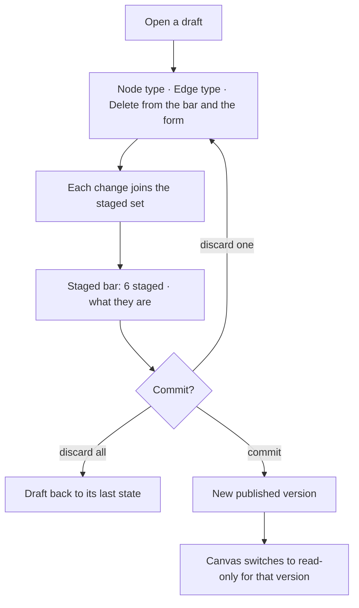

# Model editor

Draw the model. The canvas draws it; the bar over the canvas writes it, and every change stages until
it is committed together.

| | |
|---|---|
| Index | [1.4](../../../README.md#1--connect-and-model) · Slice **S3** |
| Module | [Connect and model](../spec.md) |
| API / CLI / Studio | ✅ / — / ✅ |
| Related | [the-model-page](the-model-page.md) · [domain-models](domain-models.md) · [graph-canvas](../../explore/features/graph-canvas.md) · [selection-and-the-panel](../../explore/features/selection-and-the-panel.md) |

> **As** someone authoring a model, **I want** to draw types and connect them and see the whole shape,
> **so that** I am designing a structure rather than filling in a form.

## Capabilities

| # | Capability | Notes |
|---|---|---|
| C1 | Add a node type from the canvas | **Node type** on the bar over the canvas, or the drawer's `+` — one form (ME8) |
| C2 | Connect two types into an edge type | **Edge type** on the bar; the form names the source and target |
| C3 | Delete, staged | Nothing leaves until the commit |
| C4 | Every change stages | The staged set is listed, counted and reversible before it lands |
| C5 | Commit publishes | One action turns the staged set into the next version |
| C6 | Published versions are pan-and-zoom only | Read-only, with no accidental edits |
| C7 | The panel edits what the canvas selects | Properties, keys and constraints in the panel, never in a modal over the drawing |

## Journey

```mermaid
flowchart TD
    A[Open a draft] --> B[Node type · Edge type · Delete from the bar and the form]
    B --> C[Each change joins the staged set]
    C --> D[Staged bar: 6 staged · what they are]
    D --> E{Commit?}
    E -->|discard one| B
    E -->|discard all| F[Draft back to its last state]
    E -->|commit| G[New published version]
    G --> H[Canvas switches to read-only for that version]
```

## Seams

| Seam | What the user sees |
|---|---|
| Nothing staged | The commit action says there is nothing to commit |
| A staged delete with dependents | Named dependents, before the commit, not after |
| Two people on one draft | Single editor at a time; the second sees it read-only with who holds it |
| Leaving mid-edit | The staged set survives; it is part of the draft, not of the session |
| Opening a model | The drawing is laid out and fitted before the first frame — it never drifts into place |
| A section with nothing in it | Its header still reads, with a `0`, and its body says what would go there (ME14) |
| Switching model mid-edit | `Models` in the crumb, then the row. The staged set stays with the draft it belongs to |
| Nothing selected yet | The model list fills the column, with `New model` · `Import` · `Starter models` on its header (ME17); the page reads every model ([MP2](the-model-page.md#decisions)) |
| A type is selected | The panel row marks it; the type itself reads on the Model tab beneath the canvas (ME6, ME19) |
| A long type list | It scrolls inside its own drawer. Edge types and Stitches keep their headers on screen (ME13) |

## Surfaces

| Surface | Shape |
|---|---|
| Canvas | The **Model** tab of [the model page](the-model-page.md), scoped to one model: [`GraphModelCanvas`](../../../building-studio/graph-model-canvas.md) — the model's types and its edge types between them, with no frame around them; a version with no types shows an empty state instead. Detail, Settings and the theme toggle ride its header; it opens on cards, laid out by ELK (ME12 · ME26) |
| Panel | Two views (ME17). The **list** of models, or one model's **detail**: a `Models / <name>` crumb header with `‹`, then a `PanelStack` of three drawers — Node types · Edge types · Stitches (ME13). Nothing that acts on the model itself ([MP4](the-model-page.md#decisions)) |
| Staged bar | Under the page header while a draft is open: count, the list, discard-one, discard-all — `⌘↵` opens the Publish confirm ([MP6](the-model-page.md#decisions)) |
| Type detail | On the **Model tab**, beneath the canvas: the selected type's properties, with add and remove while drafting, and its constraints (ME19) |
| Version bar | `v2 · draft` beside `v1 · active` on the page header, with the model's description on one line and `More` (ME21). `Publish v2` beside it, disabled with its reason when nothing is staged, opens a confirm naming the changes and the DDL ([MP8](the-model-page.md#decisions)) |
| Type form | The selection's form on the Model tab — name, parent, abstract, instance count, validation, and the property table with cardinality and constraint |
| Property keys | On the **Model tab**: the version's keys, with the types each is mapped onto (ME19) |

## Engine

| Thing | Shape |
|---|---|
| Draft state | the staged set, stored with the draft, not client-side |
| Commit | validates the whole staged set, then publishes one version |
| Routes | `…/models/{id}/draft*` · `POST …/models/{id}/commit` |
| Events | `model.staged · unstaged · committed` |

## Decisions

| # | Decision |
|---|---|
| ME1 | **The model canvas draws; the bar over it writes.** Adding a node type, adding an edge type and deleting are the only three writes, and none of them is a canvas gesture — the canvas is the shared model canvas and carries only its own behaviours (ME26). |
| ME2 | Everything stages; nothing reaches a version until a commit. |
| ME3 | A published version's canvas is read-only. |
| ME4 | The staged set lives with the draft, so it survives a reload and is visible to anyone opening it. |
| ME5 | Staged rows sort first in every type list, each carrying a `staged` chip, so what is about to land reads before what already has. |
| ME6 | The selected type is edited in a form that spans the main column beneath the canvas — never in a modal over the drawing. |
| ME7 | A run stages onto the same draft as a gesture does. There is one staged set and one commit, whoever wrote it. |
| ME8 | A type is added from **either** side — the section's `add` in the panel, or **Node type** on the bar over the canvas — and both open the same form. Two affordances, one path. |
| ME9 | A delete is confirmed as *staging* a delete, not as deleting. "Gone" and "gone when you commit" are different promises, and the confirm makes which one it is unmistakable. |
| ME10 | The compatibility banner sits on the page header, under the model's version readout, because `Edit` and `Publish` are there and those are the writes the server would refuse. A warning shown where nothing is being written is a warning nobody reads. |
| ME11 | **Selection is idempotent both ways.** A click announces `{ kind, id }` from `ClickSelectBehaviour`'s `selection:change`, and the canvas drops an announcement naming the selection it already draws; the page drops a write naming the selection it already holds. The panel selects by name and the canvas by id, and `ModelCanvas` maps one to the other. |
| ME12 | **The model canvas lays out as the global model does — ELK, and only ELK.** Each run glides the camera with the nodes (`fitCamera`) — one behaviour for both modeller canvases ([GM3 · GM10](../../../building-studio/graph-model-canvas.md#decisions)). |
| ME22 | **The drawing is spaced for the Detail level it is drawn at.** Each level's template carries the ELK spacing its node size needs — circles, cards or schema cards — so switching Detail re-runs the layout with room for what is now drawn ([GM4](../../../building-studio/graph-model-canvas.md#decisions)). |
| ME23 | **The camera fits every run, gliding with the nodes.** A model opens framed, and a Detail switch reframes it; the reader's zoom holds between runs. |
| ME24 | **Every run is started by the canvas, not by the engine's auto-run.** `activeLayout` alone does not lay out a graph seeded before the layout registers, so `GraphModelCanvas` runs the active layout itself whenever its data, Detail or theme changes. |
| ME25 | **The drawing is redrawn when a solve ends.** A solve that lands in the same beat as the data flush leaves the viewport empty while the store holds the types, so `layout:run:end` calls the layer's `redraw()` — a pure render pass over what the store already holds. |
| ME26 | **The model canvas is the global model canvas, with one model in it.** `ModelCanvas` builds its version (the draft while one is open) with `buildAllModelsData` — its types and its edge types, with `framed: false` — and draws it on [`GraphModelCanvas`](../../../building-studio/graph-model-canvas.md), the same component *All models* uses. No behaviour is added for authoring; the old tool-driven schema canvas is gone. Two modeller canvases that drew one model two ways were two things to learn. There is no group frame, and no card or hover card prints the model's name — under a type, or on an edge type's title and kind: the page is already the model, so either would say it twice. The builder sets `data.frame` only when it draws frames, and the cards bind to that. A version with no types shows an `EmptyState` in place of the canvas. |
| ME27 | **A model is read on the Models board, and its tab reads the scope.** One board (`kind = models`) whatever the scope ([MP18](the-model-page.md#decisions)); its tab reads `AirRoutes` when scoped to one model and `All models` otherwise, never `Model`. The name comes off the models list the panel has already read, so it costs no request; until it lands the tab falls back to the kind's label rather than to an empty one. |
| ME13 | The panel is a **stack of drawers**, not a scroll of sections. Under the `Models / <name>` header, Node types, Edge types and Stitches each keep their header on screen, each collapsing to its header on its own, the open ones sharing the column with draggable dividers (`PanelStack`). The header is the thing that is always readable, and the count sits in it, so a thirty-type model never buries Edge types or Stitches below one shared fold. |
| ME14 | **Every drawer is always present.** A section with nothing in it says so in its body rather than disappearing — `Stitches 0`, *Declare a stitch to another published model*. A stack whose sections come and go re-lays-out under the reader and discards the sizes they dragged, and a header that vanishes when its subject empties is a header nobody can learn the position of. |
| ME15 | **Node types and Edge types open; Stitches arrives closed.** The two type lists are what the panel exists for. Stitches is a closed header beneath them, one click from open. |
| ME16 | The open/closed state is **not** a decision the section makes. `defaultCollapsed` applies once, at mount; nothing re-opens a section because its contents arrived — a panel that opens drawers by itself moves the thing the reader was looking at. |
| ME17 | **The panel is the stack — there is no chrome above it.** The first header is the top of the column (G33), and the breadcrumb already answers *where am I* (G16). What acts on the list acts from the list's own header: `New model`, `Import`, `Starter models` and `Search` on **Models**, `+ add` on **Node types** and **Edge types**, `Declare a stitch` on **Stitches** — every create CTA in the section that owns it (G3). What acts on one model sits on the page header ([MP4](the-model-page.md#decisions)). The panel takes no close control: the `leftNav` icon that opened it closes it. |
| ME18 | **The model list and a model's detail are two views, and `Open` is the seam.** A click on a row sets the page's scope and leaves the panel on the list; `Open` drills in ([MP5](the-model-page.md#decisions)). Drilled in, the first header reads `MODELS / Observations` and carries no body, and the three drawers take the rest of the column. The way back is a `‹` in the header's action slot: a `PanelStack` header **is** the collapse button, so a crumb drawn there as a link would nest one interactive element in another and steal the collapse click. |
| ME19 | **The panel lists; the page reads.** The panel carries the type lists and the stitches — never a second copy of the selected type, the version's property keys or what is staged. A type reads on the Model tab beneath the canvas, where the full form has room (ME6); the staged set is the bar under the page header ([MP6](the-model-page.md#decisions)). A 300px drawer showing the same thing in miniature is a second place to look for one answer, and the one with less room always loses. |
| ME20 | **A property key is authored on the type that carries it**, in `PropertyEditor`: naming a property creates the key when no key of that name exists, and reuses it when one does. There is no separate *define a key first* step, because a key nothing maps to is a key nobody asked for. The key stays global to the version — this is where it is *declared*, not where it is *scoped*. |
| ME21 | **A model's own metadata reads on one line of the page header, with `More` for the rest.** The description — the one field a person scans — reads truncated beside the version readout; `More` expands description, validation mode, origin, status and dates as a `PropertyList` and `Less` puts it back. The version chips (`VersionBar`) are the readout itself. The compatibility banner (ME10) and the *published — open a draft* notice (ME11) sit under that line: both are about the model and the version open on it, not about one type. There is no author row: `GraphModel` records no creator, and a row that always said `—` is worse than no row. |

## Deprecated surfaces

Unreachable code, kept in the tree until a clean-up pass removes it. Nothing imports these; do
not wire them back in.

| File (under `studio/src/pages/graphs-detail/features/connect-and-model/model/components/`) | Went dead when | What does it now |
|---|---|---|
| `DetailPanel.tsx` | the right-side details panel was dropped (`6c9c8eca`) | `ModelCanvas` renders `NodeTypeDetail` / `EdgeTypeDetail` in the main column (ME19) |
| `ModelOverview.tsx` | with `DetailPanel` | `ModelMetaLine` on the model's own panel (ME21), and `ModelFormDialog` for editing |
| `NoSelectionPlaceholder.tsx` | with `DetailPanel` | each surface states its own empty state |
| `PropertyKeyTable.tsx` | with `DetailPanel` | `PropertyEditor`, on the type that carries the key (ME20) |
| `PropertyKeyFormDialog.tsx` | with `PropertyKeyTable` | `PropertyEditor` creates the key inline (ME20) |

## Not building

| Not building | Because |
|---|---|
| Freehand layout saved per type | layout is a view, not part of the model |
| Multi-user live editing | single editor with a visible holder is honest at this scale |
| Auto-layout that rewrites positions on open | a model you arranged should stay arranged |
| Writing from a canvas gesture — drag-to-connect, add on the canvas, a context menu | ME1 · ME26. The canvas is the global model canvas; the bar over it and the type form write |
