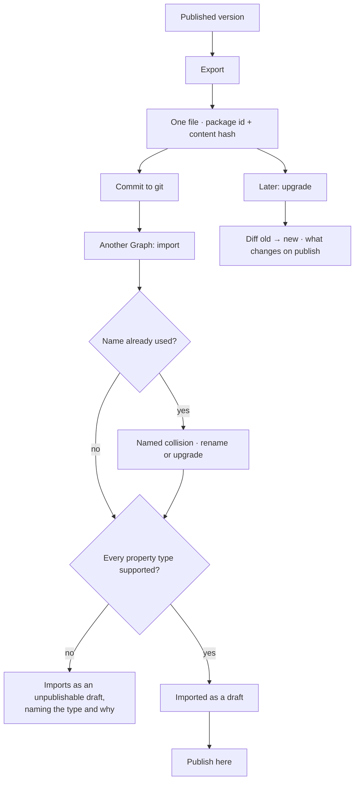

# Share a model

A published model exports as one file, imports into another Graph, and upgrades in place. Files and
git are the registry.

| | |
|---|---|
| Index | [1.5](../../../README.md#1--connect-and-model) · Slice **S7** |
| Module | [Connect and model](../spec.md) |
| API / CLI / Studio | ✅ / ✅ / ✅ |
| Related | [domain-models](domain-models.md) · [starter-models](starter-models.md) · [stitch-models](stitch-models.md) |

> **As** someone starting a second Graph, **I want** to bring a model I already built, **so that**
> `NewsArticles` is authored once and reused, not retyped.

## Capabilities

| # | Capability | Notes |
|---|---|---|
| C1 | Export a published version as one artefact | Self-contained; no server call to resolve it |
| C2 | Import into another Graph | Named on arrival, so two copies can differ |
| C3 | Upgrade an imported model | Identity is `package_id` + content hash, so upgrade is a real path |
| C4 | Bundle several models with their links | Links travel only when both endpoints are in the bundle |
| C5 | Degrade honestly | A property type the target database cannot hold arrives as an unpublishable draft, named |
| C6 | Collisions are named, never merged | A name already in use is reported with both versions |
| C7 | Git is the registry | Commit the file; diffing and history come free |

## Journey

## Seams

| Seam | What the user sees |
|---|---|
| Bundle with a dangling link | The link is dropped, naming which endpoint was missing |
| Upgrade with local edits | The diff shows both; the local draft is never silently overwritten |
| Same content, different name | Recognised by hash as the same package, offered as an upgrade |
| Target database is weaker | Draft imports, with the unsupported types listed and publishing blocked until resolved |

## Surfaces

| Surface | Shape |
|---|---|
| CLI | `invana models export <name>` · `invana models import <file>` · `invana models upgrade <file>` |
| Studio | Import from a file; the diff before publish; the reason a draft cannot publish |

## Engine

| Thing | Shape |
|---|---|
| Artefact | one file per published version: package id, content hash, types, keys, constraints, and links when bundled |
| Identity | `package_id` + content hash — not the name, which is local |
| Routes | `…/models/{id}/export` · `POST …/models/import` · `POST …/models/{id}/upgrade` |
| Events | `model.exported · imported · upgraded` |

## Decisions

| # | Decision |
|---|---|
| SM1 | Files and git are the registry. There is no publishing service. |
| SM2 | Identity is package id plus content hash, so upgrade is distinguishable from import. |
| SM3 | Links travel only inside a bundle containing both endpoints. |
| SM4 | An unsupported property type imports as an unpublishable draft — never refused outright, never degraded silently. |
| SM5 | **A refusal is a sentence that names the next command, and the CLI is where it becomes one.** `ImportRefused` carries a code and the facts behind it, because a route returns them as a document Studio renders. A terminal has no renderer, so printing `model_name_taken: {'name': …, 'same_package': True}` hands a reader the engine's internals and leaves them to work out that the verb they wanted was `upgrade`. The CLI turns each code into what happened, what was written (nothing), and the command that does what they meant. A code with no sentence falls back to the raw pair rather than being swallowed — an unhandled refusal must stay visible, and it is the CLI that is incomplete, not the refusal. |

## Not building

| Not building | Because |
|---|---|
| A hosted model registry | git already versions and shares files |
| Automatic upgrade on import | a schema change is a decision |
| Partial imports of selected types | a model is the unit; splitting it is authoring a new one |
