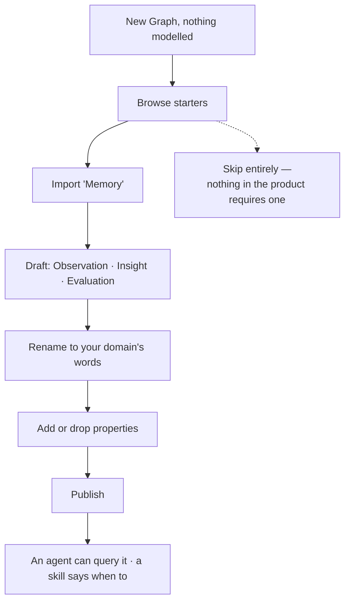

# Starter models

Importable models to begin from — memory, provenance — shipped as ordinary portable artefacts and
renamed on arrival. A starting point, not a fixed schema.

| | |
|---|---|
| Index | [1.7](../../../README.md#1--connect-and-model) · Slice **S7** |
| Module | [Connect and model](../spec.md) |
| API / CLI / Studio | ✅ / ✅ / ✅ |
| Related | [share-a-model](share-a-model.md) · [recall-by-query](../../memory/features/recall-by-query.md) |

> **As** someone setting up a new Graph, **I want** a sensible shape to start from for the parts every
> domain needs, **so that** I am not designing "how do I record what we learned" from nothing.

## Capabilities

| # | Capability | Notes |
|---|---|---|
| C1 | Ship as ordinary model artefacts | Same file, same import path, same upgrade path as any model |
| C2 | Renamed on arrival | The types are yours the moment they land |
| C3 | Nothing is reserved | The product never depends on a starter model's type names |
| C4 | **Memory** starter | An observation, a claim derived from observations, and how that claim fared |
| C5 | **Provenance** starter | Source, record, and the run that wrote it — for domains that want it explicit |
| C6 | Upgradeable | A newer starter version diffs against yours like any other upgrade |
| C7 | Discardable | Import, take two types, delete the rest — it is a draft until published |

## Journey

## Seams

| Seam | What the user sees |
|---|---|
| Name collision with an existing model | Named, with rename or upgrade offered |
| Unsupported property type in the target | Imports as an unpublishable draft, naming the type |
| Starter updated upstream | Offered as an upgrade with a diff; never applied automatically |
| Renamed heavily | Upgrade still resolves — identity is the package, not the names |

## Surfaces

| Surface | Shape |
|---|---|
| CLI | `invana models starters` · `invana models import --starter memory` |
| Studio | Starters listed at model creation; import lands in the modeller as a draft |

## Engine

| Thing | Shape |
|---|---|
| Starters | shipped artefacts in the distribution, versioned with it |
| Import | the ordinary model import path, with `source = starter` recorded |
| Events | `model.imported` with the starter's package id |

## Decisions

| # | Decision |
|---|---|
| SR1 | Starters are ordinary portable models, not built-in schemas. |
| SR2 | No product behaviour depends on a starter's type names. |
| SR3 | A starter arrives as a draft and is renamed before publishing. |
| SR4 | Upgrades are offered with a diff, never applied automatically. |

## Not building

| Not building | Because |
|---|---|
| Reserved system types | naming a type in the product forces one domain's vocabulary on all of them |
| A starter marketplace | files and git are the registry |
| Domain-specific starters (finance, medical) | a worked example teaches this better than a shipped schema |
