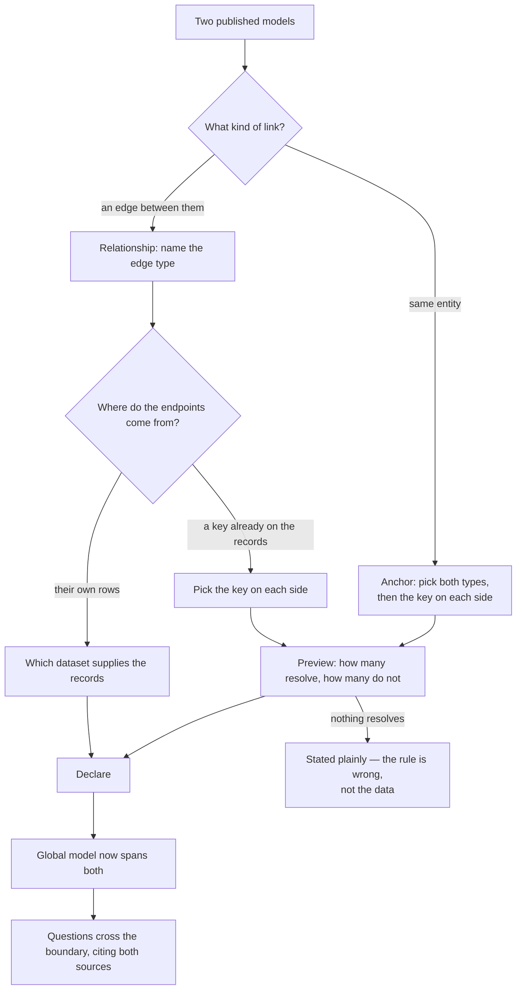
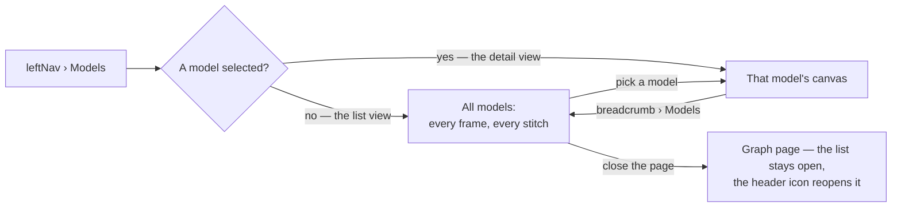

# Stitch models

Two domain models meet through a **declared** link — an anchor (same entity) or a relationship (an
edge between two of them). Either way the link carries **a key on each side**, because the two models
were authored apart and almost never spell the same fact the same way. Their union is the global
model, derived at read time.

| | |
|---|---|
| Index | [1.6](../../../README.md#1--connect-and-model) · Slice **S7** |
| Module | [Connect and model](../spec.md) |
| API / CLI / Studio | ✅ / ✅ / ✅ |
| Related | [domain-models](domain-models.md) · [load-data](../../bring-data-in/features/load-data.md) |

> **As** someone with several domains in one Graph, **I want** to say how they relate, **so that** a
> question can cross them without anyone guessing which `Stock` is which.

## Capabilities

| # | Capability | Notes |
|---|---|---|
| C1 | Declare an **anchor** | `NewsArticles.Company.ticker ≡ MarketData.Stock.nse_symbol` — one key on each side |
| C2 | Declare a **relationship link** | `Order -[PLACED_BY]-> Person`, its endpoints found by a key on each side **or** supplied by a dataset |
| C3 | Join rules are explicit | Which property on each side, matched how — never a similarity score |
| C4 | An anchor links, never merges | Both nodes stay; queries traverse the link |
| C5 | The global model is derived | Union of published models plus links, computed on read |
| C6 | A stitch is its own kind of run | `Todo(kind = stitch)` — it writes edges with no dataset in the picture |
| C7 | Links only bind published versions | A draft cannot be stitched |
| C8 | A stitch stages before it counts | Declared rows exist and are visible; the union takes active ones only (ST21) |
| C9 | A bundle's stitches apply from one command | `invana stitches apply --file <bundle>/stitches.json` declares every rule the manifest states, staged (ST39) |
| C10 | Committing a stitch **writes its edges** | A keyed relationship writes its edge type, an anchor writes `SAME_AS`; both are MERGEd, so committing twice writes nothing twice (ST44, ST49) |
| C11 | An active stitch is **standing**, not a one-off | Every later import solves the Graph's active stitches over the records it just wrote, so data arriving after the stitch is stitched as it lands (ST47) |
| C12 | A stitch-made edge says it is one | `_inv_origin = "stitch"` with the stitch id, the rule and when it was solved — nobody loaded these, and the graph says so (ST46) |
| C13 | A declared stitch can be re-counted | `invana stitches resolve` counts what each one matches against the live database, and writes nothing (ST43) |

## Three worked stitches

The finance Graph holds six models. These are every shape a stitch takes; nothing else is one.

| # | Stitch | Kind | Source key | Target key | Endpoints from |
|---|---|---|---|---|---|
| W1 | `NewsArticles.Company ≡ MarketData.Stock` | anchor | `Company.ticker` | `Stock.nse_symbol` | the keys |
| W2 | `Brokerage.Order -[FOR]-> MarketData.Stock` | relationship | `Order.instrument_isin` | `Stock.isin` | the keys |
| W3 | `Observations.Observation -[ABOUT]-> MarketData.Stock` | relationship | — | — | the `obs` dataset |

**W1** is the case a single shared property name cannot express. Two teams authored two models apart;
one wrote `ticker` and the other wrote `nse_symbol`, and neither is going to rename its published
version because the other exists. The anchor says they are the same Company, matched `exact`; both
nodes stay (ST2).

**W2** is a foreign key that is *already a property* of the records — `Order` arrived carrying
`instrument_isin` and nothing else. There is no dataset of `(order, stock)` pairs to load and there
never will be, so the edge is found by reading the key on each side. The types differ, so this is not
an anchor: `Order` is not a `Stock`.

**W3** is the other half: the edge is its own fact, with its own rows, arriving in a dataset like any
other data (ST4). `Observation` carries no key pointing at `Stock` — what it points at was decided
when the observation was written, one row per edge.

## Fixtures

`demos/airways/` ships three datasets that are one story from three angles — **air-routes** is the
network, **news-articles** is what gets written about it, **twitter** is what gets said about
that. Each carries a `graph-model.json` to import and publish, and the keys they join on are
read out of the neighbouring dataset at generation time rather than retyped, so every rule
resolves against rows that exist.

| Shape | Fixture | Resolves |
|---|---|---|
| **W1** — a key on each side | `NewsArticles.Country.iso_code ≡ AirRoutes.country.code` | 44 / 44 |
| Anchor, `case_insensitive` | `Twitter.Hashtag.tag ≡ NewsArticles.Topic.tag` — `RouteLaunch` ≡ `routelaunch`, with six hashtags no story was filed under, so the preview shows an overlap rather than a clean union | 10 / 16 |
| **W2** — a foreign key already on the records | `Twitter.Tweet -[LINKS_TO]-> NewsArticles.Article` on `linked_url` ≡ `url`; six more like it | 65 / 65 |
| **W3** — endpoints from a dataset | `Twitter.Tweet -[ABOUT]-> NewsArticles.Article`, from `twitter/stitches/ABOUT.json` | 22 rows |

Counts are **distinct key values**, as `…/model-links/preview` reports them — 26 airlines
share 24 hub codes. `invana records check demos/airways` counts every rule without a
database; the full matrix is [demos/airways](../../../../../demos/airways/README.md).

**Only two of the ten are anchors.** An anchor is type-level, so it is true only when *every*
node of one type is a node of the other: a country is a country, and a hashtag names the
topic a story was filed under. A city is not an airport and an airline's social account is
not the airline, so those are relationship links. Anchoring them collapsed `Account` into
`Airline` in the derived union and cost `Publisher` its Twitter side — the union is where a
type-level over-claim shows up, because that is the one place an anchor is read as a claim
about every node rather than about the rows that happen to match.

## Journey

## Seams

| Seam | What the user sees |
|---|---|
| Join rule matches nothing | A count of zero before the link is declared, not after, and *Stage this stitch* goes dead until the rule changes |
| Neither side holds any rows yet | **Not** a refusal — *No records to count*, and the stitch stages anyway (ST38) |
| A key that is not a property of its side | Refused, naming the side and the type that lacks it. A type that carries **no** properties says so in place of the picker, rather than offering an empty dropdown |
| Duplicate anchors on the same pair | Refused, naming the existing one |
| A model version republished | Links point at versions; a new version needs its links reviewed |
| Endpoint missing at import | The edge record is rejected with both endpoints named |
| A stitch declared but not committed | It is listed, drawn and counted — and no answer changes, which the declare message says out loud (ST21) |
| Committing with nothing staged | Refused, saying there is nothing to commit — never a silent success |

## Surfaces

Stitching has no surface of its own. It has no `leftNav` item, because a surface whose normal state
is empty does not earn one — every list here is empty until the Graph holds **two published
models**, and most do not.

| Surface | Shape |
|---|---|
| Model panel › **Stitches** | The links touching this model, listed from **either** side — `Article ≡ Stock` is the same fact whichever model you are looking at. A row reads `NewsArticles.Company ≡ MarketData.Stock` over `Company.ticker = Stock.nse_symbol · exact · active`: the pair, then the rule it resolves on, then its state. `add` opens the declare card, which carries **both kinds** itself (ST11) |
| **Declare card** | One card, titled *Declare a stitch*, with the kind as a segmented control inside it. Opened from the selected type or from a drag, with the side(s) the gesture named **pre-filled** as **Source** and **Target**. Both kinds name the key on each side; anchors add `Match`, relationships add `Edge` and an `Endpoints` choice — *These keys* or *Its own rows* (ST27). Its button says **Stage this stitch**, because that is what it does (ST21). Docked over the canvas on *All models*, a dialog from the drawer (ST34) |
| Preview | Resolve counts before declaring, fired as soon as both keys are named (ST35) — `1,284 of 1,310 resolve`, and under it the sentence that names both keys. A rule that matches nothing says so before it is committed, not after, and *Show the N* lists the source keys that matched nothing |
| Refusals | A pair already stitched comes back as its own card naming the **rule the existing stitch carries**, with *Open the existing stitch* (ST36) |
| **All models** | Every published model on one canvas in `mainSection`, each a group frame with its node types inside; a stitch is the only edge that crosses one (ST14). A crossing carries its rule as its label — `Company.ticker ≡ Stock.nse_symbol`, `FOR · Order.instrument_isin = Stock.isin` — so the canvas states what the list states. Zoom is the altitude — collapsed frames are the constellation, an expanded one is the model you are inside (ST15). Tools stack down the left rim; the legend and the altitude control sit on the bottom rim; **counts are not on the canvas** (ST37). The panel beside it is `ModelPanel`'s list view (ST22), and **that pairing is what opens it**: switching the `leftNav` to Models draws the landscape, no button pressed (ST24) |
| **Global model page** | The derived union, in `mainSection`. It belongs to no single model, so no model's panel holds it |
| **CLI** | `invana stitches apply --graph <username>/<slug> --file <bundle>/stitches.json` declares every rule a bundle states — staged, and reported one per line as *declared*, *already declared* or *skipped* with the reason. `--commit` flips the set in the same run; `--dry-run` prints the plan and writes nothing. `invana stitches list · commit · discard` are the drawer's own writes, on the command line (ST39), and `invana stitches resolve` counts what each declared stitch matches against the live database (ST43) |

Entering it (ST24):

The global-model page **states** the union — every node and edge type, which models contribute it,
and whether it is anchored. It does not draw it: `GlobalType` carries no endpoints, so an edge type
in the union does not say what it connects. Drawing it needs `source`/`target` on the payload.

## Engine

| Thing | Shape |
|---|---|
| `model_links` | `kind (anchor\|relationship)` · `status (staged\|active)` · both model version ids · both type names · `source_property` · `target_property` · `identity_match` · `edge_type` and `source_model_id` (relationship only) |
| Global model | derived on read: union of published versions plus their **active** links. `staged_count` and `mirror_label_count` ride beside the counts, never inside them (ST21, ST7) |
| Routes | `GET …/model-links?status=` · `POST …/model-links` (stages) · `POST …/model-links/commit` · `POST …/model-links/discard` · `DELETE …/model-links/{id}` · `POST …/model-links/preview` |
| Preview | `POST …/model-links/preview` takes `source_type` · `source_property` · `target_type` · `target_property` · `identity_match` and returns `StitchPreview` — the totals, `resolved`, the two unresolved counts, up to 25 `unresolved_sample` keys, and a `verdict` naming both keys. One shape for both kinds |
| Refusals | `key_required_on_each_side` · `edge_type_required` · `edge_type_on_anchor` · `source_model_on_anchor` · `endpoints_required` · `keys_and_source_model` · `version_is_draft` · `type_not_in_version` · `link_already_declared` (409, carrying the existing stitch's rule) |
| Events | `model_link.declare · commit · discard · remove` · `todo.stitch` |
| Solving | `modeller.solve.solve_link` — one MERGE per stitch, run on commit over everything already in the graph (ST44) and again at the end of every import over what that import wrote (ST47). Every edge it writes carries `_inv_origin`, `_inv_stitch_id`, `_inv_rule`, `_inv_at` (ST46) |
| CLI | `invana stitches list · apply · commit · discard · resolve`. `apply` reads the bundle manifest `invana records check` validates, resolves each `<dataset>` to a published version (ST40) and calls the same `declare` the route calls — one path into `model_links`, whoever walks it |

Declaring, committing and discarding are the engine's three writes; removing is the fourth and is immediate, staged or not — there is nothing to preview about a fact being withdrawn.

## Decisions

| # | Decision |
|---|---|
| ST1 | Every link is declared. Nothing is inferred, ever. |
| ST2 | An anchor links; it never merges two nodes. |
| ST3 | The global model is derived at read time and never stored. |
| ST4 | A relationship link's records come from a dataset, like any other data. |
| ST5 | A stitch is its own Todo kind. |
| ST6 | The global model is **stated, not drawn**: counts that name what they were derived from, then every node and edge type with the models contributing it. `GlobalType` carries no endpoints, so there is no graph to lay out — drawing it needs `source`/`target` on the payload first. |
| ST7 | The physical mirror's label count sits beside the derived counts and is never added into them. |
| ST8 | A link binds published versions only. A draft has nothing immutable to point at, so it is absent from the pickers and the Stitches section says so. |
| ST9 | Stitching has no `leftNav` item. Declaring starts from a type already selected, so it lives in the Model panel; the union is a page, because it belongs to no single model. |
| ST10 | A model's Stitches section lists every link touching it, from **either** side. `Article ≡ Stock` is one fact, not two. |
| ST11 | Both kinds are declared from the same place. The `add` control offers anchor and relationship, and the dialog opens with the selected type as the source either way — a relationship link is not a second surface. |
| ST12 | **Stitches** is a **drawer in the Model panel's stack** (model-editor.md ME13), so stitch hands the model a section rather than rendering one. `useStitchesSection()` returns the section and the declare dialog; the model places the first in its stack and the second beside it. The `add` control is the drawer header's own menu — anchor or relationship — which is what ST11 always described and now is natively. |
| ST13 | **The surface is called Stitches.** A person stitches two models together; `model_links` is what the engine stores once they have. The drawer, the section header, the crumb and the status line all read *Stitches*; the nouns inside it stay **anchor** and **relationship link**, and the word *link* stays in the engine — `model_links`, `…/model-links`, `model_link.declared`. *Links* as a surface name collided with the everyday hyperlink and named the record rather than the act. |

| ST14 | **Every model draws on one canvas — *All models*.** A model is a **group frame**: `@invana/graph`'s own group, a node carrying `style.group`, with its node types pointing at it through `parentId`. The frame is a `tabbed-rect`, so the model's name rides the tab *on* the boundary rather than floating inside the drawing. A **stitch is the only edge allowed to cross a frame**: an edge whose endpoints sit in two different groups is a stitch by construction, and an edge inside one frame is that model's own edge type. Nothing declares the difference twice. |
| ST15 | **Altitude is collapse, not a second canvas.** Zoomed out every frame carries the `collapsed` state: a `tabbed-rect` closes to its own tab, so each model reads as one named folder, and the layer re-routes each stitch onto it — the constellation is the same data, with nothing hidden from the reader and nothing rebuilt. Past the threshold the model under the camera expands while its neighbours stay closed, which is what a **port on the rim** is. One canvas, one data build, one page kind. |
| ST16 | **It reads versions, never the union.** *All models* fans out over the models list and each model's **active version**, plus `…/model-links` — every endpoint it needs is on those payloads already. It never calls `…/global-model`, whose `GlobalType` carries no endpoints, so **ST6 stands unchanged**: the global-model *page* is still stated, not drawn. Two surfaces, two questions, two payloads. |
| ST17 | **One hue per model, from the data palette.** A frame, every node type inside it and its legend row wear the same `--color-data-N`. A stitch wears the edge token and never a model's hue, because it belongs to neither of them. |
| ST18 | **A model with nothing published still draws.** The canvas spans published versions only (ST8), so a model whose draft has never been committed appears as an **empty frame that says so**, not as an absence. A model you cannot see is a model nobody remembers to publish. |
| ST19 | **Declaring starts from the canvas here too.** Dragging a node type onto another frame opens the same declare dialog the Stitches drawer opens (ST11), with the dragged type pre-filled as the source — the gesture and the drawer are two affordances onto one path, exactly as ME8 has it for adding a type. |
| ST20 | **ELK lays the frames out, not d3-force.** `ElkLayout`'s compound-group mode packs a group's members *inside* its box, sized from the group's own padding and header band, and lays a **collapsed** group out as the single node the renderer draws — the altitude contract (ST15) for free. `D3ForceLayout`'s `cluster` force only pulls members toward each other; it is not a container, and frames that overlap are frames that lie. The worker is Studio's own `?worker` import, for the reason [graph-canvas](../../explore/features/graph-canvas.md) already records. |
| ST21 | **A stitch stages on its own row, not on a draft.** `model_links.status` is `staged` or `active`. Declaring writes a **staged** row; `Commit` flips every staged row in the Graph to active in one action, `Discard` deletes them. The derived global model unions **active links only**, so a staged stitch changes no answer until it is committed. This is deliberately *not* the model's staged set: that one is the live diff between a draft and the version it replaces and records nothing (`staging.py`), and a stitch belongs to no version, so it has no draft to diff. What the two share is the property that matters — the staged set lives on the server, so it survives a reload and anyone opening the Graph sees it (ME4). |
| ST22 | **The panel is the Model panel, not a second one.** *All models* mounts `ModelPanel`'s **list** view (ME17) and hands it the Stitches and Global-model drawers. Picking a model in it flips to that model's detail exactly as it does today. A second place that lists models is a second place that can disagree about them (ME19, DS17). |
| ST23 | **Altitude is a control, not a readout.** The bottom-right altitude track is draggable and sets the camera zoom — it both reports where you are and takes you there. Zoom stays the natural gesture; the control is the one that does not require knowing that.
| ST24 | **Models, with nothing selected, *is* the landscape.** The main area belongs to the open panel, so the Models panel's two views each own a canvas: the **list** view's is *All models*, the **detail** view's is that model. Switching the `leftNav` to Models therefore draws every model at once — the whole landscape, before anyone has chosen where to look — and coming back to the list from a model returns to it. Picking a model replaces it; closing the page with its X leaves it closed, and the list header's icon is how you get it back. There is no "open all models on one canvas" row: a canvas you have to ask for is a canvas most people never see. |
| ST25 | **A solve never takes the camera.** `<ElkLayout fitPadding={null}>` — the wrapper's own `end → fitContent` fired on *every* run, and since an altitude flip re-runs the solve (ST15), zooming past the threshold re-fit the camera, which dropped the zoom back under the threshold, which flipped the altitude again: the view oscillated and any zoom the reader had was gone. So the canvas owns the camera instead, and there are exactly three moves. **Opening** puts it at the landscape altitude and fits once, which is also what makes ST24's first sight the whole constellation. A **topology change** — a model published, a stitch declared — re-fits only while the reader is still at that altitude; zoomed into a model they keep their view. An **altitude flip** never changes the zoom, because the zoom *is* how they asked for this altitude — it only pans, re-centring on the whole map going out and on the frame you were in coming back, since ELK has just repacked everything. **Fit** is the fourth move and it is the reader's own, so it is allowed to do both, and it lands at the landscape altitude because that is what it says. |
| ST26 | **A link carries a key on each side, not one key between them.** `source_property` and `target_property`, with `identity_match` saying how they compare. One property name assumed to exist on both sides is a rule that only holds when the two models were authored together, which is the one case stitching is not for — W1 is the ordinary case, not the exotic one. The pair means *same entity* on an anchor and *where the edge attaches* on a relationship; one field pair, read two ways, because it is the same question both times: which value on this side equals which value on that one. |
| ST27 | **A relationship gets its endpoints from a join or from its source model's own rows — never both.** Keys (W2) are for an edge that is implied by a property the records already carry; a source model (W3) is for an edge that is its own fact with its own rows. Declaring both would give one edge type two sources of truth and no rule for which wins, so the dialog offers them as a choice — *These keys* or *Its own rows* — and the engine refuses the pair. |
| ST28 | **The dialog says Source and Target.** They are the payload's own words (`source_version_id`, `target_type`) and the doc's; *From* and *To* read as direction, which is right for a relationship and meaningless for an anchor. One pair of words for both kinds, matching what is stored. |
| ST29 | **A frame is drawn at the size the solver reserved for it.** Two things broke that and both are gone: a `shape` width/height on a group is a floor the renderer applies and ELK never sees, so a one-type model was drawn three times wider than its slot; and a model with **nothing published** is not a group at all — ELK sizes a group from its members and reserves nothing for one with none, so an empty frame landed on top of whichever neighbour was there. An empty frame is a plain sized node (220×140), a frame with members is sized by `autoFit` alone, and the gap between frames is wider than a tab is tall, because the tab is drawn *above* the box. |
| ST30 | **The fit frames the graph layer, not every layer.** `fitView` unions every world layer, and the dot pattern behind the frames is one — framing that union is how the landscape ended up in a corner of its own canvas. The camera fits `GraphLayer.getBounds()`, and only on a **settled** solve (model-editor.md ME24): a stopped run leaves every frame on the origin, and fitting that frames a point. |
| ST31 | **Collapse is store state, so it is re-applied whenever the drawing is rebuilt.** `<GraphLayer data>` *replaces* the drawing when its reference flips, and every frame's `collapsed` state goes with it — the zoom said models, the canvas drew types, and altitude looked broken. Two halves to the fix: the altitude bridge re-applies the current altitude on a rebuild, and `useAllModels` stops causing needless ones — `useQueries` hands back a new results array on every render, so its versions are read through `combine`, whose result is structurally shared. The drawing was being rebuilt dozens of times a second. |
| ST32 | **A closed frame is a label, not a shrunken boundary.** It carries its own `state.collapsed` overlay: more of the model's hue than the open frame's 7% wash, and its title at full strength in a neutral — a pastel name on a wash of the same pastel is a name nobody can read. The tab is deep enough for the two lines it always carried (the model, and the version drawn), and a model's own edge type goes **unlabelled** while its frame is closed, because a re-routed inner edge printed its name across the tab. **The altitude threshold is 1×**, so the constellation is read at about 1:1 rather than at the 0.6 a lower threshold forced it to; *Types* sits at 1.6×. |
| ST33 | **A frame's name follows the theme.** `<ThemeBridge>` retints the layer *template*, and a frame carries its own per-node style, which **overrides that template field by field** (`GraphLayer.resolveNodeStyle`) — so a field the frame sets is a field the theme can no longer reach, and the frame sets `labelColor` — so its title was the one thing on the canvas painted in a fixed colour, and in the dark theme it was dark on dark: the models had no names, open or closed. The title now reads `--color-foreground` live (`readCanvasForeground()`, rebuilt when the theme changes), and the open frame's wash is strong enough for a title to sit on rather than the 7% it was. |
| ST34 | **The declare card is docked over the canvas, not modal.** The gesture that opens it on *All models* is a drag between two frames, and a scrim over those frames hides the two types the stitch is about. From the Stitches drawer there is nothing behind it worth keeping in view, so there it is a dialog — the same card, the same words, the same counts. |
| ST35 | **The count fires itself.** Naming both keys completes the rule, and the rule is the question; a button that has to be pressed to answer it is a count most people never see, and the whole value of the preview is that it arrives *before* the stitch exists. A zero disables *Stage this stitch* and the secondary reads **Try another key**, because the rule is what needs changing. |
| ST36 | **A refusal names what it refused.** `link_already_declared` carries the existing stitch's id and its rule, and the card states them: a pair is anchored once, so the useful action is to change *that* stitch, not to be told no and left to find it. |
| ST37 | **Counts live on the panel, never on the canvas.** `5 models · 6 stitches · active` sits on the Models panel's meta line beside the drawing. A count in two places is a count that can disagree with itself, and the panel is where a person is already reading the list those counts are about. The canvas keeps only what is about the *drawing*: the legend, the altitude, and the banner for a stitch bound to a version it is not drawing. |
| ST38 | **A zero against no rows is not a verdict.** The preview refuses a rule only when there were rows to judge it against: `countable` is false when either side holds no value for its key, and the card reads *No records to count* and stages anyway. A model is authored before its data lands — that is the ordinary order of work, and a stitch that could not be declared until the records arrived would invert it. |
| ST39 | **A bundle's stitches declare from the CLI.** `invana stitches apply --graph <username>/<slug> --file <bundle>/stitches.json` reads the manifest `invana records check` already validates (load-data.md LD12) and declares each rule against the Graph — **staged**, exactly where the declare card leaves one (ST21), with `--commit` to flip the set in the same run. A bundle that states eleven rules in a file and then asks a person to retype them into a card is a bundle whose rules exist twice, and the two copies disagree the first time one of them is edited. Nothing is inferred on the way in (ST1): the CLI declares what the manifest says, so both paths write the same rows. |
| ST40 | **The manifest names folders; a stitch binds versions, so the CLI resolves one to the other.** A rule says `news-articles:City.code` and a link needs a published version id. `<bundle>/<folder>/graph-model.json` carries the artefact's `package_id`, which is the model's identity wherever it landed (share-a-model.md SM2), so a folder resolves to its model by package, then by name for a model authored rather than imported. **A folder declares its own model and nothing else has to remember the binding** (load-data.md LD23). Whatever it resolves to must carry a **published version**, and a model with only a draft is skipped naming the model (ST8) — that is a step somebody forgot, and saying which one is the whole difference between a message and an error. |
| ST41 | **Applying twice declares nothing twice.** A rule whose pair is already stitched comes back `link_already_declared` (ST36) and the CLI reports it as *already declared*, not as a failure: a manifest is applied again after every edit to it, and re-running is the ordinary case, not the exceptional one. The exit code is non-zero only for a rule that could not be declared at all — no published version, a type the version does not carry, a rule the engine refuses — so a pipeline can branch on it exactly as it branches on `records check`. |
| ST42 | **A relationship whose endpoints are rows binds the model whose records ship them.** `"rows": "ABOUT.json"` names a file inside a folder and `model_links.source_model_id` names a model, so the CLI binds the model of the rule's **source** — the one whose folder carries `stitches/ABOUT.json`. Binding the target instead would read the rows out of the wrong folder and resolve every endpoint backwards, which is why the test asserts the side and not merely that something was bound. A folder whose model this Graph does not hold is skipped naming the model (ST40). Keys are never sent beside it (ST27). |
| ST43 | **A declared stitch can be counted again, against the database.** `invana stitches resolve` runs the same query the declare card runs, once per declared stitch, and reports `resolved/total` beside the rule. Before a stitch exists the count belongs to the card; after it exists it belongs here, because a rule nobody can re-check is a rule nobody trusts — and the data a rule was judged against is not the data it will run against next month. It opens the connection to read and writes nothing; offline, against a bundle's files, the same count is `invana records check`. |
| ST44 | **Committing a stitch writes its edges.** `Commit` is the moment a person says *this belongs in the union*, and a union the graph does not reflect is a claim nothing can traverse (C4). So the commit runs the stitch: for each active row, one MERGE joining the two keys — `MATCH (a:City), (b:airport) WHERE a.code = b.code MERGE (a)-[:SERVED_BY]->(b)`. The counts come back with the commit, and a stitch that wrote nothing says so rather than reporting success. |
| ST45 | **What each kind writes.** A keyed **relationship** writes its own `edge_type`. An **anchor** writes `SAME_AS`, in the source→target direction, read undirected — both nodes stay (ST2), and *queries traverse the link* is only true if there is a link to traverse. A **model-sourced** relationship writes nothing here: its rows are its own fact and arrive with the records (ST4, C7), so solving it would invent edges nobody loaded. |
| ST46 | **A stitch-made edge says it is one.** Every edge a solve writes carries `_inv_origin = "stitch"`, `_inv_stitch_id`, `_inv_rule` — the rule spelled out, `City.code = airport.code` — and `_inv_at`. A cross-model edge is otherwise indistinguishable from a record somebody loaded, and these are not records: nobody wrote them down, a rule derived them. It is also what makes the rest mechanical — a withdrawal finds exactly its own edges (ST48), and a re-solve recognises its own work. |
| ST47 | **An active stitch is standing, so every import solves it.** The import run's third step is already called `stitch` (load-data.md LD6): besides resolving the edges the dataset deferred, it now solves the Graph's **active** stitches over the records that import just wrote, scoped by the job's own provenance stamp. A rule solved once is a rule that is wrong by the next load — the tweet that arrives tomorrow has to reach the airport it names without anybody re-running anything. Staged stitches are not solved: nothing that is not in the union may write to the graph. |
| ST48 | **Removing a stitch removes what it wrote.** `MATCH ()-[r]->() WHERE r._inv_stitch_id = $id DELETE r` — withdrawing the fact withdraws the edges derived from it, because an edge whose rule no longer exists is one nobody can explain. Discarding a **staged** stitch deletes nothing: it never wrote anything. |
| ST49 | **Solving is a MERGE, so it is idempotent.** Committing twice, solving twice, importing the same dataset twice — none of them writes a second edge, and that is precisely what makes ST47 safe to run at the end of every load. It also means a solve can be interrupted and re-run rather than needing to be undone. |
| ST50 | **A stitch says where it came from.** `description` is written by whoever declared it — `invana stitches apply` writes *from the airways bundle (R1)* — and the Stitches row states it after the rule and the status. A stitch declared from a file on somebody's laptop is otherwise an anonymous row in a drawer three people share, and the first question anyone asks about a rule they did not write is where it came from. |
| ST51 | **A model-sourced stitch is run by loading its rows.** Committing a keyed rule joins two keys; committing a rule whose endpoints are rows reads `stitches/<EDGE_TYPE>.json` out of the folder those records were loaded from and writes those rows. **Where the files are is a fact about a load, not about the model**, so it is read back from the run that loaded them rather than stored a second time ([task-model-migration § 6.7](../../../building-engine/task-model-migration.md)). Every later import of those records writes them again, and the MERGE makes both no-ops after the first (ST49). Without this a W3 stitch is a rule pointing at data nobody ever loads: declared, and never true. |
| ST52 | **A loaded stitch edge is marked exactly like a derived one.** It carries `_inv_origin = "stitch"`, the stitch id and the rule, *and* the record provenance an import stamps (`_inv_model_id`, `_inv_record_id`, `_inv_file`, `_inv_run_id`). It is both: a record somebody loaded and an edge that exists because a stitch says so — so a withdrawal takes it (ST48), and the journal can still say which file and which row it came from. |

## Not building

| Not this | Why |
|---|---|
| A `leftNav` item for stitching | Declaring starts from a type you already have selected; browsing links is not a task |
| Inferred links | ST1. Nothing here guesses that two types are the same |
| Merging anchored nodes | ST2. Both nodes stay; queries traverse the link |
| A stored global model | ST3. Derived on read, so there is nothing to keep in sync |
| Linking drafts | ST8. Links bind published versions |
| Editing a model from *All models* | ST14 draws published versions. Authoring is the model canvas, on a draft — one surface writes a model, and it is not this one |
| A saved layout for *All models* | the arrangement is a view, as it is for the model canvas. The frames lay out on open and fit once |
| A landscape that reopens itself | ST24. The X closes it for good while the list stays open — a page that came back would be a page you cannot close |
| An auto-fit on every solve | ST25. It fought the reader's zoom and oscillated against the altitude threshold. Fit is a gesture, not a side effect |
| A minimum size for a frame | ST29. A floor the solver cannot see is a frame that overlaps its neighbour |
| Composite keys | One property per side. A rule you cannot read out loud in one line is a rule nobody audits |
| A transform on a key — trim, strip a prefix, regex | `identity_match` is `exact` or `case_insensitive` and stops there. Data that needs reshaping is reshaped on the way in, in the dataset, where the change is visible to everyone |
| Guessing the key from the property name | ST1. `person_id` looking like `id` is a coincidence the reader has to confirm anyway |
| An edge with both keys and a source model | ST27. Two sources of truth for one edge type |
| A *remove a stitch* tool on the canvas | `@invana/canvas` emits `input:node:click` and no edge equivalent, so a crossing cannot be picked. Removing is the Stitches row's own control, where the stitch is named in words rather than aimed at |
| Removing a stitch from the CLI | A withdrawal is a fact somebody's answers already depend on, and the Stitches row withdraws it where it is named in words. `discard` drops the **staged** set, which nothing has read yet |
| Solving a model-sourced relationship | ST45. Its rows are its own fact; inventing those edges from a key pair it does not have is guessing (ST1) |
| A stitch that rewrites history | A solve writes edges forward — it never edits or deletes a record somebody loaded. The only thing it deletes is its own (ST48) |
| A resolve preview for a model-sourced relationship | There is no rule to count. The endpoints are rows; what they resolve against is decided at import, so the card names the model that ships them instead |
