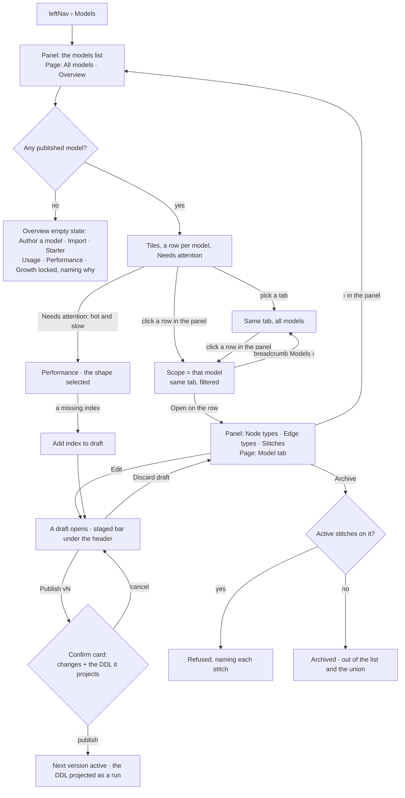
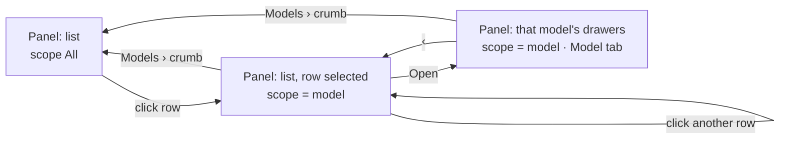

# The model page

One page for everything a Graph's models are: what is authored, what the database really holds, whether
anyone uses it, where it is slow and how the data has grown. The same tabs read every model at once or
one model — **the model is a filter, not a second page**.

| | |
|---|---|
| Index | [1.8](../../../README.md#1--connect-and-model) · Slice **S-TBD** |
| Module | [Connect and model](../spec.md) |
| API / CLI / Studio | 🔵 / — / 🔵 |
| Related | [model-editor](model-editor.md) · [stitch-models](stitch-models.md) · [introspect-a-database](introspect-a-database.md) · [domain-models](domain-models.md) · [the library's plan page](../../workflows/features/the-library.md) |

> **As** the person who owns a Graph's models, **I want** to see whether each model is used, how it
> performs and how its data grows, beside what it declares and what the database holds, **so that** I
> fix the model that is slow, retire the one nobody asks about, and never guess which is which.

## Capabilities

| # | Capability | Notes |
|---|---|---|
| C1 | One page, six tabs | Overview · Model · Database · Usage · Performance · Growth (MP1) |
| C2 | The scope is a filter | `All models` or one model; the tab holds when the scope changes (MP2) |
| C3 | One window | `7 days ¦ 30 days ¦ 90 days`; every number on the page is read over it (MP3) |
| C4 | The panel lists, the page acts | The Models list, then a model's three drawers; every write on a model sits on the page header (MP4 · MP5) |
| C5 | Database drift | Labels, relationship types, indexes and constraints, each marked against the model (MP9) |
| C6 | Usage signals | Unused · empty · cold property · hot · hot and slow · supernode, with who called (MP10) |
| C7 | Query shapes | Queries grouped by shape, with p50 · p95 · rows · callers (MP12) |
| C8 | Advice lands as a draft | A missing index is offered as *Add index to draft*, and the next publish projects it (MP13) |
| C9 | Growth over time | Records per model or type, from count snapshots, with each import and stitch commit marked (MP14) |
| C10 | Archive, not delete | A published model is archived; only a never-published one is deleted (MP7) |
| C11 | Publish shows what it will write | The confirm card lists the staged changes and the DDL the projection will push (MP8) |

## Vocabulary

Product words are [terminology.md](../../../terminology.md). This page adds:

| Word | Is | Is not |
|---|---|---|
| **Scope** | which models the page reads: all of them, or one | a lens — nothing is hidden from a run |
| **Query shape** | a query with its literal values replaced by parameters; many calls, one shape | a saved query |
| **Count snapshot** | the count of one type at one moment, written when something writes data | a metric sampled on a timer |
| **Touched** | a query read or filtered on the type or property | the type being returned only |

## Journey

Scope and panel are one state:

## Seams

| Seam | What the user sees |
|---|---|
| No model published | Overview says so, offering `New model` · `Import` · `Starter models`. Usage, Performance and Growth are locked with that reason; Model and Database open |
| Published, nothing imported | Growth and Usage show an empty state naming the model and `Bring data in`. No charts of zeros |
| Too few queries in the window | Usage says *N queries in 7 days — too few to call anything unused*, and draws counts without signals (MP10) |
| Connector cannot list indexes or constraints | Database draws labels and types, and those two sections read *<connector> does not report indexes* |
| Connector cannot explain a query | Performance draws shapes and timings; the advice column reads *not available on <connector>*, and cold properties are not drawn (MP12) |
| Mirror never captured | Database reads *never introspected* with `Introspect`; drift marks are not drawn |
| Mirror older than the last import | The captured-at time turns to the warning tone, beside `Introspect` |
| A draft is open, scope changes | The staged set stays with its draft (ME4). Coming back shows the staged bar again |
| Publish with nothing staged | `Publish` is disabled, and its reason says there is nothing staged |
| Archive with active stitches | Refused, naming each stitch and offering to open it |
| An archived model | Hidden from the list; `Show archived` lists it dimmed with `Restore`. Its versions still resolve for every import and answer that used them |
| A member without write | Every tab reads; `Edit` · `Publish` · `Archive` · `Add index to draft` are absent, not disabled |
| While a read loads | Tiles and tables hold their shape as skeletons; the window and scope controls stay live |
| Reload | Scope, tab and window live in the URL, so a reload lands on the same reading |

## Surfaces

### The panel (`leftSection`)

| View | Shape |
|---|---|
| **List** | One row per model: name · version readout (`v2 · draft` / `v1 · active`) · type count · a dot when it carries a Needs-attention item. Header: `New model` · `Import` · `Starter models` · `Search`. Footer toggle: `Show archived`. A click **selects** (scope); `Open` drills in |
| **Detail** | `Models › <name>` crumb with `‹`, then a `PanelStack` of three drawers: **Node types · Edge types · Stitches**. `add` on the two type drawers while drafting, `Declare a stitch` on Stitches. No actions on the model itself, and no Staged drawer |

### The page (`mainSection`)

The **Models** board (`board.kind = models`) — one board, whatever the scope. Its tab reads the scope:
`All models` or the model's name.

| Region | Shape |
|---|---|
| Header | Breadcrumb `Models › <name>` (the name only when scoped), the version readout when scoped, the actions below, then the tab strip with the window on its right |
| Staged bar | Under the header while a draft is open: count · the list · discard-one · discard-all. `⌘↵` opens the Publish confirm |
| Stitch bars | At All models only, on the Model tab: staged stitches with `Commit` · `Discard`, and stitches bound to a version no longer active (ST37) |

| Scope | Primary | Secondary | `⋯` |
|---|---|---|---|
| All models | `New model` | `Import` | `Starter models` · `Introspect` |
| One model, no draft | `Edit` (opens the next draft) | `Export` | `Rename` · `Archive` (or `Delete`, never published) |
| One model, drafting | `Publish vN` | `Discard draft` | `Rename` · `Export` · `Archive` |

### The tabs

| Tab | All models | One model |
|---|---|---|
| **Overview** (default) | Tiles: models (published · draft) · types · records · queries a day · p95 · drift. A row per model: version · types · records · share of queries · p95 · signal · drift. **Needs attention**: every flagged signal, each linking to its tab | Tiles: types · records · queries a day · p95 · drift · staged. A row per type: kind · records · change over the window · share of queries · p95 · signal. The same Needs attention, filtered |
| **Model** | [`GraphModelCanvas`](../../../building-studio/graph-model-canvas.md), every model as a frame with its stitches (ST14 · ST57). The union list beside it: every type with the models contributing it (ST6). The declare card docks on the right (ST34) | The same canvas, one frame (ME26). The selected type's form beneath it (ME6 · ME19) |
| **Database** | Four sections: Labels · Relationship types · Indexes · Constraints. Each row carries its drift mark and count; **unmodelled** labels sort first. Captured-at time and `Introspect` on the tab's own header | The same four, only this model's types. No unmodelled section |
| **Usage** | Tiles: queries · callers · unused types · hot types. A row per model: queries touching it · share · by agent · plan · Explorer · API · last touched · signal. **Stitches crossed**: each active stitch and the queries that traversed it | Tiles, filtered. A row per type, the same columns. **Properties**: filtered · returned · ordered on, per property, with cold ones marked |
| **Performance** | Tiles: queries · p50 · p95 · errors · slow shapes. **p95 a day**. A row per shape: shape · callers · calls · p50 · p95 · rows · types touched · advice. Picking a row opens a card: the full shape, its slowest calls (each linking to its run), the plan's summary, and the advice | The same, only shapes touching this model's types. `Add index to draft` on an advice row when the index belongs to this model |
| **Growth** | **Records over time**, stacked by model, with import and stitch-commit marks. A row per model: at the window's start · now · change · last written by (the run) | The same, stacked by type |

### Artboards

Drawn on [The Model Page](https://claude.ai/artifact/VjqhkUx3sYHJqM3FccEt9q), one row per name prefix. Named `module.feature.surface.variant` —
the file, the frame title and a row in [the-screens.md](../../../the-screens.md#beyond-the-42--the-model-page).

| Artboard | Draws |
|---|---|
| `connect_and_model.models.overview` | All models, Overview |
| `connect_and_model.models.overview.model` | One model, Overview |
| `connect_and_model.models.overview.empty` | No model published |
| `connect_and_model.models.model` | All models, the landscape and the union list |
| `connect_and_model.models.model.model` | One model, a type selected, the form beneath |
| `connect_and_model.models.model.model.drafting` | A draft open: staged bar, `Publish v3` |
| `connect_and_model.models.model.model.publish` | The Publish confirm card, with its DDL |
| `connect_and_model.models.database` | All models, drift marked, unmodelled labels first |
| `connect_and_model.models.database.unsupported` | A connector that reports no indexes |
| `connect_and_model.models.usage` | All models, stitches crossed |
| `connect_and_model.models.usage.model` | One model, per-property usage |
| `connect_and_model.models.usage.too_few` | Too few queries to call anything unused |
| `connect_and_model.models.performance` | All models, shapes |
| `connect_and_model.models.performance.model.shape` | One model, a shape's card with *Add index to draft* |
| `connect_and_model.models.growth` | All models, stacked by model |
| `connect_and_model.models.growth.never_imported` | Published, nothing imported |
| `connect_and_model.models.archive.refused` | Archive refused, naming the stitches |
| `connect_and_model.models.list.archived` | The list with `Show archived` on |
| `connect_and_model.models.read_only` | A member without write |

## Engine

| Thing | Shape |
|---|---|
| **Query log** — `graph_query_log` | `graph_id` · `at` · `shape_hash` · `shape_text` · `language` · `caller_kind (agent\|plan\|explorer\|api)` · `caller_id` · `task_run_id` (nullable) · `duration_ms` · `rows` · `ok` · `types_touched` (node and edge types) · `properties_touched` (nullable — only where the connector explains) · `touched_from (plan\|results)`. Written at the one seam that already times every graph query (`invana.query.graph.duration`), after the query returns, never failing it. Pruned past 90 days |
| **Count snapshots** — `type_count_snapshots` | `graph_id` · `at` · `source (introspect\|import\|stitch_commit)` · `source_id` · `kind (node\|edge)` · `type_name` · `count` · `max_degree` · `median_degree` (nodes only). Written by introspection, at the end of every import run and after every stitch commit |
| **Physical mirror** | Adds `indexes` and `constraints` to what introspection captures. `get_indexes()` · `get_constraints()` are overridden per connector: Neo4j (`SHOW INDEXES` · `SHOW CONSTRAINTS`) and Memgraph (`SHOW INDEX INFO` · `SHOW CONSTRAINT INFO`) first; every other connector reports `unsupported` |
| **Advice** | For the window's slowest shapes by total time, `EXPLAIN` (never `PROFILE`, which runs the query again). v1 raises `missing_index` — a label scan filtered on a property with no index — naming the label, the property and the model that owns the label. Neo4j and Memgraph only |
| Reads | `GET …/models/insights?model=<id>\|all&window=7d\|30d\|90d` — Overview, Usage, Performance and Growth in one answer. `GET …/models/insights/shapes/{shape_hash}?model=&window=` — the shape card. `GET …/schema/physical?model=` — the Database tab |
| Writes | none new. *Add index to draft* stages an `index_definition` through the existing `…/models/{id}/draft*` route. Archive and restore set `models.status` through `PATCH …/models/{id}` |
| Refusals | `archive_has_active_stitches` (carrying each stitch) · `delete_has_published_version` · `advice_unsupported_by_connector` |
| Events | `model.archived · restored` |

## Decisions

| # | Decision |
|---|---|
| MP1 | **Models is one page with six tabs: Overview · Model · Database · Usage · Performance · Growth.** Every surface a model has is a tab of it. The global-model page, the *All models* canvas and a model's canvas are no longer separate destinations. |
| MP2 | **The scope is a filter over the same tabs.** `All models` or one model; the tabs, their order and their columns do not change, and changing scope keeps the current tab. What exists at only one scope is a section inside a tab, not a tab: stitches (declare, staged, crossed) and unmodelled labels only at All models; editing, the type form and per-property usage only at one model. A page that reshapes itself per scope would be two pages to learn. |
| MP3 | **One window, `7 days ¦ 30 days ¦ 90 days`, on the tab strip's right**, read by every number on the page — the plan page's pattern ([LB24](../../workflows/features/the-library.md#decisions)). The Model and Database tabs ignore it and say so by greying the control, because a declaration and a mirror have no window. |
| MP4 | **The panel lists; the page acts.** The list view is only the models. A model's detail is three drawers — Node types · Edge types · Stitches — and nothing on the model itself: `Edit`, `Publish`, `Discard draft`, `Rename`, `Export`, `Archive` and `Introspect` sit on the page header, because they act on what the page shows. The list view's Stitches and Global-model drawers are gone: the Model tab at All models draws both, and a read-only drawer that repeats the main area is a second place to look. |
| MP5 | **A click selects, `Open` drills in.** Clicking a row sets the scope and keeps the tab, so stepping down the list compares models on one reading. `Open` drills the panel into that model's drawers and turns the page to the Model tab, because drilling in is for authoring. The breadcrumb `Models ›` on the page and `‹` in the panel return to All models; scope, tab and window are in the URL. |
| MP6 | **The staged set is a bar under the page header, not a drawer.** Count, list, discard-one, discard-all, and `⌘↵` opening the Publish confirm. It appears only while a draft is open, and the staged rows still sort first with their chip in the type drawers (ME5). |
| MP7 | **A never-published model is deleted; a published one is archived.** Imports, answers and stitches resolve against published versions (CM5), so deleting one would break what already cited it. An archived model leaves the list and the global model, and its versions still resolve. Archiving is **refused while an active stitch binds it**, naming each one, because a stitch into an archived model is a link the union no longer draws. `Show archived` lists them with `Restore`. |
| MP8 | **Publishing asks, and says what it will write.** The confirm card lists the staged changes by kind and the DDL the projection will push — each `CREATE`/`DROP` of an index or constraint — because publish is the one act on this page that writes to the database (CM10). |
| MP9 | **The Database tab reads the physical mirror and marks drift per row.** A row is `in both` · `model only` (declared, not in the database — the projection failed or someone dropped it) · `database only` (in the database, declared by no model). Unmodelled labels sort first at All models. The mirror is refreshed only by `Introspect`, and its captured-at time is on the tab so a stale reading is visible (introspect-a-database). |
| MP10 | **Usage calls a type under- or over-used by fixed rules over the window**, and calls nothing when the window holds fewer than 50 queries on the Graph. **Unused**: records > 0 and no query touched it. **Empty**: published, zero records. **Cold property**: never filtered, returned or ordered on (only where the connector explains). **Hot**: touched by ≥ 25% of the window's queries. **Hot and slow**: hot, with its p95 at or above the Graph's p95 — the one signal that links to Performance. **Supernode**: a type whose `max_degree` is ≥ 100× its `median_degree` and ≥ 1,000. The rules are numbers, not a score, so a flag can be argued with. |
| MP11 | **Usage splits every count by caller — agent · plan · Explorer · API.** A type only a person browses and a type every plan depends on are different facts, and one total hides which. |
| MP12 | **Performance groups by query shape.** Literals are replaced by parameters and the text is hashed, so a thousand calls of one generated query are one row. What a query *touched* comes from the connector's plan when it can explain, and from the labels of what it returned when it cannot; the row says which, because the second misses a type that was only filtered on. |
| MP13 | **Advice is a draft change, never a write.** A missing index is offered as *Add index to draft* on the model that owns the label, which stages an `index_definition`; the next publish projects it as a run (CM10). The page never runs DDL itself (module §7). v1 advises on missing indexes only; every other slow shape is shown without advice rather than with a guess. |
| MP14 | **Growth is drawn from count snapshots written by every act that writes data** — introspection, the end of an import run, a stitch commit — not from a timer. The line changes only where something wrote, and each mark names the run that did. The window's opening value is the last snapshot at or before its start. |
| MP15 | **The query log is Invana's own table, not read back from telemetry.** Telemetry is optional and is off in tests; a page that goes blank when HyperDX is not running is a page nobody trusts. Both are written from the same seam. |
| MP16 | **Percentiles are computed in the engine over the window's rows**, not in SQL — SQLite has no `percentile_cont` ([LB36](../../workflows/features/the-library.md#decisions)). |
| MP17 | **A type belongs to a model through the model's active version.** A label two models both declare counts toward both and is marked shared; a label no model declares is `database only` and reads only at All models. |
| MP18 | **One board, `kind = models`, whatever the scope.** Its tab reads the scope's name — `All models` or `AirRoutes`. Scope is a filter, so a second model is the same board re-read, not a second tab. |

## Not building

| Not building | Because |
|---|---|
| Applying an index or constraint from the page | the modeller describes; publish projects (MP13, module §7) |
| `PROFILE` or re-running a caller's query to measure it | it runs the query again, at the caller's cost |
| Advice beyond missing indexes | a suggestion the engine cannot back with the plan is a guess |
| A scheduled count sampler | data changes only when something writes it (MP14) |
| Per-scope tab sets | MP2 — one page, one strip |
| Comparing two models side by side | step the scope down the list instead (MP5) |
| Alerts or notifications on a signal | the page reports; Operate owns alerting |
| A usage score or health grade | a number built from numbers hides which one moved (MP10) |
| Advice on Gremlin connectors | no plan worth reading comes back |
