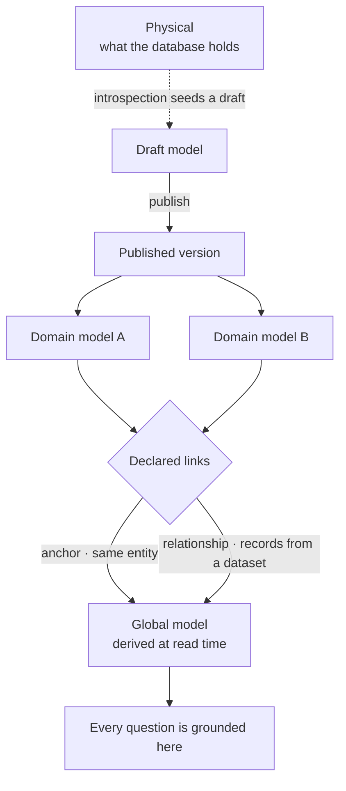
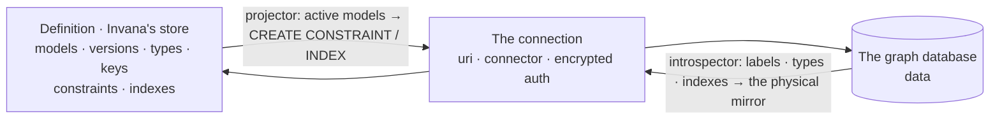

# Connect and model — module spec

Binding a Graph to a graph database, and describing what lives in it. Everything downstream — what can
be asked, what can be imported, what an agent is grounded in — resolves against the model authored
here.

| | |
|---|---|
| Index | [§1 · Connect and model](../../README.md#1--connect-and-model) |
| Features | [connect-a-database](features/connect-a-database.md) · [introspect-a-database](features/introspect-a-database.md) · [domain-models](features/domain-models.md) · [model-editor](features/model-editor.md) · [share-a-model](features/share-a-model.md) · [stitch-models](features/stitch-models.md) · [starter-models](features/starter-models.md) |
| Depends on | — |
| Depended on by | everything: the global model is the grounding context for every question |

## 1. Vocabulary

Product-wide words: [terminology.md](../../terminology.md). What this module adds:

| Noun | Is | Is not |
|---|---|---|
| **Domain model** | a model authored against a domain, portable between Graphs | a Graph's schema |
| **Published version** | an immutable model version | a draft |
| **Anchor** | a declared link saying two types are the same entity | a merge |
| **Relationship link** | a declared cross-model edge type, whose records arrive in a dataset | an inference |
| **Global model** | the read-time union of published models plus their links | a stored row |
| **Physical** | the introspected mirror of what the database actually holds | the model |

## 2. Three layers, one read

| Rule | Detail |
|---|---|
| A published version is immutable | Editing publishes the next version; imports and answers that used the old one still resolve |
| The global model is never stored | It is the union, computed on read. There is no row to edit and nothing to keep in sync |
| Nothing is inferred | An anchor and a relationship link are both **declared**. Fuzzy matching would be a decision, not a default |
| An anchor links, it never merges | Folding two nodes is lossy and has no undo |
| Physical ≠ model | The mirror shows drift; it is never the grounding context |

## 3. What this module owns

| Owns | Shape |
|---|---|
| `graphs` | `name` · `slug` (unique per owner) · `description` · `status (active\|archived)` · `setup_state` |
| `graph_connections` | 1:1 with a Graph — `connector_class` · `uri` · encrypted `auth` · `read_only` · runtime status · `server_version` |
| `models` · `model_versions` | domain models: name, version, node types, edge types, property keys, constraints |
| `model_links` | anchors and relationship links between two published models |
| Introspection | the physical mirror, refreshed on demand |
| Portability | export, import and upgrade of a domain model as one artefact |

### How a model is stored

The definition lives in Invana's own database; the graph database holds only data and the DDL the
projector pushed to it.

| Holds | What |
|---|---|
| `models` · `model_versions` | a domain model and its versions; one is active |
| `property_key_definitions` | keys, scoped to a version — global across the types in it |
| `node_type_definitions` · `edge_type_definitions` | the types; an edge names its source and target types |
| `type_property_mappings` | which key belongs to which type |
| `constraint_definitions` · `index_definitions` | uniqueness and lookup, per type |
| `schema_projections` | one row per DDL statement pushed to the graph database, so drift is detectable |

One graph database holds the union of a Graph's models. The projector composes DDL from every active
model onto it; the introspector reads back what is actually there. Neither writes the other's truth.

## 4. Connecting

| Rule | Detail |
|---|---|
| One Graph, one graph database | The binding is 1:1, set once, rarely touched |
| Test gates save | A connection that has not connected cannot be saved |
| The connector is read-only after the first save | Changing engine mid-Graph invalidates everything modelled against it |
| Credentials are encrypted at rest | A blank field on edit means "keep", never "clear" |
| Capability is resolved, not assumed | The server version decides which property types are available; unsupported ones are refused at authoring, not at write time |

## 5. Portability

A domain model belongs to a domain, not to the Graph that first held it.

| Rule | Detail |
|---|---|
| One artefact | A published version exports as a single file |
| Identity is package id + content hash | So `upgrade` is a real path, not a re-import |
| Links travel only inside a bundle | Both endpoints must be present, or the link is dropped with a named reason |
| A type the target cannot hold arrives as an unpublishable draft | Neither refused outright nor silently degraded |
| Files and git are the registry | There is no server to publish to |

[Starter models](features/starter-models.md) use exactly this path: an importable shape a Graph renames on
arrival.

## 6. Cross-feature decisions

| # | Decision |
|---|---|
| CM1 | A Graph binds to exactly one graph database, and the connector cannot change after the first save. |
| CM2 | Models are authored per domain and are portable; a Graph holds many. |
| CM3 | The global model is derived at read time and is the grounding context for every question. |
| CM4 | Links are declared, never inferred; an anchor links and never merges. |
| CM5 | A published version is immutable; changes publish a new one. |
| CM6 | Introspection seeds a draft. It never writes a published version. |
| CM7 | In Studio the module is two folders — `model/` is a model authored on its own, `stitch/` is what happens between two published ones. [code-shape.md](../../building-studio/code-shape.md) §4.1d. |
| CM8 | **Setup is derived from facts, never from a checklist someone ticks.** A section is done when the thing it asks for exists. The engine reads that at serialize time and reports it in `setup_state`; nothing has to be told a thing happened. This module owns the `graphs.setup_state` column and the derivation; **which steps there are, what they are grouped into and how they are drawn is [13.7 Setup](../../modules/platform/features/setup.md)**, which is where the six sections and their conditions are stated. |
| CM9 | The only thing `setup_state` **stores** is a skip. A required section cannot be skipped, so it has no stored state at all; an optional one is `done` (derived), `skipped` (stored) or `todo`. `POST /setup/{section}` takes `skip` and `reset`, and reset clears the skip rather than un-doing the work. |
| CM10 | **Projecting a model's DDL is a run.** Publishing pushes constraints and indexes through `project_model` (bound `schema_write`), not through the projector called from a route — the one schema write that still reached the database with no run behind it. |

## 6a. The drawn states

Hi-fi, at 1440×900, on the **Hi-fi · finance** page of the *Agents at Work Wireframes* canvas —
`claude.ai/code/artifact/58f2e380-ef59-41cd-8c96-d3dc7ddd06e4`.

| Artboard | Feature | Shows |
|---|---|---|
| Graph · settings | [connect-a-database](features/connect-a-database.md) · [introspect-a-database](features/introspect-a-database.md) | the settings panel's three tabs — Basic · Graph · Agents — with the connection filling the second, under its one-line rule rather than a collapsible group; `Test connection` and `Introspect` beside the fields; the tested strip reading *connected · Neo4j 5.26 · 0 labels · read/write*; the overview saying what unlocks next |
| Model · Observations v2 draft | [model-editor](features/model-editor.md) · [domain-models](features/domain-models.md) | the version bar (`v2 · draft` / `v1 · active`), staged-first type lists with a `staged` chip per row, the staged bar counting six changes with Commit and Discard, and `Publish v2` on the header |
| Model · a type selected — the form spans the main column | [model-editor](features/model-editor.md) | the selected type's form filling the main column under the canvas — name, parent, abstract, instance count, validation, and the property table with cardinality and constraint |
| Model · generated by the Modeller agent | [model-editor](features/model-editor.md) | the same staged set arriving from a run rather than a gesture — understand · propose · validate, then the same Commit |
| Model · Links and the global model | [stitch-models](features/stitch-models.md) | Anchors and Relationships as stacked sections, the derived global-model table (node types · edge types · links, with their counts and sources), and the physical mirror's label count beside it |

## 7. Deliberately absent

| Not built | Because |
|---|---|
| Fuzzy entity resolution | inference is a decision a person makes, not a config value |
| Node merge on an anchor | lossy, and there is no undo |
| A model registry service | files and git already version and share artefacts |
| Multi-database Graphs | the Graph is the reasoning boundary, and one boundary is one database |
| Write-back to the connected database from the modeller | the model describes; imports write |
