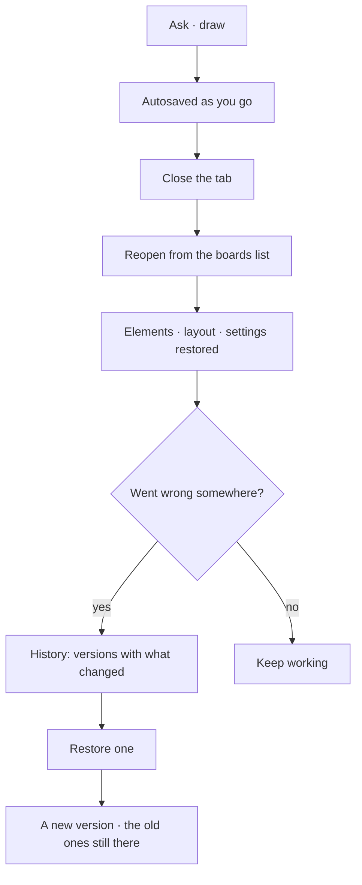

# Boards

A board is named, saved and versioned. Close the tab, come back tomorrow, and the exploration is
where you left it — including how it got there. A board is either **drawn** — on a canvas — or
**declared**: panels from a closed set, bound to one record.

| | |
|---|---|
| Index | [4.2](../../../README.md#4--explore) · Slice **S9** |
| Module | [Explore](../spec.md) |
| API / CLI / Studio | ✅ / — / ✅ |
| Related | [graph-canvas](graph-canvas.md) · [selection-and-the-panel](selection-and-the-panel.md) |
| Engine | [boards-migration.md](../../../building-engine/boards-migration.md) — the tables, the routes, the kind registry and the decisions B1–B16. Where it and this file disagree, it is right |

> **As** someone mid-investigation, **I want** my working surface to survive a reload and a week,
> **so that** I resume rather than reconstruct.

## Capabilities

| # | Capability | Notes |
|---|---|---|
| C1 | Named boards per Graph | Listed, searchable, reopenable |
| C2 | A declared **kind** | One flat axis of thirteen — `data · model · plan · workflow · envelope · lineage · run · task_run · plan_runs · compare · skill · skill_usage · rule`. Set at creation, never changed (CV1) |
| C2a | Drawn or declared is **`renders`** | A property of the kind, not a second column — `canvas` for the six that are drawn, `dashboard` for the seven that are declared ([B3](../../../building-engine/boards-migration.md)) |
| C2b | A declared board binds to one record | `subject_id` — a run, one task run, a plan. The same board for another run is the same kind with a different subject id |
| C3 | Tabs | Several open at once; the tab bar is the switcher |
| C4 | Autosave | Elements, layout and settings, without a save button — drawn boards only |
| C5 | Version history | Every meaningful change is a version, with what changed |
| C6 | Restore is additive | Restoring an old version creates a new one; nothing is lost |
| C7 | Per-board settings | Layers, layout, colour mapping — stored with the board, and they survive a re-query ([B14](../../../building-engine/boards-migration.md)) |
| C8 | Answers land in the open board | A subgraph emission draws where you are working — drawn kinds only |
| C9 | A **report** is a frozen dashboard | The panels with the numbers as they were. It is one version of the board, not a third kind ([B11](../../../building-engine/boards-migration.md)), and a live dashboard has no row until the first one is saved |

## Journey

## Seams

| Seam | What the user sees |
|---|---|
| First board | Created implicitly on the first answer, named after the question |
| Many versions | Grouped by day; each says what changed, not just when |
| Deleted board | Confirmed, and it names how many versions go with it |
| Element removed from the graph | Kept and marked missing on reopen |
| Two tabs on one board | Both see the same autosaved state; last write wins, and it is a version |
| A dashboard whose subject is gone | *This run is gone* — an orphan board, never a cascade that deletes what someone kept ([B8](../../../building-engine/boards-migration.md)) |
| A report of a run still going | Says what it looked like at that moment, and keeps saying it |

## Surfaces

| Surface | Shape |
|---|---|
| Boards list | Rail panel: name, kind, when touched |
| Tab bar | Open boards; the active one is the working surface |
| History | Timeline of versions with a diff summary and restore |
| Layers · Styling · History | Cards floating over the canvas, top right, opened from the page strip (CV6) |

## Engine

| Thing | Shape |
|---|---|
| `boards` | `graph_id` · **`kind`** (one of nine) · `subject_id` · `session_id?` · `title` · **RULES** (`settings` · `styling` · `view_state` · `filters`) · **DATA** (`snapshot` · `positions` · `banner`) · `pinned` · `archived`. The split is by **lifetime**, not structure-vs-data ([B14](../../../building-engine/boards-migration.md)) |
| `board_versions` | one immutable resolved document per meaningful change — `canvas.exportState()` when drawn, the `DashboardSpec` when declared — gzipped, with a `cause` (`query · expand · load · manual · report`), a label, counts and a banner. Pruned to the newest `INVANA_BOARD_HISTORY_LIMIT` (default 30) |
| Elements | what is drawn, per board |
| Routes | `…/boards*` · `…/boards/{id}/versions*` · `…/boards/{kind}/{subjectId}/versions*` (a declared board, addressed by what it is of). There is **no restore endpoint** — going back forks client-side through `canvas.importState()` (CV3) |
| Events | `board.create · update · delete` |
| Registry | `apps/boards/kinds.py` — the thirteen kinds and their `renders`. Studio mirrors it in `boardKinds.ts`; `tests/golden/openapi.json` pins the enum |

## Decisions

| # | Decision |
|---|---|
| CV1 | Kind is set at creation and does not change. |
| CV2 | Autosave never overwrites history — every meaningful change is a version. Declared boards do not autosave: there is nothing of their own to save. |
| CV3 | Restore creates a new version. |
| CV4 | Settings belong to the board, not to the user — and they outlive its data ([B14](../../../building-engine/boards-migration.md)). |
| CV5 | An answer draws into the open board. |
| CV6 | **The canvas's own controls ride the page strip.** Help · Layers · Styling · History are `headerActions` on the page strip, and each opens a card floating over the canvas, top right. One is open at a time — they share the anchor, so opening one closes the others. None of them is a `leftNav` panel: they describe the canvas in front of you rather than a noun you browse. |
| CV7 | **The page host is not Explore's — it is every module's.** `mainSection` is one `BoardPagesViewPanel` from `@invana/canvas-ui`, and the nine kinds in it are owned by four modules: `data` by Explore, `model` by Connect and model, `plan · workflow · envelope · lineage` by Work, `run · task_run · plan_runs` by Operate. So the host, the page list and the board record live in `studio/src/pages/graphs-detail/features/boards/`, a folder of their own, not under the module that owns one of the kinds ([code-shape.md](../../../building-studio/code-shape.md) §4.1b). |
| CV8 | **A card goes where its subject lives, not where its button lives.** All four CV6 controls ride the same strip, and they still split: Layers and Styling describe what is *drawn*, so they are the Explorer's; History and Rename describe the *board record*, so they are Boards'. The strip is one owner of buttons, not one owner of code. |
| CV9 | **One engine per open drawn board, and `keepMounted` is on.** A tab keeps its camera, layout, selection and open card across a switch. Until each page owns its engine this is `keepMounted={false}` with only the active body mounted — stated here as the debt it is, not as the design. |
| CV10 | **The version timeline is drawn by canvas-ui; the versions are ours.** `CanvasVersionsViewPanel` (`@invana/canvas-ui` › `view-panels/canvas-versions`) draws the History card — rows grouped by day, newest first, thumbnail, what changed, restore. It is presentational: Studio supplies the rows from `canvas_states` (CV11), handles restore as the fork CV3 describes, and mounts its own per-row banner query through the panel's `renderThumbnail` slot, so a heavy banner still loads only for the rows that have one. canvas-ui draws canvases and their history; it does not persist either ([canvas-ui-coverage.md](../../../building-studio/canvas-ui-coverage.md) B4). |
| CV12 | **A board is drawn or declared, and `kind` is one flat axis.** A drawn board is elements at positions, a camera, layers, a layout engine. A declared one is panels from a closed set, bound to one record. They share the page host, the tab bar, naming, versioning and the strip; they share no drawing code. Which it is, is `renders` — a property of the kind in the registry, never a second column ([B3](../../../building-engine/boards-migration.md)). `artboard` is retired. |
| CV13 | **A dashboard is a document, and a live one is built, not stored.** `runDashboardSpec(subject, reading)` resolves it on every open, so nothing is persisted for a live dashboard at all ([B9](../../../building-engine/boards-migration.md) · [B15](../../../building-engine/boards-migration.md)). Panels come from a **closed set** — the same argument as the [catalogue](../../workflows/features/the-catalogue.md): a surface that could invent a panel could not be validated, versioned or restored. |
| CV15 | **A dashboard binds to one record through `subject_id`.** `run` and `task_run` are two kinds over the same table — a step dashboard is breadcrumbed under its run and reached by clicking a task on the run dashboard's flow. Both render from that record's `result.json` ([SR17](../../operate/features/see-what-ran.md)), which is why one component serves both. |
| CV14 | **A dashboard is opened deliberately, never instead of the panel.** The drawer stays the light overview — what it is, the Gantt, a line of log per task ([SR13](../../operate/features/see-what-ran.md)) — and `More` opens the dashboard as a page. A panel that tried to be the dashboard would be a dashboard in 420px. |
| CV16 | **A board restores from its snapshot; a re-run is the heal path, not the restore path.** Reopening a board — from the tab bar, the boards list or a page reload — paints `snapshot` and `positions` and asks the graph nothing ([AS13](../../ask/features/the-answer-surface.md)). Only a board with no snapshot to paint falls back to re-running its session's last query, which is what heals boards saved blank before autosave existed. A board that re-queried on every open would spend against the graph for a drawing it already holds, and would silently redraw itself differently from the picture the user left. |
| CV11 | **A version is a version, above and below.** The card is History, the rows are versions, `CanvasVersionsViewPanel` draws them, the table is `board_versions` and the route is `…/versions`. This used to be a seam — the engine said *state* because `canvas.exportState()` is its own noun — and the seam closed when dashboards arrived, because a declared board has no `exportState` ([B6](../../../building-engine/boards-migration.md)). `exportState()` / `importState()` stay the renderer's words, where they belong. |

> **The panel set is fixed per surface, in the feature that owns it.** CV12–CV15 fix the *shape* — a
> kind, a resolved document, a closed set, opened from `More`, frozen as a report. **Which** panels a
> given dashboard draws belongs to the module whose record it is of: `run` and `task_run` in
> [see-what-ran](../../operate/features/see-what-ran.md), and `skill · skill_usage · rule` in
> [skills-dashboards.md](../../../building-studio/skills-dashboards.md). Authoring a dashboard per
> Graph stays out — a surface that could invent a panel could not be validated, versioned or
> restored (CV13).

## Not building

| Not building | Because |
|---|---|
| Sharing a board with a link | Graph membership is the access model |
| Real-time co-editing | last-write-wins with history is honest at this scale |
| Folders of boards | a list with search is enough until it is not |
| A row for every dashboard opened | it would mirror `task_runs` and be written before every read ([B9](../../../building-engine/boards-migration.md)) |
| Converting a board's kind | a drawn board and a declared one share no state; a flip would be a delete and a create wearing one id (CV1) |
