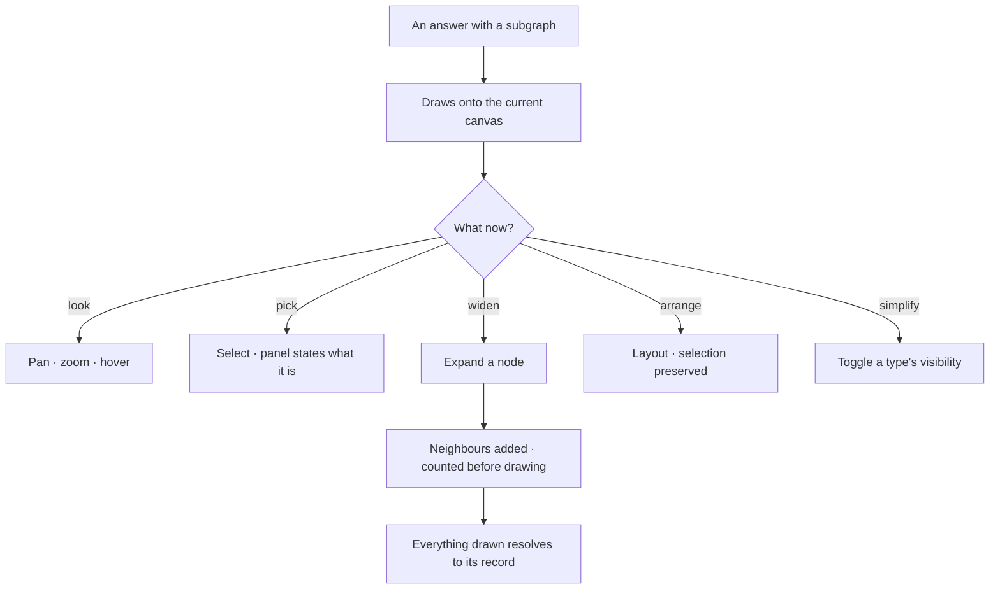

# Graph canvas

The drawing surface: pan, zoom, select, hover, style — at a hundred thousand nodes without the browser
giving up.

| | |
|---|---|
| Index | [4.1](../../../README.md#4--explore) · Slice **S9b** |
| Module | [Explore](../spec.md) |
| API / CLI / Studio | ✅ / — / ✅ |
| Related | [boards](boards.md) · [selection-and-the-panel](selection-and-the-panel.md) |

> **As** someone looking at a result, **I want** to move around it and pick things out of it, **so
> that** I am reading a structure instead of a list of ids.

## Capabilities

| # | Capability | Notes |
|---|---|---|
| C1 | Pan · zoom · fit | Trackpad, wheel, touch; one-finger pan on touch |
| C2 | Select — click, shift-click, brush | One selection concept, whatever the canvas kind |
| C3 | Hover reveals | Label and key properties without a click |
| C4 | Colour by type | Derived from the model, consistent across canvases |
| C5 | Layers toggle | Background · graph · minimap, per canvas |
| C6 | Layouts | Force and hierarchical, applied without losing what is selected |
| C7 | Expand a node | Pull in its neighbours, added to what is drawn — never replacing it |
| C8 | Large results stay usable | Counted first, drawn progressively, capped with the cap stated |

## Journey

## Seams

| Seam | What the user sees |
|---|---|
| Expanding a very connected node | The count first, and the option to cap or filter by type |
| A node no longer in the graph | Kept, marked missing — never silently dropped |
| Nothing selected | The panel says what a selection would show |
| WebGPU unavailable | Falls back to WebGL, and says so once |
| A huge answer | "24,477 nodes" before the draw, with a cap the user can raise |

## Surfaces

| Surface | Shape |
|---|---|
| Canvas | The drawing; floating controls for layout, fit and layers |
| Layers | A card over the canvas, opened from the page strip ([boards.md](boards.md) CV6): layers, then node/edge types with counts and visibility |
| Status strip | What is drawn: types, counts, the canvas name |

## Engine

| Thing | Shape |
|---|---|
| Expansion | `POST …/expand` — neighbours of a node, filtered by type, counted first |
| Canvas elements | what is drawn, persisted per canvas |
| Rendering | one package; Studio never touches the renderer directly |

## Decisions

| # | Decision |
|---|---|
| GC1 | Drawing adds to the canvas; it never replaces what is there. |
| GC2 | Selection is one concept across every canvas kind. |
| GC3 | Expansion states the count before it draws. |
| GC4 | Colour by type comes from the model, not from per-node styling. |
| GC5 | A missing element is shown as missing. |
| GC6 | **An expansion is a TaskRun.** Expanding a node dispatches `expand_neighbours` (bound `graph_read`) through the interpreter like every other read — not a direct query from the canvas ([orchestration § 4.1a](../../../orchestration.md#41a-nothing-executes-outside-the-runtime)). What a person saw, and therefore reasoned from, is recorded; a Graph whose reads are invisible cannot explain an answer that came out of one. |
| GC7 | **Interactive runs do not flood the journal.** An expansion carries `trigger = canvas`, is filtered out of Runs by default, and has its own retention ([§ 4.1b](../../../orchestration.md#41b-interactive-runs)). The count-before-it-draws promise of GC3 is the run's own estimate step, so the ceiling that refuses a 40,000-node expansion is the envelope's, not a number in the UI. |
| GC8 | **The layout does not animate.** The Explorer's force layout runs with `animate: false`: the graph is drawn once, at its settled positions, on every query and expansion. A settle-animation repaints the whole graph per tick and moves nodes out from under the cursor. |

## Not building

| Not building | Because |
|---|---|
| Per-node colour and size saved on the element | colour-by-type plus per-canvas settings covers it |
| Physics tuning controls | two layouts that work beat ten knobs that do not |
| Editing data from the canvas | data arrives by import; the canvas reads |
