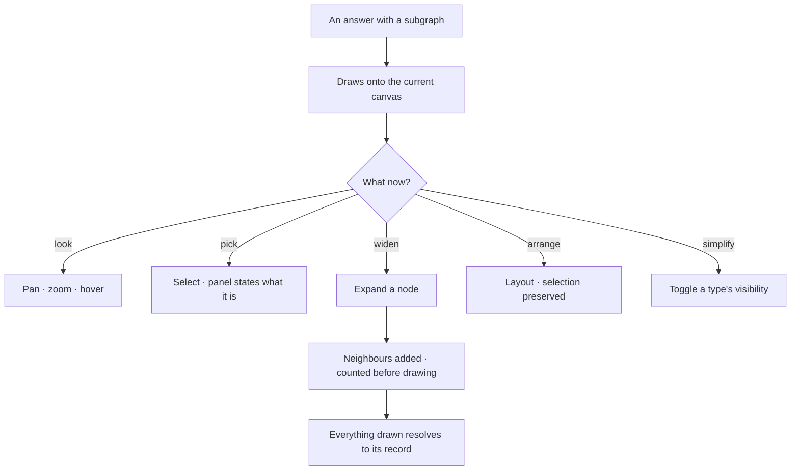
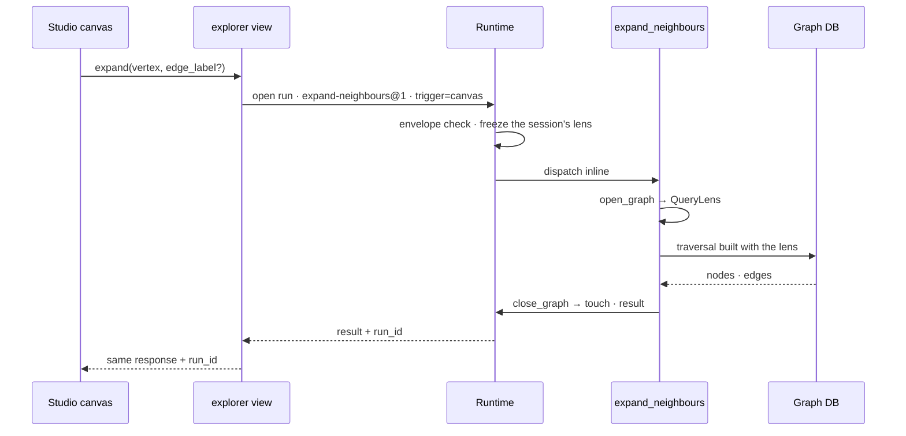

# Graph canvas

The drawing surface: pan, zoom, select, hover, style — at a hundred thousand nodes without the browser
giving up.

| | |
|---|---|
| Index | [4.1](../../../README.md#4--explore) · Slice **S9b** |
| Module | [Explore](../spec.md) |
| API / CLI / Studio | ✅ / — / ✅ |
| Related | [boards](boards.md) · [selection-and-the-panel](selection-and-the-panel.md) |

> **As** someone looking at a result, **I want** to move around it and pick things out of it, **so
> that** I am reading a structure instead of a list of ids.

## Capabilities

| # | Capability | Notes |
|---|---|---|
| C1 | Pan · zoom · fit | Trackpad, wheel, touch; one-finger pan on touch |
| C2 | Select — click, shift-click, brush | One selection concept, whatever the canvas kind |
| C3 | Hover reveals | Label and key properties without a click |
| C4 | Colour by type | Derived from the model, consistent across canvases |
| C5 | Layers toggle | Background · graph · minimap, per canvas |
| C6 | Layouts | Force and hierarchical, applied without losing what is selected |
| C7 | Expand a node | Pull in its neighbours, added to what is drawn — never replacing it |
| C8 | Large results stay usable | Counted first, drawn progressively, capped with the cap stated |

## Journey

## Seams

| Seam | What the user sees |
|---|---|
| Expanding a very connected node | The count first, and the option to cap or filter by type |
| A node no longer in the graph | Kept, marked missing — never silently dropped |
| Nothing selected | The panel says what a selection would show |
| WebGPU unavailable | Falls back to WebGL, and says so once |
| A huge answer | "24,477 nodes" before the draw, with a cap the user can raise |

## Surfaces

| Surface | Shape |
|---|---|
| Canvas | The drawing; floating controls for layout, fit and layers |
| Layers | A card over the canvas, opened from the page strip ([boards.md](boards.md) CV6): layers, then node/edge types with counts and visibility |
| Status strip | What is drawn: types, counts, the canvas name |

## Engine

| Thing | Shape |
|---|---|
| Expansion | `POST …/explorer/expand/*` — a launcher for the `expand-neighbours@1` run (GC6 · GC12); neighbours of a node, filtered by type, counted first |
| Canvas elements | what is drawn, persisted per canvas |
| Rendering | one package; Studio never touches the renderer directly |

### An expansion, as a run

## Decisions

| # | Decision |
|---|---|
| GC1 | Drawing adds to the canvas; it never replaces what is there. |
| GC2 | Selection is one concept across every canvas kind. |
| GC3 | Expansion states the count before it draws. |
| GC4 | Colour by type comes from the model, not from per-node styling. |
| GC5 | A missing element is shown as missing. |
| GC6 | **An expansion is a TaskRun.** Expanding a node dispatches `expand_neighbours` (bound `graph_read`) through the interpreter like every other read — not a direct query from the canvas ([orchestration § 4.1a](../../../orchestration.md#41a-nothing-executes-outside-the-runtime)). What a person saw, and therefore reasoned from, is recorded; a Graph whose reads are invisible cannot explain an answer that came out of one. |
| GC7 | **Interactive runs do not flood the journal.** An expansion carries `trigger = canvas`, is filtered out of Runs by default, and has its own retention ([§ 4.1b](../../../orchestration.md#41b-interactive-runs)). The count-before-it-draws promise of GC3 is the run's own estimate step, so the ceiling that refuses a 40,000-node expansion is the envelope's, not a number in the UI. |
| GC8 | **The layout does not animate.** The Explorer's force layout runs with `animate: false`: the graph is drawn once, at its settled positions, on every query and expansion. A settle-animation repaints the whole graph per tick and moves nodes out from under the cursor. |
| GC9 | **Expand is one callable.** Expand-all, by edge type and by node type are `expand_neighbours` with optional `edge_label` / `neighbor_label` — same bound, same failure mode, so one entry ([orchestration § 0.6](../../../orchestration.md#06-the-catalogue--what-a-plan-may-name): cut at the bound and the failure mode). It ships as the builtin plan `expand-neighbours@1`, read-only in the library ([LB32](../../workflows/features/the-library.md)). |
| GC10 | **An expansion honours all three grains of the lens.** A denied edge or node type is never traversed, an excluded property is never returned, and the slice predicate is composed into the traversal — nothing is filtered after the query. The lens reaches the connector as **structured input to the traversal builder** ([CC22](../../graph-connectors/features/the-connector-contract.md)), which is why an expansion is governed on Gremlin too. |
| GC11 | **An expansion runs under the canvas session's lens** — its world, its agent and the Graph's guardrails — the same one an ask on that canvas runs under, so the two can never disagree about what is in view. Every expand request carries the `lens_id` of the world the canvas has picked, exactly as an ask's `SendMessage` does; the session's agent composes its own world into the lens, but the agent is **not** the run's performer — `agent_id` stays null, so an expansion spends no agent budget, never waits on the agent's `max_concurrent_runs`, and is not listed among the runs the agent performed. With no session, the lens is the picked world and the Graph's guardrails. |
| GC12 | **The canvas awaits its run, and the turn is the run.** The expansion is dispatched inline ([RP31](../../platform/features/runtime.md)) and the response keeps its shape, plus `run_id`. When the request names a session, the turn — the user row and the assistant reply — is written **before** the run opens, its step is queued under that reply and the reply carries `run_id`, so the session's Tasks tab lists it like any ask; the reply is settled from the run's output when it ends, and an expansion that returned nothing is still a turn, because it still ran. The Runs journal keeps it off by default (GC7). A run the Graph's ceiling queues answers `409 expand_queued` with its `run_id` rather than waiting. |
| GC13 | **Outside the lens is said, never shown as empty.** The fine-tune menu offers only the edge and node types the lens allows, and an expansion that reaches a denied type is refused naming the rule — *this world has no Publisher* — never answered with zero neighbours. |
| GC14 | **A canvas holds only what the current world returns.** The world is enforced at the read, and the canvas never learns what it left out — no *excluded* state, no count of what is hidden. Reopening a canvas runs `resolve_elements` (`graph_read`, trigger `system`) under the picked world: it answers **present** (in the graph and in this world) and **missing** (gone from the graph, kept and marked per GC5). An element the world excludes is in neither list and is **not drawn**; clearing the world brings it back, and the saved snapshot is never rewritten. The check matches on the element id and is built by the connector for either dialect, never a hard-coded Cypher query. |

## Not building

| Not building | Because |
|---|---|
| Per-node colour and size saved on the element | colour-by-type plus per-canvas settings covers it |
| Physics tuning controls | two layouts that work beat ten knobs that do not |
| Editing data from the canvas | data arrives by import; the canvas reads |
| A callable per expand variant | GC9 — one bound, one failure mode, one entry |
| Filtering an expansion after the query | GC10 — a display filter wearing a bound's name |
| An *excluded* mark for elements outside the world | GC14 — the canvas is never told what the world hides; it is simply not drawn |
