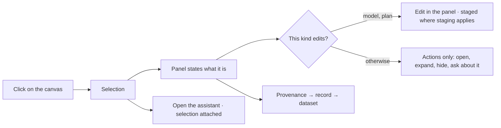

# Selection and the panel

The canvas selects. The panel states what the selection **is** — and, on the two kinds that allow it,
edits. One rule, six canvas kinds, no exceptions added in code.

| | |
|---|---|
| Index | [4.3](../../../README.md#4--explore) · Slice **S12** |
| Module | [Explore](../spec.md) |
| API / CLI / Studio | ✅ / — / ✅ |
| Related | [graph-canvas](graph-canvas.md) · [the-assistant](../../ask/features/the-assistant.md) · [model-editor](../../connect-and-model/features/model-editor.md) |

> **As** someone who clicked on something, **I want** the panel to tell me what it is and where it
> came from, **so that** I can decide what to do without hunting for its detail somewhere else.

## Capabilities

| # | Capability | Notes |
|---|---|---|
| C1 | One selection concept | The same object whatever the canvas draws |
| C2 | Inspect is the default | Properties, provenance, relationships — stated, not editable |
| C3 | Two kinds write from a gesture | `model` (add · connect · delete) and `plan` (drag card → card) |
| C4 | Everything else selects | The panel states the fact and offers actions, never inline editing |
| C5 | Provenance is one click | Element → record → dataset → import run |
| C6 | Multi-select summarises | Counts by type, and the actions that apply to all of them |
| C7 | The selection travels | Opening the assistant carries it |

## What the panel shows, per kind

| Canvas kind | The panel states | Editable? |
|---|---|---|
| `data` | properties · provenance · neighbours by type | no |
| `model` | properties, keys, constraints of the type | **yes**, while drafting |
| `plan` | the task: status, assignee, dependencies, criteria | **yes** — status and assignment |
| `workflow` | the step: arguments, what it calls | no |
| `envelope` | the bound: allowed steps, pinned arguments, ceilings | no |
| `lineage` | the agent: who authored or spawned it, on what run | no |

## Journey

## Seams

| Seam | What the user sees |
|---|---|
| Nothing selected | What a selection would show, not an error or a blank |
| Multi-select across types | Counts by type, and only the actions valid for all |
| A missing element | Marked missing, with when it was last seen |
| Read-only version | Inspect only, and the panel says why |

## Surfaces

| Surface | Shape |
|---|---|
| Panel | Sections stacked — the type lists above, the selected thing below, each collapsible |
| Actions | On the row or in the panel header; never a floating menu over the drawing |

### The Explorer panel

Three sections in one column, drawn by the `Explorer · …` hi-fi artboards. It is the page's own
left panel, opened by the rail's Explorer icon under `?panel=explorer` — one key among the rail's
own, closed by the same click that opens it (SP10).

| Section | Header meta | Row |
|---|---|---|
| `NODE TYPES` | `6 shown · 1 hidden` | colour dot · type name · graph-wide count · eye |
| `RELATIONSHIPS` | the number of types | dot · TYPE NAME · graph-wide count |
| `SELECTED` | the selected element's type | id · summary · relationship chips · the provenance line |

The footer states `<n> types · <total> nodes` on the left and the open canvas's name on the right.
The total sums the **shown** types, so hiding a type moves both numbers together.

A row's colour dot is the same colour the canvas paints that type with, which is what makes the
section a legend as well as a list.

## Engine

| Thing | Shape |
|---|---|
| Provenance | element → source record → dataset → import run |
| Neighbour counts | by type, for the selected element |
| Type counts | per node label and per edge label, across the whole graph — one call, read through the connector's schema reader |
| Routes | `GET …/elements/{id}` · `GET …/elements/{id}/provenance` · `GET …/explorer/type-counts` |

`GET …/explorer/type-counts` answers:

| Field | Shape |
|---|---|
| `nodes` | `[{ "name": "Observation", "count": 1912 }, …]`, biggest first |
| `edges` | `[{ "name": "MENTIONS", "count": 52100 }, …]`, biggest first |
| `counted` | `false` when the vendor cannot count; the lists still name every type, with `count: null` |

## Decisions

| # | Decision |
|---|---|
| SP1 | The canvas selects; the panel states or edits. Never the reverse. |
| SP2 | Exactly two kinds write from a gesture. A third is argued in writing first. |
| SP3 | Inspect is the default; editing is opt-in and kind-specific. |
| SP4 | Provenance is always one click from the element. |
| SP5 | The selection is what the assistant receives. |
| SP6 | The panel counts the **graph**, the status bar counts the **canvas**. `24,477 nodes` in the panel footer and `26 nodes` in the status bar are both true and answer different questions — what this graph holds, and what I am looking at. |
| SP7 | The eye on a type row is a canvas control, not a query. It hides that type on the open canvas; nothing re-runs, and the count stays graph-wide. Only the footer's totals follow it, because they count what is shown. |
| SP8 | Counts come from one call, served by the connector's schema reader. A vendor that cannot count says so and the panel lists the types without numbers — a type list with no numbers is still the legend, and blocking on a count nobody can produce is worse. |
| SP10 | The Explorer panel is a `?panel` key, not the left column's resting state. No key means no left column: the canvas keeps the width, and the rail lights nothing. A panel that cannot be closed is a panel whose close control lies. |
| SP9 | `SELECTED` is a section of the same stack, collapsible like the others — not a fixed detail area under them. It states the element short (id · summary · chips · provenance); the full property table is `InspectorPanel`, the right side's other occupant, which is where a reader who wants every field already is. |

## Not building

| Not building | Because |
|---|---|
| Inline editing on the canvas | a drawing is not a form |
| Context menus with the full action set | actions belong where their target lives |
| Editing data rows from the panel | data arrives by import |
