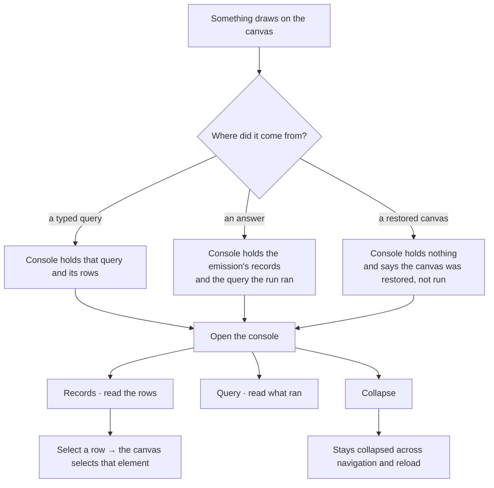

# The console

The rows under the drawing. What the canvas drew came from records and a query; the console is where
both are readable without leaving the canvas that drew them.

| | |
|---|---|
| Index | [4.5](../../../README.md#4--explore) · Slice **S12f** |
| Module | [Explore](../spec.md) |
| API / CLI / Studio | ✅ / — / 🔵 |
| Related | [graph-canvas](graph-canvas.md) · [selection-and-the-panel](selection-and-the-panel.md) · [the-answer-surface](../../ask/features/the-answer-surface.md) · [write-queries](../../ask/features/write-queries.md) |

> **As** someone looking at a canvas, **I want** the records and the query behind what it drew, **so
> that** I can read the rows without losing the picture they made.

## Capabilities

| # | Capability | Notes |
|---|---|---|
| C1 | Records | The rows behind what is drawn, in a compact table |
| C2 | Query | The query that produced them, verbatim and read-only |
| C3 | It spans the canvas only | The left panel and the inspector stay full height — both describe the selection, which the console does not change |
| C4 | It collapses, and stays collapsed | Its own param, so opening it never costs the left panel or the right side ([E8](../spec.md)) |
| C5 | It follows the canvas tab | Switching canvas switches what the console holds |
| C6 | The context bar is its last row | The counts for the surface in front of you, and the shortcut that finishes it |

## Journey

## Seams

| Seam | What the user sees |
|---|---|
| Nothing has run | The console names what would fill it — a query, or an answer — not an empty grid |
| A query returned no rows | `0 records`, and the query still readable. Nothing to cite reads as a fact, never as a failure |
| Too many rows to hold | The count is stated in full; the table is windowed, and says so |
| A run still streaming | Rows land as they arrive; the count is provisional and marked as such |
| The canvas was restored from a version | No query to show — the console says the canvas was restored, and what it was restored from |
| Reload | Whether the console is open survives; the rows come back from the emission, not from a re-run |
| Console open, no canvas | The console closes with the canvas — it describes a drawing, and there is none |

## Surfaces

| Surface | Shape |
|---|---|
| Region | `AppLayoutV2` `bottomSection`, `bottomSpan: "main"` — under the canvas, beside nothing |
| Tabs | `TabbedPanel` — Records · Query, with a re-run action and a collapse in the header |
| Records | `Table density="compact"`; ids mono, numbers tabular |
| Query | Read-only `CodeBlock` (`@invana/editor`). Editing a query is [3.1](../../ask/features/write-queries.md)'s surface, not this one |
| Context bar | `ContextBar` as the console's own last row — counters and the `⌘↵` hint |
| Param | `?console=` — open, and which tab. Independent of `?panel=` and `?right=` |

## Engine

| Thing | Shape |
|---|---|
| Routes | None new. Records come from the result already in hand, and after a reload from the emission ([3.3](../../ask/features/the-answer-surface.md)) |
| Query text | The `query` step of the run, or the query the person typed — the same string either way |
| Persistence | Client-side, in the URL. The rows are not a stored artefact of the canvas |

## Decisions

| # | Decision |
|---|---|
| CO1 | The console spans the **canvas only**. The panel and the inspector describe the selection; the console describes the draw, and a region that changes neither must not shorten both. |
| CO2 | Query is **read-only**. A second editable query surface would be a second place a query can be written, and the two would disagree about which one ran. |
| CO3 | A **third axis, a third param**. `?console=` moves independently of `?panel=` and `?right=`, for the reason E8 gives: regions that can be open at the same time were never peers. |
| CO4 | The `ContextBar` belongs to the **console**, not the page. It counts what the console holds, so it disappears with it rather than outliving the thing it counts. |
| CO5 | Selecting a row **selects on the canvas**. It is the same selection object ([E3](../spec.md)) — a table row and a drawn node are two views of one record, never two selections. |

## Not building

| Not built | Because |
|---|---|
| An editable query box | [Write queries](../../ask/features/write-queries.md) owns authoring. The console shows what ran |
| Row export | Answers are records ([3.3](../../ask/features/the-answer-surface.md)); export belongs to the emission, not to a strip under a canvas |
| A REPL or terminal | Nothing here is a shell. The `Terminal` component exists for the CLI's own screens |
| A third tab per canvas kind | Records and query are true of every kind. A kind-specific tab would make the console six consoles |
| Sorting and filtering the table | The order is the order the query returned. A grid that re-sorts silently disagrees with the query above it |
