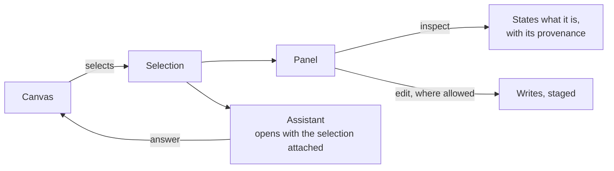

# Explore — module spec

The working surface. A canvas draws what is there; the panel says what is selected; the assistant is
reachable from either with the selection already in hand. One page, one rail, one set of gestures —
whatever kind of thing is being drawn.

| | |
|---|---|
| Index | [§4 · Explore](../../README.md#4--explore) |
| Features | [graph-canvas](features/graph-canvas.md) · [canvases](features/boards.md) · [selection-and-the-panel](features/selection-and-the-panel.md) · [the-console](features/the-console.md) |
| Depends on | [Ask](../ask/spec.md) (answers land on a canvas) · [Connect and model](../connect-and-model/spec.md) (what the shapes mean) |
| Depended on by | [Work](../work/spec.md) (the Plan canvas) · [Agents](../agents/spec.md) (lineage, envelope) |

## 1. Vocabulary

Product-wide words: [terminology.md](../../terminology.md). What this module adds:

| Noun | Is | Is not |
|---|---|---|
| **Canvas** | a named, saved, versioned drawing surface of a declared kind | a viewport |
| **Canvas kind** | `data · model · plan · workflow · envelope · lineage` | a mode toggle |
| **Selection** | what the canvas currently has picked | a filter |
| **Inspect** | the panel stating a fact about the selection | editing |
| **Assistant** | the one conversational surface, holding the right side with the selection attached | a chat page · a drawer |

## 2. One page, six kinds

Six things get drawn, and they share every gesture — pan, zoom, select, hover, style:

| Kind | Draws | Writes from a gesture? |
|---|---|---|
| `data` | records and their edges | no |
| `model` | node types and edge types | **yes** — add · connect · delete, staged |
| `plan` | tasks as cards, waves as columns | **yes** — drag card → card writes a dependency |
| `workflow` | a plan's steps | no |
| `envelope` | what an agent may run | no |
| `lineage` | who authored or spawned whom | no |

**Exactly three kinds write from a gesture** — `model`, `plan`, and `workflow` while drafting
([DP11](../workflows/features/draft-a-plan.md#decisions)). Everything else selects, and the panel
states the fact. A new exception is argued and written down, never added in code.

## 3. The canvas selects, the panel edits

| Rule | Detail |
|---|---|
| Selection is one concept | The same gesture on any kind produces the same selection object |
| Inspect is the default | Editing is opt-in and only on the kinds that allow it |
| Model edits stage | Nothing reaches the database until a commit; the staged set is visible and reversible |
| The assistant inherits the selection | Opening it never means re-describing what is on screen |
| An answer can land on the canvas | Emissions of kind subgraph draw into the current data canvas rather than replacing it |

## 4. What this module owns

| Owns | Shape |
|---|---|
| Element visibility | hidden is a flag on the node or edge, owned by the rendering package: an edge is effectively hidden when either endpoint is, and showing a node restores an edge only when that edge is not itself hidden and its other endpoint is visible. Studio sets it; it never filters the data to fake it |
| `canvases` | `graph_id` · `name` · `kind` · `settings` · created_by |
| `canvas_states` | autosaved history; restoring forks a new canvas, never an overwrite. *Version* is the user's word for a row, *state* the engine's ([canvases.md](features/boards.md) CV11) |
| Canvas elements | what is drawn and where, per canvas |
| Selection state | client-side, but one shape across kinds |
| Assistant state | which surface opened it, and with what attached |

## 5. Seams

| Seam | What the user sees |
|---|---|
| Empty canvas | What it is for, and the one action that fills it — never a blank grid |
| A large result | Drawn progressively; the count is stated before the draw finishes |
| Element removed from the graph | The canvas keeps the node marked as missing, rather than silently dropping it |
| Restoring an old version | A new version is created; nothing is lost |
| No selection | The panel states what a selection would show, not an error |

## 6. Cross-feature decisions

| # | Decision |
|---|---|
| E1 | One page. The kind is a property of the board, not a mode in the header. |
| E2 | Exactly three kinds write from a gesture — `model`, `plan`, and `workflow` while drafting ([DP11](../workflows/features/draft-a-plan.md#decisions)). Others select. |
| E3 | The canvas selects; the panel states or edits. Never the reverse. |
| E4 | Canvases are named, saved and versioned; autosave never overwrites history. |
| E5 | **The assistant is not an Explore feature.** It is one surface for the whole graph page, reachable from every left panel — Explorer, Model, Projects, Tasks, Agents, Workflows — so it belongs to [Ask](../ask/features/the-assistant.md), not here. Explore's stake in it is only where it sits (E7) and what it inherits (the selection, E3). |
| E6 | An answer draws onto the canvas; it does not replace what is there. |
| E7 | The assistant owns the **right side** whenever `?right=assistant`. Inspecting and asking stop competing for it: one param says which of them holds the region, and closing it closes the region rather than restoring the other ([the-assistant.md](../ask/features/the-assistant.md) AD11). |
| E8 | **Two axes, two params.** The left panel is `?panel=`, the right side is `?right=`. They move independently, which is the proof they were never peers — opening the assistant never costs the panel you had open. |
| E9 | **Three regions, three params.** The console is `?console=`, beside `?panel=` and `?right=`. Same reason as E8: regions that can be open at once were never peers. A region's param carries **which occupant** is in it, so a second occupant is a second value rather than a second flag. |
| E10 | **The page is the shell's regions, not a layout of its own.** The Explorer fills `AppLayoutV2`'s `leftSection` · `mainSection` · `rightSection` · `bottomSection` · `footer`; it builds no panel group of its own ([DS12](../platform/features/design-system.md)). A region the shell cannot hold is a gap in the shell. |
| E11 | **The console spans the canvas.** `bottomSpan: "main"` — the panel and the inspector describe the selection and stay full height; the console describes the draw. |

## 6a. The drawn states

Hi-fi, at 1440×900, on the *Agents at Work Wireframes* canvas —
`claude.ai/code/artifact/58f2e380-ef59-41cd-8c96-d3dc7ddd06e4`. The Explorer's own
screens sit on the **Hi-fi · finance** page; the assistant's four are on **Wireframes**,
where the decision was argued.

| Artboard | Feature | Shows |
|---|---|---|
| Explorer · the canvas | [graph-canvas](features/graph-canvas.md) · [canvases](features/boards.md) | the canvas with its tabs and layers, the status strip naming what is drawn |
| Canvas · layers | [graph-canvas](features/graph-canvas.md) | node and relationship types with counts and visibility |
| Assistant · the shell | [the-assistant](../ask/features/the-assistant.md) | the assistant *is* today's Sessions panel, moved; the trigger in the header's panel controls, after fullscreen; one stable label, and the agent stays named on the composer |
| Assistant · decided | [the-assistant](../ask/features/the-assistant.md) | the assistant taking the right side, and the selection riding above the composer as a chip |

The last artboard also names a cost, and it is worth stating rather than
discovering: the inspector's *editing* job would have to move into the left
panel, because the panel edits and the canvas selects (E3). Nothing moves today —
the inspector states properties and edits nothing — so the assistant takes the right
side without displacing any editing. The day the inspector grows an edit, it
grows it in the left panel.

## 7. Deliberately absent

| Not built | Because |
|---|---|
| Per-element styling saved per node | colour by type plus per-canvas settings covers the need without a styling store |
| A separate modeller page | the modeller is a board kind |
| Free-form annotation layers | a canvas draws what exists; notes belong to the work, not the drawing |
| Real-time multi-cursor editing | single-editor canvases with version history are honest at this scale |
| Cross-Graph canvases | the Graph is the boundary |
