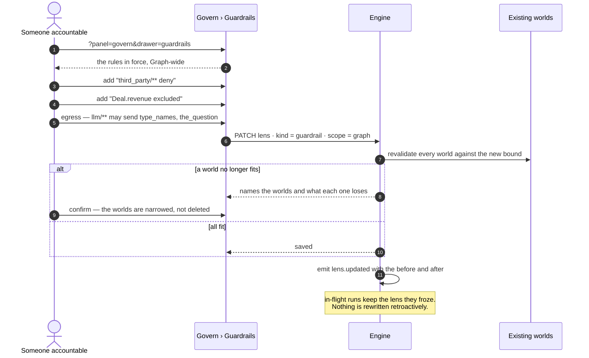
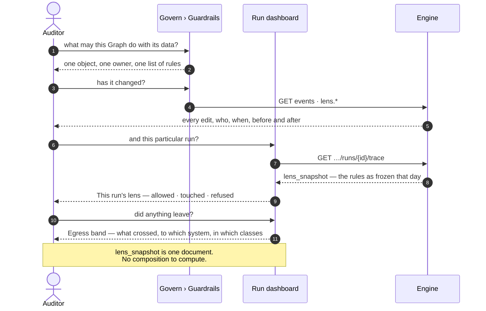

# Guardrails

The bounds every run in the Graph carries, whatever world it runs in — which participants, which
properties, which slices, and what may leave. Set once by whoever is accountable; invisible
afterwards.

| | |
|---|---|
| Index | [14.2](../../../README.md#14--govern) · Slice **S16** |
| Module | [Govern](../spec.md) |
| API / CLI / Studio | ✅ / 🟡 / ✅ |
| Related | [worlds](worlds.md) (what narrows within these) · [audit-and-activity](../../operate/features/audit-and-activity.md) (a guardrail edit is an audited write) |

> **As** someone accountable for what this Graph may do with its data, **I want** one place that says
> what no run may see or send, **so that** I can hand it to an auditor and know nobody's experiment
> loosened it.

## Capabilities

| # | Capability | Notes |
|---|---|---|
| G1 | One surface, one object | The **Guardrails** drawer of the Govern panel. Never in the Worlds list |
| G2 | Pinned on the Graph or an agent | Bounds nest; an agent's narrows the Graph's |
| G3 | The same grammar as a world | Participants, properties, selectors, egress — set once, always in force |
| G4 | Egress per destination | *entity names to the enrichment API; the question and the schema shape to a hosted model; nothing to anything else* |
| G5 | Edit is a permission, not a role | Members stay binary; this is the one field-level permission in the product |
| G6 | Every edit is an event | Who loosened what, when, and what it was before |
| G7 | A refusal names what narrowed it | The rule where one fired; the world and the closed layer where none did ([GR15](#decisions)). Never *not permitted* with nothing to act on |
| G8 | A save says what it would cost | Every world is revalidated and what each one loses is named **before** the write |
| G9 | The builder resolves as you type | *What this would match, right now* — against what this Graph is actually credentialed for |

---

## Journey 1 — set a guardrail



**The revalidation is the point of the confirm step.** A guardrail that silently invalidates six
worlds is a guardrail whose effect nobody saw at the moment they took responsibility for it.

---

## Journey 2 — a run meets a guardrail, three different ways

```mermaid
sequenceDiagram
    autonumber
    participant I as Interpreter
    participant C as Connector
    participant X as A participant
    actor P as Person

    Note over I: graph data — outside the lens
    I->>I: the plan wants graph_data/stitch/publisher_sponsor
    I->>I: refused by rule · record touch dir=refused
    I->>I: the run continues without the link
    I-->>P: cannot answer — needs the Publisher link,<br/>excluded by a guardrail
    P-->>P: recourse: ask whoever owns the guardrail

    Note over I: third party — refused before dispatch
    I->>I: the plan wants third_party/api/clearbit.com
    I->>I: refused before the call · nothing spent, nothing left
    I->>I: the run continues without it

    Note over I: egress — the call is allowed, the payload is not
    I->>I: llm/anthropic-prod allowed
    I->>I: prompt would carry property_values; may_send says no
    I->>C: rebuild the prompt without them
    C->>X: call
    X-->>C: completion
    I->>I: record touch · sent.classes = [type_names, the_question]
```

| Where it bites | What happens | What the person is told |
|---|---|---|
| `graph data` | the link does not resolve; the run continues | *cannot answer — needs X, excluded by a guardrail* |
| `third party` | refused **before dispatch** — nothing spent, nothing left | *this run may not call X* |
| `egress` | the call proceeds, the payload is cut to what is permitted | recorded on the touch; surfaced on the step's Egress band |

**Three behaviours, one vocabulary.** All three say *the answer needs something you are not allowed
to use here*; only the recourse differs, and the refusal carries it.

---

## Journey 3 — an auditor asks what a run was allowed to see



---

## Seams

| Seam | What the user sees |
|---|---|
| A guardrail is loosened | An event with before and after; past runs are untouched, because each froze its own |
| A guardrail is tightened mid-flight | In-flight runs keep the lens they froze; the next run gets the new one |
| An agent guardrail tries to widen the Graph's | Refused at save, naming the Graph's rule |
| No guardrails set | The tab shows the widest state as a sentence, not an empty list — *every configured provider, every third party your agents can reach, the whole global model* |
| Someone without the permission opens the tab | Read-only, with the rules visible. A bound nobody may read is a bound nobody can work within |
| The last person with the permission leaves | The Graph's owner holds it; it cannot become unassigned |

---

## Surfaces

| Surface | Shape | Components |
|---|---|---|
| Govern › `Guardrails` | Second drawer of the stack. Rules grouped by layer; each with its match, its rule, its selector and its egress | `PanelStack` · **`LayerSection`** · **`RuleRow`** |
| The rule builder | `layer` · `sublayer` · `name` as three controls over one address, `allow`/`deny`, and **what this would match right now** resolved against the catalogue | `Select` · `Input` · `RadioGroup` · **`MatchPreview`** |
| The impact of a save | *Saving this would change 2 of 4 worlds* — each named, with what it loses, before the write. The worlds that **do not** change are named in a sentence under the list, not as diff rows: every mark a diff list has means *something happened here*, and *checked and unaffected* is the opposite claim | `AlertDialog` · `DiffList` |
| Egress, per destination | What may accompany a call to **this** destination, and what is cut | **`EgressList`** |
| What an auditor is handed | One object · the rules grouped by layer · who may edit · the history in Events · `lens_snapshot` per run | `PropertyList` |
| A guardrail's board | A page in `BoardPagesViewPanel`, id `guardrail:<lens_id>`, **titled with the guardrail's name**. The same composer the world board uses, and it says *in force on every run* rather than *34 runs* ([GR14](#decisions)) | `Dashboard` — `properties` · `metrics` · `table` · `text` |
| The widest state | A sentence when nothing is set, never an empty table ([SR34](../../operate/features/see-what-ran.md)'s rule, applied to configuration) | `EmptyState` |
| Agent panel | That agent's own lens — replacing the provider field that D2 removed | **`LensChip`** · **`CastTable`** |
| Worlds drawer | The sibling above it. Its header names how many rules are in force | |
| A refusal | Wherever the run surfaces, naming the rule and the recourse | **`CannotAnswerCard`** |

Components in **bold** do not exist yet and are built in `design-kit` first, with a story —
[building-studio/govern-and-agents-panels.md § 3](../../../building-studio/govern-and-agents-panels.md).

---

## Engine

Full schema: [building-engine/govern-and-agents-data-model.md](../../../building-engine/govern-and-agents-data-model.md).

| Thing | Shape |
|---|---|
| `lenses` | `kind = guardrail` · `scope = graph \| agent:<id>` · `key` and `name` never null · never listed by `?kind=world` |
| Permission | `graph_members.can_edit_guardrails` — one field-level permission, held by at least one member, the owner by default. Revoking the last one is refused ([GV22](../spec.md)). Not a role |
| Revalidation | On save, every `kind = world` in the Graph is checked; the response names what each one loses |
| Composition | `effective = agent ∩ plan ∩ todo` — guardrails enter as the agent's and the Graph's contribution |
| Match preview | `GET …/graphs/{id}/participants?match=` — the pattern resolved against the live catalogue, so the builder shows what a rule *would* bite ([GV21](../spec.md)) |
| Events | `lens.created · updated · promoted · deleted`, with before and after on the payload |
| Routes | `GET · PATCH …/lenses?kind=guardrail` · `GET …/graphs/{id}/lenses/impact` (what a proposed change would cost) · `PATCH …/graphs/{id}/members/{uid}/guardrail-permission` |

---

## Decisions

| # | Decision |
|---|---|
| GR1 | **A guardrail never appears in the Worlds list.** Its own route, its own permission, its own tab — so there is no delete control to block and one object to hand an auditor ([GV16](../spec.md)). |
| GR2 | **Saving a guardrail revalidates every world and says what each one loses**, before it is saved. A bound whose effect is invisible at the moment someone takes responsibility for it is a bound taken on trust. |
| GR3 | **In-flight runs keep the lens they froze.** A guardrail is not applied retroactively, because `lens_snapshot` is what makes a past answer reconstructible ([SR11](../../operate/features/see-what-ran.md)). |
| GR4 | **A refusal names the rule and the recourse.** *Not permitted* with no rule named is not a decision anyone can act on — the same argument [§0.10](../../../orchestration.md#010-budget--the-ceiling-that-pauses-instead-of-failing) makes for a budget prompt naming its number. |
| GR5 | **The tab is readable by everyone and editable by a permission.** A bound nobody may read is a bound nobody can work within, and it turns every refusal into a mystery. |
| GR6 | **The widest state is a sentence, not an empty table.** *Nothing set* and *nothing permitted* must never look alike. |
| GR7 | **Editing a guardrail is an ordinary audited write**, in `core/events` like every other. There is no separate governance log to keep in step with the real one. |
| GR8 | **One grammar over five layers.** A rule matches an address and allows or denies it — `<layer>/<sublayer>/<name>` — so there is one mechanism to learn instead of five shapes of rule ([GV4](../spec.md)). `allow` is the only required field; `properties` and `select` are legal on `graph_data` alone, and a rule that sets them elsewhere is refused at save naming the layer. |
| GR9 | **The builder shows what a rule would match, right now.** The pattern is resolved against the live participant catalogue as it is typed, listing what matches and what does not. A rule whose effect you only discover at run time is a rule written blind — and a pattern that matches nothing is almost always a typo, which is the case this catches. |
| GR11 | **`may_edit_guardrails` rides on the lens list, not on a permissions route.** The drawer asks for that list exactly once, and a second request would let the rules and the right to edit them arrive at different moments — which is the one moment a control could flicker into existence. It is `graph_members.can_edit_guardrails` ([GV22](../spec.md)) for whoever asked, and it changes nothing about what renders: the rules read for everyone either way ([GR5](#decisions)). |
| GR12 | **Without the permission every authoring control is absent, not disabled.** No `+` on the drawer, no *Edit rules*, no *Promote* — because a greyed button promises a form this person cannot submit, and a refusal at the end of it is a worse answer than never offering it. What *is* drawn is a sentence saying the bound is editable by somebody, so a reader knows there is a person to ask rather than a wall. |
| GR13 | **A world that cannot open says so where it is picked.** A world naming a model version the Graph no longer publishes is refused at the chip, naming the version, before a run opens — not narrowed away silently at run time into an answer nobody can account for. The check resolves against the live catalogue ([GV21](../spec.md)), because a version is unpublished long after the world that named it was written. **A wildcard resolves like any other pattern** — `Deals@*` is the form the picker teaches, so exempting patterns containing a `*` would exempt almost every world anyone authors and leave GR13 refusing nothing; it is whether the pattern reaches a live participant that decides. And it reads `graph_data/model/…` rules alone: a layer with nothing configured is not a stale world, because `third_party` is empty by design and an allow reaching into it is still perfectly askable. |
| GR14 | **A guardrail opens as a board named for itself**, `guardrail:<lens_id>` — the same page the world board is, because a guardrail and a world are one record separated by `kind` ([GV1](../spec.md)) and a second composer would be the second enforcement path this module exists not to have ([WO15](worlds.md)). `kind` changes what the page says and nothing about how it is built: the crumb reads `Guardrails`, the usage band says *in force on every run* instead of counting the runs that picked it, and the `Edit` act is absent without the permission ([GR12](#decisions)), exactly as it is on the drawer. |
| GR10 | **Layer-specific limits live under `options`, not at the top level.** `max_age_s` on a cache rule and `max_rounds` on a human rule are the same kind of thing as a selector, but they are not selectors — keeping them in one sub-object is what lets the five top-level keys be the same on every layer. |
| GR15 | **A closed layer refuses by name, and the name is the world and the layer.** No rule fires when a layer was never opened, so `rule_matched` is empty and there is nothing for [GR4](#decisions) to print — which left the one refusal a reader meets most often saying *not permitted* with nothing to act on. The refusal therefore names **which world closed which layer**: *`llm/anthropic/claude-opus-5` is not in `EU · H1 2026` — the `llm` layer is closed in this world*. Both halves are actionable and neither is a rule: the layer says what to open, the world says where to open it. `rule_matched` stays empty, because inventing a rule id for a decision no rule made would put a value in the record that nothing in the world matches — the refusal names the **narrowing**, and a rule is only one kind of narrowing. |

---

## Not building

| Not building | Because |
|---|---|
| Roles on people | Members are binary ([terminology § 2](../../../terminology.md)); this is one field-level permission, not the start of a role system |
| Approval workflow for a guardrail change | the event is the record, and a Graph that needs four-eyes on this needs it on more than this |
| Guardrails that expire | a bound with a timer is a bound nobody is watching. A time-boxed exception is an agent-scoped guardrail someone removes |
| Retroactive application to past runs | `lens_snapshot` is what makes an answer reconstructible (GR3) |
| A separate governance audit log | every edit is already an event (GR7) |
| Templates or presets of guardrails | a starting set that fits nobody is a set everyone edits blindly |
