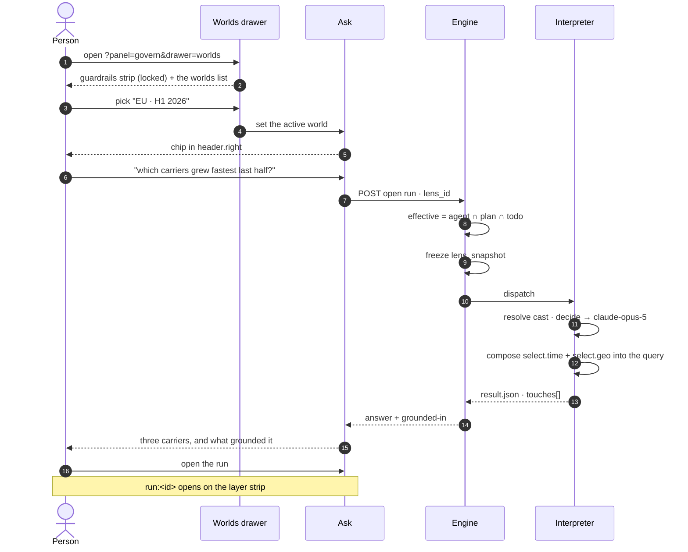
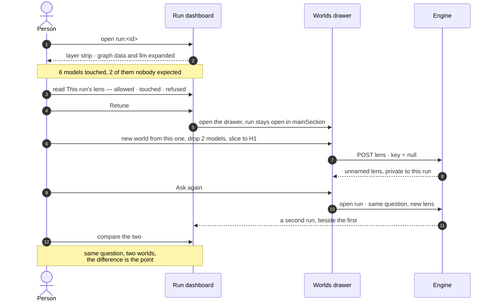
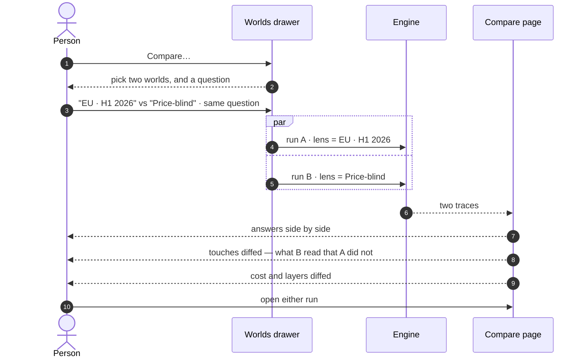

# Worlds

A named narrowing you pick per question — which models, which slice of them, which LLM decides, what
may leave. Run the same question in two and read the difference.

| | |
|---|---|
| Index | [14.1](../../../README.md#14--govern) · Slice **S16** |
| Module | [Govern](../spec.md) |
| API / CLI / Studio | ✅ / 🟡 / ✅ |
| Related | [guardrails](guardrails.md) (what a world may never widen) · [see-what-ran](../../operate/features/see-what-ran.md) (where the retune starts) |

> **As** someone deciding whether to act on an answer, **I want** to say which factors the decision
> may rest on and then run it again with different ones, **so that** I am choosing what the answer
> depends on rather than discovering it afterwards.

## Capabilities

| # | Capability | Notes |
|---|---|---|
| C1 | Pick a world before asking | A chip in `header.right`; the default is *Everything*, inside the guardrails |
| C2 | Narrow along five layers | graph data · llm · third party · cache · human |
| C3 | Slice a model | `time` · `geo` · `dims`, on axes the model declared |
| C4 | Exclude a property | *decide without seeing price* — structural, not an instruction |
| C5 | Bind a role to a model | `decide → llm/anthropic-prod/claude-opus-5` |
| C6 | Name an unnamed lens | Naming is what puts it in the Graph's list |
| C7 | Compare two worlds on one question | Two runs, one question, the answers and the touches side by side |
| C8 | Retune from a run | `Retune` opens this drawer without closing the run |
| C9 | Promote a world to a guardrail | One field, no re-authoring |
| C10 | See what it was actually used for | Run count, last use and who, per world — one grouped read over `task_runs`, never a counter |
| C11 | Read a world as one object | Five layer sections, one cast section, and `as_of` — the drill-in is the record, in order |
| C12 | Pin transaction time | `as_of` resolves which versions and stitches are in view; it composes with `select.time`, which is valid time ([GV15](../spec.md)) |
| C13 | See what saving would cost | *Validated against 3 guardrails · at save* — with the refusals named before the write |
| C14 | Ask under it | The chip sets `?lens=`, and the ask carries it; the run **freezes** what it resolves to, so the answer stays reconstructible whatever moves afterwards |

---

## Journey 1 — ask in a world



**What the person sees while waiting:** the chip stays; the answer streams; the grounded-in footer
fills in as touches land, so *which models is this resting on* is answerable before the prose is
finished.

---

## Journey 2 — the answer is wrong, so narrow



**Why the run stays open:** the drawer is a stack, so narrowing happens beside the thing that
prompted it. Closing the run to edit what it ran under is the loop this design exists to avoid.

---

## Journey 3 — a keeper becomes a world, and then a standard

```mermaid
sequenceDiagram
    autonumber
    actor P as Priya
    participant W as Worlds drawer
    participant E as Engine
    actor S as Sam
    actor Ad as An admin

    Note over P: three unnamed lenses, attached to her runs,<br/>visible to nobody else
    P->>W: this one is right — type a name
    Note over W: the field reads<br/>"Name it to add it to Worlds"
    W->>E: PATCH lens · key = "eu-h1-2026"
    E-->>W: it is now in the Graph's list
    S->>W: open the drawer
    W-->>S: "EU · H1 2026" · used in 34 runs
    S->>W: pick it, ask his own question
    Note over Ad: two weeks later — EU-only should apply to everyone
    Ad->>E: POST …/lenses/eu-h1-2026/promote · kind = guardrail
    E-->>Ad: it leaves the Worlds list
    E-->>Ad: it appears in settings › Guardrails
    Note over S,Ad: every world now narrows within it;<br/>no world is re-authored
```

---

## Journey 4 — compare



**The diff is the deliverable, not the two answers.** What B touched that A did not is the reason
the answers differ, and it is the only part a person cannot reconstruct by reading both.

---

## Seams

| Seam | What the user sees |
|---|---|
| A world names a model version that was since unpublished | The world is listed with a warning and names the version; picking it is refused before a run opens |
| A world's cast names a model whose provider was deleted | Blocked before the run starts, naming the provider ([PM seam](../../agents/features/providers-and-models.md)) |
| A world tries to widen a guardrail | Refused **with the bound named**, at edit time — not silently intersected away at run time |
| A world asks for an axis the model never declared | Refused naming the model and the axis, never ignored |
| Two people name a world the same thing | Refused on `key`; the name is unique per Graph |
| Renaming a world | It is already public, so a rename is a rename. Only the *first* naming publishes |
| A world used by a scheduled run is deleted | Refused, naming the schedules — a cron with no lens is a run with no circumstances |
| Nobody has made a world | The list is empty and the chip reads *Everything*; the guardrails strip still shows |

---

## Surfaces

| Surface | Shape | Components |
|---|---|---|
| Worlds drawer | First drawer of the **Govern** stack ([GV17](../spec.md)). Header: label · count · `+` · search · filter ([G36](../../../building-studio/graph-detail-page.md)). Body: the locked guardrails strip, then the list | `PanelStack` · `PanelBox` · `SearchInput` · `EmptyState` |
| A world row | Name · the chips it narrows by · run count and last use | **`LensRow`** · `LayerChip` |
| A world's detail | The drill-in — header `‹ WORLDS / EU · H1 2026`; a summary band (*narrows · used · validated*), then five sections one per layer, then the cast, then `as_of`; `Compare` · `Promote` · `Duplicate` | `RecordHeader` · **`LayerSection`** · **`RuleRow`** · **`SliceSummary`** · **`CastTable`** |
| A world's board | A page in `BoardPagesViewPanel`, id `world:<lens_id>`, **titled with the world's name**. The auditor's document: what it narrows, how it has been used, every rule as an addressable row, the cast resolved against the guardrails, and `spec.json`. Opens with the drill-in ([WO15](#decisions)) | `Dashboard` — `properties` · `metrics` · `table` · `text` |
| Authoring | Picking, never free text — every control is a choice over what the Graph already declares ([WO7](#decisions)) | `Field` · `Checkbox` · `RichSelect` · **`CannotAnswerCard`** for each refusal |
| The chip | `header.right`, beside the nodes-in-view readout. Opens the picker. Reads **`Everything`** when none is set | **`LensChip`** |
| Compare | A page in `BoardPagesViewPanel`, id `compare:<runA>:<runB>` | `DiffList` · **`AddressChip`** · `MetricTile` |
| Retune | A control on the run dashboard's *This run's lens* band | |

Components in **bold** do not exist yet and are built in `design-kit` first, with a story —
[building-studio/govern-and-agents-panels.md § 3](../../../building-studio/govern-and-agents-panels.md).

---

## Engine

Full schema: [building-engine/govern-and-agents-data-model.md](../../../building-engine/govern-and-agents-data-model.md).

| Thing | Shape |
|---|---|
| `lenses` | `kind = world` · `key` (slug) null while private · `name` (the typed text) · `rules` · `cast` · `as_of` · `created_in_run_id` · `version` |
| Naming | `PATCH …/lenses/{id}` setting `key` **and** `name` — the write that publishes. Emits `lens.named` |
| Promotion | `POST …/lenses/{id}/promote` — sets `kind = guardrail` and `scope`. The guardrail permission only |
| Validation at edit | A world is checked against the effective guardrails **when saved**, not when run — `POST …/lenses/validate` for the draft |
| The catalogue | `GET …/graphs/{id}/participants` — what the pickers offer, resolved live from published versions, `llm_models`, cache kinds and roles ([GV21](../spec.md)) |
| Declared axes | `graph_versions.axes` — `{time, geo, dims}`. Empty means nothing is selectable, and a slice on an undeclared axis is refused naming the model and the axis |
| Usage | one `GROUP BY lens_id` over `task_runs`: count, last use, distinct actors. No counter column |
| Resolution | `effective = agent ∩ plan ∩ todo`, computed at run open, frozen as `lens_snapshot` |
| Routes | `GET · POST · PATCH · DELETE …/lenses?kind=world` · `POST …/lenses/{id}/promote` · `POST …/lenses/{id}/duplicate` · `POST …/lenses/validate` · `GET …/lenses/{id}/usage` |

---

## Decisions

| # | Decision |
|---|---|
| WO1 | **Naming is sharing.** An unnamed lens is attached to its run and private; naming it puts it in the Graph's list. `Lens.key` as the record already defines it — no ownership column, no share action. |
| WO2 | **The name field says what it does.** `Name it to add it to Worlds`, never a bare input — someone labelling a past run for their own memory must not publish it without being told. |
| WO3 | **A world is validated against the guardrails at save, not at run.** A world that cannot legally run is a world nobody should be able to save and then wonder about. |
| WO4 | **Compare is two runs, not a diff engine.** The same question under two lenses, run properly, with their traces placed side by side. Nothing is simulated and no answer is synthesised from another. |
| WO5 | **The world chip lives in `header.right`, not in the composer.** It is the run's circumstances, not part of the question — and it must be visible on a surface that is not the composer, because a run opened from a schedule has no composer. |
| WO6 | **Deleting a world a schedule uses is refused.** A cron firing into a missing lens would silently fall back to the widest, which is the opposite of what the lens was for. The same refusal covers a world an **agent** carries — `agents.lens_id` is `ON DELETE RESTRICT`. |
| WO7 | **Narrowing is picking, not writing.** Every control in the authoring form is a choice over what the Graph already declares — published model versions, the axes they declared, the providers configured, the caches that exist. Nothing is free text, so nothing can name something that is not there, and a typo cannot become a rule that silently matches nothing. |
| WO8 | **The drill-in is the record, in its order:** a summary band, then one section per layer, then the cast, then `as_of`. A world is read as one object because that is what an auditor is handed ([GV1](../spec.md)) — a tabbed world would make *what may this run see* a thing you assemble from four tabs. |
| WO9 | **`as_of` is a field on the world, not a control on the question.** It resolves which model versions and stitches are in view, so two people picking the same world see the same graph. Putting it beside the composer would make the same world mean different things to different askers. |
| WO10 | **One editor authors both kinds.** A guardrail and a world are one record separated by `kind` ([GV1](../spec.md)), so they are one form — `LensEditor` — and `kind` changes four things and nothing else: the word on the header, whether the name field publishes, whether the save asks for its impact first, and whether the cast section is drawn. Two forms would be two places for the grammar to drift, and the two screens would start disagreeing about what `**` means. |
| WO11 | **`?lens=` is the run's circumstances; `?world=` is what you are reading.** They are two params because they answer two questions and have two lifetimes: the drill-in is dropped the moment `?panel=` moves, which is right for *what am I looking at* and exactly wrong for *what am I asking under*. `?lens=` survives every panel change and every reload, so a shared link reproduces the bound as well as the question. Absent is *Everything, inside the guardrails* — the default and the widest ([GV7](../spec.md)). |
| WO12 | **The drill-in renders from the row the list already holds; the resolved cast arrives after.** *Innermost wins, then the address is checked against the effective rules* ([GV6](../spec.md)) is a composition against the guardrails that only the server can do, so it is a second read — and the record never waits on it. A cast table without it still reads correctly: it says what this lens **casts**, rather than what a run would **get**. |
| WO13 | **Compare is reached from a run, not from the Worlds drawer.** Compare is two runs that each happened ([WO4](#decisions)), so the gesture belongs where a real run is on screen: the run dashboard offers `Compare…`, lists the Graph's other finished runs with the ones that asked the same question first, and opens `compare:<a>:<b>` as a page. A `Compare…` in the drawer would have to collect a question and launch two runs, which is the composer's job wearing a bound's clothes. |
| WO14 | **Narrowing is picked, and so are the wildcards.** The three address controls offer `**`, `*` and — for anything carrying an `@` discriminator — the `@*` form beside the exact version. Offering `Deals@*` next to `Deals@1.0.1` is what makes the version-proof rule as easy to write as the brittle one ([GV4](../spec.md)); leaving it to a keystroke makes the brittle one the default. |
| WO15 | **A world opens as a board named for itself.** Drilling into a world opens `world:<lens_id>` in `mainSection` and the tab carries the world's own name — `EU · H1 2026`, never `World` — because a strip of four tabs all reading `World` is a strip you have to click through to read. The board is not the drawer widened: the drawer is the **picking** reading, 420px of rules in the kit's layer sections with the run that prompted the narrowing still open beside it, and the board is the **auditing** one — usage, the cast resolved against the effective guardrails, every rule as an addressable row, and `spec.json`. Only the second can be kept: a declared board's `Save report` freezes a resolved document ([B6](../../../building-engine/boards-migration.md)), and *what was this world when the run happened* is the question a drawer cannot answer an hour later. |
| WO16 | **The board reads; the acts stay in the drawer.** `Edit`, `Promote`, `Duplicate` and `Delete` are on the drill-in, where *what stops* and *what stays* can be read at the moment of the act — the board offers `Edit`, which puts the drawer back on this world, and nothing else that writes. One place writes a lens, which is the same rule the rule board follows ([RU11](../../skills/features/rules.md)). |
| WO17 | **The touch carries the slice the connector composed, per type.** A world that names authored models compiles its per-type selects into `QueryLens.bounds`, and the read's verdict carries none of them — so `applied.select` is built from the **lens**, not from the verdict, and is a map keyed by type: `{"Deal": {"time": …, "geo": …}}`. One type's slice and four types' slices are then the same shape, which is what a flat `select` could not be, and *decide without seeing last year* is legible on the step that did it rather than inferable from the world it ran under. A read the lens did not slice writes no `select` key at all — an empty map would claim a narrowing happened and then name none. **`properties_excluded` is keyed the same way and for the same reason**: it is dead on exactly the shape `select` was, because the exclusion is authored on the model's address rather than the grounding version's, and one record that is per-type on one key and flat on its neighbour is a record a reader has to learn twice. |
| WO18 | **Compare diffs what each run touched *and* what each touch applied.** Addresses alone read *touched 2 · shared 2 · differed 0* for two runs where one sliced a type and the other rewrote its projection, which is the one sentence compare exists not to say. So a shared address carries **how it differed** — `select`, `properties_excluded`, `projected`, `models` — and an address only one run reached stays what it already is. Nothing is synthesised and no answer is derived from another, so [WO4](#decisions) is untouched: `applied` is a field of a touch that really happened, and placing two of them side by side is what *side by side* meant. The headline stays the address diff, because *what did each reach* is the question a reader opens compare with. |
| WO19 | **A governed read records the rows it returned, and there is no second number.** `rows_available` — what the same query would have returned unsliced — is not recorded, not stored and not promised, because producing it means executing the query a second time without its predicate: an unbounded cost on exactly the reads a bound exists to keep small, paid on every governed read in the product. *1,283 — not 4,902* is retired as a sentence this product says. What replaces it is better grounded anyway: the world is declared, the rule that bound the read is named, and the slice the connector composed rides the touch ([WO17](#decisions)) — so a reader learns *what narrowed this and how*, which is the actionable half. A count of what they were not shown is a number nobody can act on without re-running the question in a wider world, which is what [C7](#capabilities) is for. |

---

## Not building

| Not building | Because |
|---|---|
| A world per step | the lens is the run's circumstances (GV8) |
| Folders or tags for worlds | a Graph that needs to file its worlds has too many; naming is the filter |
| Auto-suggested worlds from run history | *declared but never touched* is already the suggestion, and it is a reading a person makes, not one made for them |
| Diffing two worlds without running them | the difference that matters is in the answers and the touches, and those need runs |
| Sharing a world across Graphs | a Graph is the reasoning boundary; a model version id means nothing outside it |
