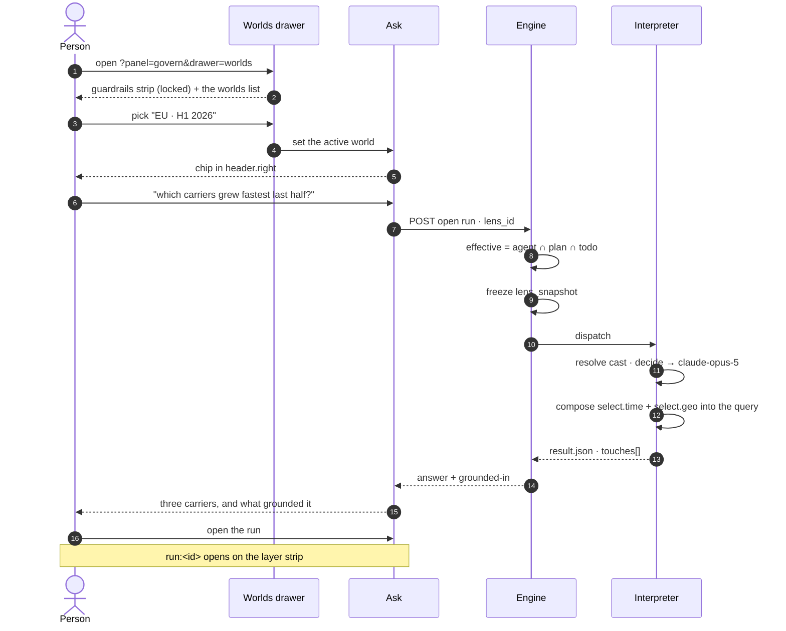
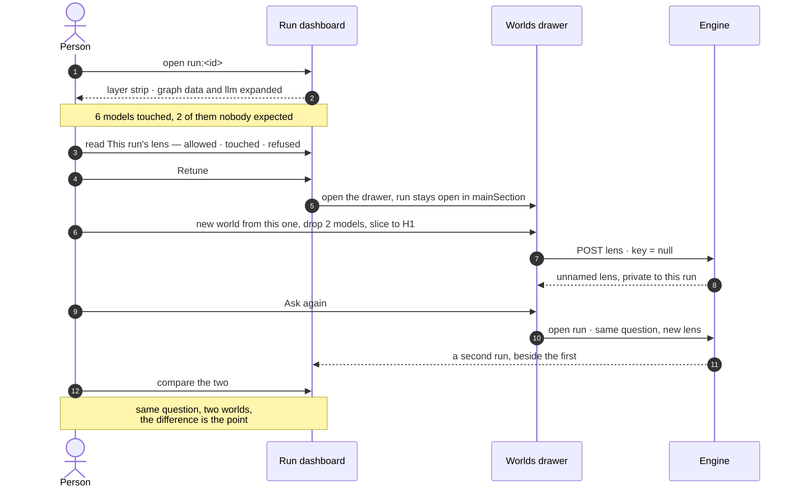
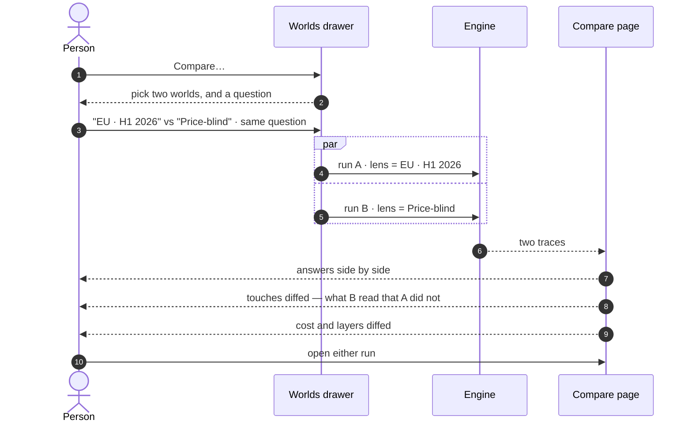

# Worlds

A named narrowing you pick per question — which models, which slice of them, which LLM decides, what
may leave. Run the same question in two and read the difference.

| | |
|---|---|
| Index | [14.1](../../../README.md#14--govern) · Slice **S16** |
| Module | [Govern](../spec.md) |
| API / CLI / Studio | 🔵 / — / 🔵 |
| Related | [guardrails](guardrails.md) (what a world may never widen) · [see-what-ran](../../operate/features/see-what-ran.md) (where the retune starts) |

> **As** someone deciding whether to act on an answer, **I want** to say which factors the decision
> may rest on and then run it again with different ones, **so that** I am choosing what the answer
> depends on rather than discovering it afterwards.

## Capabilities

| # | Capability | Notes |
|---|---|---|
| C1 | Pick a world before asking | A chip in `header.right`; the default is *Everything*, inside the guardrails |
| C2 | Narrow along five layers | graph data · llm · third party · cache · human |
| C3 | Slice a model | `time` · `geo` · `dims`, on axes the model declared |
| C4 | Exclude a property | *decide without seeing price* — structural, not an instruction |
| C5 | Bind a role to a model | `decide → llm/anthropic-prod/claude-opus-5` |
| C6 | Name an unnamed lens | Naming is what puts it in the Graph's list |
| C7 | Compare two worlds on one question | Two runs, one question, the answers and the touches side by side |
| C8 | Retune from a run | `Retune` opens this drawer without closing the run |
| C9 | Promote a world to a guardrail | One field, no re-authoring |
| C10 | See what it was actually used for | Run count and last use, per world |

---

## Journey 1 — ask in a world



**What the person sees while waiting:** the chip stays; the answer streams; the grounded-in footer
fills in as touches land, so *which models is this resting on* is answerable before the prose is
finished.

---

## Journey 2 — the answer is wrong, so narrow



**Why the run stays open:** the drawer is a stack, so narrowing happens beside the thing that
prompted it. Closing the run to edit what it ran under is the loop this design exists to avoid.

---

## Journey 3 — a keeper becomes a world, and then a standard

```mermaid
sequenceDiagram
    autonumber
    actor P as Priya
    participant W as Worlds drawer
    participant E as Engine
    actor S as Sam
    actor Ad as An admin

    Note over P: three unnamed lenses, attached to her runs,<br/>visible to nobody else
    P->>W: this one is right — type a name
    Note over W: the field reads<br/>"Name it to add it to Worlds"
    W->>E: PATCH lens · key = "eu-h1-2026"
    E-->>W: it is now in the Graph's list
    S->>W: open the drawer
    W-->>S: "EU · H1 2026" · used in 34 runs
    S->>W: pick it, ask his own question
    Note over Ad: two weeks later — EU-only should apply to everyone
    Ad->>E: POST …/lenses/eu-h1-2026/promote · kind = guardrail
    E-->>Ad: it leaves the Worlds list
    E-->>Ad: it appears in settings › Guardrails
    Note over S,Ad: every world now narrows within it;<br/>no world is re-authored
```

---

## Journey 4 — compare



**The diff is the deliverable, not the two answers.** What B touched that A did not is the reason
the answers differ, and it is the only part a person cannot reconstruct by reading both.

---

## Seams

| Seam | What the user sees |
|---|---|
| A world names a model version that was since unpublished | The world is listed with a warning and names the version; picking it is refused before a run opens |
| A world's cast names a model whose provider was deleted | Blocked before the run starts, naming the provider ([PM seam](../../agents/features/providers-and-models.md)) |
| A world tries to widen a guardrail | Refused **with the bound named**, at edit time — not silently intersected away at run time |
| A world asks for an axis the model never declared | Refused naming the model and the axis, never ignored |
| Two people name a world the same thing | Refused on `key`; the name is unique per Graph |
| Renaming a world | It is already public, so a rename is a rename. Only the *first* naming publishes |
| A world used by a scheduled run is deleted | Refused, naming the schedules — a cron with no lens is a run with no circumstances |
| Nobody has made a world | The list is empty and the chip reads *Everything*; the guardrails strip still shows |

---

## Surfaces

| Surface | Shape |
|---|---|
| Worlds drawer | First drawer of the **Govern** stack ([GV17](../spec.md)). Header: label · count · `+` · search · filter ([G36](../../../building-studio/graph-detail-page.md)). Body: the locked guardrails strip, then the list |
| A world row | Name · the chips it narrows by · run count and last use |
| A world's detail | The drill-in — header `‹ WORLDS / EU · H1 2026`; five sections, one per layer; `Compare` · `Promote` · `Duplicate` |
| The chip | `header.right`, beside the nodes-in-view readout. Opens the picker |
| Compare | A page in `BoardPagesViewPanel`, id `compare:<runA>:<runB>` |
| Retune | A control on the run dashboard's *This run's lens* band |

---

## Engine

| Thing | Shape |
|---|---|
| `lenses` | `kind = world` · `key` null while private · `rules` · `cast` · `as_of` |
| Naming | `PATCH …/lenses/{id}` setting `key` — the write that publishes. Emits `lens.named` |
| Promotion | `POST …/lenses/{id}/promote` — sets `kind = guardrail` and `scope`. Admin only |
| Validation at edit | A world is checked against the effective guardrails **when saved**, not when run |
| Resolution | `effective = agent ∩ plan ∩ todo`, computed at run open, frozen as `lens_snapshot` |
| Routes | `GET · POST · PATCH · DELETE …/lenses?kind=world` · `POST …/lenses/{id}/promote` |

---

## Decisions

| # | Decision |
|---|---|
| WO1 | **Naming is sharing.** An unnamed lens is attached to its run and private; naming it puts it in the Graph's list. `Lens.key` as the record already defines it — no ownership column, no share action. |
| WO2 | **The name field says what it does.** `Name it to add it to Worlds`, never a bare input — someone labelling a past run for their own memory must not publish it without being told. |
| WO3 | **A world is validated against the guardrails at save, not at run.** A world that cannot legally run is a world nobody should be able to save and then wonder about. |
| WO4 | **Compare is two runs, not a diff engine.** The same question under two lenses, run properly, with their traces placed side by side. Nothing is simulated and no answer is synthesised from another. |
| WO5 | **The world chip lives in `header.right`, not in the composer.** It is the run's circumstances, not part of the question — and it must be visible on a surface that is not the composer, because a run opened from a schedule has no composer. |
| WO6 | **Deleting a world a schedule uses is refused.** A cron firing into a missing lens would silently fall back to the widest, which is the opposite of what the lens was for. |

---

## Not building

| Not building | Because |
|---|---|
| A world per step | the lens is the run's circumstances (GV8) |
| Folders or tags for worlds | a Graph that needs to file its worlds has too many; naming is the filter |
| Auto-suggested worlds from run history | *declared but never touched* is already the suggestion, and it is a reading a person makes, not one made for them |
| Diffing two worlds without running them | the difference that matters is in the answers and the touches, and those need runs |
| Sharing a world across Graphs | a Graph is the reasoning boundary; a model version id means nothing outside it |
