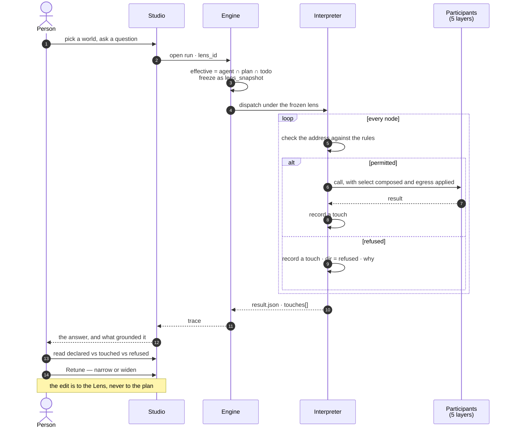

# Govern — module spec

What a run may **see**, **use** and **send** — declared before it runs, proved after it ran, and
tuned by reading the difference. [Operate](../operate/spec.md) answers *what happened*; this module
answers *what was allowed to happen*, and it is the surface a person edits when the answer was wrong.

| | |
|---|---|
| Index | [§14 · Govern](../../README.md#14--govern) |
| Features | [worlds](features/worlds.md) · [guardrails](features/guardrails.md) |
| Depends on | [orchestration § 0.9](../../orchestration.md#09-grounding-a-run--the-lens) (the Lens record) · [connect-and-model](../connect-and-model/spec.md) (declared axes) · [graph-connectors](../graph-connectors/spec.md) (predicate composition) |
| Depended on by | [Ask](../ask/spec.md) · [Agents](../agents/spec.md) · [Operate](../operate/spec.md) (the run reads its lens back) |
| Decisions | D1–D19, settled in [governance.md](../../governance.md) and restated here in present tense |

---

## 1. Vocabulary

Product-wide words: [terminology.md](../../terminology.md). What this module adds:

| Noun | Is | Is not |
|---|---|---|
| **Layer** | one of five classes of participant a run may engage — `graph data` · `llm` · `third party` · `cache` · `human` | a **lane**, which is one parallel element of a fan-out |
| **Spine** | the `agent` band — the runtime itself, which does the participating rather than being a participant | a governed layer |
| **Sublayer** | a grouping inside a layer: `model` · `stitch` · `dataset` · a provider · `api` · `app` · `db` · `agent` · `person` · `role` | a second vocabulary — it is the touch record's `kind` |
| **Participant** | one named member of a layer, addressed `<layer>/<sublayer>/<name>` | a step, a Task or a callable |
| **Address** | `graph_data/model/Observations@v2` · `llm/anthropic-prod/claude-opus-5` · `third_party/api/clearbit.com/v2/companies` | a URL to fetch |
| **Pattern** | an address a rule matches on: `*` is one segment, `**` is the rest, and a `*` **inside** a segment globs it — `graph_data/model/Deals@*` is every published version of `Deals` | a regular expression |
| **World** | a **named** Lens — a reusable narrowing people pick per question and compare | a *subgraph*, which is an [emission](../../terminology.md) |
| **Guardrail** | a Lens pinned on the Graph or an agent, always in force, on its own surface | a permission on a person |
| **Cast** | the binding of a plan's **role** (`extract` · `decide` · `judge` · `embed`) to a model address | a bound — it is a resolution, checked against the rules |
| **Selector** | a narrowing *within* a model, along an axis the model declared — `time` · `geo` · `dims` | a query |
| **Touch** | one recorded engagement with a participant: address, direction, volume, and what was sent | a log line |
| **Egress** | what of the Graph's data may accompany a call that crosses the deployment boundary | redaction |
| **Retune** | editing the lens after reading what a run touched | re-running |

**Retired here:** `internet` (it named the network, not the boundary — a private warehouse is as
outside the Graph as a public API), and `tier` for a model (this year's *small* is last year's
*frontier*; a plan names a **role**).

---

## 2. The one record

**A guardrail and a world are the same row.** One table, one enforcement path, one thing frozen onto
a run — separated by `kind`, not by a second record.

```
Lens
├── id · graph_id
├── kind           guardrail | world
├── key            the slug. null = unnamed and private to its run · set = in the Graph's Worlds list
├── name           the text a person typed when naming it — "EU · H1 2026". null iff key is null
├── scope          graph | agent:<id> | null      (guardrail only — where it is pinned)
├── rules[]        { match, allow, properties?, select?, egress?, options? }
├── closed_layers  the layers this lens allow-lists — anything it does not name is out (GV23)
│                  frozen onto a run as `closures[]` too, so the composition keeps
│                  whose allow-list each one was rather than flattening them together
├── cast           { role → model address }
├── as_of          transaction time — null means now
├── created_in_run_id   the run an unnamed lens belongs to
└── version        bumped on every rules/cast edit, so a snapshot names what it froze
```

| Field | Carries | Grain |
|---|---|---|
| `rules[].match` | an address with `*` (one segment) and `**` (the rest) | participant |
| `rules[].allow` | `true` or `false`. **Deny wins at any specificity** | participant |
| `rules[].properties.exclude[]` | properties of a model that do not exist in this world | structural |
| `rules[].select` | `time` · `geo` · `dims`, only on axes the model declared | extensional |
| `rules[].egress.may_send[]` | what may accompany a call to **this** destination | boundary |
| `cast` | role → address. Innermost wins, then checked against the effective rules | resolution |

**Three grains of narrowing, and they are enforced in three different places:**

| Grain | Removes | Enforced by |
|---|---|---|
| Structural — **type** | a model, a type, a relationship | the schema handed to the generating model, and the validator |
| Structural — **property** | one property of a type | the same, plus the connector **rewriting a whole-node return** into the permitted projection |
| Extensional — **records** | rows | the connector **composing the predicate** into the query it executes |

**Nothing is enforced by filtering afterwards.** Rows that come back and are dropped leave the
counts, the aggregates and the schema the model saw all outside the slice — a display filter wearing
a bound's name.

---

## 3. The loop this module exists to close



| Reading | Act |
|---|---|
| Allowed, touched by nothing, across many runs | **narrow** — it is not carrying the answer |
| `refused` on the same participant, repeatedly | **widen**, or accept *cannot answer* deliberately |
| `select.time` clipping a query that wanted more | widen the slice, or confirm the slice is the point |
| `decide` resolved to a small model on the step that wrote the number | retune the cast, re-run, compare |
| `sent.classes` includes something nobody expected | tighten `egress`; the runs that did it are listed |

---

## 4. Cross-feature decisions

| # | Decision |
|---|---|
| GV1 | **A guardrail and a world are one `Lens` record separated by `kind`.** One enforcement path and one `lens_snapshot`, so *what was this run allowed to see* is one document rather than a composition an auditor computes. Promotion is a field change, never a re-authoring. |
| GV2 | **Naming is sharing.** An unnamed lens is attached to its run and private to whoever ran it; naming one puts it in the Graph's Worlds list. This is `Lens.key` as [orchestration § 0](../../orchestration.md#0-the-records) already defines it — no ownership column, no share action. The name field reads *Name it to add it to Worlds*, never a bare input. |
| GV3 | **One ladder, each rung one edit:** `unnamed lens --name it--> world --kind--> guardrail`. |
| GV4 | **A participant is addressed `<layer>/<sublayer>/<name>`, and the address is the only identifier.** The lens matches on it, the ledger records it, the drawing expands it. One string instead of five shapes of rule. A rule matches on the same string with three wildcards: `*` for one segment, `**` for the rest, and a `*` **within** a segment — which is how a bound names a model across its versions (`graph_data/model/Deals@*`). Writing the version out would make a bound that silently stops applying the next time somebody publishes. |
| GV5 | **Deny wins at any specificity.** A rule that can be overridden by being more precise is not a bound: a broad `third_party/** deny` must not be punchable by a narrow allow written later by someone who did not know the deny existed. |
| GV6 | **Allow intersects, deny accumulates, selectors intersect** across agent, plan and Todo. The `cast` is not a bound and does not intersect — innermost wins, and the resolved address is then checked against the effective rules, refused by name if denied. |
| GV7 | **The default is the widest.** A Graph that sets no lens sees the whole global model, every configured provider and every third party its agents are credentialed for. Nothing changes for anyone who does not want this, and no surface grows a required field. |
| GV8 | **A lens is per run, never per step.** The lens is the run's circumstances; per-step narrowing is the plan's job, and two places to narrow means neither is authoritative. |
| GV9 | **The llm sublayer is the configured provider row, not the vendor.** `llm/anthropic-prod/...` and `llm/anthropic-research/...` are different participants with different keys, which is what lets one address name one credential. |
| GV10 | **A plan names a role; the cast resolves it.** `role: decide` says *how much this matters*, which stays true when the model line-up moves. `tier` does not, and a model id in a plan is a plan that cannot leave its Graph. |
| GV11 | **Reading a thing and sending it are different permissions.** A query may filter on `Deal.revenue` while the value never enters a prompt — used to **compute**, not to **reason**. Collapsing them forces a choice between losing the ranking and exporting the number. |
| GV12 | **Egress is declared per destination, on the rule that matched it.** A run-wide setting would have to be the strictest of its destinations, which is the least useful one. An unmatched crossing falls to the lens default, and that default is `[]`. |
| GV13 | **A third party carries no selector.** It is permitted or denied, and `egress` governs the call. A third party you could slice is one you have effectively modelled — the answer is to bring it across as a model, where it gets the whole grammar. |
| GV14 | **Only declared axes are selectable.** A model declares which property carries valid time, which carries geography, and which named properties are selectable dimensions. A lens asking for an axis a model never declared is refused naming the model, never silently ignored. |
| GV15 | **`as_of` and `select.time` are two fields.** `as_of` is transaction time, lens-level, resolving which versions and stitches are in view. `select.time` is valid time, rule-level, composed into the query. They compose: *what we knew on 1 March about what was true in H1*. |
| GV17 | **Govern is its own `leftNav` item**, holding `Worlds` and `Guardrails` as two drawers. A guardrail belongs beside the worlds it bounds, not in Graph settings — the two are one record ([GV1](#4-cross-feature-decisions)) and a person reading one is one drawer from the other. It also keeps *what may participate* out of a settings panel that otherwise holds connection and configuration. |
| GV18 | **`LLMs` moves out of Graph settings and becomes the second drawer of `Agents`.** A provider is what an agent's cast resolves against, so it belongs where agents are read, not in a settings tab reached from elsewhere. Graph settings drops to `Basic · Graph · Agents`. |
| GV16 | **A guardrail is legible as one object.** Its own route, its own permission, its own settings tab, and it never appears in the Worlds list — so there is no delete control to block and nothing to explain to an auditor. It is still a row an admin can edit; if a bound must be *structurally* unreachable, that is a second record and this is not it. |
| GV19 | **A lens carries both a slug and the text that was typed.** `key` is derived from `name` on the first naming and then frozen; a rename changes `name` alone. One column would put a middle dot in a route or a slug in a list, and a slug that moved on rename would break every schedule that pinned one ([WO1](features/worlds.md) already says only the *first* naming publishes). |
| GV20 | **`run_touches` is a projection of the ledger, not a second record.** Every row derives from exactly one `task_stream` row and carries its `seq`; the table is rebuildable from the stream and loses to it on any disagreement. It exists because *allowed · touched · refused*, comparing two runs, and *which worlds name this model* are joins rather than scans — the same relation `emissions` already has to the same ledger. |
| GV21 | **The participant catalogue is resolved, never stored.** What a Graph may address is a view over its published model versions, its stitches and datasets, its `llm_models`, the cache kinds and the roles. A stored copy goes stale the moment a model publishes, and the pickers and the *what this would match, right now* preview both read the live resolver. |
| GV22 | **The editable-guardrail permission is a column on membership**, `graph_members.can_edit_guardrails`, and a Graph always has at least one holder — the owner by default. Revoking the last one is refused, naming the holder. This is the one field-level permission in the product and it does not start a role system ([GR5](features/guardrails.md)). |
| GV23 | **Closing a layer is what picking four models out of six means.** `Lens.closed_layers` names the layers this lens allow-lists: a layer in it admits only what its rules allow, and one absent from it is permitted whole. Stated as a field rather than inferred from *the lens has an allow rule somewhere in this layer*, because an implicit allow-list is exactly the kind of bound an auditor cannot see. It is also what lets [GV5](#4-cross-feature-decisions) and [GV7](#4-cross-feature-decisions) both hold: narrowing to a set is not a broad deny with narrow allows punched through it, which deny-wins would forbid. `closed_layers` unions across contributors — any of them closing a layer closes it for all. |
| GV25 | **The ceiling is stated in the Worlds drawer and read in the Guardrails drawer.** Worlds leads the stack — it is what a person arrives for — and carries a locked strip naming the layers the guardrails narrow and how many rules each one holds; the drawer below it is where those rules are read in full, drilled into by `&guardrail=<id>`. Two surfaces because they answer different questions: *what am I picking inside?* is a glance and must not cost a drawer's height, while *what exactly does it say?* is a document. The strip offers nothing selectable — a guardrail is in force whatever world is chosen — and its one control is the way down to the rules, because a bound nobody may read is a bound nobody can work within ([GR5](features/guardrails.md)). |
| GV26 | **The lens is frozen at run open, and the freeze is the runtime's job.** `open_turn` composes the Graph's guardrails, the agent's, and the world the asker picked into one `Effective`, writes it to `task_runs.lens_snapshot` and the world's id to `task_runs.lens_id`. The composition happens once and is never recomputed ([GV8](#4-cross-feature-decisions)) — which is what makes a past answer reconstructible rather than a pointer at rows that have since moved. **No world is the widest, not the narrowest** ([GV7](#4-cross-feature-decisions)): a run with no world still freezes the guardrails, and a Graph with nothing set freezes an empty lens that permits everything. A world from another Graph refuses *before* the run is written, because a run that opened under nothing while its asker believed otherwise is the one outcome this module exists to prevent. |
| GV27 | **A snapshot's contributors carry the name that was typed, not only the slug.** The run dashboard names the world a run *was* asked under, and reading it off the row would let a rename rewrite what a past run says about itself — which is [GR3](features/guardrails.md) one grain down. `{id, kind, key, name, version}` is the contributor shape, and a snapshot written before names were carried falls back to the slug. |
| GV24 | **A stitch is addressed by what makes it unique, which includes its edge type.** `graph_data/stitch/<source>_<target>` for an anchor, and `graph_data/stitch/<source>_<target>@<edge_type>` for a relationship — the `@` discriminator [GV4](#4-cross-feature-decisions) already defines for model versions, so `tweet_article@*` is every link between those two types and `tweet_article@about` is one of them. `model_links` has always keyed a stitch on `edge_type` as well as its endpoints, so an address that drops it names two participants at once: `Tweet -[LINKS_TO]-> Article` and `Tweet -[ABOUT]-> Article` collapse onto one string, the catalogue returns the row twice, and no rule can permit one without permitting the other. An address that cannot separate two participants is not an identifier, and [GV4](#4-cross-feature-decisions) says the address is the only one there is. |
| GV28 | **A touch is the projection of one frame, and there is no touch without one.** Every engagement emits a `touch` frame onto `task_stream` and then writes one `run_touches` row carrying that frame's `seq`. This is [GV20](#4-cross-feature-decisions) made into a call order rather than an intention: a projection written beside the ledger instead of *from* it is a second record, and the first time the two disagree nobody can say which one the run actually did. |
| GV29 | **A refusal is recorded, and it ends the run only where the run has nothing left to do.** `graph data`, `third party`, `cache` and `human` are refused before dispatch, the touch is written, and the run carries on without them — the answer says what it could not reach ([guardrails § Journey 2](features/guardrails.md)). The two participants a run cannot continue without are **the model it thinks with** and **the model version it is grounded on**: denying either leaves nothing to answer from, so the run ends in *cannot answer* naming the rule — which is the run **succeeding** with a refusal, never erroring. A refused participant is never an engine failure, because a bound doing its job is not a fault. |
| GV30 | **Egress bounds a crossing only where a rule states it.** `may_send` absent from every matching rule leaves the crossing unbounded; `may_send: []` cuts everything. The two are different statements and the record keeps them apart — an allow with nothing said about egress is a decision about *whether* the call happens, and [GV11](#4-cross-feature-decisions) is the reason that is not also a decision about what may accompany it. This is what makes [GV7](#4-cross-feature-decisions) and [GV12](#4-cross-feature-decisions) both true: the lens default of `[]` is the default for a crossing a rule **reached**, not for one nobody wrote a rule about. |
| GV31 | **The cut is applied to the prompt's parts, before the prompt exists.** An egress class names a part of what is assembled — `type_names` and `property_names` the grounding block, `the_question` the ask, `property_values` the conversation carried into it — and a class that is not permitted removes that part rather than editing the text that was already built. Cutting afterwards is the same mistake as filtering rows after a query ([§ 2](#2-the-one-record)): what the model saw is what it reasoned from, whatever the record says went. `sent.classes` is what crossed and `sent.cut` is what did not, and both are on the touch because *nothing was cut* and *nothing was governed* are different runs. |
| GV32 | **The connector is handed a `QueryLens`, built from the snapshot and the version the run is grounded on.** A connector knows nothing of addresses, worlds or layers ([the connector contract](../graph-connectors/features/the-connector-contract.md)): it is handed the types it may read, the properties each one keeps, and a predicate. The translation happens once, in `apps/govern`, because it needs the model version's types — and putting it in the connector would make every integration reimplement the grammar, while putting it in the runtime would put the grammar two bands from the rules it implements. |
| GV33 | **A run engages the version it is grounded on; a rule naming another published version bounds the types that version declares.** The grounding version is the introspected `global` model — the one model whose types cover everything an arbitrary query can reach — so it is what `open_graph` checks and what the `QueryLens` is built from ([GV32](#4-cross-feature-decisions)). The authored models layered on top of it stay addressable ([GV21](#4-cross-feature-decisions)) and become **bindable**: a rule matching `graph_data/model/Deals@*` resolves to the node and edge types `Deals@1.0.0` declares, and those types are what it admits, excludes properties from, and slices — along **that** version's axes ([GV14](#4-cross-feature-decisions)), never the mirror's. Closing `graph_data` and naming four models therefore admits the union of their declared types ([GV23](#4-cross-feature-decisions)), not the mirror's whole list. Grounding on an authored model instead is the unsafe reading: its `allowed_types` would cover its own types while the query walked into everything it never declared — a bound with a hole in it. Leaving the authored models unresolved is the other failure, and it is the one the first build shipped: `Deals@*` reads as a bound in the picker, freezes into the snapshot, and narrows nothing — a bound that fails **open** while looking closed. The resolution happens at run open, like the address does, and **what it resolved to is recorded on the touch** — so a run stays reconstructible without `lens_snapshot` growing a copy of the schema, and a version archived later cannot rewrite what a past run was bound by ([GV26](#4-cross-feature-decisions)). |
| GV34 | **The citation is the query that produced the number.** Both digests ride the touch and the step ([D3](../../governance.md)), but a digest proves a difference without showing one: under a world that slices, the step dashboard printed *1,283* beside the generated `MATCH (d:Deal) RETURN count(d)` — a citation that returns 4,902 if a reader runs it. So the step records `generated_query` and `executed_query`, the **texts** of both, and records them only when the lens rewrote the query; where the digests are equal the resolved request already is what ran and a second copy would say nothing. Both halves, because the step is what the dashboard reads and an ask run's `args` carry `read_only` and nothing else — the question lives on the message, so a band holding only the rewritten half would leave a reader comparing it against something they have to go and find. It lives on the step and never on the touch, because `run_touches` is an index into the trace and a copy of the text there would make it a second record of it ([GV20](#4-cross-feature-decisions)). This is what [GV20](#4-cross-feature-decisions) means by a past answer being reconstructible: not that the difference is provable, but that the reader can see both queries and which one the graph answered. |
| GV35 | **A write is a governed crossing, addressed by the model version it lands in.** Every step that writes to the graph — `write_graph`, `stitch`, `commit_stitches`, `bulk_write` — checks the address **before** it writes and records a touch **after**, through one pair in `contract.py` (`open_write` / `close_write`), beside the model and graph-read pairs. The address is `graph_data/model/<Name>@<version>`, the same string a read engages, so *which runs touched Deals* finds the imports that loaded it and the questions that read it in one list. The touch is `direction: out` — something left the run for the participant — with `volume` `{rows, nodes, edges}` written. **Only `allow` decides a write.** `properties`, `select` and `egress` narrow what a run *reads* or *sends*; a write that honoured them would load half a record and call it a load, so they are ignored on a write and the touch's `applied` stays empty. **A refused write target is fatal ([GV29](#4-cross-feature-decisions))**: the run ends in *cannot answer* naming the rule, and nothing is written. A refused *counterpart* is not: a stitch whose other side is refused is skipped, its touch recorded `refused`, and the rest of the step carries on. `bulk_write` has no model, so it engages the Graph's grounding version ([GV33](#4-cross-feature-decisions)) — the only address that covers every label a bulk load can write. One address, one verdict: a rule that denies `Deals@*` denies loading it too. There is no read-only / write-only rule. |
| GV36 | **Every run freezes a lens at open, a load included.** `open_load_run` and `open_bulk_run` call `freeze_lens` like `open_turn` and `open_todo_run` do ([GV26](#4-cross-feature-decisions)) — the Graph's guardrails, no agent, no world. A load has no asker to pick a world, so a world never narrows one; a guardrail does. A run opened before this froze nothing and recorded no touches, and it stays that way: its dashboard says nothing was recorded rather than that nothing was touched ([SR34](../operate/features/see-what-ran.md#decisions)). |
| GV37 | **A drawer's lens body is unboxed.** Drilled into Worlds or Guardrails, `Rules`, `Cast` and `Editing` — and each band of the editor — are an `Eyebrow` over their content, never a `PanelBox`, and the cast is a `CastTable bordered={false}`. The body is inset `px-3` — the 12px every list row in the stack uses (`RunRow`, `LensRow`) — so a drilled-in lens, its list and the Runs drawer share one left edge. The drawer's edge already frames them; a box a few pixels inside it, a layer rule inside that and a bordered table inside that read as three frames in the first 20px, and the column stops lining up with the list rows and the Guardrails drawer beneath it. `PanelBox` stays for the lens **dashboard**, where bands sit side by side and need an edge between them. |

---

## 5. Where it lands in Studio

**Govern is its own `leftNav` item** ([GV17](#4-cross-feature-decisions)), holding two drawers.

| Surface | Region | Reached by | Owner |
|---|---|---|---|
| **Worlds** | first drawer of the **Govern** stack | `?panel=govern&drawer=worlds`, drill-in `&world=<id>` ([G35](../../building-studio/graph-detail-page.md)) | this module |
| **Guardrails** | second drawer of the same stack | `?panel=govern&drawer=guardrails` | this module |
| A world's detail | inside its own drawer, header `‹ WORLDS / EU · H1 2026` ([G36](../../building-studio/graph-detail-page.md)) | the drill-in, `&world=<id>` | this module |
| A guardrail's rules | inside the Guardrails drawer, same header shape | the drill-in, `&guardrail=<id>` | this module |
| The guardrails strip | locked at the top of the **Worlds** drawer | always, while the Graph has a guardrail | this module |
| The world chip | `header.right`, beside the nodes-in-view readout | always visible while a Graph can be asked | this module |
| A world's board | a page in `mainSection`, `world:<lens_id>`, titled with the world's name | opens with the drill-in ([WO15](features/worlds.md)) | this module |
| A guardrail's board | the same page, `guardrail:<lens_id>` ([GR14](features/guardrails.md)) | opens with the drill-in | this module |
| **This run's lens** band | the run dashboard page `run:<run_id>` ([SR36](../operate/features/see-what-ran.md)) | `Retune` opens the Govern panel | [Operate](../operate/spec.md) |

**The guardrails are a sibling of the worlds they bound.** That is what the nav item buys: the locked
strip that a settings-tab layout needed above the worlds list is gone, because the drawer underneath
it *is* the guardrails.

**The module contributes one `GraphFeature`** ([G7](../../building-studio/graph-detail-page.md)): a
`leftSection` component (the Worlds drawer, stacked by Tasks) and three declared page kinds —
`world`, `guardrail` and `compare`. The drawer is where a bound is **picked** and written; the board
is where one is **audited** and kept ([WO15](features/worlds.md)), and `compare` is two runs that
each happened ([WO4](features/worlds.md)).

**Why Worlds is in the Tasks stack.** A run is made of a plan, the callables in it, **and the world
it ran against**. *This run → its world → retune → run again* stays in one column and never closes
what you came from, which is the property [SR12](../operate/features/see-what-ran.md) exists to
protect. A fifth icon would be the shape [SR7](../operate/features/see-what-ran.md) warns about.

---

## 6. Where it lands in the engine

**The full column list, the ER diagram and the migration order are in
[building-engine/govern-and-agents-data-model.md](../../building-engine/govern-and-agents-data-model.md).**
This is the shape; that file is the schema.

| Thing | Shape |
|---|---|
| `lenses` | `graph_id` · `kind` · `key` (the slug, unique per graph, null while unnamed) · `name` (the typed text) · `scope` · `rules` jsonb · `cast` jsonb · `as_of` · `created_in_run_id` · `version` |
| `agents.lens_id` | the agent's own lens — the third bound beside its envelope and its budget. `ON DELETE RESTRICT`; null means *Everything*, inside the guardrails |
| `graph_members.can_edit_guardrails` | the one field-level permission in the product ([GR5](features/guardrails.md)). At least one member of a Graph holds it |
| `graph_versions.axes` | `time` · `geo` · `dims`, declared per published version — what a lens may slice ([GV14](#4-cross-feature-decisions)) |
| `llm_providers` + `llm_models` | one configured endpoint holding many models, because `llm/<provider>/<model>` has two segments and they are not the same thing ([GV9](#4-cross-feature-decisions)) |
| `task_runs.lens_snapshot` | already exists — now carries the whole record, five layers' worth |
| `run_touches` | the indexed projection of the ledger: one row per engagement, carrying address, layer, direction, volume, what was sent, and both query digests |
| `TaskStream` | the **complete** ledger — every touch, spine dispatches included, in `seq` order. **Authoritative**: `run_touches` is rebuildable from it and loses to it on any disagreement |
| Resolution | `effective = agent ∩ plan ∩ todo`, computed once at run open and frozen. Never recomputed mid-run |
| Enforcement | in the **interpreter** before dispatch (participant, egress) and in the **connector** at execution (projection, predicate) — never in Studio |
| Where enforcement lives | `runtime/governing.py` is the frozen lens as the thing that decides and records; `runtime/catalogue/contract.py` owns the three crossings (`open_model`/`close_model` · `open_graph`/`close_graph` · `open_write`/`close_write` — [GV35](#4-cross-feature-decisions)), so an entry module still reaches one app; `apps/govern/query_lens.py` compiles the snapshot into the connector's own vocabulary ([GV32](#4-cross-feature-decisions)); the same module resolves a rule's model address into the types that version declares, so an authored model is a bound and not only a label ([GV33](#4-cross-feature-decisions)) |
| Routes | `GET · POST · PATCH · DELETE …/lenses` · `POST …/lenses/{id}/promote` · `POST …/lenses/validate` · `GET …/lenses/impact` · `GET …/graphs/{id}/participants` · `GET …/runs/{id}/touches` · `GET …/runs/compare?a=&b=` |
| Events | `lens.created · updated · named · promoted · deleted` — a guardrail edit is an audited write like any other |

**Two things are deliberately not new.** There is no governance table beside the record: every fact
is a key in a document the interpreter already writes, a field on `Lens`, or a projection of the
trace. And there is no second enforcement path: a guardrail and a world reach the interpreter as one
resolved object.

**Nothing is its own table that could be a key.** A rule is an element of `rules[]`, the cast is four
keys, and a world's usage is one `GROUP BY` over `task_runs`. The single exception is `run_touches`,
and it is a projection rather than a record ([GV20](#4-cross-feature-decisions)).

---

## 7. What this module changes elsewhere

| File | Change | Why |
|---|---|---|
| [terminology.md](../../terminology.md) | **Lens** rewritten — five layers, not one. New: *layer* · *participant* · *world* · *guardrail* · *cast* · *touch*. Retired: *internet* · model *tier* | GV1 · GV4 |
| [providers-and-models](../agents/features/providers-and-models.md) | **PM1 rewritten** — the Graph resolves the credential, an agent binds no provider. **PM4 retired** — `is_default` dropped, with its partial unique index. **C8 rewritten** — the agent panel shows a lens, not a provider | D2 · D19 |
| [see-what-ran](../operate/features/see-what-ran.md) | **SR32 rewritten** — one continuous strip, not wrapped rows. New: the touch record, the layer flow, the `Touches` · `Slice` · `Egress` · `Model` · `Cache` bands, `Retune` | D3 · D5 · D12 · D16 |
| [domain-models](../connect-and-model/features/domain-models.md) | a published model version declares its `time`, `geo` and `dims` axes | GV14 |
| [the-connector-contract](../graph-connectors/features/the-connector-contract.md) | `run_query` composes the effective predicate and rewrites whole-node returns into the permitted projection | GV grain table, §2 |
| [observability](../operate/features/observability.md) | spend grouped by layer, then by participant | the tuning loop needs it |

**A default cast ships with the distribution.** Dropping `is_default` means a Graph with providers
configured and no cast can run nothing, and the trade for removing a second model-picking mechanism
is that the shipped default has to be right.

---

## Not building

| Not building | Because |
|---|---|
| A second record for governing | every fact is a key in `result.json`, a field on `Lens`, or a projection of the trace. A parallel store can disagree with the trace it governs |
| A lens per step | the lens is the run's circumstances; per-step narrowing is the plan's job (GV8) |
| Redaction or masking of what leaves | egress governs **whether** data may go, not a transformation of it. A masked value that still identifies someone is a false promise, and one nobody could check |
| Most-specific-rule-wins | a deny a narrower allow can punch through is not a bound (GV5) |
| Selectors on undeclared properties | that is a query, and the product has one place to write a query (GV14) |
| Automatic model downgrade to save money | a silent switch changes what produced an answer. Retuning the cast is deliberate, recorded, and a person's act |
| Roles on people | a **Member** is binary ([terminology § 2](../../terminology.md)). A guardrail's edit permission is the one exception and it is a permission, not a role |
| A rule that governs reading and writing separately | one address, one verdict (GV35). A model a run may not read but may overwrite, or the reverse, is two participants wearing one name |
| Alerting when a layer lights unexpectedly | this is a product surface, not a monitoring platform |
