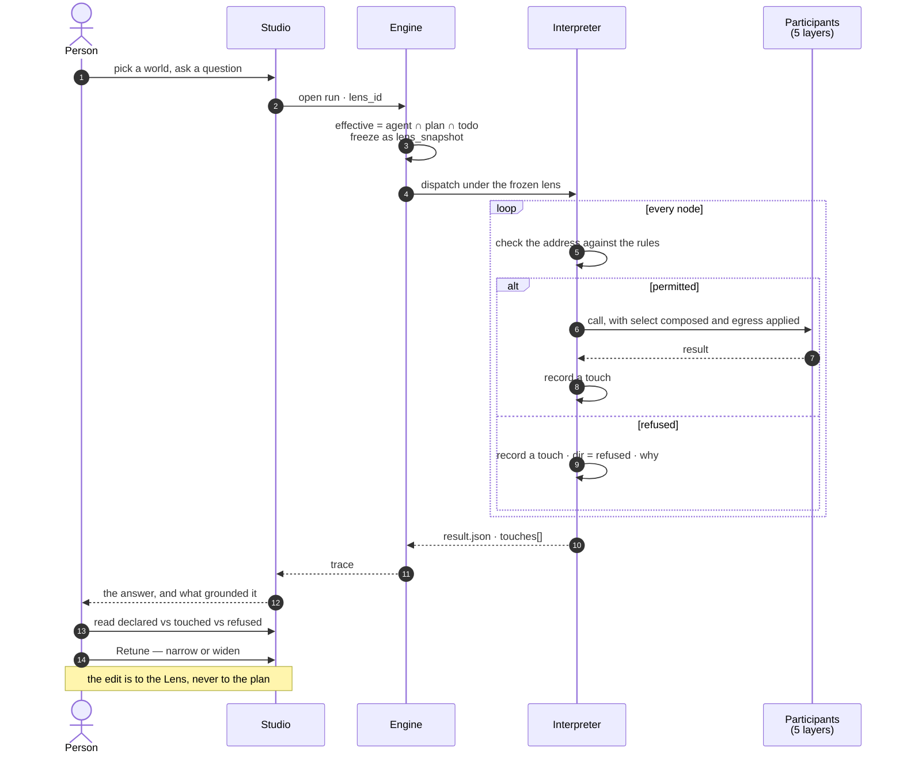

# Govern — module spec

What a run may **see**, **use** and **send** — declared before it runs, proved after it ran, and
tuned by reading the difference. [Operate](../operate/spec.md) answers *what happened*; this module
answers *what was allowed to happen*, and it is the surface a person edits when the answer was wrong.

| | |
|---|---|
| Index | [§14 · Govern](../../README.md#14--govern) |
| Features | [worlds](features/worlds.md) · [guardrails](features/guardrails.md) |
| Depends on | [orchestration § 0.9](../../orchestration.md#09-grounding-a-run--the-lens) (the Lens record) · [connect-and-model](../connect-and-model/spec.md) (declared axes) · [graph-connectors](../graph-connectors/spec.md) (predicate composition) |
| Depended on by | [Ask](../ask/spec.md) · [Agents](../agents/spec.md) · [Operate](../operate/spec.md) (the run reads its lens back) |
| Decisions | D1–D19, settled in [governance.md](../../governance.md) and restated here in present tense |

---

## 1. Vocabulary

Product-wide words: [terminology.md](../../terminology.md). What this module adds:

| Noun | Is | Is not |
|---|---|---|
| **Layer** | one of five classes of participant a run may engage — `graph data` · `llm` · `third party` · `cache` · `human` | a **lane**, which is one parallel element of a fan-out |
| **Spine** | the `agent` band — the runtime itself, which does the participating rather than being a participant | a governed layer |
| **Sublayer** | a grouping inside a layer: `model` · `stitch` · `dataset` · a provider · `api` · `app` · `db` · `agent` · `person` · `role` | a second vocabulary — it is the touch record's `kind` |
| **Participant** | one named member of a layer, addressed `<layer>/<sublayer>/<name>` | a step, a Task or a callable |
| **Address** | `graph_data/model/Observations@v2` · `llm/anthropic-prod/claude-opus-5` · `third_party/api/clearbit.com/v2/companies` | a URL to fetch |
| **World** | a **named** Lens — a reusable narrowing people pick per question and compare | a *subgraph*, which is an [emission](../../terminology.md) |
| **Guardrail** | a Lens pinned on the Graph or an agent, always in force, on its own surface | a permission on a person |
| **Cast** | the binding of a plan's **role** (`extract` · `decide` · `judge` · `embed`) to a model address | a bound — it is a resolution, checked against the rules |
| **Selector** | a narrowing *within* a model, along an axis the model declared — `time` · `geo` · `dims` | a query |
| **Touch** | one recorded engagement with a participant: address, direction, volume, and what was sent | a log line |
| **Egress** | what of the Graph's data may accompany a call that crosses the deployment boundary | redaction |
| **Retune** | editing the lens after reading what a run touched | re-running |

**Retired here:** `internet` (it named the network, not the boundary — a private warehouse is as
outside the Graph as a public API), and `tier` for a model (this year's *small* is last year's
*frontier*; a plan names a **role**).

---

## 2. The one record

**A guardrail and a world are the same row.** One table, one enforcement path, one thing frozen onto
a run — separated by `kind`, not by a second record.

```
Lens
├── id · graph_id
├── key            null = unnamed and private to its run · named = in the Graph's Worlds list
├── kind           guardrail | world
├── scope          graph | agent:<id> | null      (guardrail only — where it is pinned)
├── rules[]        { match, allow, properties?, select?, egress? }
├── cast           { role → model address }
└── as_of          transaction time — null means now
```

| Field | Carries | Grain |
|---|---|---|
| `rules[].match` | an address with `*` (one segment) and `**` (the rest) | participant |
| `rules[].allow` | `true` or `false`. **Deny wins at any specificity** | participant |
| `rules[].properties.exclude[]` | properties of a model that do not exist in this world | structural |
| `rules[].select` | `time` · `geo` · `dims`, only on axes the model declared | extensional |
| `rules[].egress.may_send[]` | what may accompany a call to **this** destination | boundary |
| `cast` | role → address. Innermost wins, then checked against the effective rules | resolution |

**Three grains of narrowing, and they are enforced in three different places:**

| Grain | Removes | Enforced by |
|---|---|---|
| Structural — **type** | a model, a type, a relationship | the schema handed to the generating model, and the validator |
| Structural — **property** | one property of a type | the same, plus the connector **rewriting a whole-node return** into the permitted projection |
| Extensional — **records** | rows | the connector **composing the predicate** into the query it executes |

**Nothing is enforced by filtering afterwards.** Rows that come back and are dropped leave the
counts, the aggregates and the schema the model saw all outside the slice — a display filter wearing
a bound's name.

---

## 3. The loop this module exists to close



| Reading | Act |
|---|---|
| Allowed, touched by nothing, across many runs | **narrow** — it is not carrying the answer |
| `refused` on the same participant, repeatedly | **widen**, or accept *cannot answer* deliberately |
| `select.time` clipping a query that wanted more | widen the slice, or confirm the slice is the point |
| `decide` resolved to a small model on the step that wrote the number | retune the cast, re-run, compare |
| `sent.classes` includes something nobody expected | tighten `egress`; the runs that did it are listed |

---

## 4. Cross-feature decisions

| # | Decision |
|---|---|
| GV1 | **A guardrail and a world are one `Lens` record separated by `kind`.** One enforcement path and one `lens_snapshot`, so *what was this run allowed to see* is one document rather than a composition an auditor computes. Promotion is a field change, never a re-authoring. |
| GV2 | **Naming is sharing.** An unnamed lens is attached to its run and private to whoever ran it; naming one puts it in the Graph's Worlds list. This is `Lens.key` as [orchestration § 0](../../orchestration.md#0-the-records) already defines it — no ownership column, no share action. The name field reads *Name it to add it to Worlds*, never a bare input. |
| GV3 | **One ladder, each rung one edit:** `unnamed lens --name it--> world --kind--> guardrail`. |
| GV4 | **A participant is addressed `<layer>/<sublayer>/<name>`, and the address is the only identifier.** The lens matches on it, the ledger records it, the drawing expands it. One string instead of five shapes of rule. |
| GV5 | **Deny wins at any specificity.** A rule that can be overridden by being more precise is not a bound: a broad `third_party/** deny` must not be punchable by a narrow allow written later by someone who did not know the deny existed. |
| GV6 | **Allow intersects, deny accumulates, selectors intersect** across agent, plan and Todo. The `cast` is not a bound and does not intersect — innermost wins, and the resolved address is then checked against the effective rules, refused by name if denied. |
| GV7 | **The default is the widest.** A Graph that sets no lens sees the whole global model, every configured provider and every third party its agents are credentialed for. Nothing changes for anyone who does not want this, and no surface grows a required field. |
| GV8 | **A lens is per run, never per step.** The lens is the run's circumstances; per-step narrowing is the plan's job, and two places to narrow means neither is authoritative. |
| GV9 | **The llm sublayer is the configured provider row, not the vendor.** `llm/anthropic-prod/...` and `llm/anthropic-research/...` are different participants with different keys, which is what lets one address name one credential. |
| GV10 | **A plan names a role; the cast resolves it.** `role: decide` says *how much this matters*, which stays true when the model line-up moves. `tier` does not, and a model id in a plan is a plan that cannot leave its Graph. |
| GV11 | **Reading a thing and sending it are different permissions.** A query may filter on `Deal.revenue` while the value never enters a prompt — used to **compute**, not to **reason**. Collapsing them forces a choice between losing the ranking and exporting the number. |
| GV12 | **Egress is declared per destination, on the rule that matched it.** A run-wide setting would have to be the strictest of its destinations, which is the least useful one. An unmatched crossing falls to the lens default, and that default is `[]`. |
| GV13 | **A third party carries no selector.** It is permitted or denied, and `egress` governs the call. A third party you could slice is one you have effectively modelled — the answer is to bring it across as a model, where it gets the whole grammar. |
| GV14 | **Only declared axes are selectable.** A model declares which property carries valid time, which carries geography, and which named properties are selectable dimensions. A lens asking for an axis a model never declared is refused naming the model, never silently ignored. |
| GV15 | **`as_of` and `select.time` are two fields.** `as_of` is transaction time, lens-level, resolving which versions and stitches are in view. `select.time` is valid time, rule-level, composed into the query. They compose: *what we knew on 1 March about what was true in H1*. |
| GV17 | **Govern is its own `leftNav` item**, holding `Worlds` and `Guardrails` as two drawers. A guardrail belongs beside the worlds it bounds, not in Graph settings — the two are one record ([GV1](#4-cross-feature-decisions)) and a person reading one is one drawer from the other. It also keeps *what may participate* out of a settings panel that otherwise holds connection and configuration. |
| GV18 | **`LLMs` moves out of Graph settings and becomes the second drawer of `Agents`.** A provider is what an agent's cast resolves against, so it belongs where agents are read, not in a settings tab reached from elsewhere. Graph settings drops to `Basic · Graph · Agents`. |
| GV16 | **A guardrail is legible as one object.** Its own route, its own permission, its own settings tab, and it never appears in the Worlds list — so there is no delete control to block and nothing to explain to an auditor. It is still a row an admin can edit; if a bound must be *structurally* unreachable, that is a second record and this is not it. |

---

## 5. Where it lands in Studio

**Govern is its own `leftNav` item** ([GV17](#4-cross-feature-decisions)), holding two drawers.

| Surface | Region | Reached by | Owner |
|---|---|---|---|
| **Worlds** | first drawer of the **Govern** stack | `?panel=govern&drawer=worlds`, drill-in `&world=<id>` ([G35](../../building-studio/graph-detail-page.md)) | this module |
| **Guardrails** | second drawer of the same stack | `?panel=govern&drawer=guardrails` | this module |
| A world's detail | inside its own drawer, header `‹ WORLDS / EU · H1 2026` ([G36](../../building-studio/graph-detail-page.md)) | the drill-in | this module |
| The world chip | `header.right`, beside the nodes-in-view readout | always visible while a Graph can be asked | this module |
| **This run's lens** band | the run dashboard page `run:<run_id>` ([SR36](../operate/features/see-what-ran.md)) | `Retune` opens the Govern panel | [Operate](../operate/spec.md) |

**The guardrails are a sibling of the worlds they bound.** That is what the nav item buys: the locked
strip that a settings-tab layout needed above the worlds list is gone, because the drawer underneath
it *is* the guardrails.

**The module contributes one `GraphFeature`** ([G7](../../building-studio/graph-detail-page.md)): a
`leftSection` component (the Worlds drawer, stacked by Tasks) and no page kinds of its own — a world
is read in its drawer and applied to a question, never opened as a page.

**Why Worlds is in the Tasks stack.** A run is made of a plan, the callables in it, **and the world
it ran against**. *This run → its world → retune → run again* stays in one column and never closes
what you came from, which is the property [SR12](../operate/features/see-what-ran.md) exists to
protect. A fifth icon would be the shape [SR7](../operate/features/see-what-ran.md) warns about.

---

## 6. Where it lands in the engine

| Thing | Shape |
|---|---|
| `lenses` | `graph_id` · `key` (unique per graph, null allowed) · `kind` · `scope` · `rules` jsonb · `cast` jsonb · `as_of` |
| `task_runs.lens_snapshot` | already exists — now carries the whole record, five layers' worth |
| `result.json → touches[]` | the readable projection: five governed layers plus the spine's `when`/`until`/`loop` evaluations |
| `TaskStream` | the **complete** ledger — every touch, spine dispatches included, in `seq` order |
| Resolution | `effective = agent ∩ plan ∩ todo`, computed once at run open and frozen. Never recomputed mid-run |
| Enforcement | in the **interpreter** before dispatch (participant, egress) and in the **connector** at execution (projection, predicate) — never in Studio |
| Routes | `GET · POST · PATCH · DELETE …/lenses` · `POST …/lenses/{id}/promote` (`kind`) · `GET …/runs/{id}/touches` |
| Events | `lens.created · updated · named · promoted · deleted` — a guardrail edit is an audited write like any other |

**Two things are deliberately not new.** There is no governance table beside the record: every fact
is a key in a document the interpreter already writes, a field on `Lens`, or a projection of the
trace. And there is no second enforcement path: a guardrail and a world reach the interpreter as one
resolved object.

---

## 7. What this module changes elsewhere

| File | Change | Why |
|---|---|---|
| [terminology.md](../../terminology.md) | **Lens** rewritten — five layers, not one. New: *layer* · *participant* · *world* · *guardrail* · *cast* · *touch*. Retired: *internet* · model *tier* | GV1 · GV4 |
| [providers-and-models](../agents/features/providers-and-models.md) | **PM1 rewritten** — the Graph resolves the credential, an agent binds no provider. **PM4 retired** — `is_default` dropped, with its partial unique index. **C8 rewritten** — the agent panel shows a lens, not a provider | D2 · D19 |
| [see-what-ran](../operate/features/see-what-ran.md) | **SR32 rewritten** — one continuous strip, not wrapped rows. New: the touch record, the layer flow, the `Touches` · `Slice` · `Egress` · `Model` · `Cache` bands, `Retune` | D3 · D5 · D12 · D16 |
| [domain-models](../connect-and-model/features/domain-models.md) | a published model version declares its `time`, `geo` and `dims` axes | GV14 |
| [the-connector-contract](../graph-connectors/features/the-connector-contract.md) | `run_query` composes the effective predicate and rewrites whole-node returns into the permitted projection | GV grain table, §2 |
| [observability](../operate/features/observability.md) | spend grouped by layer, then by participant | the tuning loop needs it |

**A default cast ships with the distribution.** Dropping `is_default` means a Graph with providers
configured and no cast can run nothing, and the trade for removing a second model-picking mechanism
is that the shipped default has to be right.

---

## Not building

| Not building | Because |
|---|---|
| A second record for governing | every fact is a key in `result.json`, a field on `Lens`, or a projection of the trace. A parallel store can disagree with the trace it governs |
| A lens per step | the lens is the run's circumstances; per-step narrowing is the plan's job (GV8) |
| Redaction or masking of what leaves | egress governs **whether** data may go, not a transformation of it. A masked value that still identifies someone is a false promise, and one nobody could check |
| Most-specific-rule-wins | a deny a narrower allow can punch through is not a bound (GV5) |
| Selectors on undeclared properties | that is a query, and the product has one place to write a query (GV14) |
| Automatic model downgrade to save money | a silent switch changes what produced an answer. Retuning the cast is deliberate, recorded, and a person's act |
| Roles on people | a **Member** is binary ([terminology § 2](../../terminology.md)). A guardrail's edit permission is the one exception and it is a permission, not a role |
| Alerting when a layer lights unexpectedly | this is a product surface, not a monitoring platform |
