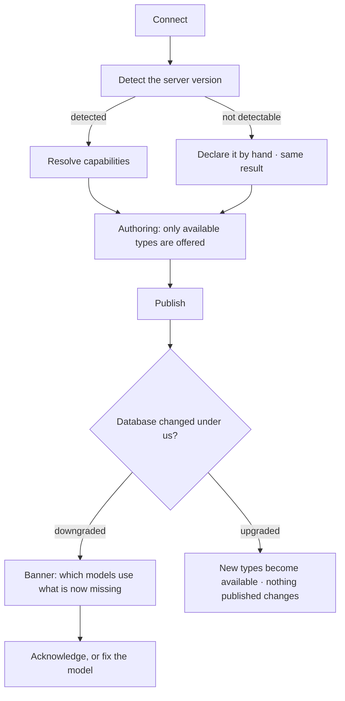

# Capabilities

What *this* database, at *this* version, can actually hold and do. Resolved once and enforced at
authoring time, so a model is never publishable against a database that cannot store it.

| | |
|---|---|
| Index | [12.3](../../../README.md#12--graph-connectors) · Slice **S3** |
| Module | [Graph connectors](../spec.md) |
| API / CLI / Studio | 🟡 / — / 🔵 |
| Related | [domain-models](../../connect-and-model/features/domain-models.md) · [share-a-model](../../connect-and-model/features/share-a-model.md) |

> **As** someone authoring a model, **I want** to be told now that this database cannot store a
> duration, **so that** I do not find out during an import at three in the morning.

## Capabilities

| # | Capability | Notes |
|---|---|---|
| C1 | Property types, per version | Which types this server can actually store |
| C2 | Features, per version | Constraints, index kinds, algorithms, vector search |
| C3 | Resolved from the server version | Detected on connect, or declared when detection is not possible |
| C4 | Enforced at authoring | An unavailable type cannot be added to a draft |
| C5 | Enforced at import | A model version validated against a database that has since changed is refused with the difference named |
| C6 | Surfaced as a banner | When a Graph's database no longer supports what its models use |
| C7 | Travels with a shared model | An imported model whose types the target cannot hold arrives as an unpublishable draft |

## Journey

## Seams

| Seam | What the user sees |
|---|---|
| Version undetectable | A field to declare it; capabilities resolve the same way afterwards |
| Version acknowledged | The read-only lock lifts, and the acknowledgement is recorded |
| A type used by data already imported | The banner names the models and the datasets, not just the type |
| Importing a richer model | Unpublishable draft, listing every type the target cannot hold |

## Engine

| Thing | Shape |
|---|---|
| Capability set | property types plus feature flags, keyed by connector and server version |
| Resolution | on connect and on demand; cached with the connection |
| Enforcement | at authoring (offered types), at publish, and at import |
| Routes | `POST …/connection/acknowledge-version` clears the untested-version lock |

## Decisions

| # | Decision |
|---|---|
| CP1 | Capability is resolved from the real server version, never assumed from the connector. |
| CP2 | An unavailable property type is refused at authoring, not at write time. |
| CP3 | A version that cannot be detected is declared, and treated identically thereafter. |
| CP4 | A capability change is surfaced as a banner naming what is affected. |

## Not building

| Not building | Because |
|---|---|
| Silent type degradation | storing a duration as a string is a lie the model then tells everyone |
| Feature emulation in the engine | if the database cannot do it, the honest answer is that it cannot |
| Per-type capability overrides by hand | that is how a model becomes unpublishable in production |
