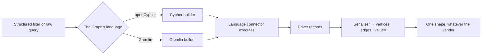

# Languages

Two query languages, written once each: **openCypher** and **Gremlin**. Every supported database is one
of the two, and one — ArcadeDB — is both.

| | |
|---|---|
| Index | [12.2](../../../README.md#12--graph-connectors) · Slice **S2** |
| Module | [Graph connectors](../spec.md) |
| API / CLI / Studio | ✅ / — / 🟡 |
| Related | [the-connector-contract](the-connector-contract.md) · [write-queries](../../ask/features/write-queries.md) |

> **As** the person maintaining this, **I want** Neo4j and Memgraph to share their query logic, **so
> that** a fix lands once rather than in every package that speaks the same language.

## Capabilities

| # | Capability | Notes |
|---|---|---|
| C1 | Two complete implementations | Standard openCypher and standard Gremlin, in the core |
| C2 | ~80% shared per family | Neo4j and Memgraph differ in the driver and a handful of procedures, not in reading and writing |
| C3 | Structured filters compile to either | A nested AND / OR group becomes the target language |
| C4 | Serializers normalise results | Driver records become the engine's own vertex and edge shapes |
| C5 | The editor speaks the Graph's language | One connection, one language — no dialect switch mid-Graph |
| C6 | A database may speak both | ArcadeDB has a connector in each family; the Graph picks one |
| C7 | Raw queries pass through | Validated against the model, then executed as written |
| C8 | A raw query travels in its language's own raw form | openCypher as a statement over Bolt; Gremlin as a **script** to the server's script engine, with parameters passed as bindings |
| C9 | A script result is normalised like any other | Vertices and edges become nodes and edges; a scalar, a map or a count becomes a record |
| C10 | The wire serializer is the vendor's choice | GraphBinary by default; a vendor whose ids are its own types says so and gets GraphSON |
| C11 | The identity function is the vendor's choice | `elementId()` by default; one name on the builder, not one query at a time |
| C12 | An element id crosses one boundary | Every id entering a queryset passes `coerce_id`, so a vendor storing longs never compares against a string |

## The families

| Language | Databases |
|---|---|
| **openCypher** | Neo4j · Memgraph · ArcadeDB |
| **Gremlin** | JanusGraph · Amazon Neptune · TinkerGraph · ArcadeDB |

## Journey — a query, either way

## Seams

| Seam | What the caller sees |
|---|---|
| A construct one language lacks | Declared unsupported for that family, refused with the reason |
| A vendor procedure inside a raw query | Passes through; validation checks the model, not the vendor's catalogue |
| Results shaped differently per driver | Normalised by the serializer — the caller never sees driver types |
| A Graph on ArcadeDB | Whichever connector it was bound to; the language does not change afterwards |
| A server that will not evaluate scripts | Refused at the connector with the vendor named — Neptune accepts bytecode and its own HTTP API, not Groovy ([LG7](#decisions)) |
| A script that returns a count, a list or a map | Comes back as records. Only vertices and edges become nodes and edges ([LG8](#decisions)) |
| A traversal the engine composed itself | Goes as bytecode, never as text — `execute_traversal`, which the querysets use ([LG6](#decisions)) |
| A vendor whose element id is its own type | JanusGraph's `RelationIdentifier` — GraphBinary cannot carry it and fails the **whole** response, so that vendor speaks GraphSON and unwraps it ([LG9](#decisions)) |
| A vendor without `elementId()` | Memgraph — it subclasses the builder, sets one name, and coerces the id to the integer `id()` compares against ([LG10](#decisions)) |
| A construct a vendor spells differently | Overridden, not refused — Memgraph writes a shortest path as `-[*BFS ..n]-`. Refusal is for what a vendor genuinely cannot do |

## Engine

| Thing | Shape |
|---|---|
| Language connectors | complete implementations, in the core, not abstract |
| Query builder | structured filters → language string, per family |
| Serializers | a base plus one per family |
| Filters | nested groups of conditions, combined with AND / OR |

## Decisions

| # | Decision |
|---|---|
| LG1 | The core implements languages, not vendors. |
| LG2 | A Graph's language is fixed by its connector and never switches. |
| LG3 | Filters are structured and compiled; queries are never concatenated from strings. |
| LG4 | Results are normalised before they leave the connector. |
| LG5 | **`execute()` is the one door for an arbitrary query, in both families.** A raw query reaches the database in its language's own raw form — a Bolt statement, or a Gremlin script. A family that left that door shut had no path at all from a question to its database, whatever else it implemented. |
| LG6 | **Bytecode is for what the engine composes; a script is for what a person or a model wrote.** The querysets build traversals because they own the shape, so they send bytecode. A raw query has no structure to compose from, so it is submitted as text. Two paths, and which one a caller is on is never ambiguous. |
| LG7 | **A server that does not evaluate scripts is declared, not discovered.** It refuses at the connector, naming the vendor ([CN6](../spec.md)) — not with a driver error from the wire. Amazon Neptune is the case: bytecode and its own HTTP API, no Groovy. |
| LG8 | **Anything a script returns that is not a vertex or an edge is a record.** A serializer that recognised only the shapes its own querysets build reported an empty answer for a query that returned rows — an empty answer being the one wrong answer that looks like a right one. |

## Not building

| Not building | Because |
|---|---|
| Translation between the two languages | a Graph binds to one database, so there is nothing to translate for |
| SQL or SPARQL families | not a database family this product targets |
| A dialect-detection layer | the connector declares its language; guessing is worse |
