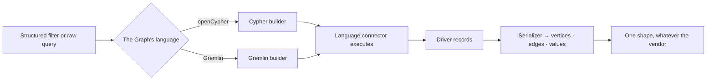

# Languages

Two query languages, written once each: **openCypher** and **Gremlin**. Every supported database is one
of the two, and one — ArcadeDB — is both.

| | |
|---|---|
| Index | [12.2](../../../README.md#12--graph-connectors) · Slice **S2** |
| Module | [Graph connectors](../spec.md) |
| API / CLI / Studio | ✅ / — / 🟡 |
| Related | [the-connector-contract](the-connector-contract.md) · [write-queries](../../ask/features/write-queries.md) |

> **As** the person maintaining this, **I want** Neo4j and Memgraph to share their query logic, **so
> that** a fix lands once rather than in every package that speaks the same language.

## Capabilities

| # | Capability | Notes |
|---|---|---|
| C1 | Two complete implementations | Standard openCypher and standard Gremlin, in the core |
| C2 | ~80% shared per family | Neo4j and Memgraph differ in the driver and a handful of procedures, not in reading and writing |
| C3 | Structured filters compile to either | A nested AND / OR group becomes the target language |
| C4 | Serializers normalise results | Driver records become the engine's own vertex and edge shapes |
| C5 | The editor speaks the Graph's language | One connection, one language — no dialect switch mid-Graph |
| C6 | A database may speak both | ArcadeDB has a connector in each family; the Graph picks one |
| C7 | Raw queries pass through | Validated against the model, then executed as written |

## The families

| Language | Databases |
|---|---|
| **openCypher** | Neo4j · Memgraph · ArcadeDB |
| **Gremlin** | JanusGraph · Amazon Neptune · TinkerGraph · ArcadeDB |

## Journey — a query, either way

## Seams

| Seam | What the caller sees |
|---|---|
| A construct one language lacks | Declared unsupported for that family, refused with the reason |
| A vendor procedure inside a raw query | Passes through; validation checks the model, not the vendor's catalogue |
| Results shaped differently per driver | Normalised by the serializer — the caller never sees driver types |
| A Graph on ArcadeDB | Whichever connector it was bound to; the language does not change afterwards |

## Engine

| Thing | Shape |
|---|---|
| Language connectors | complete implementations, in the core, not abstract |
| Query builder | structured filters → language string, per family |
| Serializers | a base plus one per family |
| Filters | nested groups of conditions, combined with AND / OR |

## Decisions

| # | Decision |
|---|---|
| LG1 | The core implements languages, not vendors. |
| LG2 | A Graph's language is fixed by its connector and never switches. |
| LG3 | Filters are structured and compiled; queries are never concatenated from strings. |
| LG4 | Results are normalised before they leave the connector. |

## Not building

| Not building | Because |
|---|---|
| Translation between the two languages | a Graph binds to one database, so there is nothing to translate for |
| SQL or SPARQL families | not a database family this product targets |
| A dialect-detection layer | the connector declares its language; guessing is worse |
