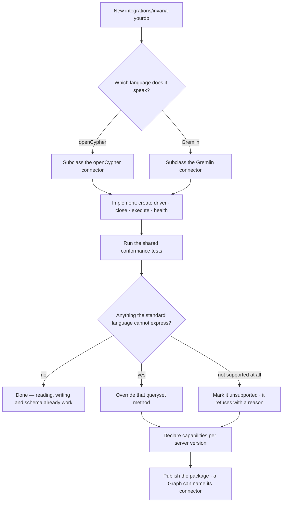

# The connector contract

What an `invana-<db>` package must implement — four methods and, where the standard language falls
short, an override. Everything else is inherited and already works.

| | |
|---|---|
| Index | [12.1](../../../README.md#12--graph-connectors) · Slice **S2** |
| Module | [Graph connectors](../spec.md) |
| API / CLI / Studio | ✅ / — / — |
| Related | [languages](languages.md) · [capabilities](capabilities.md) · [connect-a-database](../../connect-and-model/features/connect-a-database.md) |

> **As** someone whose team runs a graph database Invana does not support, **I want** to add it in an
> afternoon, **so that** adopting Invana is not blocked on a roadmap I do not control.

## Capabilities

| # | Capability | Notes |
|---|---|---|
| C1 | Four required methods | Create the driver, close it, execute, health-check |
| C2 | Everything else inherited | Reading, writing, schema, filters and serialization come from the language connector |
| C3 | Override where the language falls short | A vendor's algorithm library, its schema dialect, its vector syntax |
| C4 | Declare what is unsupported | Marked on the method; the caller gets a refusal naming the vendor, not a driver error |
| C5 | Its own dependencies | The driver is the package's, never the core's |
| C6 | Reports its capabilities | Per server version — [capabilities](capabilities.md) |
| C7 | Discovered by dotted path | The Graph's connection names the class; no registry to update |

## Journey — adding a database

## Seams

| Seam | What the developer sees |
|---|---|
| A method left unimplemented | The shared conformance tests fail, naming it |
| A driver that is not async | It must be wrapped in the package; the core has no sync path |
| An unsupported operation called anyway | Refused with the vendor and the operation named, before the wire |
| Two vendors on one driver | Fine — Memgraph rides the Bolt driver and overrides almost nothing |

## Engine

| Thing | Shape |
|---|---|
| Package | `integrations/invana-<db>/` — its own manifest, dependencies, tests |
| Class | subclasses a language connector; named in a Graph's `connector_class` |
| Required | `_create_driver` · `_close_driver` · `execute` · `health_check` |
| Optional | any queryset method, plus the unsupported marker |
| Tests | a shared conformance suite every integration runs against a live database |

## Decisions

| # | Decision |
|---|---|
| CC1 | An integration supplies a driver and vendor-native overrides; nothing else. |
| CC2 | Four methods are required; everything else is inherited and working. |
| CC3 | Unsupported operations are declared, and refuse with a reason. |
| CC4 | Each integration owns its dependencies. |
| CC5 | Integrations are conformance-tested against a live database, not mocked. |

## Not building

| Not building | Because |
|---|---|
| A plugin discovery registry | a dotted path in the connection is enough for a known set |
| Vendor branching in the core | that is exactly what this module exists to prevent |
| A compatibility shim for sync drivers | the package wraps it, or the driver is not suitable |
