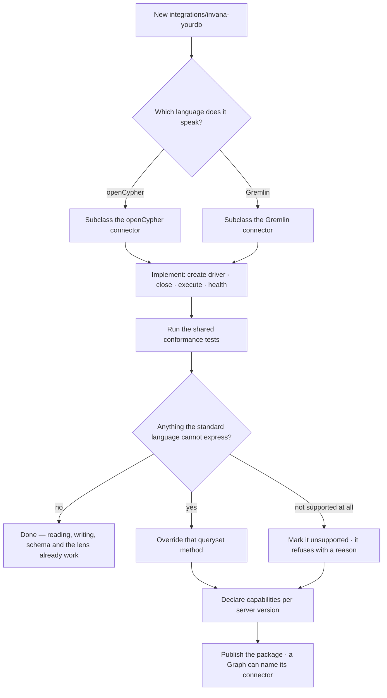
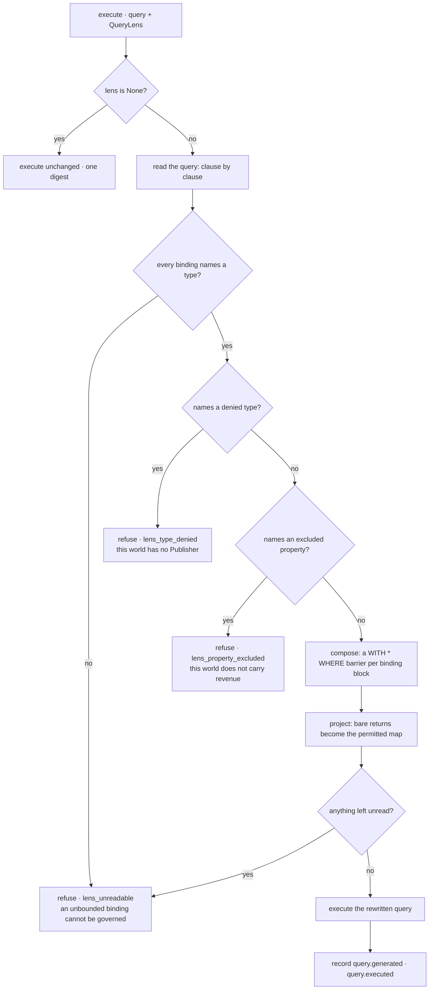

# The connector contract

What an `invana-<db>` package must implement — four methods and, where the standard language falls
short, an override. Everything else is inherited and already works. And what the **language**
connectors owe a governed run: a lens is enforced here, at execution, or it is not enforced at all.

| | |
|---|---|
| Index | [12.1](../../../README.md#12--graph-connectors) · Slice **S2**, and the lens half in **S16** |
| Module | [Graph connectors](../spec.md) |
| API / CLI / Studio | ✅ / — / — |
| Related | [languages](languages.md) · [capabilities](capabilities.md) · [connect-a-database](../../connect-and-model/features/connect-a-database.md) · [govern](../../govern/spec.md) |

> **As** someone whose team runs a graph database Invana does not support, **I want** to add it in an
> afternoon, **so that** adopting Invana is not blocked on a roadmap I do not control.

> **As** someone who has bounded a world, **I want** the bound composed into the query the database
> actually runs, **so that** what I excluded cannot reach an answer through a count, an average or a
> whole-node return.

## Capabilities

| # | Capability | Notes |
|---|---|---|
| C1 | Four methods make a connector | Create the driver, close it, execute, health-check — **already implemented** by the language connector you subclass |
| C2 | Everything else inherited | Reading, writing, schema, filters, serialization and the lens come from the language connector |
| C2a | Override one only when the vendor differs | A driver the reference one cannot speak, or an operation the server will not run. `invana-neo4j` overrides none of the four |
| C3 | Override where the language falls short | A vendor's algorithm library, its schema dialect, its vector syntax |
| C4 | Declare what is unsupported | Marked on the method; the caller gets a refusal naming the vendor, not a driver error |
| C5 | Its own dependencies | The driver is the package's, never the core's |
| C6 | Reports its capabilities | Per server version — [capabilities](capabilities.md) |
| C7 | Discovered by dotted path | The Graph's connection names the class; no registry to update |
| C8 | **Composes** the effective selector | The per-type `FilterGroup` is folded into the dialect **before** execution — a Cypher `WHERE`, a Gremlin `has()` |
| C9 | **Projects** the permitted properties | A whole-node return is rewritten into a map projection over `declared − excluded`; a whole-vertex traversal into a `valueMap` with keys |
| C10 | **Rejects** an excluded property | Any reference to it anywhere in the query — a return item, a predicate, an `ORDER BY`, the inside of an aggregate |
| C11 | **Refuses what it cannot read** | Fail closed. A query whose shape the compiler cannot bound is refused naming the fragment, never executed |
| C12 | Reports both queries | `query.generated` and `query.executed` as two digests, so the rewrite is visible rather than silent |

## Journey — adding a database



**The lens is not on this path.** An integration supplies a driver; the lens is compiled by the
*language* connector it subclasses, so a new vendor inherits enforcement without writing a line of it
([CC9](#decisions)).

## Journey — a query under a lens



**Both halves, and the diagram is why.** The `F` branch alone does not stop `RETURN d`; the `H`
branch alone does not stop `avg(d.revenue)`. A compiler that takes one branch is not enforcing a
lens ([CC8](#decisions)).

## The readable subset

A query under a lens must be readable, and *readable* is a defined set rather than a hope. Anything
outside it is refused — which is what makes a reader sufficient where a full grammar is not
([CC11](#decisions)).

| Must | Or it is refused |
|---|---|
| Every variable-binding node or relationship pattern names at least one type | `MATCH (n) RETURN n` — an unbounded binding cannot be governed |
| Every property access is literal — `d.revenue`, `d { .revenue }` | `d[$key]` — a property the compiler cannot name it cannot exclude |
| No whole-property-bag function over a governed binding | `properties(d)` · `keys(d)` · `elementMap(d)` — the bag is the hole the projection closes |
| A governed element may be **counted or identified** whole — `count` · `id` · `elementId` · `labels` · `type` | `collect(d)` · `avg(d)` — these carry the element, not a fact about it |
| `RETURN` names its items | `RETURN *` — it returns bindings the compiler was never shown |
| A `WITH` item touching a governed binding is that binding, a bare alias of it, or an explicit projection | `WITH collect(d) AS ds` — the whole node survives inside the list |
| An `OPTIONAL MATCH` binds nothing the lens narrows extensionally | a composed predicate would make the optional match required, which changes the answer |
| Gremlin arrives as a traversal | a raw Gremlin script does not parse into a lens ([CC12](#decisions)) |

String literals and comments are masked before the query is read, so the word `revenue` inside a
string is text and not a reference — the same treatment the read-only check already gives them.

## Seams

| Seam | What the developer sees |
|---|---|
| A method left unimplemented | The shared conformance tests fail, naming it |
| A driver that is not async | It must be wrapped in the package; the core has no sync path |
| An unsupported operation called anyway | Refused with the vendor and the operation named, before the wire |
| Two vendors on one driver | Fine — Memgraph rides the Bolt driver and overrides almost nothing. *Almost*: it has no `elementId()` ([LG10](languages.md)) |
| A vendor difference with nowhere to live | The seam is missing, and that is the bug. A difference worked around inside a queryset is one every other vendor inherits |
| No lens on the call | The query executes byte-identical and the two digests are equal — nothing changes for a Graph that never set one |
| A lens whose type carries exclusions and no declared property set | Refused. There is nothing to project *to*, and projecting to the empty map would be a silent answer-changer |
| A governed node in the result | Still a node on the canvas — the projection is emitted in the serializer's own node shape ([CC13](#decisions)) |
| A refusal | `LensViolationError`, before the wire. It names the type, the property and the rule — never *cannot answer* on its own |

## Engine

| Thing | Shape |
|---|---|
| Package | `integrations/invana-<db>/` — its own manifest, dependencies, tests |
| Class | subclasses a language connector; named in a Graph's `connector_class` |
| Required | `_create_driver` · `_close_driver` · `execute` · `health_check` — already implemented by the language connector |
| Optional | any queryset method, plus the unsupported marker |
| Vendor hooks | `message_serializer()` · `query_builder` · `coerce_id()` · `classify_error()` · the serializer's `coerce_element_id()` — five named seams, so a vendor difference is a line, not a fork |
| The contract | `graph/types/lens.py` — `QueryLens` · `TypeBound` · `ComposedQuery` |
| The compilers | `graph/connectors/base/lens.py` (the seam) · `cypher/lens.py` · `gremlin/lens.py` |
| The identity function | read from the connection's own `query_builder.ELEMENT_ID` ([LG10](languages.md)) — a hardcoded `elementId()` is invalid Cypher on Memgraph, i.e. a bound failing **open** on exactly one vendor |
| The refusal | `graph/connectors/base/exceptions.py` — `LensViolationError(code, type, property)` |
| Entry point | `BaseConnector.execute(query, parameters, *, timeout_s, lens=None)` — the one door ([CC18](#decisions)) |
| The compiler per language | `BaseConnector.lens_compiler()` — `CypherLensCompiler(self.query_builder)` · `GremlinLensCompiler` (refuses) · `UnsupportedLensCompiler` at the base |
| The trace | `execute_graph_query` records `query: {generated, executed}`; the step reads *… · under a lens* when they differ |
| Tests | a shared conformance suite every integration runs against a live database |

### `QueryLens` — what the connector is handed

```python
QueryLens(
    bounds={
        "Deal": TypeBound(
            type_name="Deal",
            declared=frozenset({"name", "stage", "country_iso", "observed_at", "revenue"}),
            excluded=frozenset({"revenue"}),
            predicates=FilterGroup(conditions=[
                FilterExpression(property="observed_at", op=FilterOp.GTE, value="2026-01-01"),
                FilterExpression(property="observed_at", op=FilterOp.LTE, value="2026-06-30"),
            ]),
        )
    },
    allowed_types=None,          # None = every type this graph holds
)
```

**Types, not addresses.** `graph_data/model/Observations@v2`, its rules and its declared axes resolve
**upstream** — in [Govern](../../govern/spec.md), against the model version's axes. What reaches the
connector is its own vocabulary: a type, its properties, and a predicate over them
([CC6](#decisions)). The connector knows nothing of worlds, guardrails or five layers.

### What `execute` gives back

`ComposedQuery` rides the response: `generated`, `executed`, `rewritten`, and the two digests
`sha256:…` that the trace carries as `query.generated` and `query.executed`
([CC14](#decisions)). Equal digests mean nothing was rewritten.

## Decisions

| # | Decision |
|---|---|
| CC1 | An integration supplies a driver and vendor-native overrides; nothing else. |
| CC2 | **Four methods are required of a connector, and the language connector already satisfies all four.** An integration overrides one only when its vendor's driver or server differs — which is why `invana-neo4j` implements none of them. *Required* names the contract, not a to-do list for every package. |
| CC3 | Unsupported operations are declared, and refuse with a reason. |
| CC4 | Each integration owns its dependencies. |
| CC5 | Integrations are conformance-tested against a live database, not mocked. |
| CC6 | **A lens reaches the connector as a `QueryLens` in its own vocabulary** — types, their declared and excluded properties, and a `FilterGroup` per type. Addresses, model versions and declared axes resolve upstream. A connector that knew about worlds would be a connector every governance change had to visit. |
| CC7 | **Compose, project and reject are one pass.** All three need the same reading of the query — which variable is bound to which type — so one compiler per language does all three and returns one `ComposedQuery`. Three passes would read the query three ways and disagree on the third. |
| CC8 | **Both halves, always.** Rewriting a whole-node return does not stop `avg(d.revenue)`; rejecting a named property does not stop `RETURN d`. A connector that does one of the two is not enforcing a lens, and the half it is missing is the half an answer will find. |
| CC9 | **A lens is compiled per language, never per vendor.** It lives beside the query builder in `cypher/` and `gremlin/`, so an integration inherits enforcement and overrides nothing — the same rule as reading and writing ([CN1](../spec.md)). |
| CC10 | **Fail closed.** A query whose shape the compiler cannot bound under a lens is refused, naming the fragment it could not read. Executing what we could not read is the one outcome a bound may not have. Without a lens nothing is read and nothing changes ([GV7](../../govern/spec.md)). |
| CC11 | **The projection is enumerated, never dynamic.** `declared − excluded` is written into the query as literal keys — a Cypher map projection, a Gremlin `valueMap` with keys — so the rewrite is deterministic and needs no vendor extension. A type with exclusions and no declared set has nothing to project to and is refused. |
| CC12 | **Gremlin enforces on the traversal, not on a script.** Bytecode composes — `.has()` and `.valueMap(keys)` are steps, not string surgery. A raw Gremlin script under a lens is refused, which costs nothing: the base Gremlin connector has no raw-script path. |
| CC13 | **A governed node stays a node.** The rewritten projection is emitted in the serializer's own node and relationship shape — `element_id` · `labels` · `properties`, and `type` · `start_node_element_id` · `end_node_element_id` — so the canvas, the emissions and the table see what they always saw, minus the excluded keys. Returning a bare map would make every lens silently retype a graph answer as a table. |
| CC14 | **The rewrite is recorded, never silent.** `execute` returns `query.generated` and `query.executed` as two digests and the trace carries both. *The generated query, exactly as executed* stays true by showing both and saying which ran. |
| CC18 | **`execute(query, …, lens=None)` is the seam.** One door, the same one an ungoverned query uses — so there is no second path a caller could take to reach the database without the lens, and no caller assembling a rewrite itself. |
| CC19 | **The digests are internal.** Both queries ride back on the result, but as a **private** attribute: the reader is the trace, in process. `ResultMetadata` is serialised to the browser inside `GraphResponse`, and the OpenAPI document is the frontend contract — a lens appearing in Studio is a decision the Govern panels make deliberately, not one that leaks in behind a field. |
| CC20 | **A refusal is not a failed query.** `LensViolationError` is never flattened into `QueryExecutionError`: nothing ran, and the property and rule that explain it would be lost. Telling a reader their query was broken, when their world simply does not hold what they asked for, is the wrong sentence. |
| CC16 | **A named exclusion outranks an unreadable shape.** `collect(d)` is outside the readable subset *and* may name an excluded property; the refusal says *this world does not carry Deal.revenue*, not *this shape cannot be read*. One tells the reader what to change. So readability complaints are held until the whole query has been read and rejection has had its turn. |
| CC17 | **An explicit map projection is a projection, not the element carried whole.** `d { .name }` already names what it takes, and its keys have been checked — rewriting it again, or refusing it, would punish the one query shape that was already doing the right thing. |
| CC15 | **The predicate is composed at a `WITH * WHERE` barrier**, inserted after the clauses that bind a governed variable. It is a clause boundary the compiler can find without a grammar, it cannot be swallowed by an existing `WHERE` expression it failed to parse the end of, and it composes with itself when several blocks bind several types. |
| CC21 | **An edit replaces an item's own text, never the whitespace after it.** A return item's span runs to the **next clause's keyword**, so the last item owns the space in front of `LIMIT` / `ORDER BY` / `SKIP`; replacing that span whole welds the alias to the keyword — `… AS dLIMIT 5`. The compiler is a text rewriter without a grammar (CC15), so every edit it makes stops where the text it is replacing stops. A test whose query ends at its `RETURN` cannot see this, which is why the projection tests now carry a clause after it. |
| CC22 | **A structured reader takes the lens as input, not as text to rewrite.** The neighbour, count and resolve readers build their own queries, so they receive the `QueryLens` as arguments — allowed types, excluded properties, the slice predicate — and compose it into what they build. The refusal of CC12 is for a raw script a compiler cannot read; a traversal the connector wrote itself has no such excuse, so it is governed on every dialect. The neighbour reader takes `lens` on the abstract `read_neighbors` / `count_neighbors` and is implemented once per language — in the OpenCypher and Gremlin query builders — so every integration built on either (Neo4j, Memgraph, ArcadeDB, JanusGraph, Neptune, TinkerGraph) inherits it without a line of its own, and the conformance suite proves it on every live backend of both languages. The count takes the same lens as the read, so *showing X of N* is counted inside the world. |

## Not building

| Not building | Because |
|---|---|
| A plugin discovery registry | a dotted path in the connection is enough for a known set |
| Vendor branching in the core | that is exactly what this module exists to prevent |
| A compatibility shim for sync drivers | the package wraps it, or the driver is not suitable |
| A full Cypher or Gremlin grammar | the compiler reads the shapes the product generates and refuses the rest. Fail closed ([CC10](#decisions)) is what makes a reader sufficient, and a grammar is a dependency that has to track every vendor's dialect |
| Dropping excluded keys from rows after they return | the value has already crossed the wire, and it leaks through any aggregate where there is no key to drop. [govern § 2](../../govern/spec.md) |
| Masking or redacting a returned value | a masked value that still identifies someone is a false promise. `egress` governs **whether**, not a transformation |
| Rewriting a raw Gremlin script string | it does not parse into a lens, so it is refused instead ([CC12](#decisions)) |
| Enforcing a lens in a queryset method | the querysets build their own queries from structured filters and already carry the bound; the seam is `execute`, which is where an arbitrary query arrives |
