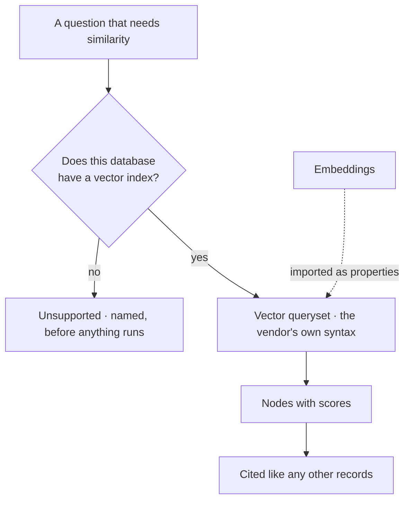

# Vector search

Similarity search where the database has a vector index — as a queryset like any other, declared
unsupported where it does not exist.

| | |
|---|---|
| Index | [12.4](../../../README.md#12--graph-connectors) · Slice **S7** |
| Module | [Graph connectors](../spec.md) |
| API / CLI / Studio | 🔵 / — / 🔵 |
| Related | [capabilities](capabilities.md) · [the-connector-contract](the-connector-contract.md) · [recall-by-query](../../memory/features/recall-by-query.md) |

> **As** someone whose graph holds text, **I want** to find the nodes most like a phrase, **so that**
> a question can start from meaning and end in records I can cite.

## Capabilities

| # | Capability | Notes |
|---|---|---|
| C1 | A queryset, not a subsystem | Same contract as reading, writing and schema |
| C2 | Uses the database's own index | No vector store beside the graph |
| C3 | Declared per vendor | Memgraph has no vector search; that is marked, not discovered |
| C4 | Reported as a capability | Authoring and planning both know whether it exists |
| C5 | Results are records | Nodes with scores — citable, and resolvable to their provenance |
| C6 | A step, when planned | Reached like any other query step, and shown in the trace |
| C7 | Embeddings arrive with the data | Produced upstream and imported as properties |

## Journey

## Seams

| Seam | What the user sees |
|---|---|
| No index on the property | Refused, naming the property and the index it needs |
| Vendor without vector support | Declared unsupported, with the vendor named |
| Embeddings missing | Zero results, worded as "nothing embedded", not as "nothing similar" |
| Dimension mismatch | Refused at query time with both dimensions named |

## Engine

| Thing | Shape |
|---|---|
| Vector queryset | in each language connector, overridden per vendor where syntax differs |
| Unsupported marker | on the method; the caller gets a refusal with a reason |
| Capability | reported alongside property types and features |

## Decisions

| # | Decision |
|---|---|
| VS1 | Vector search uses the database's own index; Invana ships no vector store. |
| VS2 | It is a queryset, under the same contract as everything else. |
| VS3 | Where a vendor lacks it, that is declared, not discovered at runtime. |
| VS4 | Embeddings are produced upstream and imported as data. |

## Not building

| Not building | Because |
|---|---|
| A separate vector database | two stores means two truths and a sync problem |
| Generating embeddings in the engine | that is a pipeline job, and Invana is a destination |
| Hybrid ranking across vector and graph scores | a ranking nobody can explain is not an answer |
