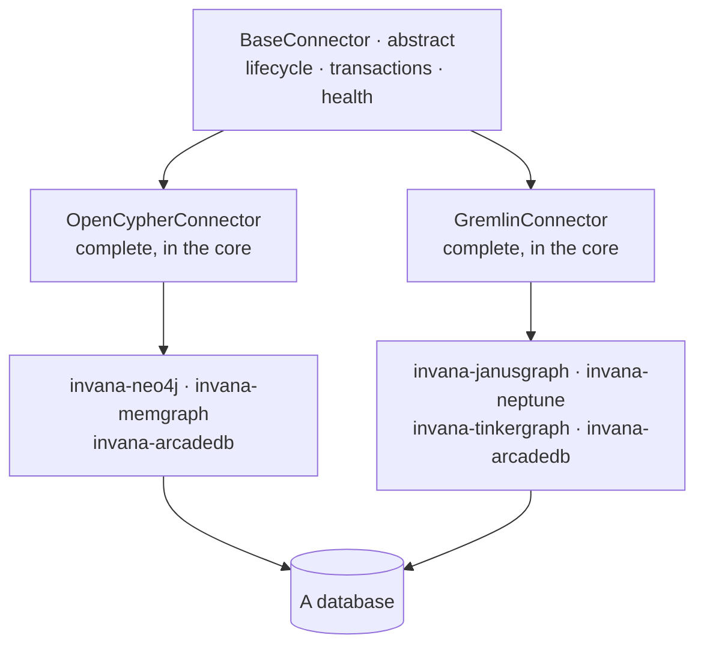

# Graph connectors — module spec

How Invana speaks to a **graph database**, and how someone adds one. The engine knows two **query
languages**, not six vendors; each vendor is a small package that supplies a driver and overrides only
what the standard language cannot express.

The qualifier is deliberate. A *graph connector* binds a Graph to the database it reasons over. It is
not a source connector — nothing here reaches out to a mailbox, a bucket or an API to pull data in.
That word stays free.

| | |
|---|---|
| Index | [§12 · Graph connectors](../../README.md#12--graph-connectors) |
| Features | [the-connector-contract](features/the-connector-contract.md) · [languages](features/languages.md) · [capabilities](features/capabilities.md) · [vector-search](features/vector-search.md) |
| Depends on | — |
| Drawn in | **nothing.** One of the two modules the [index](../../README.md#how-a-module-gets-built) lists as not drawn — it ships from its feature files alone, and a module pass here has no artboards to reconcile |
| Depended on by | [Connect and model](../connect-and-model/spec.md) (the binding) · [Ask](../ask/spec.md) (execution) · [Bring data in](../bring-data-in/spec.md) (writes) |

## 1. Vocabulary

Product-wide words: [terminology.md](../../terminology.md). What this module adds:

| Noun | Is | Is not |
|---|---|---|
| **Graph connector** | the object that speaks to one graph database, over one driver | a source connector, or the connection row |
| **Language connector** | a complete implementation in one query language | an abstract base |
| **Integration package** | `invana-<db>` — a driver plus what the language cannot express | a plugin |
| **Queryset** | one area of work — reading, writing, schema, algorithms, vector | a repository |
| **Capability** | what this server version can actually do | a feature flag |

## 2. Three layers, and where each lives

| Layer | Ships in | Holds |
|---|---|---|
| Base | core | lifecycle, transactions, health, the queryset contracts |
| Language | core | a **working** implementation in standard openCypher or Gremlin |
| Integration | `invana-<db>` | overrides only where the **vendor** falls short — a driver the reference one cannot replace, a schema dialect, an algorithm library, a vector index. The four required methods are already satisfied by the language connector above it |

**The language connectors are not abstract.** They work as they are. An integration exists to supply a
driver and to reach for something vendor-native — a graph algorithm library, a schema DDL dialect, a
vector index — not to reimplement reading and writing.

## 3. Rules that keep the core clean

| Rule | Detail |
|---|---|
| The core knows no vendor | No branching on database name, anywhere above this module |
| The core carries two drivers, not six | One reference driver per language — `neo4j` for openCypher, `gremlinpython` for Gremlin. A **vendor** driver ships in its own package, and only when the reference driver cannot reach that server |
| Two languages, not six vendors | Neo4j and Memgraph share ~80% of their query logic; that shared part is written once |
| Everything is async | Queryset methods are `async`; there are no sync wrappers to maintain |
| Pooling is the driver's, lifecycle is ours | The driver owns the TCP pool; connect, disconnect, health and reconnection belong to the engine |
| Unsupported is declared, not discovered | A vendor that cannot do something says so, and the caller gets a refusal rather than an error from the wire |

## 4. Querysets

One connector, several areas of work, each with its own contract:

| Queryset | Covers |
|---|---|
| Data reader | vertices and edges, filtered, paged |
| Data writer | creates, updates, deletes, and bulk paths |
| Schema | labels, relationship types, property keys, constraints, indexes |
| Algorithms | what the vendor's algorithm library exposes |
| Vector | similarity search where the database has a vector index |

Filters are a structured group — a nested AND / OR of conditions — not a string. The query builder
turns them into the target language, so the caller never assembles syntax.

## 5. What this module owns

| Owns | Shape |
|---|---|
| `BaseConnector` | lifecycle, transactions, health, context-manager support |
| Language connectors | complete openCypher and Gremlin implementations |
| Queryset contracts | the five areas above |
| Query builder | structured filters → the target language |
| Serializers | driver records → the engine's own vertex and edge shapes |
| Capability reporting | what this server version can do — [capabilities](features/capabilities.md) |
| Lens compilation | a `QueryLens` composed, projected and checked into the target language — [the-connector-contract](features/the-connector-contract.md) |

## 6. Cross-feature decisions

| # | Decision |
|---|---|
| CN1 | The engine knows query languages; integrations know vendors. |
| CN2 | Language connectors are complete implementations, not abstract bases. |
| CN3 | **The core carries one reference driver per language, and no vendor driver.** `neo4j` and `gremlinpython` are what make a language connector *complete* rather than abstract (CN2) — without them there is no working implementation to inherit, and every integration would rewrite the same four methods. Six vendors still mean two drivers. |
| CN4 | Everything is async; no sync wrappers. |
| CN5 | Connection pooling belongs to the driver; lifecycle belongs to the engine. |
| CN6 | An unsupported operation is declared by the integration and refused with a reason. |
| CN7 | Filters are structured and compiled, never concatenated. |
| CN8 | **A lens is enforced here, at execution, or it is not enforced.** The predicate is composed into the query the database runs and the projection is rewritten to the permitted properties — never filtered out of the rows that came back. Filtering afterwards leaves the counts, the aggregates and the schema the generating model saw all outside the bound ([govern § 2](../govern/spec.md)). |
| CN9 | **A lens is compiled per language, never per vendor** — the same rule as CN1. `cypher/lens.py` and `gremlin/lens.py` sit beside their query builders, and an integration inherits enforcement without writing a line of it. |
| CN10 | **Under a lens, unreadable is refused.** A query whose shape the compiler cannot bound does not execute. Everywhere else in this module an unknown is passed through to the driver; here it is not, because a bound that fails open is not a bound. |
| CN11 | **A selector is a `FilterGroup`, not a second filter language.** The extensional grain reuses the structured filter CN7 already compiles — the one place this module turns a condition into a dialect. |

## 7. Deliberately absent

| Not built | Because |
|---|---|
| An ORM-style query DSL | traversals, paths and algorithms do not fit a relational-shaped API; a structured filter plus raw query is more honest |
| A plugin registry for querysets | the set of databases is known; subclassing is simpler to debug and types resolve |
| All connectors inside the core | it would force every driver on every install |
| A sync API alongside the async one | it doubles the surface, and the CLI can run the event loop |
| A Python fallback for graph algorithms | the target databases have native libraries; a fallback is a dependency surface with no user asking for it |
| A query grammar for either language | the lens compiler reads the shapes the product generates and refuses the rest. A grammar is a dependency that has to track every vendor's dialect, and fail-closed is what makes a reader sufficient ([CC10](features/the-connector-contract.md)) |
| Post-filtering a result against a lens | CN8. It is a display filter wearing a bound's name |
