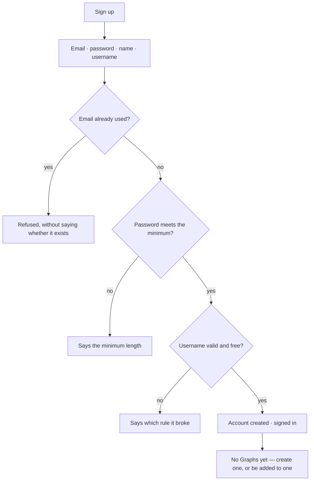

# Accounts

Sign up, sign in, and the profile behind them. Email is the login identity; everything else about a
person is small on purpose.

| | |
|---|---|
| Index | [11.1](../../../README.md#11--identity-and-access) · Slice **S1** |
| Module | [Identity and access](../spec.md) |
| API / CLI / Studio | ✅ / — / ✅ |
| Related | [usernames](usernames.md) · [sessions](sessions.md) · [membership](membership.md) |

> **As** a new user, **I want** to create an account and get to work, **so that** setting up is a
> minute rather than an onboarding funnel.

## Capabilities

| # | Capability | Notes |
|---|---|---|
| C1 | Sign up with email, password, name | First name required, last name optional |
| C2 | Email is the login identity | Case-folded on write; unique |
| C3 | Passwords are hashed with bcrypt | Cost and minimum length are configuration, with sane defaults |
| C4 | A username is chosen at sign-up | It is the URL identity — [usernames](usernames.md) |
| C5 | Deactivate rather than half-delete | `is_active` gates sign-in; deletes are hard when they happen |
| C6 | Superuser is a flag | Platform administration only; it opens no Graph |
| C7 | Profile edits | Name and password; email and username have their own rules |

## Journey

## Seams

| Seam | What the user sees |
|---|---|
| Inactive account signing in | Refused, worded so it does not confirm the account exists |
| Password change | Existing refresh tokens are revoked; other devices sign out |
| No Graphs | An empty state that offers creating one, not an error |
| Superuser without membership | Platform admin works; a Graph's contents remain closed |

## Surfaces

| Surface | Shape |
|---|---|
| Sign up · sign in | Two fields plus name; no marketing steps in between |
| Profile | `/settings/profile` — a left nav of sections (Basic info · Appearance · Password · Access tokens · Danger zone) with the section's content beside it. Name and password live here; username and email are their own actions |
| Admin | Platform administration, gated by the superuser flag |

## Engine

| Thing | Shape |
|---|---|
| `users` | `email` · `username` · `password_hash` · `first_name` · `last_name?` · `is_superuser` · `is_active` · `username_last_changed_at` |
| Hashing | bcrypt, cost from configuration; verification is constant-time |
| Routes | `POST /auth/register` · `POST /auth/login` · `GET PATCH /auth/me` |
| Events | `user.registered · updated · password_changed` |

## Decisions

| # | Decision |
|---|---|
| AC1 | Email is the login identity and is unique, case-folded. |
| AC2 | Password rules are configuration with defaults, not hard-coded. |
| AC3 | A password change revokes existing sessions. |
| AC4 | Errors never confirm whether an account exists. |
| AC5 | Superuser is platform administration, never Graph access. |
| AC6 | The profile's sections are a **left nav**, not a tab strip, and the page is as wide as a reading column allows rather than the width of one form. Five labels do not fit a tab bar, and [Access tokens](personal-access-tokens.md) is a table that needs the width the strip was taking. |

## Not building

| Not building | Because |
|---|---|
| Email verification flows | not what stands between a user and value at this stage |
| Password reset by email | needs a mail path the product does not otherwise have |
| Profile avatars and bios | an account is an identity, not a profile page |
| SSO | a later decision, once someone needs it |
