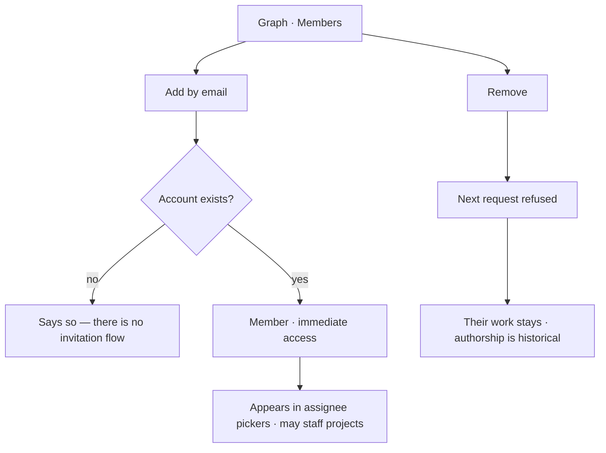

# Membership

You are a member of a Graph, or you are not. That single fact is the whole access model — everything
else that looks like a permission is an envelope or a criterion.

| | |
|---|---|
| Index | [11.4](../../../README.md#11--identity-and-access) · Slice **S1** |
| Module | [Identity and access](../spec.md) |
| API / CLI / Studio | ✅ / — / ✅ |
| Related | [sessions](sessions.md) · [projects-and-tasks](../../work/features/projects-and-tasks.md) · [envelope-and-budget](../../agents/features/envelope-and-budget.md) |

> **As** someone who owns a Graph, **I want** to add the people who work on it and nothing more,
> **so that** access is a list I can read rather than a matrix I have to maintain.

## Capabilities

| # | Capability | Notes |
|---|---|---|
| C1 | Add and remove members | By email; they must already have an account |
| C2 | Binary | No roles, tiers or per-surface permissions |
| C3 | The owner is a member | Their username is the Graph's URL namespace |
| C4 | Checked per request | Removal takes effect on the next call |
| C5 | Staffing follows membership | Being staffed on a project fills a picker; it grants nothing |
| C6 | Agents are not members | They are principals inside the Graph, bounded by an envelope |
| C7 | Every change is an event | Who added or removed whom, when |

## Journey

## Seams

| Seam | What the user sees |
|---|---|
| Removing the last member | Refused — a Graph without members is unreachable |
| Removing someone with open tasks | Their tasks stay, assigned, and the list says who is gone |
| Removed mid-session | The next request is refused; the UI says access changed |
| An agent "member" | Not a thing — agents are separate, and the panel says so |

## Surfaces

| Surface | Shape |
|---|---|
| Graph → Members | One list, add by email in the header, remove on the row |
| Assignee picker | Members and staffed agents |
| Activity | Membership changes alongside every other write |

## Engine

| Thing | Shape |
|---|---|
| `graph_members` | `graph_id` · `user_id` · `added_by` · `added_at` |
| Guard | membership resolved per request, never from a token claim |
| Routes | `…/members*` |
| Events | `member.added · removed` |

## Decisions

| # | Decision |
|---|---|
| MB1 | Membership is binary and is the permission. |
| MB2 | Membership is resolved per request. |
| MB3 | A Graph always has at least one member. |
| MB4 | Removing a member never removes their work or their authorship. |
| MB5 | Agents are principals, not members. |

## Not building

| Not building | Because |
|---|---|
| Roles and permission matrices | unproven complexity; the envelope and criteria carry the real limits |
| Invitations to people without accounts | an invitation flow is a product of its own |
| Per-project or per-canvas access | the Graph is the boundary that matters |
| Transferring ownership | the URL namespace is the owner's username; moving it is a rename problem |
