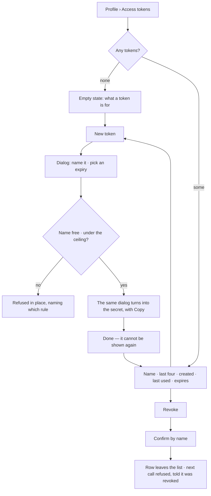
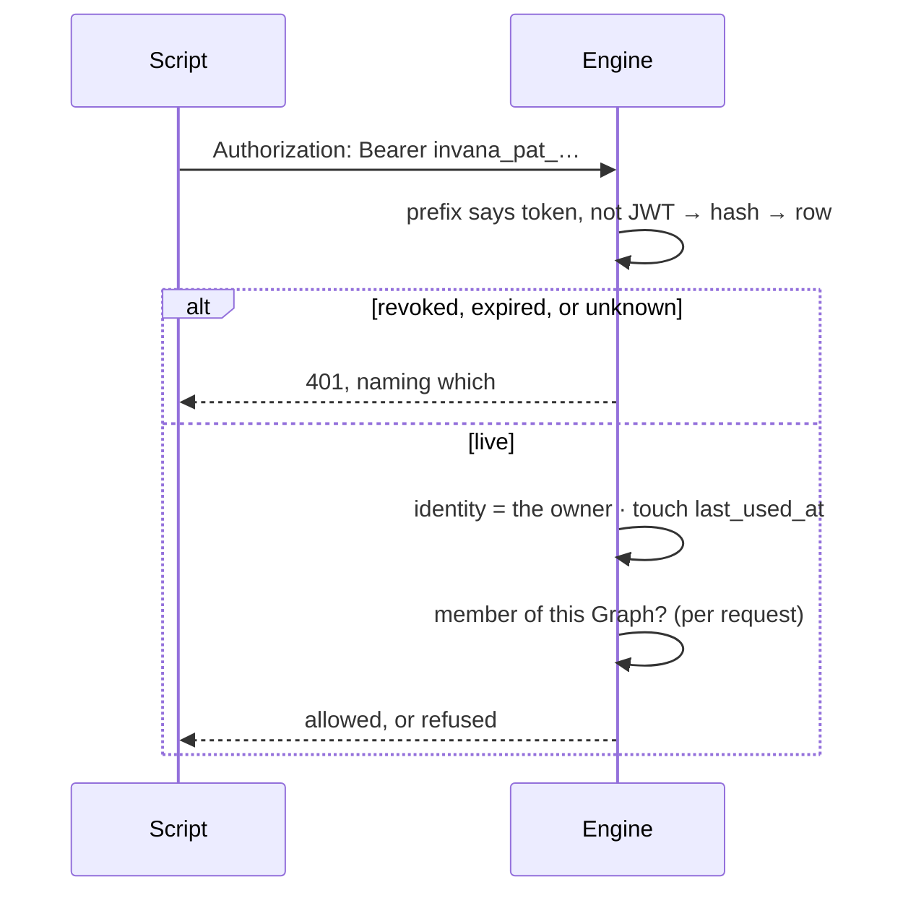

# Personal access tokens

A long-lived credential a person mints for themselves, so a script, a terminal or a CI job can call the
API as them without holding their password.

| | |
|---|---|
| Index | [11.5](../../../README.md#11--identity-and-access) · Slice **S1** |
| Module | [Identity and access](../spec.md) |
| API / CLI / Studio | ✅ / — / ✅ |
| Related | [sessions](sessions.md) · [accounts](accounts.md) · [membership](membership.md) · [external-agent-api](../../operate/features/external-agent-api.md) |

> **As** someone with a script that loads a dataset every night, **I want** a token I mint once and can
> revoke, **so that** automating against my Graphs is not a password in a cron file.

## What it is, and what it is not

A personal access token **carries identity, exactly as an access token does**. It is not a scope, not a
grant, and not a second permission system: the request resolves to the person who minted it, and
membership is looked up per request like every other request ([IA2](../spec.md#5-cross-feature-decisions)).
Revoking access to a Graph takes the token with it, at once.

| | Personal access token | Access token ([sessions](sessions.md)) | Graph token ([10.4](../../operate/features/external-agent-api.md)) |
|---|---|---|---|
| Owned by | a person | a session | a Graph |
| Lives | months, or until revoked | minutes | until revoked |
| Carries | identity | identity | a scope |
| Reaches | every Graph the person is a member of | the same | one Graph, the listed reads |
| Revoked by | the person, on their profile | signing out | the Graph |
| Built | now, S1 | S1 | S10 |

## Capabilities

| # | Capability | Notes |
|---|---|---|
| C1 | Mint a token from the profile | A name, and an expiry chosen from a short list |
| C2 | The secret is shown once | Only its sha256 hash is stored; there is no way to read it back |
| C3 | It acts as the person | Every Graph they are a member of, read and write — the same rights as their session |
| C4 | Membership is resolved per request | Removing someone from a Graph closes their token's way in immediately |
| C5 | Revoke, immediately | One row update; the next request is refused |
| C6 | Expiry is a choice, including never | The offer is `auth_token_expiry_day_choices` (30 · 90 · 365), plus never. Studio renders the picker from it |
| C7 | Last used is visible | So a token nobody uses can be recognised and revoked |
| C8 | A token cannot manage credentials | Minting, revoking, changing a password, deleting the account and provisioning a user all need a session |
| C9 | A ceiling on how many | `auth_max_personal_access_tokens`, default 20 — a named refusal, not a silent failure |
| C10 | The list carries what the deployment allows | `GET …/tokens` returns the rows, the expiry choices and the ceiling, so neither is restated in Studio |

## Journey

A call carrying one:

## Seams

| Seam | What the user sees |
|---|---|
| The secret dialog is dismissed | It is gone. The list says so, and offers minting another — never a way to reveal it |
| Token used after revocation | `401 Token revoked.` The attempt is recorded as `token.refused` |
| Token past its expiry | `401 Token expired.` The row stays in the list, marked **Expired**, until it is revoked — so the thing that stopped the script is visible, not missing |
| Owner deactivated or deleted | Refused with the account, not separately — `is_active` is checked as it is for a session, and the rows go with the user |
| Removed from a Graph | That Graph's routes refuse; the token still reaches the others |
| A token trying to mint a token | `403` naming the rule — credential management needs a session |
| Password changed | Tokens survive. A password change revokes **sessions** ([AC3](accounts.md#decisions)); a token is not a session, and a script should not break because a person rotated their password |
| Ceiling reached | Refused naming the ceiling and the count; revoke one, or reuse one |
| Token in a URL | Not accepted. The `?token=` SSE fallback takes access tokens only ([PT5](#decisions)) |

## Surfaces

| Surface | Shape |
|---|---|
| Profile › **Access tokens** | A section of `/settings/profile`, reached from its left nav beside Basic info · Appearance · Password · Danger zone ([AC6](accounts.md#decisions)) |
| The list | One row per token: name · `invana_pat_…abcd` · created · last used · expires · Revoke. Revoked rows are gone; expired ones stay, marked |
| At the ceiling | **New token** is disabled and the count says why; nothing is refused only after typing |
| New token | A dialog behind the **New token** button — name and expiry stacked, then the same dialog turns into the secret with Copy and a one-time warning ([PT10](#decisions)) |
| Revoke | Confirms by name, because the row is the only thing the person can still identify it by |
| Empty | `EmptyState` — what a token is for, and the button that mints the first one |

## Engine

| Thing | Shape |
|---|---|
| `personal_access_tokens` | `id` · `user_id` · `name` · `token_hash` (sha256, unique) · `last_four` · `expires_at?` · `last_used_at?` · `revoked_at?` · `created_at` |
| Secret | `invana_pat_` + `secrets.token_urlsafe(32)`. The prefix is what routes the credential and what a secret scanner matches |
| Name | Unique per user, 1–64 characters |
| Expiry | `auth_token_expiry_day_choices` — anything else is refused at validation, before the service sees it |
| Ceiling | `auth_max_personal_access_tokens`; the refusal names the ceiling and the current count |
| Resolution | The `Bearer` value starting `invana_pat_` is hashed and looked up; anything else is decoded as a JWT |
| `last_used_at` | Touched at most once a minute per token, so a busy script is not a write per request |
| Routes | `GET · POST /api/v1/auth/me/tokens` · `DELETE /api/v1/auth/me/tokens/{id}` (revokes) |
| `GET …/tokens` | `{ tokens, expiry_day_choices, max_tokens }` — the rows plus what this deployment allows |
| Session-only routes | `…/me/tokens*` · `POST /auth/me/password` · `DELETE /auth/me` · `POST /auth/register` |
| Events | `token.create` · `token.revoke` · `token.refused` (with the reason; never the secret) |

## Decisions

| # | Decision |
|---|---|
| PT1 | A personal access token carries identity, not scope. It reaches every Graph its owner is a member of, and membership is resolved per request. |
| PT2 | Only the sha256 hash is stored. The secret is returned once, at creation, and cannot be read back. |
| PT3 | The secret carries the fixed prefix `invana_pat_`, so the engine routes the credential without attempting a JWT decode and a scanner can recognise a leak. |
| PT4 | Credential management needs a session: a request authenticated by a token may not mint or revoke tokens, change a password, delete an account, or provision a user. |
| PT5 | A token is accepted in the `Authorization` header only. The `?token=` SSE fallback stays an access-token path, so a long-lived secret never lands in a URL, a log or a referrer. |
| PT6 | A password change revokes sessions and leaves tokens alone. Revoking a token is its own, explicit action. |
| PT7 | Expiry is chosen at creation, from the offer the deployment configures in `auth_token_expiry_day_choices`, or never. An expired row is refused and stays in the list, marked, until its owner revokes it — so the list still explains what stopped working. |
| PT8 | `last_used_at` is the only usage record on the row; use is not an event. Refusals are, because a refusal is a signal. |
| PT9 | Revocation is a stamp, not a delete. The row leaves the person's list, and a call made with the secret afterwards is told it was revoked rather than that it never existed. |
| PT10 | Creating is a dialog behind **New token**, not a form standing above the list — the section is a list of what you hold. The dialog is one dialog in two states: the form, then the secret it produced, so nobody dismisses a form to be handed the thing they came for. |

## Not building

| Not building | Because |
|---|---|
| Scopes, per-Graph tokens, read-only tokens | membership is the permission ([IA1](../spec.md#5-cross-feature-decisions)); a scoped credential is [10.4](../../operate/features/external-agent-api.md), owned by a Graph |
| Showing the secret again | a secret that can be read back is a stored password |
| Rotation, and expiry reminders by email | revoke and mint is the whole of rotation, and the product has no mail path |
| Per-token rate or cost ceilings | a token is its owner; their ceilings already apply. A ceiling of its own is [10.4](../../operate/features/external-agent-api.md)'s |
| An `invana` CLI for minting | the profile mints it, and the caller pastes it into its own configuration |
