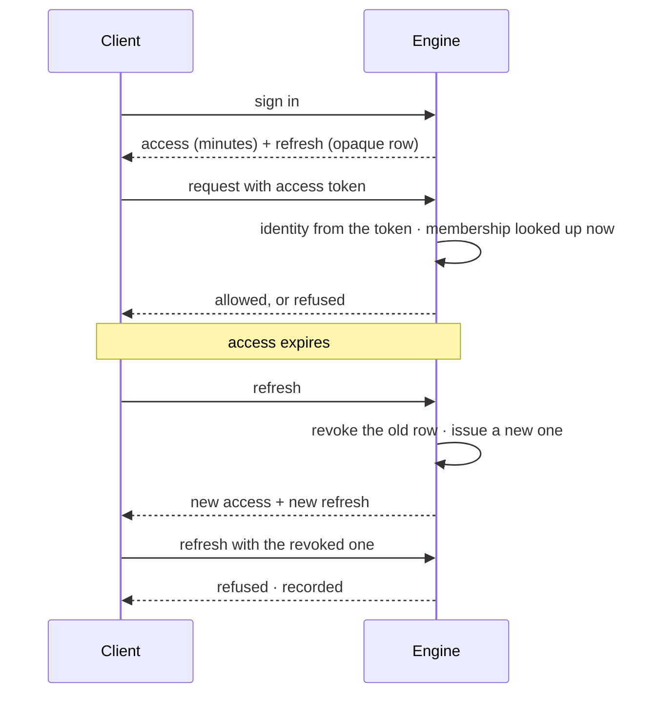

# Sessions

A short-lived access token for every request, and an opaque refresh token that can be revoked in one
database write.

| | |
|---|---|
| Index | [11.3](../../../README.md#11--identity-and-access) · Slice **S1** |
| Module | [Identity and access](../spec.md) |
| API / CLI / Studio | ✅ / — / ✅ |
| Related | [accounts](accounts.md) · [personal access tokens](personal-access-tokens.md) · [external-agent-api](../../operate/features/external-agent-api.md) |

> **As** someone signed in on two machines, **I want** to be able to sign one of them out, **so that**
> losing a laptop is not a password change and a prayer.

## Capabilities

| # | Capability | Notes |
|---|---|---|
| C1 | Short-lived access token | Minutes, from configuration |
| C2 | Opaque refresh token | A server-side row, not a JWT — revocation is a write |
| C3 | Rotation on refresh | The old row is revoked as the new one is issued |
| C4 | Reuse of a revoked refresh is a signal | Refused, and recorded |
| C5 | The token carries identity only | Not membership, not the username |
| C6 | Membership is resolved per request | So removing someone takes effect at once |
| C7 | Sign-out revokes | This device, or all of them |
| C8 | A password change revokes everything | Every other session ends |

## Journey

## Seams

| Seam | What the user sees |
|---|---|
| Access expired mid-action | Refreshed transparently; the action completes |
| Refresh expired | Signed out, told why, and returned to where they were afterwards |
| Removed from a Graph while working | The next request is refused; the UI says access changed |
| Signed out everywhere | Every device returns to sign-in on its next request |
| Clock skew | Tolerated within a small window, then refused |
| Lands on sign-in while still signed in | The page proves the stored session and redirects to `?next=` — it shows "Restoring your session…", never the password form |
| Stored session no longer valid | The stored tokens are dropped and the sign-in form appears |

## Surfaces

| Surface | Shape |
|---|---|
| Sign-in | Sets both tokens; the refresh is not exposed to page scripts more than it must be |
| Sign-in, already signed in | Resumes first: `GET /auth/me` (rotating the access token if it expired), then redirects to `?next=` |
| Profile → Sessions | Sign out here, or everywhere |
| Every request | Identity resolved, membership checked |

## Engine

| Thing | Shape |
|---|---|
| Access token | signed, short TTL, claims: subject and the superuser flag |
| `refresh_tokens` | opaque value, owner, issued/expiry, revoked flag |
| Rotation | one transaction: revoke old, issue new |
| Routes | `POST /auth/login · /auth/refresh · /auth/logout` |
| Events | `session.started · refreshed · revoked · reuse_detected` |

## Decisions

| # | Decision |
|---|---|
| SS1 | Access tokens are short-lived and carry identity only. |
| SS2 | Refresh tokens are opaque server-side rows, so revocation needs no denylist. |
| SS3 | Every refresh rotates. |
| SS4 | Reuse of a revoked refresh token is refused and recorded. |
| SS5 | Membership is checked per request, never cached into a token. |
| SS6 | Reaching the sign-in page with a stored session resumes it instead of asking again: Studio verifies it with `GET /auth/me` and redirects to `?next=`. A stored session that fails verification is cleared. |
| SS7 | `?next=` is followed only when it is an in-app absolute path. `//host`, `/\host` and any absolute URL land on the app root — a resumed session follows the parameter with no click, so it cannot be a redirect out of Studio. |
| SS8 | Only `/auth/login`, `/auth/refresh` and `/auth/logout` skip the client's 401 refresh-and-retry. Every other authenticated route, `/auth/me` included, rotates an expired access token underneath the caller. |

## Not building

| Not building | Because |
|---|---|
| A JWT denylist | rotation plus a server-side row is simpler and exact |
| Long-lived tokens for convenience | a session stays short. A person who needs one mints a [personal access token](personal-access-tokens.md); a third party gets a scoped one from a Graph ([10.4](../../operate/features/external-agent-api.md)) |
| Device fingerprinting | a session list is enough to act on |
