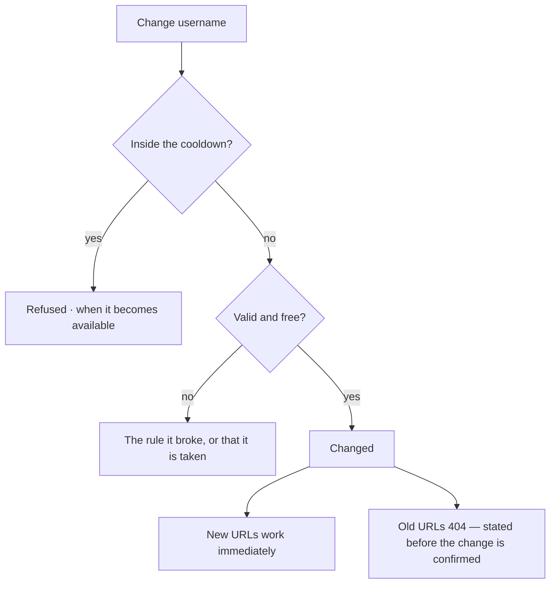

# Usernames

The username is an **address**: `/u/<username>/<graphSlug>/…`. It can change, rarely, and old
addresses do not forward.

| | |
|---|---|
| Index | [11.2](../../../README.md#11--identity-and-access) · Slice **S1** |
| Module | [Identity and access](../spec.md) |
| API / CLI / Studio | ✅ / — | ✅ |
| Related | [accounts](accounts.md) · [membership](membership.md) |

> **As** someone sharing a link to my Graph, **I want** a stable, readable address, **so that** the
> URL means something and keeps working.

## Capabilities

| # | Capability | Notes |
|---|---|---|
| C1 | Lowercase, digits and hyphens | 2–64 characters |
| C2 | No leading, trailing or consecutive hyphens | Refused with the rule named |
| C3 | Globally unique, case-insensitively | Stored lowercase |
| C4 | The `/u/` prefix isolates the namespace | So only `u` itself is reserved |
| C5 | Changeable, with a cooldown | Once per configured window, default thirty days |
| C6 | Old usernames are not aliased | Previous URLs 404 rather than silently forwarding |
| C7 | Not carried in the token | A token outlives a username change |

## Journey

## Seams

| Seam | What the user sees |
|---|---|
| A shared old link | 404, not a redirect that hides the rename |
| Reserved word | Only `u` is reserved; everything else is available |
| Changing twice quickly | Refused, with the date it unlocks |
| Uppercase entered | Folded to lowercase, and the field shows what will be saved |

## Surfaces

| Surface | Shape |
|---|---|
| Profile → Username | The field, the rules, the cooldown state, and a warning about old links |
| Every graph-scoped URL | `/u/<username>/<graphSlug>/…` |

## Engine

| Thing | Shape |
|---|---|
| Validation | `^[a-z0-9](?:[a-z0-9-]{0,62}[a-z0-9])?$`, plus no consecutive hyphens |
| Cooldown | `username_last_changed_at` against a configured window |
| Routes | `PATCH /auth/me` — refuses inside the cooldown |
| Events | `user.username_changed` |

## Decisions

| # | Decision |
|---|---|
| UN1 | The username is a URL identity, not a display name. |
| UN2 | Changes are rate-limited by configuration. |
| UN3 | Old usernames are never aliased or redirected. |
| UN4 | The username is not carried in a token. |
| UN5 | Only `u` is reserved, because the prefix isolates the namespace. |

## Not building

| Not building | Because |
|---|---|
| Redirects from old usernames | an address that forwards silently hides a rename |
| Reserved-word lists | the `/u/` prefix makes them unnecessary |
| Display names separate from usernames | one name, one address, less to explain |
