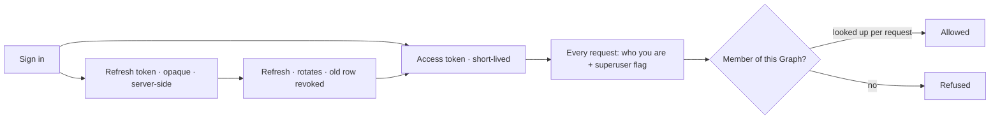

# Identity and access — module spec

Who you are, how you stay signed in, and which Graphs you can reach. Deliberately small: an account, a
username that is also a URL, a session that can be revoked, and membership that is binary.

| | |
|---|---|
| Index | [§11 · Identity and access](../../README.md#11--identity-and-access) |
| Features | [accounts](features/accounts.md) · [usernames](features/usernames.md) · [sessions](features/sessions.md) · [membership](features/membership.md) · [personal access tokens](features/personal-access-tokens.md) |
| Depends on | — |
| Depended on by | everything: every request resolves to a principal |

## 1. Vocabulary

Product-wide words: [terminology.md](../../terminology.md). What this module adds:

| Noun | Is | Is not |
|---|---|---|
| **Account** | a person, identified by email | a seat |
| **Username** | the URL identity — `/u/<username>/<graphSlug>/…` | a display name |
| **Session** | an access token plus a revocable refresh token | a login row |
| **Personal access token** | a long-lived credential a person mints for a script, carrying their identity | a scope, or a second permission system |
| **Member** | someone with access to a Graph | a role |
| **Superuser** | platform administration, outside any Graph | a Graph admin |

## 2. Membership is binary

| Rule | Detail |
|---|---|
| You are a member of a Graph, or you are not | There are no roles, tiers or per-surface permissions |
| Membership is the permission | Staffing a project, being assigned a task and running an agent all follow from it |
| The owner is a member who created it | Ownership decides the URL namespace, not extra rights |
| Superuser is separate | It is platform administration, and never a way into someone's Graph |

Anything finer — approvals, read-only members, per-project access — is unproven complexity and is not
built. What looks like a permission question is usually an **envelope** question (what an agent may
run) or a **criterion** question (what "done" means).

## 3. What this module owns

| Owns | Shape |
|---|---|
| `users` | `email` (login, case-folded) · `username` · `password_hash` · `first_name` · `last_name?` · `is_superuser` · `is_active` · `username_last_changed_at` |
| `refresh_tokens` | opaque, server-side, revocable, rotated on use |
| `personal_access_tokens` | hashed, server-side, revocable, never rotated — [11.5](features/personal-access-tokens.md) |
| `graph_members` | `graph_id` · `user_id` — the whole access model |
| Auth routes | `/api/v1/auth/*`; everything else is graph-scoped under `/api/v1/u/{username}/{graphSlug}/…` |
| The superuser flag | what the admin application checks — the application itself is [13.6](../platform/features/admin-and-health.md) |

## 4. What a token carries

| Rule | Detail |
|---|---|
| The token carries identity only | Not membership, and not the username — both can change while a token lives. A [personal access token](features/personal-access-tokens.md) carries the same thing, for longer |
| Membership is checked per request | So revoking access takes effect immediately |
| The refresh token is not a JWT | It is a server-side row, so revocation is a database update rather than a denylist |
| Rotation on every refresh | A reused old refresh token is a signal, not a convenience |

## 5. Cross-feature decisions

| # | Decision |
|---|---|
| IA1 | Membership is binary. There are no roles. |
| IA2 | Access tokens carry identity and the superuser flag; membership is resolved per request. |
| IA3 | Refresh tokens are opaque, server-side and rotated on use. |
| IA4 | The username is a URL identity and is mutable, rate-limited, and never aliased. |
| IA5 | Deletes are hard; there is no soft-delete tier for accounts. |
| IA6 | Superuser is platform administration and grants no access to a Graph's contents. |
| IA7 | The admin application browses app state for operators. It is not a product surface, and it is never how a member reaches their own Graph. |
| IA8 | Every credential this module issues carries identity and nothing else. A long-lived one is a personal access token, revocable on its own; a scoped one belongs to a Graph, and is [10.4](../operate/features/external-agent-api.md). |
| IA9 | Credential management needs a session. A request authenticated by a personal access token cannot mint or revoke one, change a password, delete an account or provision a user. |

## 6. Deliberately absent

| Not built | Because |
|---|---|
| Roles, permission levels, per-surface access | membership is the permission; anything finer is unproven |
| Invitations | a member is added directly; an invitation flow is a product of its own |
| Old-username aliases and redirects | a username is an address, and addresses that silently forward hide mistakes |
| SSO and OAuth providers | email and password first; a provider is a later decision |
| Admin as a product surface | it exists so an operator can inspect state without writing SQL, not as a way around the product |
| Soft deletes, trash, undo | archive covers the real need for Graphs; accounts delete outright |
