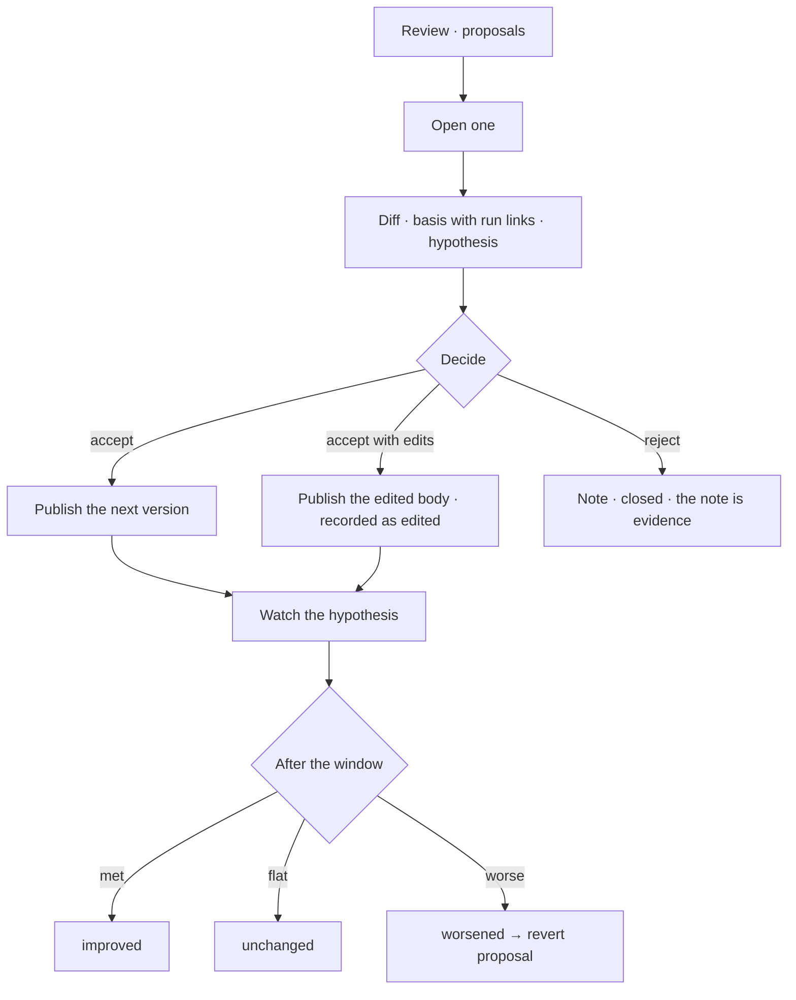

# Consolidation

The human half of the loop: accept, edit or reject a proposal in Review — and then watch whether the
change did what it promised.

| | |
|---|---|
| Index | [8.4](../../../README.md#8--memory) · Slice **S12c** |
| Module | [Memory](../spec.md) |
| API / CLI / Studio | 🔵 / — / 🔵 |
| Related | [proposals](proposals.md) (what arrives) · [evidence](evidence.md) (what it is measured against) · [review](../../work/features/review.md) |

> **As** the person responsible for the setup, **I want** one place where suggested changes wait for
> me with their evidence, **so that** improving it is a review rather than a project.

## Capabilities

| # | Capability | Notes |
|---|---|---|
| C1 | Proposals queue in Review | Between questions and results — they wait, they do not block |
| C2 | Three decisions | Accept · accept with edits · reject with a note |
| C3 | Accepting publishes | The next version of the skill, rule, workflow, template — or the criterion's next revision |
| C4 | Edits are recorded | The published body, and the fact that a person changed it |
| C5 | Rejection needs a note | It is evidence about the detector as much as the proposal |
| C6 | The hypothesis is watched | After acceptance, the triggering metric is measured against what was predicted |
| C7 | Outcome is written back | `improved · unchanged · worsened`, on the version |
| C8 | Worsened opens a revert | An ordinary proposal, reviewed the same way |

## Journey

## Seams

| Seam | What the user sees |
|---|---|
| Nothing to consolidate | An empty queue that says the setup is behaving |
| A stale proposal | Refused on accept, showing the base it was raised against and the current one |
| Many proposals at once | Ranked by the size of the evidence, not by age |
| A rejected pattern recurring | The detector's own signal — repeated rejections are visible |
| Accepted but never measured | Flagged: the window passed with too few runs to judge |

## Surfaces

| Surface | Shape |
|---|---|
| Review | Proposals in the middle band of the queue |
| Proposal card | Diff · basis · hypothesis · the three actions |
| Version history | On the artefact: what proposed each version, and how it fared |

## Engine

| Thing | Shape |
|---|---|
| Decision | writes `status`, `decided_by`, `note`, and publishes the version or revision |
| Watch | the hypothesis metric, re-derived from the record after the window |
| Routes | `POST …/proposals/{id}/{accept,reject}` |
| Events | `proposal.accepted · rejected · outcome_recorded` |

## Decisions

| # | Decision |
|---|---|
| CN1 | Every change to a skill, rule, workflow, template or criterion passes through a person. |
| CN2 | A rejection carries a note. |
| CN3 | Acceptance starts a measurement against the stated hypothesis. |
| CN4 | An unmeasurable improvement is reported as unmeasured, not as success. |
| CN5 | A worsened outcome opens an ordinary revert proposal — nothing rolls back by itself. |

## Not building

| Not building | Because |
|---|---|
| Bulk accept | a diff a person did not read is not a decision |
| Auto-accept for low-risk changes | risk is exactly what the person is judging |
| Silent rollback on a worse outcome | reverting is a change, and changes are reviewed |
