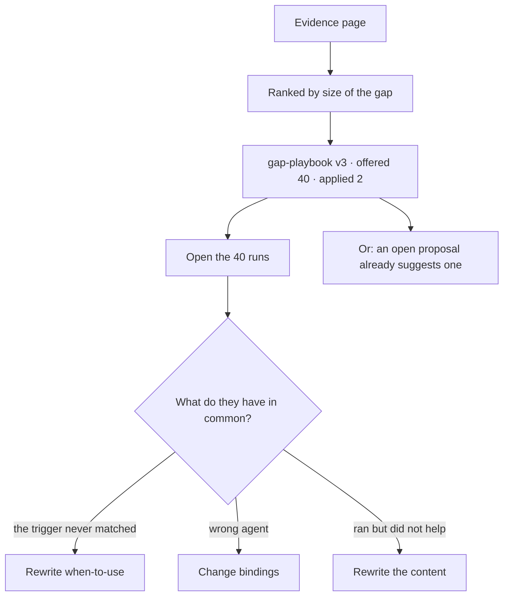

# Evidence

What the record says about how well things are working: skills offered versus applied, plans that
served, criteria that are never met, rules nothing cites. Counted, never scored.

| | |
|---|---|
| Index | [8.1](../../../README.md#8--memory) · Slice **S12c** |
| Module | [Memory](../spec.md) |
| API / CLI / Studio | 🔵 / — / 🔵 |
| Related | [proposals](proposals.md) (what evidence triggers) · [usage](../../skills/features/usage.md) |

> **As** someone responsible for a setup that runs by itself, **I want** the numbers that say what is
> failing quietly, **so that** I am fixing the right thing.

## Capabilities

| # | Capability | Notes |
|---|---|---|
| C1 | Skill gap | Offered versus reported applied, per version, per agent |
| C2 | Plan performance | How often each workflow version's Verify step passed |
| C3 | Criterion outcomes | Met · unmet · not-applicable across tasks |
| C4 | Rule citation | Which rules are cited, and which never are |
| C5 | Refusal counts | Which envelope bounds refuse plans, and how often |
| C6 | Failure shapes | Which step fails, with which diagnosis, how often |
| C7 | Every number links to its runs | A count that cannot be opened is not evidence |
| C8 | Windowed | Last 7 · 30 · 90 days, stated on every figure |

## Journey

## Seams

| Seam | What the user sees |
|---|---|
| Not enough runs | "12 runs — too few to read" rather than a misleading percentage |
| A new version | Counts restart, and the previous version's are kept beside them |
| Purged window | The counts stand; the run links say the payloads are gone |
| Nothing wrong | An empty page that says so, not a dashboard of zeroes |

## Surfaces

| Surface | Shape |
|---|---|
| Evidence page | One list, ranked by gap, filtered by kind |
| On the artefact | The same numbers on the skill, workflow, rule or criterion itself |
| Review | Where evidence has become a proposal |

## Engine

| Thing | Shape |
|---|---|
| Source | `task_runs` · `criterion_outcomes` · plan verdicts · refusal records |
| Derivation | computed on read, windowed; no accumulator to drift |
| Routes | `GET …/evidence` · `GET …/evidence/{kind}/{id}` |

## Decisions

| # | Decision |
|---|---|
| EV1 | Evidence is derived from the record on read. There is no statistics store. |
| EV2 | Every figure links to the runs behind it. |
| EV3 | Windows are stated, always. |
| EV4 | Counts, not scores — a score invites optimising the score. |
| EV5 | Too few runs is said plainly rather than shown as a percentage. |
| EV6 | **Evidence is a page reached from the Skills drawer, not a `leftNav` item.** It is read *about* an artefact — a skill, a rule, a plan, a criterion — so it opens from the drawer that lists them and from the artefact itself, and the same numbers appear on both. A rail item would make a reading into a place, and the rail is eleven items already ([G39](../../../building-studio/graph-detail-page.md)). Drawn as `Evidence` on [The Undrawn Features](https://claude.ai/artifact/26QSEwgdJh6xiHr3xJJ4Wn). |
| EV7 | **A gap is read next to what the runs share, never alone.** The number opens the runs, and the panel beside it states what they have in common — *37 of the 40 never matched the trigger* — because the count says something is wrong and only the shared shape says what to change. |

## Not building

| Not building | Because |
|---|---|
| Agent leaderboards | ranking agents optimises for the ranking |
| Predictive quality models | the point is a number you can open |
| Alerting on thresholds | detectors open proposals; alerts belong to operations |
