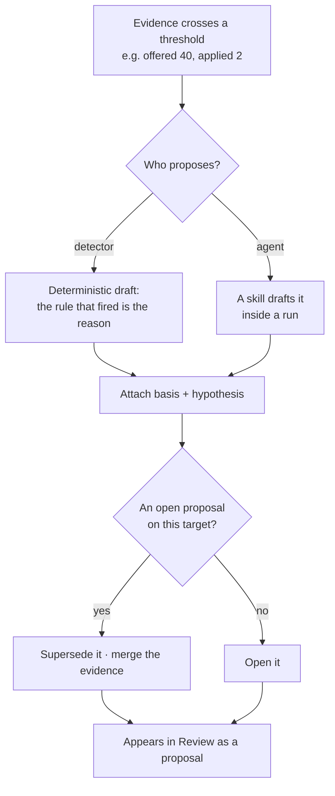
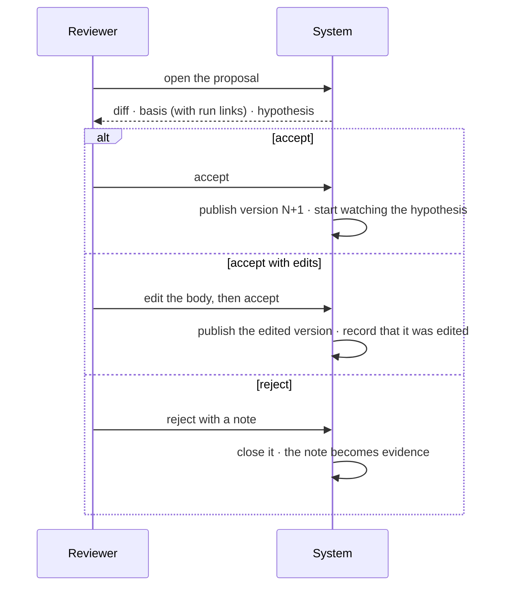
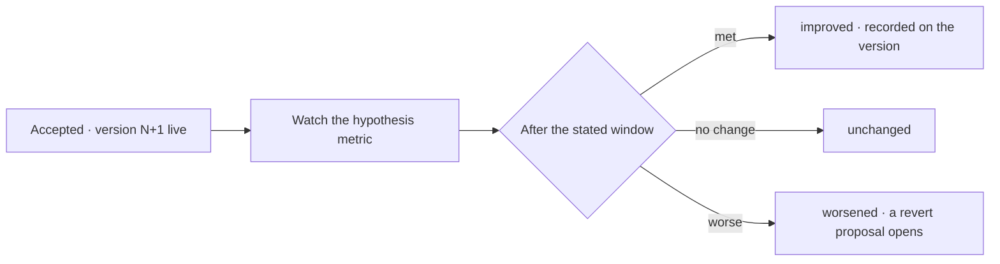

# Proposals

The system watches what happened, notices that something is not working, and **proposes a new version
of it** — a skill, a workflow, an agent's bindings, a rule, a criterion, a projection template. The
proposal carries its evidence and a diff. A person accepts or rejects it in [Review](../../work/features/review.md).
Accepting publishes the next version; rejecting is itself recorded.

| | |
|---|---|
| Index | [8.3](../../../README.md#8--memory) · Slice **S12c** |
| Module | [Memory](../spec.md) |
| API / CLI / Studio | 🔵 / — / 🔵 |
| Related | [evidence](evidence.md) (what triggers one) · [consolidation](consolidation.md) (what happens after) · [review](../../work/features/review.md) (where it is seen) |

> **As** someone running agents, **I want** the system to tell me which skill, plan or rule is failing
> and show me a fix I can accept, **so that** the setup improves from what actually happened rather
> than from my memory of it.

## 1. What this is, and is not

| | |
|---|---|
| **Is** | a closed loop: act → measure → propose a versioned change → a person decides → measure again |
| **Is not** | reinforcement learning. No weights are trained, no reward is optimised. The artefacts that change are text and configuration a person can read and edit |

The distinction is not pedantry. Training would make the improvement opaque and unattributable, which
breaks the one claim the product rests on. A proposal is legible: it names the evidence, shows the
diff, and has an author.

## 2. What can be proposed

| Target | A proposal looks like | Triggered by |
|---|---|---|
| **Skill** | rewrite `when_to_use`, rewrite `content`, split into two, retire | offered often, applied rarely — or applied and the run still failed |
| **Workflow** | promote a plan, change a step's arguments, retire a version | a plan that keeps serving, or a template that keeps being abandoned |
| **Agent binding** | bind a skill, unbind one | a skill applied well by a peer agent that this one never had |
| **Agent envelope** | *tighten* a bound | steps repeatedly refused, or budget never approached |
| **Rule** | add, rewrite, deactivate | never cited across many runs, or cited in every failure |
| **Criterion** | rewrite, drop, add a check | never met, or always met without ever being looked at |
| **Projection template** | promote, adjust columns | readers keep switching away from the default |

## 3. Capabilities

| # | Capability | Notes |
|---|---|---|
| C1 | A proposal names its evidence | Row-level: which runs, which counts, over what window. No "this seems better" |
| C2 | A proposal is a **diff against a version** | Old → new, rendered field by field |
| C3 | A proposal has an author | A detector (deterministic threshold) or an agent (a skill drafted it), recorded as a principal |
| C4 | A proposal carries a **hypothesis** | "applied rate should exceed 40% within 20 offers" — so acceptance can be judged later |
| C5 | Accepting publishes version N+1 | Runs that used version N still resolve to it |
| C6 | Rejecting requires a note | The note is evidence too — it says why the machine read it wrong |
| C7 | Effect is re-measured | After acceptance, the triggering metric is watched against the hypothesis and reported |
| C8 | An agent may not propose loosening its own bounds | It may propose tightening them, or changes to skills and workflows. Widening its own envelope or budget is a person's move only |
| C9 | Proposals supersede, never stack | A newer proposal on the same target replaces the open one, carrying both bodies of evidence |
| C10 | Nothing auto-applies | There is no threshold at which the system edits itself |

## 4. Shape

| Field | Means |
|---|---|
| `target_kind` · `target_id` · `base_version` / `base_revision` | what this changes, and from what |
| `change` | the proposed new body — the whole field, not a patch |
| `basis` | evidence: metric, window, counts, and the run ids behind them |
| `hypothesis` | the metric and the threshold acceptance predicts |
| `authored_by_kind/id` · `authored_in_run_id?` | detector or agent |
| `status` | `open · accepted · rejected · superseded` |
| `decided_by` · `decided_at` · `note` | the person, and why |
| `outcome` | after N runs: `improved · unchanged · worsened`, against the hypothesis |

## 5. Flows

### P1 — Evidence becomes a proposal

### P2 — A person decides

### P3 — Did it help?

A revert proposal is an ordinary proposal: same evidence shape, same review, no special path.

## 6. Surfaces

| Surface | Shape |
|---|---|
| Review queue | proposals sit between questions and results — they wait, they do not block |
| Proposal card | diff on the left, basis on the right; every count links to the runs behind it |
| Version history | on the skill, workflow or agent: versions with what proposed each, and how it fared |
| Evidence page | the open metrics, and which have an open proposal |

## 7. Engine

| Thing | Shape |
|---|---|
| `proposals` | the fields in §4, graph-scoped, indexed on `target_kind, target_id, status` |
| Detectors | declarative thresholds over evidence, evaluated on a schedule, one row per firing |
| Versioning | `skill_versions` · `rule_versions` are new; workflows and projection templates already version; criteria gain a `revision` counter and an outcome snapshot |
| Routes | `…/proposals*` · `…/proposals/{id}/{accept,reject}` |
| Events | `proposal.opened · accepted · rejected · superseded · outcome_recorded` |

## 8. Decisions

| # | Decision |
|---|---|
| PR1 | Nothing self-applies. Every change to a skill, workflow, rule, criterion or agent has a human decision behind it. |
| PR2 | A proposal without evidence is invalid — it is refused at creation, not shown and ignored. |
| PR3 | What is **offered** is versioned — skills, rules, workflows, projection templates — and old versions keep resolving for the runs that used them. What is **judged against** is revisioned: a criterion carries a `revision`, and its outcome snapshots the statement. |
| PR3a | A proposal raised against a stale base — an older version or revision than the current one — is refused with both shown, never merged blind. |
| PR4 | An agent may propose tightening its own bounds, never loosening them. |
| PR5 | A rejection needs a note, because rejection is a signal about the detector, not only about the proposal. |
| PR6 | Acceptance states a hypothesis and is measured against it. An improvement no one can measure is an opinion. |
| PR7 | A worsened outcome opens an ordinary revert proposal — no automatic rollback. |

## 9. Deliberately absent

| Not built | Because |
|---|---|
| Training or fine-tuning on outcomes | the artefacts must stay readable and editable by a person |
| Auto-accept above a confidence threshold | confidence in what? The evidence is counted, not modelled |
| Reward shaping or scoring of agents | a per-agent score invites optimising the score |
| Proposals that change more than one artefact at once | a diff a person cannot hold in their head is not reviewable |
| A/B running two versions live | run cost and attribution make it unreadable at this scale |

## 10. Open

| # | Question |
|---|---|
| Q1 | Who owns detector thresholds — shipped defaults, or per-Graph configuration? |
| Q2 | Should an accepted-with-edits proposal record the machine's original body for comparison? |
| Q3 | Does a proposal expire if nobody decides, or wait indefinitely in Review? |
| Q4 | Can a proposal target a starter model's shape, or only the artefacts a Graph authored? |
