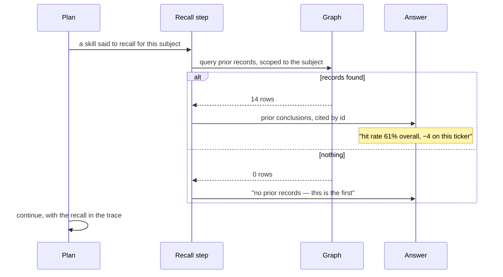

# Recall by query

An agent "remembers" by reading. A planned step queries prior records in the graph and cites what it
found — so recall has a source, and "nothing to recall" is stated rather than skipped.

| | |
|---|---|
| Index | [8.2](../../../README.md#8--memory) · Slice **S9d** |
| Module | [Memory](../spec.md) |
| API / CLI / Studio | 🔵 / — / 🔵 |
| Related | [starter-models](../../connect-and-model/features/starter-models.md) · [authoring-a-skill](../../skills/features/authoring-a-skill.md) |

> **As** someone whose agents work the same subject repeatedly, **I want** the next run to know what
> the last ones concluded, **so that** it builds on them instead of starting cold.

## Capabilities

| # | Capability | Notes |
|---|---|---|
| C1 | Recall is a step in the plan | Not a hidden context injection |
| C2 | It queries the graph | Domain memory is modelled by the domain; the step reads it |
| C3 | A skill says when to recall | The trigger is authored, not inferred |
| C4 | What it read is cited | By record id, in the answer and the trace |
| C5 | Nothing found is stated | "No prior records for this subject" appears in the trace |
| C6 | Scoped by the subject | The query is parameterised by what the run is about |
| C7 | Counts are part of the answer | "Read 14 prior observations" is a fact the reader can check |

## Journey

## Seams

| Seam | What the user sees |
|---|---|
| No memory types modelled | The step is not planned; the skill that would trigger it says why |
| Records exist but none match the subject | Stated as none, with the query shown |
| Very many prior records | Counted, and the query's own limit stated |
| A recalled record later corrected | The citation resolves to the record as it is now, with its own history |

## Surfaces

| Surface | Shape |
|---|---|
| Step row | "Recall · 14 records · query shown" |
| Answer | Prior conclusions cited inline, resolvable to records |
| Trace | The query, the rows, and what the step made of them |

## Engine

| Thing | Shape |
|---|---|
| Recall step | an ordinary query step with a subject parameter, recorded like any other |
| Citations | record ids on the emission |
| Nothing to recall | recorded as an outcome of the step, not a skipped step |

## Decisions

| # | Decision |
|---|---|
| RQ1 | Recall is a planned, visible step — never background context. |
| RQ2 | What is recalled is cited by record id. |
| RQ3 | "Nothing to recall" is stated in the trace. |
| RQ4 | The domain models its own memory; the step just reads it. |
| RQ5 | A skill decides when to recall. |

## Not building

| Not building | Because |
|---|---|
| Embedding search over past runs | recall must be explainable as a query |
| Automatic recall on every run | it costs a query and is not always relevant; a skill decides |
| Recall across Graphs | the Graph is the reasoning boundary |
