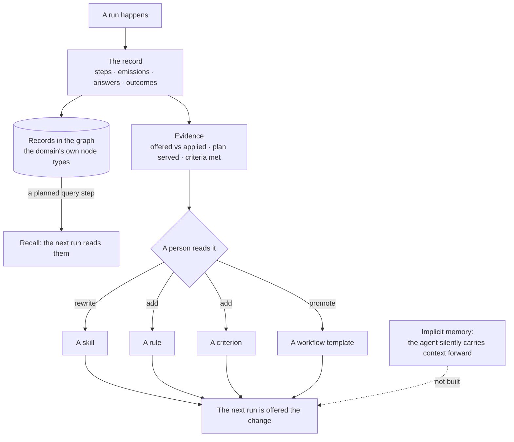
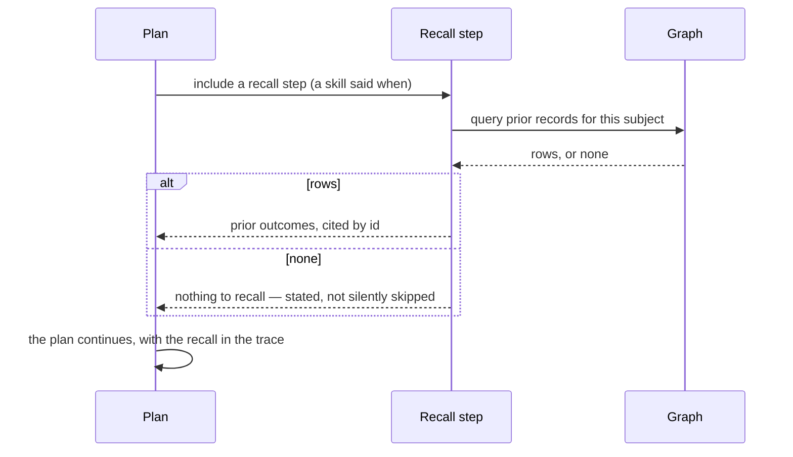
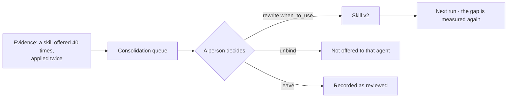

# Memory — module spec

What carries over between runs. An agent does not remember on its own: everything it "knows" the next
time is either **a record in the graph it queries**, or **something a person changed on the evidence**
of what happened. This module owns both paths, and the evidence that drives them.

> ⚠ **Rewritten for [orchestration § 0](../../orchestration.md#0-the-records)** — `Todo` · `TaskPlan` ·
> `Task` · `TaskRun` · `Lens`. The words *Thought*, *Thinking* and *Step-as-a-record* are retired, and
> **`Task` now names a node inside a plan**, never a thing a user authored. Migration:
> [task-model-migration.md](../../building-engine/task-model-migration.md).

| | |
|---|---|
| Index | [§8 · Memory](../../README.md#8--memory) |
| Features | [evidence](features/evidence.md) · [recall-by-query](features/recall-by-query.md) · [proposals](features/proposals.md) · [consolidation](features/consolidation.md) |
| Depends on | [Ask](../ask/spec.md) (runs produce the record) · [Skills](../skills/spec.md) · [Workflows](../workflows/spec.md) · [Work](../work/spec.md) (criterion outcomes) |
| Depended on by | every module that improves with use |

## 1. Vocabulary

Product-wide words: [terminology.md](../../terminology.md). What this module adds:

| Noun | Is | Is not |
|---|---|---|
| **The record** | every run, step, emission, answer and outcome — owned by [Ask](../ask/spec.md), audited by Operate, **read** here | this module's data |
| **Evidence** | what the record says about how well something worked | a metric dashboard |
| **Recall** | an agent querying prior records mid-run, as a planned step | remembering |
| **Proposal** | a suggested new version of an artefact, carrying its evidence and a diff | an automatic change |
| **Consolidation** | a person accepting, editing or rejecting a proposal | training |
| **Hypothesis** | what accepting a proposal predicts, so it can be judged later | a promise |

## 2. The two paths, and the one that does not exist

| Path | How it works | Why it is this way |
|---|---|---|
| **Recall by query** | The domain models its own memory as node types; an agent reads them with a planned query step | Provenance: what the agent "remembers" is a record with a source, not a claim in a prompt |
| **Consolidation** | Evidence reaches a person, who edits a skill, rule, criterion or template | Auditable: the change has an author, a time and a reason |
| **Implicit memory** | — | Not built. An agent that silently carries context forward cannot be audited, and its recall cannot be cited |

## 3. Domain memory is modelled, not built in

The product supplies the mechanism; the use case names the types.

| Layer | Owns |
|---|---|
| Product | the record · evidence · a query step that reads prior records · the consolidation loop |
| Domain model | whatever the domain calls its memory — the finance example uses `Pattern`, `Observation` and `Learning` |
| Skill | the playbook that says *when* to recall — the finance example's `learn-from-record` |

So "remember what worked" is a **modelling pattern**, reachable by any domain, not a feature with
finance's nouns in it. A medical Graph models `Finding` and `Guideline`; the mechanism is identical.

## 4. Where memory lives

One test decides it: **would you ever query it in the same breath as your domain data?**

| Data | Lives in | Because |
|---|---|---|
| Runs · steps · timings · tokens · emissions | Invana's store | About the run, not the subject. It must survive swapping the graph database, and writing it would break a read-only connection |
| Evidence — offered vs applied, plan served, criteria met | Invana's store, derived from the record | About the machine's behaviour |
| Objectives · criteria · rules | Invana's store | About the work |
| "BPCL gapped 2.1% and the setup was taken" | **the graph** | Joins to the domain's own types, cited in answers |
| "this pattern fares better on high-liquidity names" | **the graph** | Queried mid-run, cited by id |

The two sides join without duplicating: a memory node in the graph carries the `run_id` that
produced it, so provenance crosses the boundary in one direction only.

Domain memory is authored as a domain model like any other. [Starter models](../connect-and-model/features/starter-models.md)
ship an importable shape — an observation, a claim derived from observations, and how that claim
fared — which a Graph renames to its own vocabulary on arrival.

## 5. What this module owns

| Owns | Shape |
|---|---|
| `plan_verified` | per workflow version: how often a Verify step judged it as serving |
| Skill evidence | per skill: offered count, reported-applied count, and the gap |
| Criterion evidence | per criterion: met / unmet / not-applicable across tasks |
| Recall step | the planned query step shape: read prior records, cite them in the answer |
| Consolidation queue | evidence a person has not yet acted on |

All of it is **derived from the record**, which [Ask](../ask/spec.md) writes and Operate retains. This
module adds no store of its own — a second copy of the truth would drift from the first.

## 6. Flows

### M1 — Recall inside a run

### M2 — Evidence becomes a change

The same shape carries a workflow that keeps serving (promote it), a criterion that is never met
(rewrite or drop it), and a rule nothing ever cites (deactivate it).

## 7. Cross-feature decisions

| # | Decision |
|---|---|
| M1 | An agent does not remember across runs on its own. |
| M2 | What is recalled is a record with a source, read by a planned step — never context injected behind the scenes. |
| M3 | Consolidation is human. The system proposes on evidence; a person edits. |
| M4 | Domain memory is modelled by the domain. The product ships the mechanism, not the nouns. |
| M5 | "Nothing to recall" is stated in the trace, never skipped silently. |
| M6 | Evidence is derived from the record. This module adds no store of its own. |
| M7 | The operational record stays in Invana; domain memory is modelled in the graph. The join is a `run_id` on the node. |
| M8 | Improvement is a **versioned proposal a person accepts**, never a weight that shifts. Every proposable artefact carries versions. |
| M9 | Acceptance states a hypothesis and is measured against it; a worsened outcome opens an ordinary revert proposal. |

## 8. Deliberately absent

| Not built | Because |
|---|---|
| Implicit cross-run memory | unauditable, and its recall cannot be cited |
| Embedding-based recall | what is recalled must be explainable as a query over records |
| Agents writing their own skills or rules | consolidation has an author for a reason |
| Per-user personalisation of answers | the graph is the shared truth; a per-person memory forks it |
| Automatic promotion or demotion on evidence | evidence proposes; a person decides |
| Training or fine-tuning on outcomes | the artefacts must stay readable and editable by a person |
| Per-agent scores | a score invites optimising the score |
