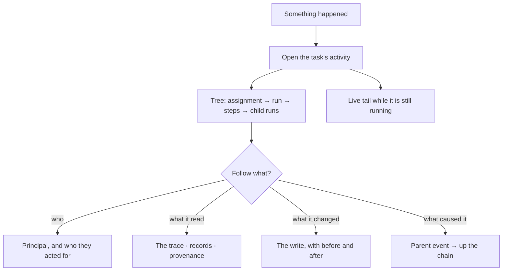

# Audit and activity

Every write is an event, every actor is a principal, and causality is kept — so "who recommended what,
citing what, on whose behalf" has an answer rather than an opinion.

| | |
|---|---|
| Index | [10.2](../../../README.md#10--operate) · Slice **S5.5 · S12a** |
| Module | [Operate](../spec.md) |
| API / CLI / Studio | 🟡 / — / 🟡 |
| Related | [reasoning-trace](../../ask/features/reasoning-trace.md) · [lineage](../../agents/features/lineage.md) · [evidence](../../memory/features/evidence.md) |

> **As** someone accountable for what this system did, **I want** an unedited record with the actor on
> every line, **so that** an audit is a query and not an archaeology project.

## Capabilities

| # | Capability | Notes |
|---|---|---|
| C1 | Every write emits | Graph, model, skill, rule, agent, task, import, connection |
| C2 | Append-only | Never edited, never individually deleted |
| C3 | The actor is a principal | `user · agent · system · external · anonymous` |
| C4 | On-behalf-of is separate | The agent that acted, and the person it acted for |
| C5 | Causality | `parent_event_id` links what caused what |
| C6 | Activity as a tree | Per task, per agent, per Graph — assembled from the record |
| C7 | Live tail | New events appear as they happen |
| C8 | Sensitive fields redacted at write | Credentials never enter the record |
| C9 | Retention by window | A purge removes a whole window, never selected rows |

## Journey

## Seams

| Seam | What the user sees |
|---|---|
| A purged window | Events gone, but the shape retained: counts and the purge itself are recorded |
| An agent acting for a person | Both named, never conflated |
| An external caller | Listed as `external`, with the token's name |
| A very busy Graph | Filtered by subject, actor and verb; the tail is paced |
| An event about a deleted subject | Still resolvable — the subject's name is captured at write |

## Surfaces

| Surface | Shape |
|---|---|
| Activity | On the task, the agent and the Graph — the same tree, scoped |
| Live tail | Events streaming, filterable |
| Event row | A timeline entry: marker · when + actor, the verb on the line, the record on expand |

## Engine

| Thing | Shape |
|---|---|
| `events` | append-only: principal, `on_behalf_of`, verb, target, payload, `parent_event_id`, time |
| Redaction | at write, by field name and by type |
| Activity | recursive query over events plus run steps |
| Retention | window-based purge, itself recorded |
| Routes | `GET …/events` (keyset) · `GET …/tasks/{id}/activity` · SSE for the tail |

## Decisions

| # | Decision |
|---|---|
| AA1 | Every write emits an event; there are no silent writes. |
| AA2 | Events are append-only and never individually deleted. |
| AA3 | Actor and on-behalf-of are separate fields. |
| AA4 | Redaction happens at write, not at read. |
| AA5 | Retention removes windows, and the purge is itself an event. |
| AA6 | Activity reads as a timeline, not a list of cards — `TimelineList variant="rail"` from `@invana/ui`, newest first. The rail's marker is a `StatusDot` toned by the event's derived outcome (`success` · `error` · `muted`), `when` carries the relative time and the actor, the verb is the entry's title, and the full record opens in place under it. `Load older` sits in the `TimelineFooter`, so the rail runs on into it — the line itself says the history continues past what is loaded. |
| AA7 | **An event's scope is a path, not a value, and it lives in `event_scopes` — `(event_id, scope_kind, scope_id)`, one row per scope.** An event belongs to a project *and* a task *and* a run at once, so no single `(scope_kind, scope_id)` pair on the event can carry it. The join table is unbounded, so an app that wants scoped events adds rows rather than a column to `core`, and it answers *every event on this thread* in one query — which is exactly what notification fan-out asks. `graph_id` stays a column on `events`: it is tenancy, not scope, it is present on nearly every emit, and every read filters on it. The cost is one join on the activity read and 1–3 extra rows per event. |

## Not building

| Not building | Because |
|---|---|
| Editable events | an audit trail you can edit is not one |
| Per-user feeds | activity is per subject |
| Log shipping and alerting | that belongs to the operator's platform |
| Deleting a single event | history with holes cannot be reasoned about |
