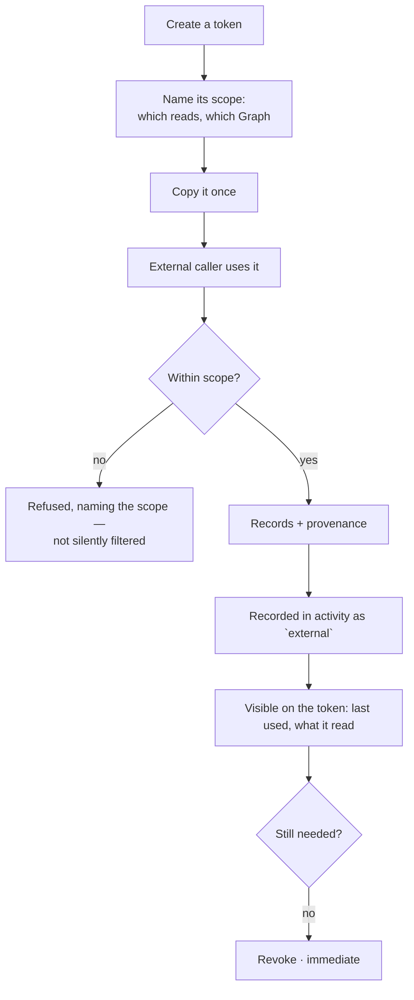

# External-agent API

Something outside Invana — an orchestrator, a bot, someone else's agent — reading from the Graph with
a scoped token, and getting provenance with every answer.

| | |
|---|---|
| Index | [10.4](../../../README.md#10--operate) · Slice **S10** |
| Module | [Operate](../spec.md) |
| API / CLI / Studio | 🔵 / — / 🔵 |
| Related | [audit-and-activity](audit-and-activity.md) · [inspect-what-landed](../../bring-data-in/features/inspect-what-landed.md) |

> **As** the author of a bot that posts the day's summary, **I want** to read from the Graph with a
> token that can only read what I said it could, **so that** integrating does not mean handing over
> the keys.

## Capabilities

| # | Capability | Notes |
|---|---|---|
| C1 | Scoped tokens | Each names exactly what it may read |
| C2 | Read-only | There is no general write path |
| C3 | Provenance on every response | Records, and where they came from |
| C4 | Recorded as a principal | External calls appear in activity like any other actor |
| C5 | Ask, or query | A token may be allowed to open a run, or only to read records |
| C6 | Import status is readable | What an orchestrator polls after a load |
| C7 | Revocable | Immediately, with what it last did visible |
| C8 | Rate and cost bounded | A token carries its own ceiling |

## Journey

## Seams

| Seam | What the user sees |
|---|---|
| Token used after revocation | Refused, and the attempt is recorded |
| A scope that matches nothing | Refused at creation, not at first call |
| Ceiling reached | Refused with the ceiling named; the token stays valid |
| A token asking a question | Runs through a named agent, and costs against that agent's budget |
| Leaked token | Revoke, and the activity shows everything it read |

## Surfaces

| Surface | Shape |
|---|---|
| Tokens | One list per Graph; `+` in the header; the secret shown once |
| Token detail | Scope, ceiling, last used, and its activity |
| Activity | External calls alongside every other actor |

## Engine

| Thing | Shape |
|---|---|
| `api_tokens` | `graph_id` · name · hashed secret · scope · ceiling · `last_used_at` · revoked |
| Scope | explicit read capabilities; anything unlisted is refused |
| Responses | records plus provenance, always |
| Routes | `…/tokens*` · the scoped read endpoints |
| Events | `token.created · used · refused · revoked` |

## Decisions

| # | Decision |
|---|---|
| EA1 | External access is read-only. |
| EA2 | Out-of-scope requests are refused, not silently filtered. |
| EA3 | Every response carries provenance. |
| EA4 | External calls are principals in the record. |
| EA5 | A token carries its own ceiling. |
| EA6 | **Tokens are a group inside Settings › Graph, not a settings tab of their own.** The tabs are `Basic · Graph · Agents` ([GV18](../../govern/spec.md)) and a token is Graph configuration in the same sense the connection is — a group in the form, the way the connection already is. A fourth tab would make a credential list look like a fourth subject. Drawn as `Tokens` on [The Undrawn Features](https://claude.ai/artifact/26QSEwgdJh6xiHr3xJJ4Wn). |
| EA7 | **The secret is shown once, in place, and never stored readable.** The row afterwards carries what the token *did* — last used, and what it read — because that is what answers *was this leaked*, and a re-readable secret is one the record cannot prove was yours. |

## Not building

| Not building | Because |
|---|---|
| A general write API | writes have contracts — import has one, tasks have one |
| OAuth apps and third-party installs | scoped tokens cover the need at this stage |
| Webhooks | polling with provenance is simpler to reason about and to audit |
