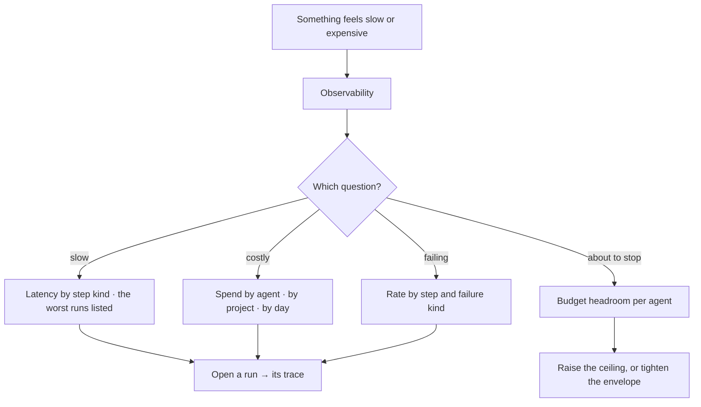

# Observability

What is slow, what it costs, what fails and where. Derived from the record — so the numbers cannot
disagree with the traces they summarise.

| | |
|---|---|
| Index | [10.3](../../../README.md#10--operate) · Slice **S11** |
| Module | [Operate](../spec.md) |
| API / CLI / Studio | 🔵 / — / 🔵 |
| Related | [audit-and-activity](audit-and-activity.md) · [evidence](../../memory/features/evidence.md) · [envelope-and-budget](../../agents/features/envelope-and-budget.md) |

> **As** whoever pays the bill, **I want** to see where the time and money go, **so that** I can act
> before a budget is a surprise.

## Capabilities

| # | Capability | Notes |
|---|---|---|
| C1 | Query latency | Per Graph, per model, per step kind |
| C2 | LLM cost | Tokens and spend, per agent, per project, per day |
| C3 | Failure rates | By step and by failure kind — cannot-answer counted separately from failure |
| C4 | Budget headroom | Spend against each agent's ceiling, before it is reached |
| C5 | Every figure opens | Down to the runs and the traces behind it |
| C6 | Windowed and comparable | Same window on every chart on the page |
| C7 | Derived, not accumulated | Read from the record; there is no counter to drift |

## Journey

## Seams

| Seam | What the user sees |
|---|---|
| Too little data | Stated as too few runs, not as a flat line |
| A purged window | Aggregates survive with a note; individual runs are gone |
| A cost spike from one run | Called out, with the run linked, rather than smoothed into an average |
| Provider pricing unknown | Tokens shown, spend marked unavailable — never estimated silently |

## Surfaces

| Surface | Shape |
|---|---|
| Observability page | Latency · cost · failures · budgets, one window control for all |
| Agent panel | Its own spend and headroom |
| Run header | This run's tokens and cost |

## Engine

| Thing | Shape |
|---|---|
| Source | `task_runs` timings and tokens; query executions; failure outcomes |
| Derivation | on read, windowed and cached briefly; no separate pipeline |
| Routes | `GET …/metrics/{latency,cost,failures,budgets}` |

## Decisions

| # | Decision |
|---|---|
| OB1 | Metrics are derived from the record. There is no second pipeline. |
| OB2 | Cannot-answer is counted separately from failure. |
| OB3 | Every figure links to the runs behind it. |
| OB4 | Spend is shown only where pricing is known; otherwise tokens alone. |
| OB5 | Budget headroom is shown before a ceiling is reached. |

## Not building

| Not building | Because |
|---|---|
| Alerting, paging, on-call | this is a product surface, not a monitoring platform |
| Custom dashboards | four questions answered well beat a builder |
| Exporting metrics to a TSDB | the record is the source; export it, not a summary |
