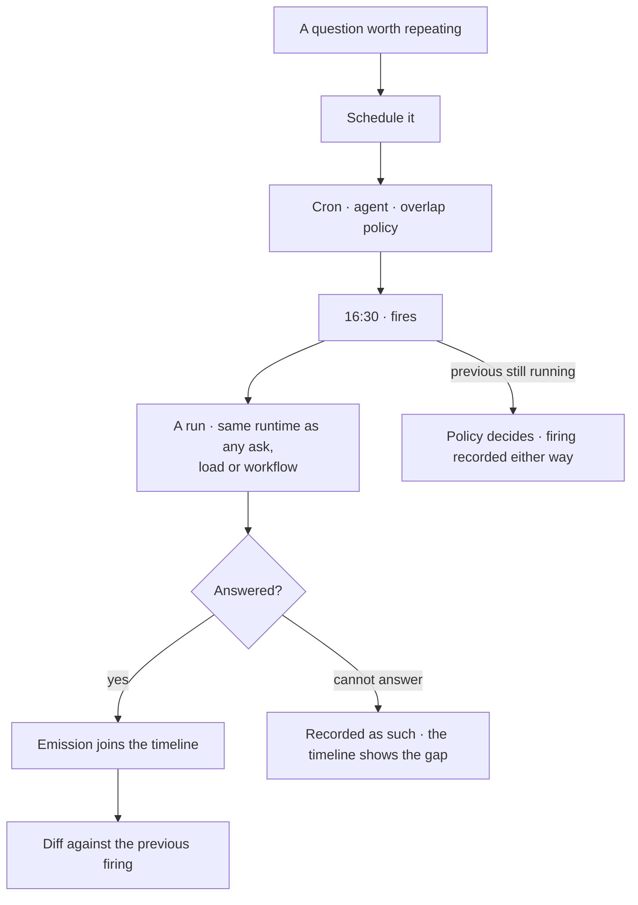

# Schedules

A cron on a question, a task or a workflow. A question schedule **stacks answers** into a diffable
timeline; a task schedule **creates work**; a workflow schedule **runs a plan**. None does another's
job.

> ⚠ **Rewritten for [orchestration § 0](../../../orchestration.md#0-the-records)** — `Todo` · `TaskPlan` ·
> `Task` · `TaskRun` · `Lens`. The words *Thought*, *Thinking* and *Step-as-a-record* are retired, and
> **`Task` now names a node inside a plan**, never a thing a user authored. Migration:
> [task-model-migration.md](../../../building-engine/task-model-migration.md).

| | |
|---|---|
| Index | [10.1](../../../README.md#10--operate) · Slice **S9.5** |
| Module | [Operate](../spec.md) |
| API / CLI / Studio | 🔵 / — / 🔵 |
| Related | [recurring-tasks-and-conditions](../../work/features/recurring-tasks-and-conditions.md) · [ask-in-natural-language](../../ask/features/ask-in-natural-language.md) · [the-library](../../workflows/features/the-library.md) · [load-a-bundle](../../bring-data-in/features/load-a-bundle.md) |

> **As** someone who asks the same question every day, **I want** it asked for me and the answers kept
> side by side, **so that** I read the change instead of re-running the query.

## Capabilities

| # | Capability | Notes |
|---|---|---|
| C1 | Three kinds | `question` · `task` · `workflow` |
| C2 | A question schedule opens a run per firing | Answers stack; nothing is created |
| C3 | Answers are diffable | Today against yesterday, on the same axes |
| C4 | A task schedule creates a task | Which a person still accepts |
| C4a | A workflow schedule opens a run | One run per firing, on the named workflow version. Nothing is created and nothing is accepted — the nightly load is this kind ([2.3](../../bring-data-in/features/load-a-bundle.md)) |
| C5 | Overlap policy | `skip · queue · allow` |
| C6 | Every firing is recorded | Including the ones that did nothing, with the reason |
| C7 | Pause and resume | Without losing the history |
| C8 | It runs through an agent | The one named on the schedule, or the Graph default |

## Journey

## Seams

| Seam | What the user sees |
|---|---|
| The graph changed shape | The answer changes; the diff shows it, and the timeline keeps both |
| A firing that cannot answer | A gap in the timeline with the reason, not a missing row |
| Schedule paused mid-run | The run finishes; no further firings |
| Agent retired | Firings block, naming the agent, until another is set |
| A clarification asked on a firing | Parks like any other; the timeline shows it waited |

## Surfaces

| Surface | Shape |
|---|---|
| Schedules | One list; `kind` visible; `+` in the header |
| Schedule detail | Firings · answers · diff as tabs of the main area |
| Timeline | One row per firing, with its answer and what changed |

## Engine

| Thing | Shape |
|---|---|
| `schedules` | `kind` · cron · agent · overlap policy · target (question text · task template · `workflow:<key>@<version>` with its arguments) |
| `firings` | time · outcome · run id or created task id · skip reason |
| Version pinning | a workflow schedule names a **version**. A library that publishes v4 does not silently change what fires at 02:00 |
| Routes | `…/schedules*` · `GET …/schedules/{id}/firings` |
| Events | `schedule.created · fired · skipped · paused` |

## Decisions

| # | Decision |
|---|---|
| SC1 | A question schedule stacks answers and creates nothing. |
| SC2 | A task schedule creates work that a person still accepts. |
| SC3 | Every firing is recorded, including skips, with a reason. |
| SC4 | A schedule runs through a named agent. |
| SC5 | Answers stack; they never overwrite. |
| SC6 | **A workflow schedule opens a run and creates nothing.** It is how a recurring load, stitch or enrichment recurs. Before it existed the only recurrence was a task schedule, which raised a Task nobody accepts for work nobody owns. |
| SC7 | A workflow schedule pins a **version**. Publishing a new one never changes what is already scheduled; re-pointing the schedule is a deliberate edit. |
| SC8 | A workflow schedule is [7.5](../../workflows/features/run-a-workflow.md) on a cron — the same start call, the same envelope check, the same arguments. Not a second way to open a run. |

## Not building

| Not building | Because |
|---|---|
| A question schedule that enqueues work | the three kinds are separate on purpose |
| A workflow schedule that follows the latest version | SC7 — a plan that changes under a cron is a change nobody reviewed |
| Alerting on an answer's value | that is a monitoring product |
| Calendar-aware scheduling | cron plus a skip policy is enough |
