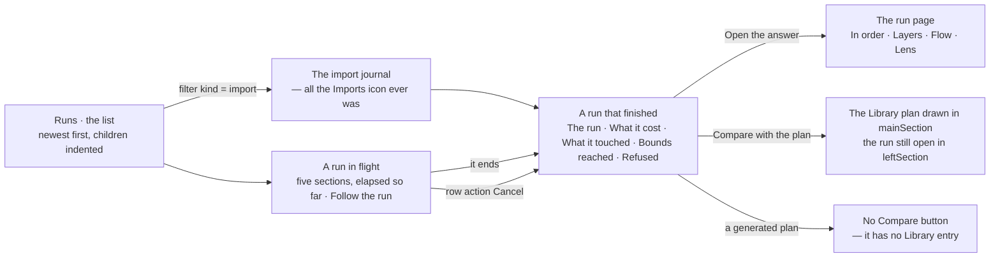
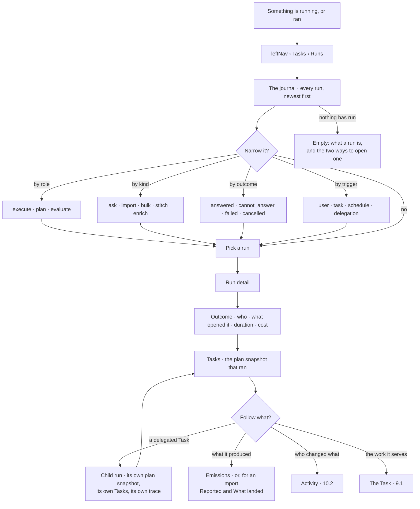

# See what ran

Every import, every question, every stitch and every enrichment is one **TaskRun**. **Runs** is the
one journal that lists them all, newest first, with their children underneath — so "what is this
system doing, and what did it do last night" has one answer instead of four panels.

> ⚠ **Rewritten for [orchestration § 0](../../../orchestration.md#0-the-records).** The surface is
> renamed **Thoughts → Runs**: *Runs* was forbidden while a run was called a *thinking*, and now
> `TaskRun` is the record. Migration: [task-model-migration.md](../../../building-engine/task-model-migration.md).

| | |
|---|---|
| Index | [10.5](../../../README.md#10--operate) · Slice **S14** |
| Module | [Operate](../spec.md) |
| API / CLI / Studio | 🟡 / — / 🟡 |
| Related | [the runtime](../../platform/features/runtime.md) (what produces every row here) · [inspect-what-landed](../../bring-data-in/features/inspect-what-landed.md) · [audit-and-activity](audit-and-activity.md) · [reasoning-trace](../../ask/features/reasoning-trace.md) · [delegation](../../agents/features/delegation.md) · [projects-and-tasks](../../work/features/projects-and-tasks.md) |

> **As** someone operating a Graph, **I want** every run the system has made in one journal, with its
> children under it, **so that** I can see what is running and what happened without first knowing
> which feature produced it.

## The four words this feature keeps apart

Nothing here is new machinery. The confusion this feature answers is a naming one, and the names are
already pinned in [terminology.md](../../../terminology.md).

| Word | Is | Is not |
|---|---|---|
| **Todo** | a unit of *work* a person wrote — definition of done, optional assignee | anything that runs |
| **TaskPlan** | the flow that carries it out. Its `kind` is the *subject* — `ask` · `import` · `bulk` · `stitch` · `model` · `enrich` | a run |
| **TaskRun** | one *execution* — agent, plan snapshot, lens, status, outcome. Its `role` says what the execution is for: `execute` · `plan` · `evaluate` | a job |
| **Task** | one node inside a plan — an LLM call, a query, a decision box, a graph algorithm | a Todo |

**A workflow is not a kind.** A workflow is a **reusable TaskPlan**, selected from the library by
intent ([7.2](../../workflows/features/plan-selection.md)). Running one produces a TaskRun of whatever
kind the plan is, with `plan_origin = reused:<id>` — never a fifth row in the table above.

**Nor is `plan` a kind.** A planner run is `role = plan`; an evaluator is `role = evaluate`. Both
appear in this journal as ordinary runs under the Todo they serve, which is how *why did it decide
that* is answerable at all.

**A kind selects a plan and nothing else.** Every row in this journal was walked by the same
interpreter, wrote the same child-run rows, emitted the same `run.*` events and logged to the same place,
whether it was a question, a load or a stitch ([13.8 §3.1](../../platform/features/runtime.md)). Kind
is what this surface *filters* and what C7 renders differently — it is never a second write path.

**A Task is never a Todo.** A Task is a node the runtime dispatches; a Todo is work a principal owns
and a person accepts. A run acquires child runs two ways — a composite's children, and
[delegation](../../agents/features/delegation.md) — and both children are TaskRuns with
`parent_run_id`. Neither is a Todo.

## Runs is not Activity

Both are trees, and they read the same Graph. They answer different questions.

| | **Runs** · this feature | [Activity](audit-and-activity.md) · 10.2 |
|---|---|---|
| A row is | one **TaskRun** | one **event** — a write |
| The tree is | root run → child runs → delegated runs | event → caused events |
| Answers | *what ran, how did it end, what did it cost* | *who changed what, on whose behalf* |
| Scope | the Graph, filterable | a subject — a Todo, an agent, the Graph |
| Reads | `todos` · `task_plans` · `task_runs` | `events` |

## Capabilities

| # | Capability | Notes |
|---|---|---|
| C1 | The journal — every TaskRun in the Graph, newest first | Across every kind, not one surface per kind |
| C2 | Children nest under their parent | A child run sits under the Task that spawned it, indented, never as a sibling row |
| C3 | Filters: kind · **role** · status · outcome · trigger · agent · lens · time |
| C3a | **Interactive runs are off by default** | `trigger in (canvas, system)` — canvas expansions and provider pings — are runs like any other and hidden until *Show interactive runs* ([orchestration § 4.1b](../../../orchestration.md#41b-interactive-runs)). The journal answers *what has this system been doing*, and a thousand expands is not that | Each is a column on `task_runs`; none is derived at read time. `awaiting_input` and `awaiting_approval` are distinct statuses ([13.8 §10](../../platform/features/runtime.md)) |
| C4 | **Imports is this journal with `kind in (import, bulk)` preselected** | One surface, one filter — not a second implementation. There is no `import_jobs` behind it: a load is a TaskRun the interpreter dispatched ([BD12](../../bring-data-in/spec.md)) |
| C5 | A run in flight is live | Tasks paint and counts climb from the run's own `TaskStream`, resumed by `seq` |
| C6 | Run detail is the same Task view everywhere | The trace an answer opens and the trace an import opens are one component |
| C7 | Kind-specific blocks appear only for their kind | An import run has **Reported** and **What landed**; an ask has **Emissions**; the rest of the detail is shared |
| C8 | The chain, both ways | From a child up to the root, and from the root down through every descendant |
| C9 | Where it came from | The Todo, the schedule firing, the session message or the CLI invocation that opened it |
| C13 | **Which world it ran against** | The run's `lens_snapshot` — the model versions and stitches it was grounded in ([orchestration § 0.9](../../../orchestration.md#09-grounding-a-run--the-lens)) |
| C10 | Cost and duration per run, rolled up over the chain | A parent's cost includes what it delegated |
| C11 | Cancel, where the runtime allows it | The one write on this surface, and it is gated on the run being non-terminal |
| C12 | Read-only otherwise | Nothing here retries, edits or re-runs |

## Journey

**The flow** — the list, a filter, a run in flight and a run that finished are one column and four
states, not four surfaces.

## Seams

| Seam | What the user sees |
|---|---|
| Nothing has run | What a run is, and the two ways one opens — ask a question, or import a dataset. Empty because nothing ran, not because something broke |
| A run in flight | Its row is live; steps paint as they arrive, and the row keeps its place rather than jumping to the top again |
| A deep delegation chain | Nested to the envelope's depth bound, collapsed past the second level, with the descendant count on the collapsed row |
| A very busy Graph | Keyset paging, filters applied server-side; the live tail is paced and never reorders rows already read |
| A run whose agent was retired | The agent is named with its version as it ran — a retired row still resolves ([5.5](../../agents/features/lifecycle.md)) |
| A run purged by retention | The row stays with its counts and outcome; its steps and emissions say they were purged ([O6](../spec.md)) |
| A parent still running, a child already failed | The parent's row shows the chain's worst outcome alongside its own status; neither is hidden behind the other |
| A member without access to the Task | The run is listed; the Task link is absent, not broken |
| A step board opened cold — a reload, or a link | The step resolves its own run before it reads a trace ([SR44](#decisions)); while it does, the page is loading, not refusing |
| A step whose run was deleted | *This task is not in the run's trace* — the step names a run that no longer answers, which is the same empty state a pruned attempt gives |

## Surfaces

| Surface | Shape |
|---|---|
| **Runs** panel | One row per TaskRun, newest first ([SR44](#decisions)). A status glyph and two lines ([SR45](#decisions) · [SR65](#decisions)): `which carriers were late in H1?` over `7d3184f1  nl-query@5 · 2m 51s · 21.4k · 9/9 · 4 mins ago`. No status badge. Children indent under their parent. Search and filter in the panel's own header; counts in the `footer.left` status bar |
| **Imports** | `kind in (import, bulk)` on that drawer's filter, with the import columns (`written / total`, dataset, `model@v3`) swapped in — **not a panel and not an icon** (SR7). [2.2](../../bring-data-in/features/inspect-what-landed.md) is a view of this list |
| Run detail · the drawer | **Five sections and two ways out** ([SR67](#decisions)). A `RecordHeader` — status dot, `run:7d3184f1`, `succeeded`, `6.4s of work`. **The run** — asked (the prompt as typed; mono and clamped to three lines on a `ql` run) · plan · agent · lens, a link that opens Govern drilled into it · opened by · elapsed. **What it cost** — cost `of` the per-run ceiling · tokens in/out · waiting, with the asking share named. **What it touched** — the kit's `TouchStrip` in `column` orientation, one line per layer, refused struck, untouched dimmed, `N refused` beside the eyebrow. **Bounds reached** — rounds · attempts (the worst step, named) · replans, `none exhausted` beside it. **Refused** — each address struck, with its reason. Foot: `Open the answer` (the run page) · `Compare with the plan` (the Library plan drawn in `mainSection`, the run kept open). The status bar reads `run:7d3184f1` and `9 events · 1 refusal` |
| Step detail · the page | A task on the run dashboard's flow opens **its own dashboard**, breadcrumbed `runs › run:<id> › step:<id> <name>` ([SR54](#decisions)), with `‹ ›` to the task before and after. One shell for every `kind`, in three readings ([SR55](#decisions)): `Overview` — tiles · **its clock**, per attempt ([SR56](#decisions)) · **Input** (args after `${…}` binding) · **Output** · `result.json` · where it sits (run · plan task · lane · parent); `Touched`; `Log` |
| Run detail · the four readings | One page, one trace, a segmented switch ([SR46](#decisions)). **In order** — a row per step, the layer as a column on the row, the loop as a box around its rounds, the gate as a rule between them ([SR47](#decisions) · [SR48](#decisions)); the touch strip sits above it. **Layers** — the strip on the run's own clock, one row per participant ([SR49](#decisions)), optionally against the plan's p50 ([SR51](#decisions)). **Flow** — the plan with status on it, read-only ([SR52](#decisions)). **Lens** — allowed · touched · never touched · refused ([SR53](#decisions)) |
| Step detail · `Touched` | What it **read** (one row per participant, with what came back), what it **wrote** (created and updated apart, per model or dataset), what it was **refused**, and the **files it left** — each band absent when nobody recorded one ([SR57](#decisions) · [SR58](#decisions)) |
| Step detail · the states | One shell, six readings of it: in flight · failed on a spent bound · cancelled · recorded nothing · purged · read-only ([SR59](#decisions)) |
| Step detail · `Log` | The step's slice of the stream, full height, levels filterable, the attempt boundaries marked ([SR55](#decisions)) |
| Run detail · the page | `More` opens the **run dashboard** — `board.kind = run` ([CV12](../../explore/features/boards.md)): tasks `4 / 7`, elapsed, tokens against the ceiling, cost against the **allocated budget**, rows, lanes; **the flow with status on it, full width**; the Gantt; the reported breakdown; **Input** — what opened the run — and **`result.json` as it stands**; then the log |
| The flow, drawn | The run's Tasks as the plan they ran, on an **artboard** — shape rather than numbers: the branch never taken, the fan-out, where the retry sat ([§3b](../../../building-studio/graph-detail-page.md)) |
| Row actions | `Open trace · Open the Task · Open activity · Cancel`. Cancel only while non-terminal |
| Todo detail › `Runs` | The same journal, filtered to one `todo_id` — [9.1](../../work/features/projects-and-tasks.md) |

## Engine

Nothing new in the *shape* of the journal — but the tables are renamed by
[task-model-migration.md](../../../building-engine/task-model-migration.md) §2.4. `task_runs` carries every column
this reads.

| Thing | Shape |
|---|---|
| `task_plans.kind` | `ask` · `import` · `bulk` · `stitch` · `model` · `enrich` — the plan's **subject**. `nl` and `ql` are both *ask* to a reader |
| `task_runs.parent_run_id` · `task_id` | the chain, explicit — never inferred from timestamps |
| `task_runs.todo_id` · `triggered_by` · `role` | what opened the run, and what the run is *for* |
| `task_runs.status` · `outcome` | machinery and reading, kept separate — a clean run that found nothing is `succeeded` + `cannot_answer`, and *outside the lens* is a third reading |
| `task_runs.plan_snapshot` · `plan_revision` · `plan_origin` · `lens_snapshot` | the plan that actually ran — **per revision**, so a replanned run says which graph each child was dispatched under — where it came from, and the world it ran against |
| `task_runs.result` | **`result.json`** — one document per run and per task run, written by the interpreter when the row settles ([SR38](#decisions)): `status · task_key · step_key · attempt · outputs · artifacts · timing · tokens · error`, each key absent when empty. A run's own is the roll-up ([SR39](#decisions)). The dashboard renders this; it does not read the task's internals |
| `task_runs.cost_usd` | what this row spent, in dollars — derived at settle from the provider's model and its tokens ([SR40](#decisions)). `NULL` when the model has no published rate, which is the same as *unknown*, never `0` |
| `GET …/runs` items | the journal row's own facts, so neither line needs a trace fetch per row ([SR45](#decisions)): `body` — the question as asked, the query text, or the dataset and its target, which line one reads verbatim · `started_at` beside `queued_at` · `finished_at` for elapsed, and `tokens_in` · `tokens_out` **summed over the run's tasks** — the roll-up [SR39](#decisions) already defines, computed in the same pass that counts the steps |
| `GET …/runs/{id}/tasks/{task_key}` | one task run: its resolved input, its `result.json`, its artifacts and its log slice |
| `GET …/runs/{id}/trace` | the whole run and every step, with what each one cost and read — and the fields the dashboards render: `args` · `bound` · `lane` · `step_key` · `result` · `cost_usd` per step, `body` · `ask_kind` · `result` · `cost_usd` · `budget` on the run ([SR33](#decisions) · [SR41](#decisions)) |
| Chain rollup | recursive over `parent_run_id`: descendant count, worst outcome, summed cost and tokens |
| Routes | `GET …/runs` (keyset on `queued_at`, newest first; `?cursor=` and `next_cursor` — [SR61](#decisions); filters `kind · role · status · outcome · triggered_by · agent_id · todo_id · lens_id · since`) · `GET …/runs/{id}` · `GET …/runs/{id}/chain` · `POST …/runs/{id}/cancel` · SSE for the tail, paced by the reader ([SR62](#decisions)) |
| `GET …/task-plans/{id}/stats` | `p50` · `p95` per `step_key` over the plan's earlier runs — what `Layers · forecast` draws, computed once in the engine and never in a page ([SR63](#decisions)). Gate steps are omitted: approval latency has no estimate |

`GET …/imports` is **deleted, not aliased** ([task-model-migration §7b](../../../building-engine/task-model-migration.md)).
It is `GET …/runs?kind=import`, and the CLI is updated in the same slice that removes it — an alias
is a second vocabulary to maintain for a route whose only caller ships from this repo.

## Decisions

| # | Decision |
|---|---|
| SR1 | There is one journal of runs in a Graph. **Runs** is it, and every kind-specific surface is a filter of it. |
| SR2 | The product has no *job*. A run is a **TaskRun**, its parts are child runs of **Tasks**, and the word `job` names nothing ([terminology §8](../../../terminology.md)). |
| SR3 | A **Todo** is work; a **TaskRun** is a run. Assigning a Todo opens exactly one root run ([W2](../../work/spec.md)), joined by `task_runs.todo_id`. Neither is the other. |
| SR4 | A **Task** is never a Todo. It gets a child-run row, never a top-level one — a composite's children and delegation are the two ways a run acquires children, and both children are TaskRuns.
| SR10 | **`role` is a first-class filter.** A planner run and an evaluator run appear in this journal like any other, under the Todo they serve — which is how *why did it plan that* and *why was it rejected* stay answerable. |
| SR11 | **A run records the world it ran against.** `lens_snapshot` is frozen with `plan_snapshot`, so a trace stays reconstructible after the next model version publishes ([orchestration § 0.9](../../../orchestration.md#09-grounding-a-run--the-lens)). |
| SR5 | A workflow is a reusable plan, not a kind. Running one is recorded as `plan_origin = reused:<id>`, not as a fifth kind. |
| SR6 | `enrich` is a plan kind of its own — writing derived properties or edges onto the graph is a run with its own inputs and its own failure story, distinct from `stitch`, which declares that two models meet. |
| SR7 | **Imports loses its `leftNav` item as well as its implementation.** It is this journal with `kind in (import, bulk)` preselected and the import columns swapped in — the two kinds a load produces ([BD11](../../bring-data-in/spec.md)) — reached by the kind filter, from a Todo, or from a saved filter, never by an icon. An icon per kind is how one journal became four panels; the fix is not to keep one of them ([G30](../../../building-studio/graph-detail-page.md)). |
| SR12 | **Runs is its own `leftNav` panel, and it holds the journal alone.** The definitions a run is composed from — plans, the catalogue, templates — live in **Library** ([G41](../../../building-studio/graph-detail-page.md)). Following *this run → the plan it ran → the callable that failed* happens in `mainSection`, not by drawer adjacency: a run's detail is a page ([SR36](#decisions)), a plan's is a canvas page, and `keepMounted` keeps the run open beside it. A run's detail replaces the panel body, not the panel |
| SR44 | **Runs is a list, so it carries `&run=` and no `?drawer=`** ([G31](../../../building-studio/graph-detail-page.md) · [G33](../../../building-studio/graph-detail-page.md)). `RunsPanel` is the one-header `ListPanelChrome` grammar every other list uses — label, the `24 · 2 running` count, refresh, the status filter — and a drill-in replaces the body, turning the header into `‹ Runs / orders.csv`. `?panel=tasks` is **deleted, not redirected**: the three-drawer Tasks stack is gone, `PanelStack` with it, and a stale link lands on the graph page. |
| SR8 | This surface is read-only except for **cancel**. Retry and re-run belong where the run was started. |
| SR9 | Runs lists runs; Activity lists writes. Neither is derived from the other, and neither is a feed. |
| SR13 | **The drawer is an overview; the run page is the detail.** A 420px column answers *what ran, what it cost, what it touched, which bounds it reached and what was refused* ([SR67](#decisions)). Where the time went — the Gantt, the flow, the log, the reported breakdown, what landed — is the run page, a **dashboard canvas** ([CV12](../../explore/features/boards.md)) that `Open the answer` opens, not a longer panel. [SR14](#decisions), [SR15](#decisions) and [SR26](#decisions) govern the Gantt where it is drawn: on that page. |
| SR17 | **Every task run writes `result.json`, and that is the whole contract.** `status`, `outputs` (the declared ones — [§0.6](../../../orchestration.md#06-the-catalogue--what-a-plan-may-name)), `artifacts`, `timing`, plus whatever its kind adds. The dashboard renders that document; it never reaches into a task's internals, so a new `kind` ships a surface by writing a document, not by shipping a panel. A run's own `result.json` is the merge of its tasks'. |
| SR18 | **One step dashboard for every `kind`; only the Output panel differs.** Breadcrumb, tiles, Input, Output, Log, `result.json`, Artifacts, where it sits — identical for `import_dataset`, `execute_graph_query` and `understand_intent`. What changes is the one panel: graph data written · rows · the prompt and completion. Everything else the runtime already records identically, so rendering it differently per kind would be a second vocabulary for one record. |
| SR19 | **Input is shown wherever result is.** At run level the input is what opened it (trigger, question, plan, agent, lens, budget); at task level it is the args **after `${…}` binding**, so the trace answers *what was it actually asked to do* and not only *what did it produce*. A result with no request beside it cannot be audited. |
| SR23 | **Everything that executes is in this journal — and the journal is filtered, not selective.** An import, a chat ask, a stitch commit, a provider ping and a canvas expansion are all TaskRuns, because nothing executes outside the runtime ([§ 4.1a](../../../orchestration.md#41a-nothing-executes-outside-the-runtime)). What keeps it readable is a **default filter and separate retention**, never a second write path: the moment one act is allowed to skip the runtime, *what ran* has two answers. |
| SR27 | **The journal reads two endpoints until M3 gives it one table, and the merge is the drawer's job.** [SR23](#decisions) is the end state; today `thinkings` and `import_jobs` are separate, and reading only the second is what made a question answered end to end leave no row anywhere a reader could find it. So the drawer lists both, newest first. **An import's own thinking is excluded**, because a load already opens one and the run detail reads its steps for the Gantt — listing both unfiltered shows every load twice, once by its dataset and once by its plan. The de-duplication lives here and dies with M3: when a run is one row, there is one list and nothing to merge. |
| SR29 | **A run records the plan it ran, and the record is `plan_snapshot`.** `plan_origin` says *where the flow came from* (`template:nl-single@1`, `generated`); `plan_snapshot` is *the flow itself*, frozen, and they are not interchangeable — a replay reads the second, and promotion copies it into a library entry. A run carrying only the first is a trace that names a document it does not have, which is why [promote-a-plan](../../workflows/features/promote-a-plan.md) filters candidates on the snapshot and not on the origin. The word **`plan` is never the column**: it names the record, the role, a catalogue key and the document, so the frozen flow is `plan_snapshot` and nothing else ([task-model-migration § 2.4](../../../building-engine/task-model-migration.md)). |
| SR28 | **An ask's detail is a load's, minus the two bands a load owns.** No `Written`/`Reported` tile, because an ask writes no records; no Log band, because a thinking's lines go to the stream rather than to a stored log. The Gantt is unchanged — it already reads `ThinkingStep`, so an ask and a load draw from the same component and the same fields ([SR21](#decisions)). The Log band arrives with `result.json` in S4, not with a second detail surface. |
| SR24 | **`trigger` is the axis that separates deliberate work from interaction.** `user · task · schedule · delegation` are deliberate and shown; `canvas · system` are interactive and hidden by default. An audit turns them on; a person reading last night's load does not. |
| SR20 | **Budget is drawn as a ceiling, not a total.** Tokens read `8.2k of 40k`, cost reads `$0.04 of $2.00` with a meter — a spend without its ceiling is a number nobody can act on, and the ceiling is the thing that pauses the run ([§0.10](../../../orchestration.md#010-budget--the-ceiling-that-pauses-instead-of-failing)). |
| SR16 | **A run in flight and a run that finished are the same five sections.** Elapsed reads `so far`, the trace polls and the touch list and bounds climb with it, and the primary action reads `Follow the run` until the run settles; `Cancel` is the row action while the run is non-terminal ([C11](#capabilities)). There is no separate live view to build or to keep honest. |
| SR15 | **Picking a Task filters the log to it.** A Gantt row and a log line are the same Task seen twice — clicking the bar narrows the log to that `task` with a removable chip, which is the debugging loop (*which one was slow → what did it say*) without leaving the column. |
| SR14 | **The Gantt is the run's own clock, not a step list.** Duration is the question a run detail is opened with, and a list of steps with a duration column answers it one row at a time. The bar chart puts the slow Task, the retry and the branch that never ran in one glance — and it is one component, reused by the drawer, the dashboard and the document rendering. |
| SR21 | **The Gantt is one kit component, and it reads the trace unchanged.** `TaskGantt` (`@invana/ui` › `ui-extended`) takes a task per row with the trace's own fields — `task_key` · `status` · `started_at` · `finished_at` · `duration_ms` — so wiring a run to it is a rename, not a transform. A retry is `attempts` (segments left of the bar that stuck), a Task that never ran carries no segment and draws as an outline rather than a paler fill, a run in flight adds `nowMs` and `openEnded`, and the three surfaces differ only by `density` · `labelWidth` · `showLogs`. Its statuses are the engine's (`succeeded` · `running` · `failed` · `needs_input` · `stopped` · `skipped` · `queued`), so a Gantt row and a log line say the same word for the same state. |
| SR25 | **A log line carries the `task_key` of the Task that wrote it, and the runtime is what stamps it.** SR15 only works if a Gantt row and a log line say the same word for the same Task, and a *stage* vocabulary beside a *task* vocabulary is two words for one thing — the second one drifts. So the writer passes the key its own trace gave the step, and a line that belongs to the run rather than to any one Task (`register`, `done`, and every line of a `bulk` load, which walks no plan) carries `null` and reads at run level. Filtering to a Task therefore hides the run-level lines: they are not that Task's lines. |
| SR26 | **Picking a Task folds the Performance band to one line.** The Gantt is how a Task is *picked*; once one is picked, *where did the time go* has been answered, and the height is worth more to the log — which is the band the reader is now in. The folded band still states the run's slowest Task, so it goes quiet rather than silent, and clearing the chip brings the chart back. |
| SR22 | **A Task's detail is a card on hover, not a line under its row.** A line of log per row doubled the Gantt's height and still carried one truncated sentence; the card carries what the reader hovering a slow bar came for — the Task's `result.json`, its error, its attempts and its last line of log — and the rows stay a chart. The card is *supplementary*: it is unreachable by touch, so every fact in it is also in the Log band and on the task's own dashboard ([SR17](#decisions)). `TaskGantt` takes `result` · `error` · `summary` · `log` per Task and renders the default card; `task.detail` replaces one row's body and `renderDetail` replaces every row's, which is how a `kind` shows a table preview or a subgraph thumb without a second Gantt. |
| SR30 | **The dashboard is a spec, and the spec is composed from the trace.** `@invana/dashboard` renders a `DashboardSpec` — bands of panels, JSON and nothing else — so the run dashboard is a pure function of `GET …/runs/{id}/trace` (`runDashboardSpec`) and a step dashboard a pure function of that same trace and one of its steps (`stepDashboardSpec`). The page fetches, composes, and hands over; it carries no per-panel branch and no fetch of its own per band. When `dashboard.yml` becomes a stored document ([CV13](../../explore/features/boards.md)) the composer is what writes it, and the renderer does not change. |
| SR31 | **One shell for every task kind, and Output is the only branch.** [SR18](#decisions) as code: `stepDashboardSpec` builds the same bands for every `task_key` — tiles · Input · `result.json` · Output · Artifacts · Log · Where it sits — and picks the Output panel from **the shape the step recorded**, never from its key: rows → `table`, a prompt and a completion → `exchange`, records written → `properties`, anything else → the output document as `json`. A new catalogue entry ships a surface by recording one of those shapes, which is the same argument [SR17](#decisions) makes for `result.json`. |
| SR32 | **The flow is one continuous strip of six layer bands, ordered by `seq`.** `TaskFlowPanel` lays the steps left to right with **no wrap** — the vertical axis is spent on the layer a step touched ([§2](../../govern/spec.md)), so wrapping would put a second set of bands under the first and mean nothing. The layer labels freeze in a left column and the strip scrolls horizontally under them; `graph data` and `llm` expand into one row per participant by default, and a band caps its rows at `+ n more`. It reads the plan's real edges the moment `plan_snapshot` is on the trace; until then a drawn branch would be invented. **This replaces wrapping into rows**, which was written when the flow had no vertical axis to spend |
| SR33 | **The trace returns what the dashboards render, because the run already recorded it.** `GET …/runs/{id}/trace` carries `args` (the resolved arguments after `${…}` binding — the Input band), `bound` (from the catalogue entry the `task_key` names — the flow's chips and the step's header), `lane` · `step_key` (Where it sits) and `result` per step, and `body` · `ask_kind` · `result` on the run. None of it is new state: every field is a column on `task_runs`, and the trace was the one reader not returning them. |
| SR34 | **A band with no record is absent, not zero.** A tile or a panel whose record nobody wrote does not render at all rather than rendering `$0.00`, `{}` or `0 of 0` — a dashboard that shows an empty Artifacts box says the task produced none, and a dashboard that omits it says nobody has recorded any. The rule outlives the gaps it was written for: a task that listed no artifacts still draws no Artifacts panel, a step whose price nobody knows still draws no Cost tile ([OB4](observability.md)), and a run with no ceiling still draws a spend with no meter. |
| SR35 | **The Log band is one line per task until there is a log.** There is no `run_logs` table ([SR28](#decisions)), and `task_runs.detail` is the one line each step already writes — so the Log band renders those, stamped with the step's own `task_key` and its offset from the run's start, which is exactly [SR25](#decisions)'s contract at one line per Task. Picking a Gantt row filters it ([SR15](#decisions)). It becomes the real log when one is stored; the panel does not change. |
| SR36 | **A dashboard is a page, and its id is `<kind>:<subject_id>`.** `More` on a run opens `run:<run_id>`; a task on the flow opens `task_run:<step_id>`, breadcrumbed under its run. Both are pages in `BoardPagesViewPanel` beside the canvases ([CV14](../../explore/features/boards.md)), reached by the id shape the boards registry already uses ([boards-migration § 5](../../../building-engine/boards-migration.md)), so persisting one later is creating the row the id already names — not moving the page. |
| SR37 | **The view switch shows `spec.json`, not `dashboard.yml`, until there is a document to show.** The design's segmented control offers `Dashboard ¦ dashboard.yml`; a board has no stored spec yet ([CV13](../../explore/features/boards.md)), so the second option renders **the spec this page is rendering** — the same object, as JSON, in a `code` panel. It is the honest label for what it shows, and it makes *a dashboard is data* checkable rather than claimed. It becomes `dashboard.yml` when the document is stored and the switch edits it. |
| SR38 | **`result.json` is assembled by the interpreter, and a task never writes one.** A catalogue entry returns `Out` and nothing else; the interpreter turns that into the document when the row settles — `status` · `task_key` · `step_key` · `attempt` · `outputs` · `artifacts` · `timing` · `tokens` · `error`, each key **omitted when there is nothing to put in it** ([SR34](#decisions)). `outputs` is filtered to what the entry **declares** ([§0.6](../../../orchestration.md#06-the-catalogue--what-a-plan-may-name)), which is what makes the document a contract rather than a dump of internals: an undeclared key a step recorded about itself stays on `output`. One writer means a new entry ships `result.json` by existing, and none of them can ship a different shape. |
| SR39 | **A run's own `result.json` is a roll-up, not a concatenation.** `status` · `outcome` · `timing` · `tokens`, then one line per task — `step_key` · `task_key` · `status` · `duration_ms` · its declared `outputs` — and its tasks' artifacts in the order they were produced. It is the merge [SR17](#decisions) asks for, kept to what a reader opening a run wants: the shape of what happened, with the detail one click away on the task's own dashboard. A task's full document is never copied up, because it is already addressable. |
| SR40 | **Cost is `task_runs.cost_usd`, derived at settle from a price list, and absent when the price is unknown.** Tokens are a fact the provider returns; money is tokens × a rate nobody stores per call, so the column is computed when the row settles from `(provider kind, model id)` and the tokens it spent. An unpriced model leaves the column `NULL` and the Cost tile absent — [OB4](observability.md) is the rule and [SR34](#decisions) is how it draws. The list ships with the distribution and is not a table: a rate is a fact about a vendor's model, not state a Graph owns, and a stale rate is corrected by a release rather than by a migration. Two sources, narrowest first — `llm_providers.guardrails.pricing` is an endpoint's own contract rate and wins; the shipped list matches a model-id prefix, so a dated snapshot prices as its family. A **local** provider prices at `0.0`, which is a fact rather than a guess, and a **subscription** (`claude_agent_sdk` holding an OAuth token) is unpriced — a call on a plan is neither metered per token nor free, and neither number would be true. |
| SR41 | **The ceiling rides the trace, because a spend without one is a number nobody can act on.** `GET …/runs/{id}/trace` carries `budget` — the agent's effective `max_tokens` and `max_cost_usd` ([EB1](../../agents/features/envelope-and-budget.md)) — beside `tokens_in` · `tokens_out` · `cost_usd`, so the dashboard draws `8.2k of 40k` and `$0.04 of $2.00` with a meter ([SR20](#decisions)) rather than a bare total. A run opened with no agent has no ceiling and draws none. **Reading it is not enforcing it**: pausing at the ceiling is [§0.10](../../../orchestration.md#010-budget--the-ceiling-that-pauses-instead-of-failing)'s budget approval and is not built here. |
| SR42 | **An LLM step records its exchange on `output`, undeclared — and that is what makes it undeclared.** The step dashboard picks the `exchange` panel from the shape the step recorded ([SR31](#decisions)), so `prompt` and `completion` are top-level keys on `output`; they are deliberately **not** in the entry's `outputs`, because a declared output is a bindable API ([§0.6](../../../orchestration.md#06-the-catalogue--what-a-plan-may-name)) and a plan that binds a raw prompt has reached into a step's internals. Declaration governs binding, so an undeclared key is visible to a reader and invisible to the grammar — which is exactly the split this needs. Both sides are **truncated on write**, with the cut stated in the text: a trace row is not where a megabyte of prompt belongs. |
| SR43 | **The journal lists roots, and the filter is `parent_run_id IS NULL` rather than a side effect of another one.** *Per-step rows in the journal* is a [non-goal](#not-building) — a step belongs to its run, and is reached through the run's trace and its own dashboard ([SR36](#decisions)). `list_runs` enforced it only by accident: `ask_kind` is null on a child, so **naming a kind** narrowed to roots, and the journal names none. The drawer's own list is therefore the one caller that got every step row in the Graph — 43 of its first 50. The roots filter is now stated in the query rather than inferred from a column that happens to correlate, because a rule that holds only while an unrelated filter is applied is not being enforced. A run's children stay reachable where they were always drawn: underneath it, on drill-in. |
| SR44 | **A step board's run is read from the step, never carried in its page id.** `task_run:<step_id>` is the whole address ([SR36](#decisions)), and the run a step belongs to is a column on the step's own row — so a **cold** open resolves it with one `GET …/runs/{step_id}`, which answers `parent_run_id` beside the rest of the row, and only then reads the trace. Growing the id to `task_run:<run_id>:<step_id>` would put a *fetched* fact inside an *identity* — the split [B15](../../../building-engine/boards-migration.md#9-decisions) draws between the subject and the reading — and would key a step's reports on a string half of which is derivable from the other half. Leaving it refused is worse than either: the host writes `?page=task_run:<id>` itself the moment a step board is focused, so the link that refuses is a **reload**, not something somebody assembled by hand. The warm path pays nothing — opening a task from the run's flow already holds the run and passes it ([SR18](#decisions)), so the read happens once, on the one open that has no run to pass. |
| SR45 | **A journal row leads with what was asked, then addresses and measures it.** Line one is **what the run was about**, in the words it was opened with: the question as the person typed it, the query text (monospace) for a `ql-*` run, the dataset and its target for a load. A plan name on line one reads the same for fifty rows, and the prompt is what a reader scans the journal for. Line two starts with the run's **short id** — the last eight characters of its uuid, monospace, quoted the way a commit is — then the **plan and version**, then what it spent: **elapsed · tokens · tasks · when**. The id stays on the row because a run is the noun every other surface names — a log line, a support thread, `GET …/runs/{id}` — and a list nobody can quote from forces a drill-in just to copy one. **Elapsed is the run's own clock** (`started_at` → `finished_at`, ticking while it runs), **tokens** is `tokens_in + tokens_out` summed over the run's tasks, and **tasks** is `done/total` — a position, never a percentage: a plan can replan. Which step it is on is what the drill-in answers. Each fact is absent when nobody recorded it ([SR34](#decisions)): a load spends no tokens and draws none, a queued run has no elapsed. |
| SR46 | **A run has one record and four readings, and a reading is a switch, not a page.** `In order` (the default) · `Layers` · `Flow` · `Lens` sit in the pagehead's segmented slot ([SR37](#decisions)) over one `GET …/runs/{id}/trace`. Four pages would be four fetches, four URLs and four places for the same fact to drift; a step is a page ([SR36](#decisions)) because it is a *different subject*, and a reading is not. |
| SR47 | **`In order` is the default, and a row is a step.** Time is what a reader opens a run with, and *the order it happened in* is the cheapest honest answer to it. **The layer a step spent is a column on the row, never an axis of its own**: a step touches exactly one layer, so a six-band matrix was 1/6 full by construction and a name along the top could not say how long anything took. What the six bands were answering — *what did this touch at all* — is a **summary question**, so it collapses to one strip above the list and stops costing an axis. |
| SR48 | **A bounded repetition contains its rows; a gate lies between them.** A loop is drawn as a box **around** the rounds it holds, so a list nests for free and a second round is simply a further row inside it. A gate is dispatched by nobody, holds no slot and spends no participant — so it is not a row: it is a full-width rule **between** two rows, with its chip on the side the cost falls on. *Above it, nothing has been spent* is then something the drawing says rather than something a legend claims. |
| SR49 | **`Layers` is the plan's strip in the run's tense.** One component, two tenses ([SR32](#decisions)): a plan's axis is its step order, a run's is the wall clock. Bars are placed by time, the label column freezes and the strip scrolls under it, the bound is a bracket over the stretch it owns and the gate is a rule across every band. Where a plan draws its repetition as a bracket, a run **unrolls** it — round 2 is a second bar, further right. |
| SR51 | **A plan's p50 is drawn on the run's own axis, and the one part nothing can forecast says so.** `Layers` compares against the plan's medians over its earlier runs: the bar is what *this* run did and `p50` rides on it, so an overrun is visible rather than arithmetic. **Approval latency has no estimate** — how long a person takes to say yes is not in the record — so its gate draws dashed and states `no estimate exists` beside its actual. Drawing a guess there would be the one dishonest mark on the board. |
| SR52 | **`Flow` is shape, not numbers, and it is read-only.** A run paints status onto the plan it ran: the round that went back, the attempt that stuck, the branch this run never took, the gate on the edge it held. A selected node gets a **ring and no drag handles** — handles belong to the draft canvas ([DP14](../../workflows/features/the-library.md)), and a run is not editable. Its card carries what the node cannot, and `Open the step` is the way out of it. |
| SR53 | **`Lens` is a reading of the run, not of the world.** It lists every participant the world allowed, each marked `touched` · `never touched` · `refused`, grouped by layer and **struck in place rather than hidden** — the gap between *declared* and *did* is the whole point, and it names the three acts it supports: narrow (three allowed and never touched), widen (a refusal is a stitch this world leaves out), or accept *cannot answer* deliberately. `Retune` opens a **new** run; the world is frozen with the plan snapshot ([SR11](#decisions)) and this trace is never rewritten. |
| SR54 | **A step page names the run it belongs to, and every crumb after the panel carries an id.** The header on `?page=task_run:<step_id>` reads `ravi › finance › runs › run:7d3184f1 › step:9b1c40e2 execute_query` — the panel crumb verbatim from `?panel` ([G16](../../../building-studio/graph-detail-page.md#decisions)), then the **parent run**, linked to `?page=run:<run_id>`, then the step itself, unlinked because it is the page. **The kind prefix is what says which dashboard you are on**: `execute_query` alone reads the same on a plan node, a catalogue entry and a step, so a crumb that carries only the callable's name leaves the one question a breadcrumb exists to answer unanswered. The id is the **last eight characters** of the uuid, monospace, exactly as the journal addresses a row ([SR45](#decisions)) — quotable into a log line, a support thread or `GET …/runs/{id}` without a drill-in. The crumb names the **subject** in the product's word (*step* — [terminology](../../../terminology.md)) while the URL keeps the record's own shape, `task_run:<step_id>` ([SR36](#decisions)); the two are the same address written for two readers. Resolving the run crumb costs nothing — a cold open already reads it off the step's own row ([SR44](#decisions)). A run page stops one crumb earlier, at `run:7d3184f1`. |
| SR55 | **A step has three readings, and each answers a different question.** `Overview` (the default) · `Touched` · `Log` sit in the step pagehead's segmented slot, the same slot a run's four readings use ([SR46](#decisions) · [SR37](#decisions)), over the trace the page already holds and the step's own `result.json` ([SR38](#decisions)). **Overview** — what it was asked after binding, what it returned, what it cost and its clock. **Touched** — what it read, what it wrote, what it was refused and the files it left. **Log** — its slice of the stream, full height. Three rather than one page, because a step that reads a table, writes a model and leaves files ran past the fold long before the log started; three rather than four, because a file is *what a step left behind* and belongs with the rest of what it touched. |
| SR56 | **A step's clock is drawn per attempt, and the attempt that failed keeps its place.** The Overview band reads `queued · attempt 1 · attempt 2 · settled` — each with its own start and duration, the timed-out attempt struck rather than dropped — and states **elapsed against working** on the side. `2.1s` is what the step *did*; `32.5s` is what a reader waited, and the gap is the first attempt. A single duration tile cannot say that, and a reader who has to subtract two numbers to find a 30-second timeout has been handed arithmetic instead of an answer. The fields are `timing` and `attempt` on `result.json` ([SR38](#decisions)); nothing new is recorded. |
| SR57 | **What a step touched is counted per participant, and what it created is counted per model.** `Touched` lists **Read** — one row per participant with what came back (`graph data · Routes@v4 · 1,284 rows · 11 of 12 properties`), **Written** — one row per model or dataset with `created` and `updated` apart, because an upsert that changed nothing and one that rewrote a graph are the same row until they are split — and **Refused**, struck in place and naming the guardrail ([SR53](#decisions)). A step that wrote nothing says so in the words of its own contract (`read_only: true`), and a band nobody recorded is absent rather than zero ([SR34](#decisions)). Counts, never prose: *what* changed is the graph's own surface, one click away; this page answers *how much*. |
| SR58 | **An artifact is a file the step left, addressed by digest.** The `Files it left` band lists `name · kind · size · digest · written`, with `Open` and `Download` per row; the record is **TaskArtifact** ([§0](../../../orchestration.md#0-the-records)) and the step's `result.json` `artifacts` key is what names them ([SR17](#decisions) · [SR38](#decisions)). The **digest is the address** — the same bytes produced twice are one artifact, and a file that outlives its run is still reachable — so it is drawn, eight characters, monospace, beside the name. A step that produced no files draws no band ([SR34](#decisions)); rejected records are a file like any other, which is what makes `18 rejected` clickable rather than a dead count. |
| SR59 | **A step page is drawn in every state its record can put it in, and each one is a different fact.** *In flight* — the clock ticks, `Cancel this step` is live and there is **no** `result.json` panel, because the interpreter writes that document when the row settles. *Failed on a spent bound* — three attempts struck in place, no Output and no Files; the bound is the stop, and a fourth attempt is a change to the plan, not a button ([non-goal](#not-building)). *Cancelled mid-attempt* — what it had read is **not** written, so no count is left behind. *Recorded nothing* — a step that declares no outputs draws no Output panel at all, because an empty table would claim it returned an empty result ([SR34](#decisions)). *Purged by retention* — counts and outcome stay and the three documents say **purged**, never *empty* ([O6](../spec.md)). *A member who can only read* — `Cancel` is absent and nothing else is: a file is part of the record, and reading the record is not a grant. |
| SR60 | **A reading rides in the URL, and one param carries every page's.** `?read=` names the active page's reading — `in_order` · `layers` · `flow` · `lens` on a run ([SR46](#decisions)), `overview` · `touched` · `log` on a step ([SR55](#decisions)) — and **absent is the default**, `in_order` on a run and `overview` on a step, so the plain link a person pastes is the one a reader wants. One param rather than one per page kind, because only one page is active at a time and the vocabulary belongs to the page that reads it ([G37](../../../building-studio/graph-detail-page.md#decisions)); it is dropped the moment `?page=` moves, so a reading never outlives the record it was a reading of. `Dashboard ¦ spec.json` ([SR37](#decisions)) stays out of the URL: it swaps a document for its source, which is one reading seen twice rather than a second reading. |
| SR61 | **The journal pages by keyset on `queued_at`, and `total` is a first-page fact.** `GET …/runs` orders by `queued_at desc` and takes `?cursor=` — opaque base64 over `queued_at` **and** `id`, the id being in it because two runs queued in the same millisecond otherwise drop or repeat a row exactly on the page boundary. The response carries `next_cursor`, absent on the last page. An offset would renumber every row behind a run that starts while a reader is on page three, which is precisely what a live journal does to itself ([SR62](#decisions)). `total` is computed **only when the cursor is absent**: it is the count the status bar reads when the journal opens, and a `COUNT(*)` on every page of a busy Graph buys a number nobody reads twice. |
| SR62 | **The live tail is paced, and it never moves a row a reader has already read.** Stream events coalesce into **one repaint per 250 ms** — a run whose steps arrive in a burst repaints once, not eleven times, and a reader's scroll position survives it. A run that starts while the journal is open is inserted at the top **only on the first page**; below it the reader sees the count change and the list hold still, which is the same promise the row in flight makes — it stays where it is rather than jumping to the top again. Pacing is the client's, not the stream's: the engine emits what happened when it happened, and a surface that needs every event unbatched (the log) subscribes to the same stream without it. |
| SR63 | **A forecast is an aggregate the engine computes, never one Studio derives.** `GET …/task-plans/{id}/stats` answers `p50` and `p95` per `step_key` over that plan's own earlier runs, and `Layers · forecast` draws what it returns ([SR51](#decisions)). A median over the runs a page happens to have fetched is a different number from the median over the plan's history, and two surfaces that each compute one will disagree in front of a reader who has no way to tell which is wrong. **Approval latency is excluded at the source** — the stats route omits gate steps entirely rather than returning a number the board then has to refuse to draw. |
| SR64 | **`invana runs` is the CLI verb, and it is the same journal read from a terminal.** `invana runs list` (`--kind · --status · --since · --limit`, paging with the same cursor) and `invana runs show <id>` (`--read in_order|layers|lens`, defaulting to `in_order`) — the two readings a terminal can honestly draw, and `flow` is not one of them. `GET …/imports` is deleted rather than aliased, so `invana imports` is `invana runs list --kind import` ([SR7](#decisions)) and the CLI gains no second vocabulary for a filter. |
| SR65 | **A journal row's status is a glyph, and there is no status word on the row.** The kit's `StatusIcon`, drawn by `RunRow` in the row's leading slot, coloured by token, so the shape carries the status for a reader who cannot tell the colours apart: `succeeded` circle-check `--success` · `failed` circle-x `--destructive` · `running` loader-circle `--info`, spinning · `queued` clock `--muted-foreground` · `awaiting_approval` and `awaiting_input` circle-pause `--warning` · `cannot_answer` circle-help `--warning` · served partial circle-alert `--warning` · `cancelled` circle-slash `--muted-foreground`. The status name is the glyph's accessible name and tooltip. The run page's header and the `mainSection` table keep the word; they have the room, and a table column is sorted on it. |
| SR66 | **The journal is one drawer, and its filters are chips the funnel opens.** Runs is a one-drawer `PanelStack`: the drawer header reads `RUNS 24 · 2 running` with search and the funnel. **The funnel toggles a row of chips under the header, and each chip is its own dropdown** — the kit's `FilterBar` with one `FilterChip` per dimension, `kind · status · role · agent · since`. There is no funnel menu. A set chip shows its value and a `×` that clears only that filter; the funnel stays lit while anything is set, even with the row hidden. The drawer's search is the 26px panel field (`inputSize="sm"`), the size every form inside a panel uses. The panel's status bar says `11 of 24 shown`. **The chip values are the engine's own words**: `kind` is `nl · ql · import · bulk` (`ask_kind`), `role` is `execute · plan · evaluate`, `since` is `today · 7 days · 30 days`, and a filter the endpoint does not take narrows the fetched page in the client. `GET …/runs` items carry `role` for it. The *interactive runs hidden* note stays off the bar until a run records a `canvas`/`system` trigger — nothing is hidden today, so the line would be untrue. |
| SR67 | **The drawer reads a run in five sections, and where the time went is the page's.** `The run` · `What it cost` · `What it touched` · `Bounds reached` · `Refused`, derived from the trace and the ledger (`runSummary.ts`); the Gantt and the log are the run page's `In order` and `Layers` readings ([SR46](#decisions)), and a drawer that carried them was a dashboard in 420px. **Work is the steps' summed durations**, a paused step's span excluded; **waiting is elapsed less work**, and only its *asking* share is named — from the step that paused to the attempt that answered. **Gated** is not drawn: the runtime has no approval gate yet, so the word would name a wait that cannot happen. **Bounds are read against the ceilings the trace carries**: `rounds` is clarifications + 1 of `max_clarifications` + 1 (a round is one pass at understanding), `attempts` is the step closest to its `max_attempts` (resolved the way the interpreter resolves it — plan node, else workflow, else the task default), `replans` of `max_replans`; a bound with no ceiling draws no row. The trace carries `triggered_by` · `opened_by` (the on-behalf-of user, else the author, by username) · `clarifications` · `replans`, and every step its `max_attempts`. **`Compare with the plan` draws the Library plan the run ran** — `template:` / `promoted:` origins — beside the run; a generated plan has no entry, so the button is absent. The drawer is addressed, not titled: `RUNS / run:7d3184f1`, the last eight characters ([SR54](#decisions)). **`The run` leads with what was asked, and only that** — `asked` is the run's body verbatim: the question as typed, or the query text on a `ql` run. The query the runtime generated for an `nl` run is not stored on the run and is not derived into the drawer; it belongs to the step that proposed it and is read on the run page. **The lens is a link to the record its name was read from**: the trace's `lens_ref` (`{id, kind}`, the snapshot's world, else its first contributor), opened in Govern in `leftSection` on the Worlds or Guardrails drawer by kind. `Everything` has no record and stays text. |
| SR68 | **Every plan draws *What each step engaged*, a load included.** The band reads `GET …/runs/{id}/touches`, and a load's steps now write touches ([GV35](../../govern/spec.md#4-cross-feature-decisions)) — `write_graph` on the model it loaded, `stitch` on each model its edges joined — so an import run's dashboard shows which models it wrote, per step, beside the same band a question draws. The drawer's *What it touched* shows `graph data  12,480 rows`. **Nothing recorded and nothing touched are told apart by the lens, not by the count** ([SR34](#decisions)): the trace carries `governed` — whether the run froze a lens — and a run that did not recorded nothing, and the band says *This run opened before runs of its kind were governed; what it engaged was not recorded*, while the drawer draws no *What it touched* section at all; a governed run with zero touches engaged nothing, and the six bands draw muted. |
| SR69 | **What each step engaged fits its panel, and a `Fit` switch on the header turns that off.** `Fit` is on by default: the strip fits the panel's width (`LayerStrip` `fit`), so every step — Understand through the last — stays in view as `leftSection` or `mainSection` is resized; a bar narrower than its name truncates and its hover card carries the rest. Off, the track is as wide as its shortest bar needs to be read at the bar's own minimum width, capped at `maxTrackWidth`, and the strip scrolls. The switch — a labelled form `Switch`, not a pressed button — sits after the touch count, a panel `actions` entry with `pressed`, dispatched as `layers-fit`. Its state is in-memory, like the log filter ([SR15](#decisions)): a view of the page, not a place a link carries. |

## Not building

| Not built | Because |
|---|---|
| A word for "job" | the vocabulary already has TaskRun and Task; a third word would name the same row twice |
| Retry / re-run from the journal | a run is re-opened where it was started, with its own inputs — a blind re-run of an import is how a graph gets written twice |
| A DAG editor over steps | a plan is data validated against an envelope, never a hand-authored graph ([Ask §6](../../ask/spec.md)) |
| A second grouping on the layer strip | the strip is read by participant; regrouping the same bars by what dispatched what is an outline with a clock, and the outline is what `In order` already draws |
| Per-step rows in the journal | steps belong to their run; a flat list of every step in a Graph answers no question anyone has |
| Cross-Graph journal | a Graph is the reasoning boundary; nothing reads across one |
| Alerting on a failed run | this is a product surface, not a monitoring platform ([Operate §8](../spec.md)) |
