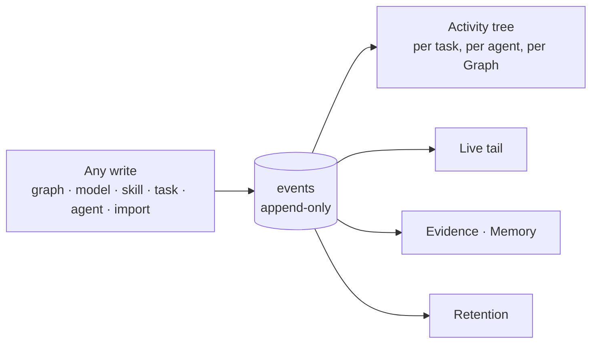

# Operate — module spec

Running the thing: what happened, what it cost, what is scheduled, and what may be reached from
outside. Every write in the product is an event here, and every actor is a principal — which is what
makes "who recommended what, citing what, on behalf of whom" answerable.

> ⚠ **Rewritten for [orchestration § 0](../../orchestration.md#0-the-records)** — `Todo` · `TaskPlan` ·
> `Task` · `TaskRun` · `Lens`. The words *Thought*, *Thinking* and *Step-as-a-record* are retired, and
> **`Task` now names a node inside a plan**, never a thing a user authored. Migration:
> [task-model-migration.md](../../building-engine/task-model-migration.md).

| | |
|---|---|
| Index | [§10 · Operate](../../README.md#10--operate) |
| Features | [schedules](features/schedules.md) · [audit-and-activity](features/audit-and-activity.md) · [observability](features/observability.md) · [external-agent-api](features/external-agent-api.md) · [see-what-ran](features/see-what-ran.md) |
| Depends on | every module emits into it |
| Depended on by | [Memory](../memory/spec.md) (evidence reads the record) |

## 1. Vocabulary

Product-wide words: [terminology.md](../../terminology.md). What this module adds:

| Noun | Is | Is not |
|---|---|---|
| **Event** | one append-only fact: actor, verb, target, time | a log line |
| **Activity** | events assembled into a tree for one subject | a feed |
| **Schedule** | a cron on a question or a task | a background job |
| **Firing** | one occurrence of a schedule | a run |
| **Scoped token** | credentials for an external agent, limited to named reads | an API key |
| **Runs** | the journal of every run in the Graph, children nested | a feed, a job queue, or Activity |
| **Chain** | a run and every run delegated beneath it | a workflow |

## 2. Every write is an event

| Rule | Detail |
|---|---|
| Append-only | Events are never edited or deleted; retention removes whole windows, never single rows |
| Actor is a principal | `user · agent · system · external · anonymous`, with `on_behalf_of` when they differ |
| Causality is kept | `parent_event_id` links a spawned action to what caused it |
| Sensitive fields are redacted at write | Credentials never reach the record, not even encrypted |
| One record, many readings | Audit, activity, evidence and observability all read this; none of them copies it |

## 3. Schedules

| Kind | Fires | Produces |
|---|---|---|
| `question` | a cron | a run whose answers **stack into a diffable timeline**; nothing is created |
| `task` | a cron | a new Task from a template, which a person still accepts |

| Rule | Detail |
|---|---|
| A firing is recorded even when it does nothing | Skipped by an overlap policy is a firing with a stated reason |
| A question schedule cannot create work | The two kinds do different jobs, deliberately |
| Answers stack, never overwrite | Comparing today with last week is the point |

## 4. What this module owns

| Owns | Shape |
|---|---|
| `events` | append-only: actor principal, `on_behalf_of`, verb, target, payload, `parent_event_id`, time |
| `schedules` · `firings` | `kind (question\|task)` · cron · overlap policy · target template · per-firing outcome |
| Metrics | per query and per LLM call: latency, tokens, cost, errors — derived from the record |
| `api_tokens` | scoped tokens for external agents, with their allowed reads |
| Retention | how long task_runs, steps, emissions and events are kept, and what a purge removes |
| The runs journal | a reading of [Ask](../ask/spec.md)'s `todos` · `task_runs` · `task_runs` — Operate owns the *surface*, never the tables ([see-what-ran](features/see-what-ran.md)) |

## 5. Observability

| Question | Answered by |
|---|---|
| What is slow? | query latency per graph, per model, per step kind |
| What costs? | tokens and spend per agent, per project, per day |
| What fails, and where? | error rates by step and by failure kind |
| Is the budget going? | spend against each agent's ceiling, before it is reached |

Metrics are **derived from the record**. There is no second pipeline to disagree with it.

## 6. The external surface

| Rule | Detail |
|---|---|
| Read, with provenance | An external agent gets records and where they came from — never a bare answer |
| Scoped | A token names what it may read; anything else is refused, not filtered silently |
| Recorded as a principal | External calls appear in activity like any other actor |
| Never a write path | Imports are CLI and API with their own contract; the external surface does not write |

## 7. Cross-feature decisions

| # | Decision |
|---|---|
| O1 | Every write emits an event. Append-only, with the acting principal and `on_behalf_of`. |
| O2 | Audit, activity, evidence and observability are readings of one record, not copies of it. |
| O3 | A question schedule stacks answers; a task schedule creates work. Neither does the other's job. |
| O4 | A firing that did nothing is still recorded, with the reason. |
| O5 | External access is read-only, scoped, and carries provenance. |
| O6 | Retention removes windows, never individual rows — history must stay coherent. |
| O7 | There is one journal of runs in a Graph — **Runs**. Imports and a Task's `Runs` tab are filters of it, not second implementations. |
| O8 | Runs lists **runs**; Activity lists **writes**. Neither is derived from the other. |

## 8. Deliberately absent

| Not built | Because |
|---|---|
| A separate metrics pipeline | it would drift from the record it claims to describe |
| Editable or deletable events | an audit trail that can be edited is not one |
| Alerting and on-call routing | this is a product surface, not a monitoring platform |
| External write access | writes have contracts; a general write API has none |
| Per-user activity feeds | activity is per subject — a task, an agent, a Graph |
| A *job* concept | a run is a **TaskRun** and its parts are child runs of **Tasks**; a third word would name the same row twice |
| Retry or re-run from the journal | a run is re-opened where it was started, with its own inputs |
