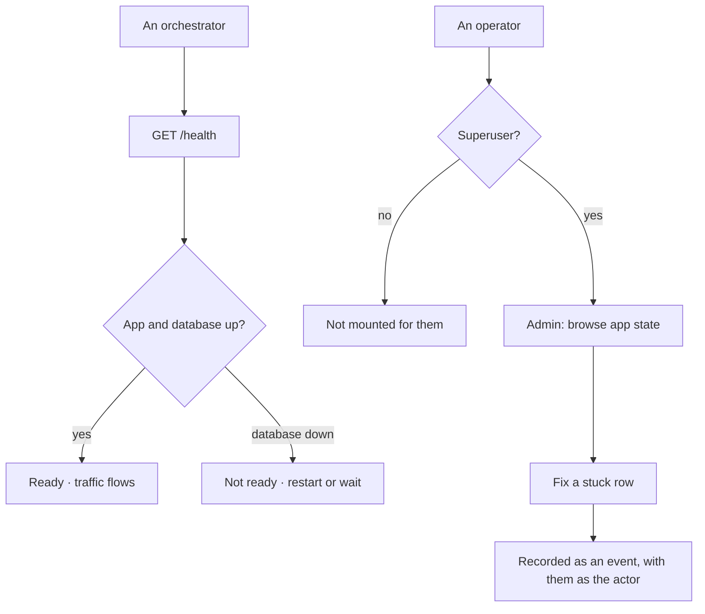

# Admin and health

Two operator surfaces: a generated table browser over app state, and a probe that says whether the
engine and its database are up. Neither is a product surface.

| | |
|---|---|
| Index | [13.6](../../../README.md#13--platform) · Slice **S1** |
| Module | [Platform](../spec.md) |
| API / CLI / Studio | ✅ / — / — |
| Related | [membership](../../identity-and-access/features/membership.md) · [telemetry](telemetry.md) |

> **As** an operator with shell access, **I want** to look at what is in the database without writing
> SQL, **so that** diagnosing a stuck import does not start with `psql`.

## Capabilities

| # | Capability | Notes |
|---|---|---|
| C1 | Generated from the tables | Models, versions, projections, agents, events, users — no hand-built screens |
| C2 | Superuser only | The flag, not Graph membership — and it opens no Graph's contents in the product |
| C3 | Read and repair | An operator can fix a stuck row; every change is an event like any other |
| C4 | Health probe | Unauthenticated, cheap, reporting the app and its database |
| C5 | Liveness and readiness | Distinguished, so an orchestrator can restart or wait appropriately |
| C6 | Mounted beside the API | One process, one deployment |
| C7 | Never the way in | A member reaching their own Graph uses the product; if admin is the only route, something is broken |

## Journey

## Seams

| Seam | What you see |
|---|---|
| Database unreachable | Health reports not-ready with the component named; the app does not pretend |
| A superuser without membership | Admin works; the product still shows no Graphs, which is correct |
| An edit through admin | Appears in activity attributed to that person, not to "system" |
| Admin used as a workaround | Visible in the event record, which is the point |

## Engine

| Thing | Shape |
|---|---|
| Admin | generated views over the app-state tables, mounted under the server, superuser-gated |
| Health | `GET /health` — liveness and readiness, unauthenticated |
| Events | admin writes emit the same events as product writes |

## Decisions

| # | Decision |
|---|---|
| AH1 | Admin is generated from tables, not hand-built. |
| AH2 | Superuser-only, and it grants no access to a Graph's contents in the product. |
| AH3 | Writes through admin are events like any other, attributed to the person. |
| AH4 | Health is unauthenticated and distinguishes liveness from readiness. |

## Not building

| Not building | Because |
|---|---|
| Admin as a product surface | it exists so an operator avoids SQL, not to route around the product |
| Per-Graph admin | a Graph's contents belong to its members |
| A metrics page inside admin | that is telemetry, and a collector reads it better |
