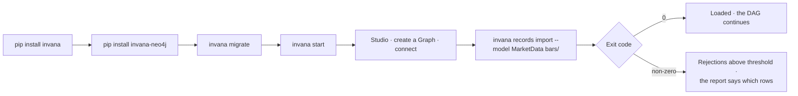

# Command line

`invana` — install, run, migrate, import. Anything scripted happens here; anything read happens in
Studio.

| | |
|---|---|
| Index | [13.3](../../../README.md#13--platform) |
| Module | [Platform](../spec.md) |
| API / CLI / Studio | — / ✅ / — |
| Related | [load-data](../../bring-data-in/features/load-data.md) · [share-a-model](../../connect-and-model/features/share-a-model.md) |

> **As** whoever runs this, **I want** a handful of commands that behave like every other CLI, **so
> that** installing and automating it needs no special knowledge.

## Commands

| Command | Does |
|---|---|
| `invana init` | Bootstraps the root superuser; idempotent, and non-interactive for a container |
| `invana users` | Creates accounts and resets passwords, for an operator with shell access |
| `invana start` | Runs the engine, and Studio when bundled |
| `invana migrate` | Applies database migrations; nothing migrates itself on boot |
| `invana version` | The engine version and every installed connector |
| `invana records import` | Loads a dataset — the only write path from outside |
| `invana models export · import · upgrade` | Moves a domain model between Graphs |
| `invana models starters` | Lists the shipped starter models |
| `invana loader` | Loads a flat CSV straight through the connector; `--graph` supplies the connection and journals it as a `bulk` run — [2.1](../../bring-data-in/features/load-data.md) |

## Capabilities

| # | Capability | Notes |
|---|---|---|
| C1 | Exit codes a scheduler can branch on | Zero, non-zero, and distinct codes for validation failure |
| C2 | Human output on a tty, machine output otherwise | Detected, and overridable |
| C3 | Core plus connectors | Each database connector is its own package |
| C4 | Cross-platform | The same commands on every OS a contributor uses |
| C5 | Configuration by file and environment | Flags override both, in that order |
| C6 | Migrations are explicit | Boot never migrates |
| C7 | Version reports the whole set | Engine plus each connector, so a bug report is complete |

## Journey

## Seams

| Seam | What the user sees |
|---|---|
| Migrations pending at start | Refuses to start, naming the command to run |
| A connector not installed | The connector list, and the package to install |
| No config found | The defaults it will use, and where to put a file |
| Version mismatch between engine and connector | Named at start, not at first query |

## Decisions

| # | Decision |
|---|---|
| CL1 | Nothing migrates on boot. |
| CL2 | The CLI is the entry point for anything scripted. |
| CL3 | Connectors are separate packages; the core depends on no driver. |
| CL4 | Exit codes distinguish failure kinds. |
| CL5 | The same commands work on every supported OS. |

## Not building

| Not building | Because |
|---|---|
| A deployment orchestrator | an image and a command; the rest is the operator's platform |
| An interactive shell | the API and Studio cover exploration |
| Writing graph data from the CLI beyond import | writes have contracts |
